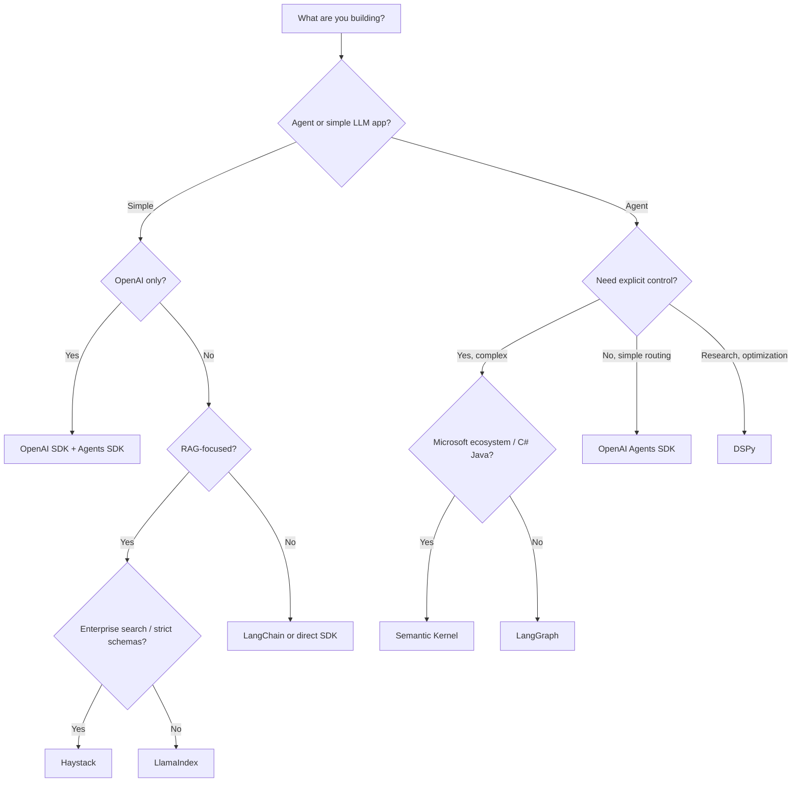

# 25 — Frameworks and Tools MOC

> [!info] Deep technical guides for the major frameworks used to build LLM applications, agents, and serving systems. Iteration 4 added per-framework deep dives for LangChain, LangGraph, DSPy, LlamaIndex, OpenAI SDK/Agents, vLLM, and Ollama/llama.cpp. Iteration 6 added 6 more frameworks: AutoGen, CrewAI, PydanticAI (agent frameworks) and TGI, TensorRT-LLM, SGLang (serving engines). Iteration 10 added the final 2 frameworks: Semantic Kernel (Microsoft's multi-language agent framework) and Haystack (deepset's RAG-focused pipeline framework). Total: 16 frameworks/serving engines.

## Reading Order

| #   | Note                                              | Sub-domain        | Purpose                                            |
|-----|---------------------------------------------------|-------------------|----------------------------------------------------|
| 01  | [[01 - Framework Selection Guide]]                | —                 | Decision framework for choosing frameworks.        |
| 02  | [[02 - LangChain]]                                | LLM Frameworks    | General LLM framework; broad integrations.         |
| 03  | [[03 - LangGraph]]                                | Agent Frameworks  | Graph-based agent orchestration.                   |
| 04  | [[04 - DSPy]]                                     | LLM Frameworks    | Declarative prompt optimization.                   |
| 05  | [[05 - LlamaIndex]]                               | LLM Frameworks    | RAG-focused data framework.                        |
| 06  | [[06 - OpenAI SDK and Agents SDK]]                | LLM Frameworks    | Official OpenAI tooling.                           |
| 07  | [[07 - vLLM]]                                     | Serving           | Production LLM serving engine.                     |
| 08  | [[08 - Ollama and llama.cpp]]                     | Serving           | Local LLM inference.                               |
| 09  | [[09 - AutoGen]]                                  | Agent Frameworks  | Conversational multi-agent framework.              |
| 10  | [[10 - CrewAI]]                                   | Agent Frameworks  | Role-based agent framework.                        |
| 11  | [[11 - PydanticAI]]                               | Agent Frameworks  | Type-safe agent framework.                         |
| 12  | [[12 - TGI]]                                      | Serving           | HuggingFace Text Generation Inference.             |
| 13  | [[13 - TensorRT-LLM]]                             | Serving           | NVIDIA-optimized serving engine.                   |
| 14  | [[14 - SGLang]]                                   | Serving           | RadixAttention + structured generation.            |
| 15  | [[15 - Semantic Kernel]]                          | Agent Frameworks  | Microsoft's multi-language (Python/C#/Java) agent framework. |
| 16  | [[16 - Haystack]]                                 | LLM Frameworks    | deepset's RAG-focused pipeline framework.           |

## Sub-Domains

- [[25 - Frameworks and Tools/Agent Frameworks/01 - Framework Selection Guide|Agent Frameworks]] — notes 03, 09, 10, 11, 15
- [[25 - Frameworks and Tools/LLM Frameworks/02 - LangChain|LLM Frameworks]] — notes 02, 04, 05, 06, 16
- [[25 - Frameworks and Tools/Serving/07 - vLLM|Serving]] — notes 07, 08, 12, 13, 14
- [[20 - AI Infrastructure/Storage/02 - Vector Storage with pgvector|Vector Databases]] — see [[04 - Vector Memory Backends]] (chapter 18)
- [[25 - Frameworks and Tools/MOC|Orchestration]] — (planned: Prefect, Airflow)

## Frameworks Coverage (Iteration 10 — Complete)

All originally planned frameworks are now covered. Iteration 10 added the final 2:
- **Semantic Kernel** (note 15) — Microsoft's enterprise multi-language agent framework with planner-based orchestration.
- **Haystack** (note 16) — deepset's RAG-focused pipeline framework with type-safe DAG-based components.

## Why This Chapter Matters

Framework choice affects:
- Development speed (some frameworks are easier to start with).
- Production reliability (some frameworks are more battle-tested).
- Performance (some frameworks have better optimizations).
- Lock-in (some frameworks are tightly coupled to a vendor).

## Selection Heuristics

- **For prototyping**: LangChain or LlamaIndex (lots of integrations, easy to start).
- **For production agents**: LangGraph (stateful, durable, well-tested) or PydanticAI (type-safe, clean abstractions).
- **For enterprise C# / Java stack**: Semantic Kernel (multi-language parity, Microsoft integration).
- **For production search + RAG**: Haystack (type-safe DAG pipelines, Elasticsearch/OpenSearch first-class).
- **For systematic prompt optimization**: DSPy (declarative compilation).
- **For RAG-focused applications**: LlamaIndex (best data loaders, index variety).
- **For OpenAI-centric apps**: OpenAI SDK + Agents SDK (official, minimal).
- **For serving**: vLLM (open-source standard) or TensorRT-LLM (NVIDIA, max performance).
- **For local dev**: Ollama (easy install, good UX).
- **For vector DB**: pgvector (if you already use Postgres) or Qdrant (standalone, fast).

## Framework Decision Tree

## See Also

- [[01 - Framework Selection Guide]] — detailed decision framework
- [[15 - AI Agents/MOC|15 AI Agents]] — what agent frameworks help build
- [[13 - Inference/MOC|13 Inference]] — what serving frameworks optimize
- [[17 - RAG/MOC|17 RAG]] — what LLM frameworks help build
- [[20 - AI Infrastructure/MOC|20 AI Infrastructure]] — where everything runs
