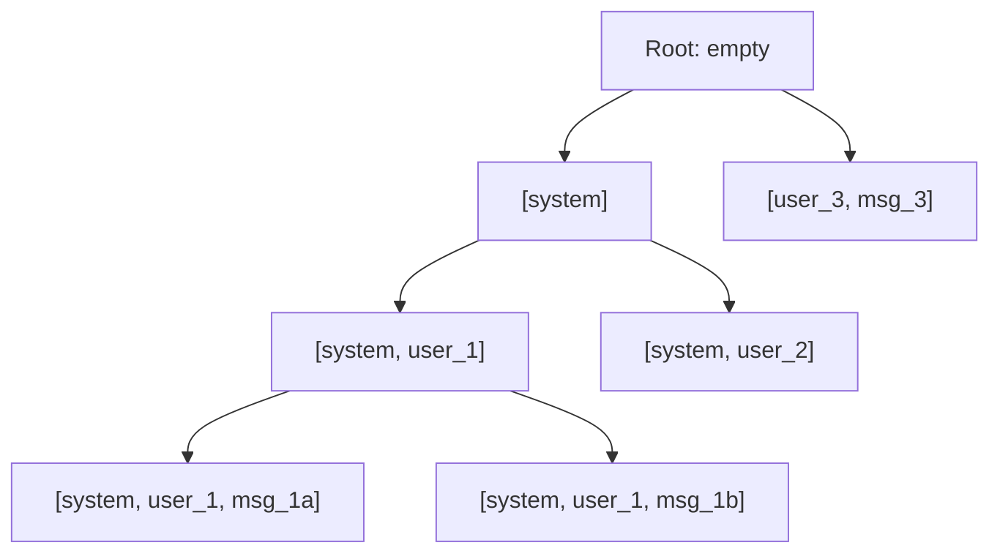

# 14 — SGLang

> [!info] TL;DR
> SGLang is a serving engine with two innovations: **RadixAttention** (an automatic prefix cache that reuses KV across requests sharing a common prefix) and a **structured generation language** (a DSL for writing programs that constrain LLM output to schemas, control flow, and multi-step reasoning). SGLang delivers vLLM-class throughput plus automatic prefix reuse, making it especially strong for **agentic workloads** (where many requests share long system prompts and tool descriptions) and **structured-output workloads** (JSON, regex, context-free grammars).

## Overview

- **Developer**: LMSYS (the team behind Chatbot Arena) and UC Berkeley researchers; spun out as a venture-backed company in 2024.
- **Languages**: Python (API and DSL), C++/CUDA (kernels).
- **License**: Apache 2.0.
- **Status**: actively developed; rapid feature releases. Used in production by several LLM application companies.

## Why SGLang Exists

Two pain points motivated SGLang:

### Pain Point 1: Prefix Redundancy

Agentic workloads have massive prefix redundancy. Every request to a ReAct agent starts with the same multi-thousand-token system prompt + tool descriptions + few-shot examples. vLLM and TGI recompute the prefill for every request, wasting compute. Manually managing prefix caches (e.g., vLLM's `--enable-prefix-caching`) works but requires care to align prompt prefixes exactly.

RadixAttention solves this automatically. The engine maintains a **radix tree** of KV cache blocks indexed by token prefixes. When a new request arrives, SGLang walks the tree to find the longest matching prefix, reuses its KV, and only computes the new tokens. This works for any prompts that share prefixes — no manual alignment.

### Pain Point 2: Structured Generation Pain

Getting an LLM to produce valid JSON, conforming-to-schema, or following a specific control flow (branch on a value, loop until condition, call a tool) has historically required either:

- Prompt engineering (unreliable), or
- Post-hoc parsing with retries (slow and fragile), or
- External libraries like Outlines or Guidance (added dependencies, integration friction).

SGLang embeds a structured generation DSL directly into the engine. You write Python-like code that calls the LLM with constraints; the engine handles the constraint enforcement at the token level. This is faster (constraints are checked during decoding, not after) and more reliable (constraints are enforced, not requested).

## Core Concepts

### RadixAttention

The radix tree is a tree where each node represents a token sequence prefix. Each node stores its KV cache. When a new request arrives:

1. Tokenize the prompt.
2. Walk the radix tree from the root, matching tokens one by one.
3. Stop at the longest matching node; reuse its KV cache.
4. Compute attention only for the unmatched suffix.
5. Insert the new request's KV into the tree (evicting LRU entries if memory is full).



The tree enables **prefix sharing** across requests automatically. A common pattern: 1000 requests sharing a 2000-token system prompt hit the same `[system]` node and reuse its KV — saving 2M tokens of prefill compute.

### Cache Reuse Across Sessions

RadixAttention persists across requests. A user's first request populates the tree; subsequent requests from the same user (with overlapping context) reuse the cached KV. For conversational agents, this dramatically reduces per-turn latency after the first turn.

### The SGLang DSL

The DSL lets you write programs that interleave LLM calls with control flow:

```python
import sglang as sgl

@sgl.function
def multi_step_qa(s, question):
    s += "You are a careful reasoning assistant."
    s += "Question: " + question
    # Branch based on difficulty
    difficulty = s.gen("difficulty", choices=["easy", "hard"])
    if difficulty == "easy":
        s += "Answer directly:"
        s += sgl.gen("answer", max_tokens=100)
    else:
        s += "Let's think step by step."
        s += sgl.gen("reasoning", max_tokens=300)
        s += "Final answer:"
        s += sgl.gen("answer", max_tokens=100)
```

The `s +=` operator appends to the conversation. `sgl.gen()` generates text with constraints. The function is traced into an execution graph that SGLang runs efficiently on the server, with RadixAttention reusing KV across LLM calls within the same function execution.

### Constrained Generation

The DSL supports several constraint types:

- **Choices**: `s.gen("x", choices=["a", "b", "c"])` — generate one of the listed options.
- **Regex**: `s.gen("phone", regex=r"\d{3}-\d{3}-\d{4}")` — generate text matching a regex.
- **JSON schema**: `s.gen("user", schema={"type": "object", "properties": {...}})` — generate JSON conforming to a schema.
- **Grammar**: `s.gen("code", grammar=open("python.ebnf").read())` — generate text matching a context-free grammar.

Constraints are enforced at decoding time by masking the logits of disallowed tokens. This guarantees the output conforms, with no retries needed.

### JSON Mode

For JSON output, SGLang's schema-constrained generation is significantly faster than prompt-then-parse:

```python
@sgl.function
def extract_entities(s, text):
    s += "Extract entities from this text: " + text
    s += sgl.gen(
        "entities",
        schema={
            "type": "object",
            "properties": {
                "people": {"type": "array", "items": {"type": "string"}},
                "organizations": {"type": "array", "items": {"type": "string"}},
                "dates": {"type": "array", "items": {"type": "string"}},
            },
            "required": ["people", "organizations", "dates"],
        },
    )
```

The output is guaranteed to validate against the schema. No try/except, no retry loop, no malformed JSON.

### Frontend and Backend

SGLang has a frontend-backend architecture:

- **Frontend**: Python DSL. Compiles your function into an execution graph.
- **Backend**: serving engine. Runs the execution graph, with RadixAttention caching KV across calls.

The frontend submits the graph to the backend via HTTP. The backend manages the radix tree, schedules requests, and returns results. This separation lets you run the frontend on a cheap CPU machine and the backend on a GPU server.

### Multi-Modal Support

SGLang supports vision-language models (LLaVA, Qwen-VL). Images are embedded and added to the prompt; RadixAttention caches the image+text prefix for reuse across requests sharing the same image.

## Common Patterns

### Agentic ReAct with Prefix Caching

A ReAct agent's system prompt + tool descriptions are long (often 2K+ tokens). With RadixAttention, every ReAct call after the first reuses this prefix:

```python
@sgl.function
def react_agent(s, user_query):
    s += SYSTEM_PROMPT  # 2K tokens, cached
    s += TOOL_DESCRIPTIONS  # 1K tokens, cached
    s += "User: " + user_query
    for _ in range(10):
        s += sgl.gen("thought", max_tokens=200)
        s += sgl.gen("action", choices=TOOL_NAMES)
        tool_result = call_tool(s["action"])
        s += "Observation: " + tool_result
        if s["action"] == "FINISH":
            break
    s += sgl.gen("final_answer", max_tokens=500)
```

Without RadixAttention, every iteration recomputes the 3K-token prefix. With RadixAttention, only the new tokens are computed — a 5-10× speedup on long ReAct loops.

### Multi-Turn Chat with Persistent Cache

A user's chat history is shared across turns. RadixAttention caches the entire history; each new turn only computes the new user message + assistant response. This makes multi-turn chat nearly as cheap as single-turn.

### Batch Structured Extraction

For batch jobs extracting structured data from many documents, SGLang's schema-constrained generation is significantly faster than unconstrained generation + parsing:

```python
@sgl.function
def extract(s, doc):
    s += "Extract: " + doc
    s += sgl.gen("result", schema=MY_SCHEMA)
```

Run the function across thousands of documents. Each call's output validates against `MY_SCHEMA`. No retries, no parsing failures, no manual fixing.

### Tool Selection via Choices

For tool routing, use `choices` to constrain the model to pick a valid tool:

```python
s += "User asked: " + question
s += sgl.gen("tool", choices=["calculator", "search", "knowledge_base", "no_tool"])
```

The output is guaranteed to be one of the four options. No more "the LLM said 'calclator' and broke my dispatcher."

## Comparison to Alternatives

| Engine         | Prefix Caching         | Structured Generation     | Best For                              |
|----------------|------------------------|---------------------------|---------------------------------------|
| SGLang         | Automatic (Radix)      | First-class DSL            | Agentic, structured output            |
| vLLM           | Manual (`--enable`)    | Outlines integration       | General-purpose production            |
| TGI            | Limited                | Outlines integration       | HuggingFace ease of use               |
| TensorRT-LLM   | Manual                 | Limited                    | NVIDIA max performance                |

SGLang's distinct strength is **automatic prefix caching and first-class structured generation**. For agentic workloads and structured-output workloads, it's the strongest choice. For raw throughput on long prompts without prefix sharing, vLLM or TensorRT-LLM may be faster.

## Strengths

### Automatic Prefix Caching

RadixAttention is automatic. No prompt engineering for prefix alignment, no `--enable-prefix-caching` flag. The engine figures out what's reusable. This is a major productivity win for agentic workloads.

### First-Class Structured Generation

The DSL makes structured generation a primitive, not an afterthought. Schema constraints, regex constraints, choice constraints — all enforced at decoding time. This eliminates the "model returned invalid JSON" class of bugs.

### Fast on Agentic Workloads

For workloads with long shared prefixes and many small generations (the typical agentic pattern), SGLang is faster than vLLM and TGI. The exact speedup depends on prefix overlap; 5-10× is common.

### Clean Python API

The DSL is Pythonic. Writing a multi-step agent or extraction pipeline reads like writing a normal Python function. This is more maintainable than string-template-based approaches.

### Multi-Modal Support

Vision-language models work natively. Image prefixes are cached, so multi-turn VLM conversations are efficient.

## Weaknesses

### Smaller Community Than vLLM

SGLang is newer and has a smaller community than vLLM. Fewer tutorials, fewer Stack Overflow answers, fewer community-contributed optimizations. This is improving rapidly as SGLang gains adoption.

### Less Mature Ecosystem

The integration ecosystem (LangChain, LlamaIndex, etc.) has first-class vLLM and TGI support; SGLang support is still maturing. You may need adapter code for some frameworks.

### DSL Lock-In

The DSL is SGLang-specific. Code written in the DSL doesn't port directly to other engines. For teams that value portability, this is a concern.

### Less Aggressive Raw Throughput

For workloads without prefix sharing (e.g., batch processing of unrelated long documents), SGLang's raw throughput is comparable to vLLM but less than TensorRT-LLM. The advantage is in caching, not in single-request speed.

### Memory Overhead of Radix Tree

The radix tree consumes GPU memory. For workloads with low prefix overlap, this memory is wasted. SGLang has eviction policies, but for some workloads the tree overhead may reduce effective batch size.

## Production Patterns

### Use SGLang for Agentic Workloads

For ReAct loops, multi-turn chat, and other workloads with long shared prefixes, SGLang is the strongest choice. The automatic prefix caching pays for the engine's overhead many times over.

### Use the DSL for Structured Output

For structured output, use the DSL's schema constraints. Don't fall back to prompt engineering + parsing. The DSL is more reliable and faster.

### Monitor Cache Hit Rate

SGLang exposes metrics on radix tree cache hit rate. If hit rate is low (<30%), your workload doesn't have much prefix sharing — consider switching to vLLM (less overhead) or restructuring your prompts to share more prefix.

### Set Eviction Policy

For long-running services, configure the radix tree eviction policy. LRU (least recently used) is the default; for workloads with temporal locality (recent prompts are likely to recur), LRU is correct. For workloads with no temporal locality, consider a smaller tree size to free memory for batching.

### Pin Versions

SGLang is under rapid development; APIs change. Pin your version in Docker and test upgrades in staging.

### Combine with a Router

For multi-model deployments, put SGLang behind a router (LiteLLM or similar). Route agentic requests to SGLang; route batch processing to vLLM or TensorRT-LLM.

## When to Use SGLang

### Good Fit
- **Agentic workloads**: ReAct, multi-turn chat, tool-using agents.
- **Structured output**: JSON, regex, grammar-constrained generation.
- **Multi-modal**: vision-language models with multi-turn conversation.
- **High-prefix-overlap workloads**: many requests sharing system prompts.

### Poor Fit
- **Batch processing of unrelated long documents**: no prefix overlap, SGLang's overhead is wasted.
- **NVIDIA-only with strict latency targets**: TensorRT-LLM is faster for single-request latency.
- **HuggingFace-model compatibility**: TGI is more permissive about model architectures.
- **Local development**: Ollama is easier.

## See Also

- [[07 - vLLM]] — general-purpose alternative
- [[12 - TGI]] — HuggingFace-focused alternative
- [[13 - TensorRT-LLM]] — NVIDIA-optimized alternative
- [[04 - vLLM and Continuous Batching]] — continuous batching basics
- [[02 - KV Cache Mechanics]] — what RadixAttention caches
- [[02 - PagedAttention]] — vLLM's related memory-management approach
- [[25 - Frameworks and Tools/MOC|25 Frameworks MOC]]
