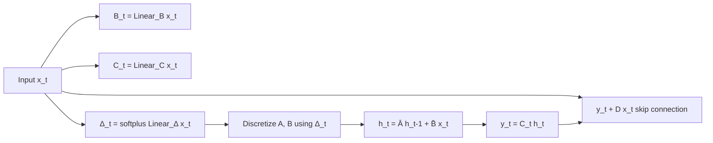
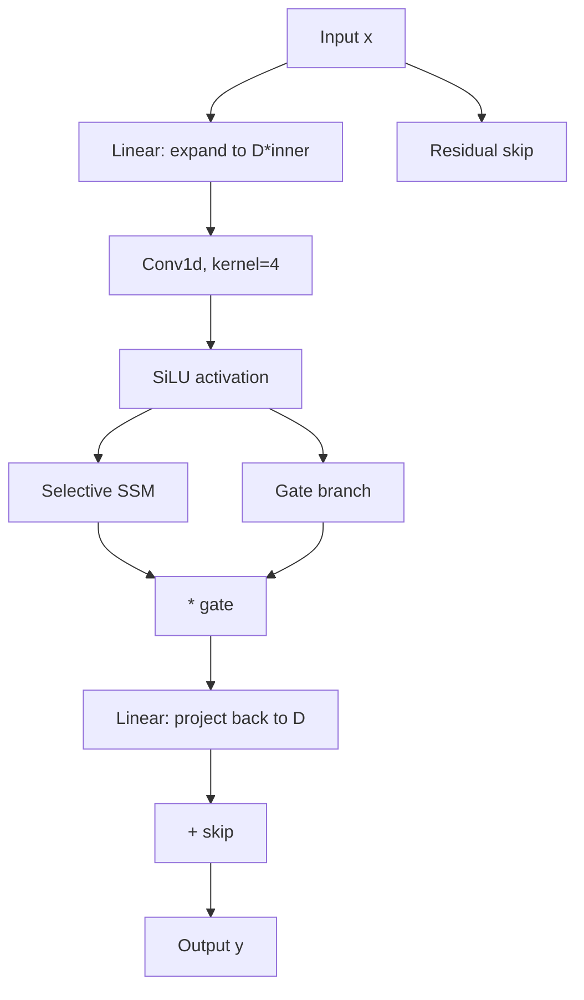

# 11 — Mamba (Gu & Dao, 2023)

> [!info] TL;DR
> Mamba is a **state-space model (SSM)** that matches Transformer quality on language modeling while scaling linearly in sequence length. Its core innovation is **selective SSMs** — making the SSM's parameters input-dependent, which gives the model the ability to selectively remember or forget information. Mamba challenged the assumption that attention is necessary for high-quality sequence modeling and triggered a wave of hybrid Transformer+SSM architectures (Jamba, Zamba, Falcon-Mamba).

## Citation

Gu, A., & Dao, T. (2023). *Mamba: Linear-Time Sequence Modeling with Selective State Spaces*. arXiv:2312.00752.

## The Problem Being Solved

Transformers have a fundamental limitation: attention is `O(N²)` in sequence length. For long sequences (10k+ tokens), this becomes the dominant cost — both compute and memory. [[08 - FlashAttention 2022|FlashAttention]] reduced the constant factor but did not change the asymptotic complexity.

The alternative — **recurrent** models (RNN, LSTM, GRU) — are `O(N)` but historically performed much worse than Transformers on language modeling. Their problems: (1) training cannot parallelize over the sequence (each step depends on the previous), and (2) they struggle with long-range dependencies due to vanishing gradients.

State-space models (SSMs) — S4, S5, etc. — offered a middle ground: linear in sequence length, parallelizable in training (because the recurrence can be unrolled as a convolution), and able to model long-range dependencies through structured state matrices. But S4-style SSMs were **time-invariant**: the parameters did not depend on the input. This limited their expressivity — they could not perform content-based reasoning like attention.

Mamba's contribution: make the SSM **input-dependent (selective)**. This single change gives SSMs the flexibility of attention while keeping linear-time complexity.

## The Key Idea: Selective State Space Models

### State Space Model Recap
A continuous-time SSM maps an input sequence `x(t)` to an output `y(t)` via a hidden state `h(t)`:

```
h'(t) = A · h(t) + B · x(t)
y(t)  = C · h(t)
```

Discretized for sequence modeling with step size `Δ`:

```
h_t = Ā · h_{t-1} + B̄ · x_t
y_t = C · h_t
```

where `Ā, B̄` are discretized versions of `A, B`.

In S4, `A, B, C, Δ` are *learned but fixed* — they do not depend on the input `x_t`. This makes the model a linear time-invariant system, which can be computed as a convolution in parallel during training.

### Why Time-Invariance is Limiting
Attention is content-based: the attention weight between query `i` and key `j` depends on their *content* (`softmax(QK^T)`). This is what lets the model retrieve specific past tokens based on the current query.

Time-invariant SSMs cannot do this — they apply the same `A, B, C` regardless of input. The model can learn *generic* filters (e.g., "average the last 100 tokens") but cannot learn content-based retrieval (e.g., "if the current token is a pronoun, find the most recent noun").

### Mamba's Selection Mechanism
Mamba makes `B`, `C`, and `Δ` input-dependent:

```
B_t = Linear_B(x_t)
C_t = Linear_C(x_t)
Δ_t = softplus(Linear_Δ(x_t))
```

`A` stays fixed (initialized as a HiPPO matrix for long-range memory).

The crucial parameter is `Δ_t` — it controls the "timescale" of the update. A large `Δ_t` means "forget the past and focus on the current input"; a small `Δ_t` means "keep the past and mostly ignore the current input." By making `Δ` input-dependent, the model learns to selectively attend to or forget inputs based on their content.



### Hardware-Efficient Implementation
The recurrence `h_t = Ā_t h_{t-1} + B̄_t x_t` cannot be expressed as a simple convolution anymore (because `Ā, B̄` now depend on `t`). Naively, this requires sequential execution — bad for GPU parallelism.

Mamba solves this with a **parallel scan** algorithm: the recurrence can be computed in `O(log N)` sequential steps using associative reduction. The paper provides a custom CUDA kernel that implements this efficiently, achieving throughput comparable to FlashAttention on A100.

The kernel also fuses the discretization, recurrence, and output projection into a single GPU operation, minimizing HBM round-trips — a similar IO-awareness philosophy to FlashAttention.

## The Architecture: Mamba Block

A Mamba model stacks Mamba blocks, similar to how a Transformer stacks attention+FFN blocks. Each Mamba block contains:

1. A linear projection expanding the input (similar to FFN up-projection).
2. A depth-wise convolution (1D conv, kernel size 4) — for local context.
3. The selective SSM (the core innovation).
4. A gated multiplication (similar to SwiGLU's gate).
5. A linear projection back to the model dimension.

Notably, Mamba **fuses** what would be attention and FFN in a Transformer into a single block. There is no separate "attention sublayer" — the SSM is the sequence-mixing mechanism, and the gating provides nonlinearity.



## Key Results

The paper evaluated Mamba on language modeling (The Pile, books), audio generation, and DNA sequence modeling. Highlights:

- **Language modeling**: Mamba-3B matches Transformer-3B (Pythia) on The Pile, with similar training compute. At inference, Mamba is much faster: for 128k context, Mamba's inference throughput is ~5× higher than a similarly-sized Transformer with FlashAttention.
- **Long-context quality**: on tasks requiring retrieval of facts mentioned far back in the context, Mamba underperforms attention but the gap narrows as sequence length grows.
- **Audio (SC09)**: Mamba set new SOTA on audio generation, beating prior diffusion and Transformer baselines.
- **DNA (HG38)**: Mamba significantly outperformed Transformer baselines on long-range DNA sequence modeling (5k tokens), demonstrating its strength on very long sequences.

Subsequent work (Mamba-2, 2024) showed that the SSM state can be expressed as a structured attention matrix, unifying SSM and attention theory. This led to hybrid architectures (Jamba, Falcon-Mamba) combining attention layers with Mamba layers.

## Why It Worked

### Selection Enables Content-Based Reasoning
The empirical result that input-dependent `Δ, B, C` dramatically improves quality over fixed SSMs confirmed the hypothesis: content-based retrieval (which attention provides natively) is essential for language modeling. Mamba gives SSMs this ability while keeping linear complexity.

### Hardware-Aware Kernel Design
The parallel scan kernel is as important as the algorithm. Without an efficient GPU implementation, Mamba would be theoretically fast but practically slow. The kernel's IO-awareness — minimizing HBM round-trips — is the same lesson as FlashAttention.

### Simplified Architecture
Fusing attention and FFN into a single block reduces memory traffic. Mamba has fewer parameters per layer than a Transformer of the same hidden dimension, which gives it an inherent FLOP advantage.

### Linear-Time Inference
For long contexts, Mamba's `O(N)` inference is a decisive advantage. A 1M-token context is feasible on a single GPU with Mamba; it requires either extreme memory or distributed inference with attention.

## Limitations

Mamba is not a strict replacement for attention. Known weaknesses:

- **Retrieval quality**. On "needle-in-a-haystack" tasks requiring exact retrieval from a long context, attention models still outperform pure SSMs. This is the main motivation for hybrid architectures.
- **Copying long sequences**. SSMs struggle to copy verbatim from far back in the context — attention can do this trivially.
- **State capacity**. The SSM's hidden state has a fixed size (`N` dimensions, typically 16–256 per channel). For tasks requiring very large state, attention's unbounded `N×N` memory wins.
- **In-context learning**. Mamba underperforms Transformers on few-shot in-context learning, suggesting that ICL specifically benefits from attention's exact retrieval.

## Hybrid Architectures (2024–2026)

The most successful 2024–2026 designs are hybrids: most layers are Mamba (cheap, fast), with a few attention layers interspersed (for retrieval quality). Examples:

- **Jamba** (AI21, 2024): interleaves Mamba and attention layers in a 7:1 ratio. 52B parameters (12B active), MoE.
- **Falcon-Mamba** (TII, 2024): pure Mamba at 7B parameters.
- **Zamba** (Zyphra, 2024): Mamba blocks share a single attention block, repeated.
- **MiniMax-01** (2025): hybrid linear-attention + sparse-attention at 456B parameters.
- **Mamba-2** (2024): improved SSM with higher state dimension; comparable to attention on most tasks.

By 2025–2026, the consensus was that pure SSMs work for many tasks but attention remains necessary for retrieval-heavy workloads. Hybrids offer the best of both worlds.

## Impact and Legacy

Mamba's influence extends beyond the model itself:

1. **Revived RNN-style architectures**. After 2017, RNNs were considered obsolete. Mamba showed that the recurrence itself was not the problem — the time-invariance was. This reopened research into linear-complexity sequence models.
2. **Challenged the Transformer monoculture**. For five years, every LLM was a Transformer. Mamba's success made hybrid architectures credible, leading to the diverse ecosystem of 2024–2026.
3. **Inspired theoretical unification**. Mamba-2's derivation linking SSMs to structured attention provided a common theoretical framework for understanding when each architecture is preferable.
4. **Long-context applications**. For tasks with very long contexts (DNA, audio, code, video), Mamba-class models are often the practical choice — Transformers are simply too expensive.

## Further Reading

- Original paper: arXiv:2312.00752
- Mamba-2: arXiv:2405.21060 — the unification with structured attention.
- Jamba: arXiv:2403.19887 — hybrid Mamba+attention MoE.
- Albert Gu's `mamba` and `mamba-ssm` PyPI packages — official implementations.
- The Annotated Mamba — line-by-line explanation.

## See Also

- [[01 - SSMs Mamba and Frontiers]]
- [[08 - FlashAttention 2022]]
- [[02 - Vaswani Attention Is All You Need 2017]]
- [[13 - Linear Attention]]
- [[26 - Papers/MOC|Papers MOC]]
