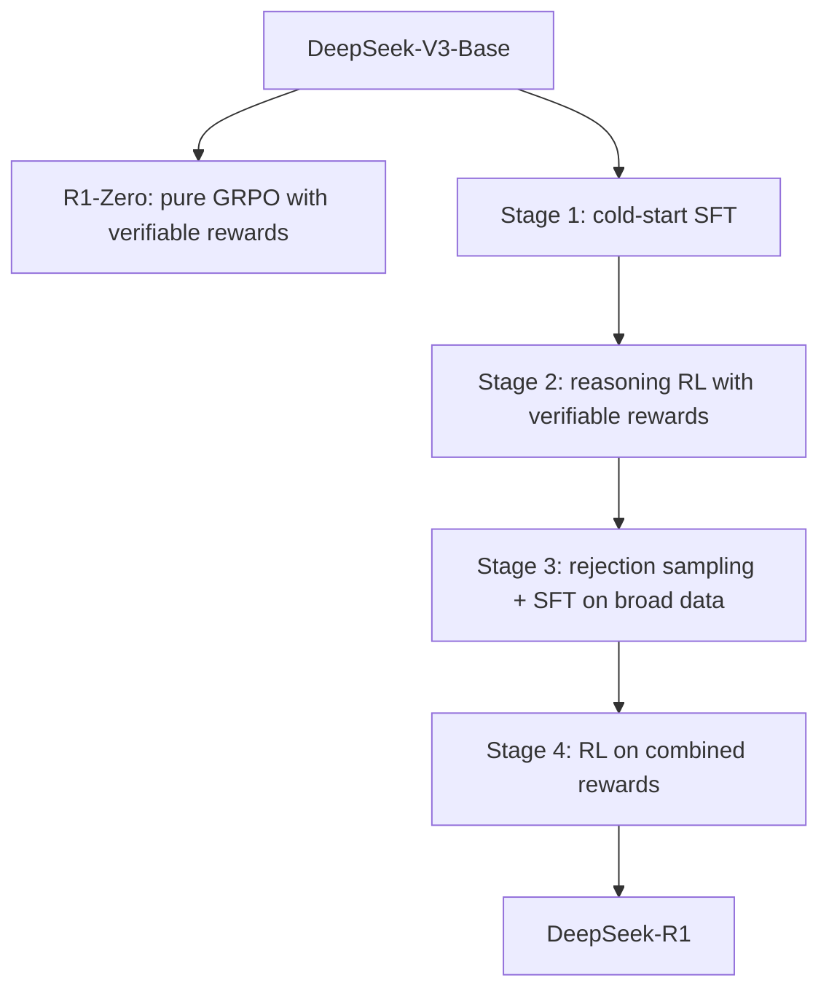

# 12 — DeepSeek-R1 (DeepSeek-AI, 2025)

> [!info] TL;DR
> DeepSeek-R1 demonstrated that large-scale reinforcement learning on **verifiable rewards** (correct code execution, provable math results) — without any human preference data — can teach an LLM to reason competently across math, coding, and logic. R1 matches OpenAI's o1 on multiple reasoning benchmarks while being open-weights. The paper also showed that a "pure RL" variant (R1-Zero) develops reasoning behaviors emergently, but a small amount of cold-start SFT dramatically improves usability. R1 reshaped the open-source reasoning-LLM landscape in 2025.

## Citation

DeepSeek-AI (2025). *DeepSeek-R1: Incentivizing Reasoning Capability in LLMs via Reinforcement Learning*. arXiv:2501.12948.

## The Problem Being Solved

[[07 - InstructGPT 2022|InstructGPT]] established RLHF as the alignment recipe, but RLHF requires human preference data — expensive, slow, and noisy. Worse, for *reasoning* tasks (math, code, multi-step logic), human raters often cannot reliably judge which of two chain-of-thoughts is better. They can verify the final answer, but evaluating intermediate steps requires domain expertise.

OpenAI's o1 (released September 2024) showed that a different signal works for reasoning: **verifiable rewards**. For math problems with known answers, the reward is simply "did the model produce the correct answer?" For code, the reward is "does the code pass the test cases?" These rewards are binary, automatic, and unlimited in supply.

DeepSeek-R1 applied this idea at scale, with two key contributions:
1. **Pure RL can elicit reasoning** (R1-Zero): start from a base model, apply RL with verifiable rewards, and the model develops chain-of-thought reasoning behaviors *emergently* — without any demonstrations.
2. **Cold-start data dramatically improves usability** (R1): R1-Zero produces messy reasoning (mixed languages, unstructured thoughts). A small amount of cold-start SFT on high-quality reasoning examples, followed by RL, gives a much more usable model.

The economic significance: R1 matched o1-class reasoning quality while being open-weights, dramatically lowering the cost of frontier reasoning capability. Within weeks of release, R1 distillations (Qwen-R1-Distill, Llama-R1) proliferated across the open ecosystem.

## The Two Pipelines

### R1-Zero: Pure RL on a Base Model

DeepSeek-V3-Base is the starting point (a 671B-parameter MoE model, 37B active — see [[01 - DeepSeek Architecture]]). No SFT, no instruction tuning. Apply RL directly:

**Reward function:**
- **Accuracy reward**: for math problems with known answers, `r = 1` if the final answer matches, `r = 0` otherwise.
- **Formatting reward**: small bonus for wrapping the chain-of-thought in `<think>...</think>` tags, so the model separates reasoning from the final answer.

That is it. No human preferences, no reward model trained on ratings.

**Algorithm: GRPO (Group Relative Policy Optimization)** — DeepSeek's variant of PPO. Instead of training a separate value function (which doubles memory), GRPO samples K responses per prompt, computes the advantage of each relative to the group mean, and uses this as the PPO advantage. This eliminates the value model, simplifying training.

```
A_i = (r_i - mean(r_1..r_K)) / std(r_1..r_K)
```

Standard PPO clipping then applies.

**Emergent behaviors observed during R1-Zero training:**
- **Chain-of-thought spontaneity**: the model starts producing step-by-step reasoning without being told to.
- **Reflection**: the model occasionally backtracks ("Wait, that's not right...").
- **Verification**: the model checks its own intermediate answers before committing.
- **Search-like behavior**: on hard problems, the model tries multiple approaches.

These behaviors emerge around the 10% mark of training and stabilize by ~50%. They are not pretrained in — they are discovered by RL because they improve accuracy.

**R1-Zero limitations:**
- Poor readability: reasoning is often mixed-language, overly verbose, and unstructured.
- Output format inconsistency: sometimes the `<think>` tags are missing or malformed.
- Worst-case behavior on out-of-distribution prompts is unpredictable.

### R1: Cold-Start SFT + Multi-Stage RL

R1 fixes R1-Zero's usability issues with a multi-stage pipeline:

**Stage 1: Cold-start SFT.** Curate a small (~10k examples) high-quality dataset of reasoning traces. Examples are written or selected for clarity, structure, and correctness. Fine-tune the base model with SFT.

This is the key difference from R1-Zero: instead of relying on emergent reasoning format, you seed the model with a "good" reasoning template.

**Stage 2: Reasoning-oriented RL.** Apply GRPO with verifiable rewards (same as R1-Zero), but starting from the cold-start model. The model now improves reasoning quality while preserving the seeded format.

**Stage 3: Rejection sampling + SFT.** Generate many reasoning traces from the RL'd model, filter for correctness (using verifiers), and combine with non-reasoning supervised data (writing, translation, QA). SFT the model on this combined dataset. This stage broadens the model's capabilities beyond pure reasoning.

**Stage 4: RL on broad preferences.** Final RL pass combining verifiable rewards (for reasoning) with rule-based or model-based rewards (for helpfulness, safety, formatting) on a broader prompt distribution.

The final R1 model is competitive with OpenAI's o1 on math, coding, and logical reasoning benchmarks while being open-weights.



## Key Results

R1's benchmark performance (selected):

| Benchmark                | o1-preview | DeepSeek-R1 |
|--------------------------|------------|-------------|
| MATH-500                 | 85.5       | 97.3        |
| AIME 2024 (pass@1)       | 9.3        | 16.0        |
| Codeforces (percentile)  | 62.9       | 65.9        |
| GPQA Diamond             | 52.4       | 71.5        |
| MMLU                     | 90.8       | 90.8        |

Particularly notable: AIME (American Invitational Mathematics Examination) is a benchmark where prior open-source models scored near zero. R1's 16% pass@1 (with majority voting, much higher) was a step change.

R1 also handles general knowledge (MMLU, GPQA) and code (Codeforces, LiveCodeBench) well, suggesting that reasoning capability transfers beyond pure math.

### Distillations
The paper released distilled variants: Qwen-1.5B/7B/14B/32B and Llama-8B/70B fine-tuned on R1's reasoning traces. These distillations outperform much larger base models on reasoning, demonstrating that the *reasoning pattern* (not just parameters) is what makes R1 effective.

For practitioners, the distilled Qwen-R1-7B or Llama-R1-8B models are practical to run on consumer hardware, providing o1-class reasoning quality at 7B-parameter cost.

## Why It Worked

### Verifiable Rewards Are Cheap, Unlimited, and Noise-Free
Unlike human preferences, verifiable rewards can be generated automatically for any problem with a known answer. This unlocks much larger RL training runs at lower cost. The signal is also binary and noise-free — there is no labeler disagreement.

### Cold-Start SFT Provides Formatting Scaffold
Pure RL discovers reasoning but does not discover *good formatting*. The cold-start data gives the model a clean template (`<think>` tags, structured steps) that RL then optimizes within. The combination is much more usable than pure RL.

### Reasoning Behaviors Are Latent in the Base Model
The fact that R1-Zero develops reflection, verification, and search behaviors *emergently* is profound. It means these behaviors are already within the base model's distribution; RL merely amplifies them because they improve accuracy. This suggests reasoning is not a special capability that needs to be trained in — it is a strategy that base models can discover.

### GRPO Simplifies RL Implementation
Removing the value function halves the memory footprint and eliminates a known source of instability in PPO. This makes large-scale RL feasible without dedicated RL infrastructure.

## Limitations

- **Limited to verifiable domains**. R1's recipe works because math and code have verifiers. For domains without objective correctness (creative writing, policy advice), the recipe does not directly apply.
- **Reasoning cost**. R1 produces long chain-of-thought tokens, increasing inference cost 5–20× compared to a non-reasoning model on the same prompt.
- **Language mixing**. Even with cold-start data, R1 sometimes switches languages mid-thought, especially on multilingual prompts.
- **Safety and alignment**. R1 is aligned primarily for reasoning; general safety alignment is shallower than models like Claude or GPT-4.
- **Distillation limits**. Distilled models inherit R1's reasoning patterns but not its full capability. They are useful for many tasks but cannot match the full R1 on hard problems.

## Impact and Legacy

DeepSeek-R1 had several major effects on the 2025 LLM landscape:

1. **Democratized reasoning models**. Before R1, frontier reasoning capability was OpenAI-exclusive. R1 made it open-weights, spawning a wave of distillations and reproductions.
2. **Validated verifiable-reward RL**. The recipe — verifiable rewards + GRPO + cold-start SFT — became the standard for training reasoning models. OpenAI, Anthropic, and Google all use variants of it.
3. **Renewed interest in pure RL**. The R1-Zero result showed that pure RL could elicit sophisticated behaviors from base models, reigniting interest in RL as a research direction (after DPO had somewhat displaced it).
4. **Reasoning as a commodity**. Within months of R1's release, reasoning capability was available in many open-weights models at small scales (7B–14B). This shifted the frontier of differentiation to other capabilities (multimodal, agentic, long-context).
5. **Reasoning cost as a new engineering problem**. Because R1-style models produce long chain-of-thought, inference cost became a major concern. This drove renewed investment in efficient inference (speculative decoding, KV cache compression, distilled reasoning).

## Further Reading

- Original paper: arXiv:2501.12948
- DeepSeek-V3 paper: arXiv:2412.19437 — the base model.
- DeepSeekMath: arXiv:2402.03300 — GRPO was first introduced here.
- OpenAI o1 system card (2024) — the closed-source counterpart.
- Qwen-R1 distillations on HuggingFace.

## See Also

- [[01 - DeepSeek Architecture]]
- [[10 - PPO Deep Treatment]]
- [[09 - Foundation Models/Reasoning Models/03 - Reasoning Models]]
- [[07 - InstructGPT 2022]]
- [[09 - DPO 2023]]
- [[26 - Papers/MOC|Papers MOC]]
