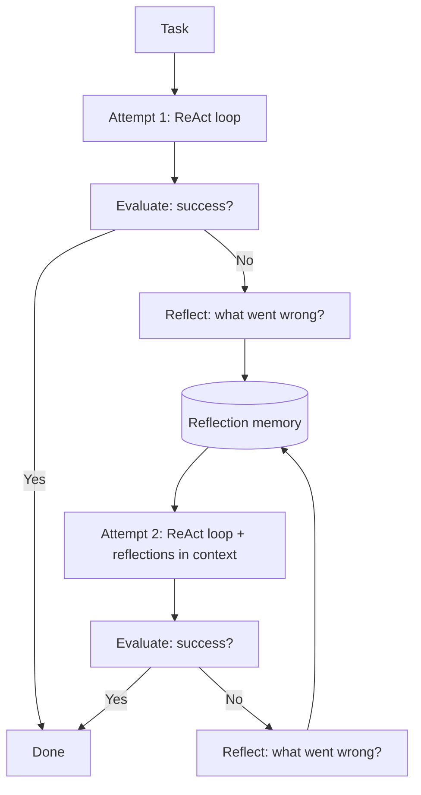

# 32 — Reflexion (Shinn et al., 2023)

> [!info] TL;DR
> Reflexion gives an LLM agent a **verbal self-critique loop**: after attempting a task and failing, the agent reflects on what went wrong, writes a "reflection" (a natural-language note about the failure), and retries with the reflection in context. This is "verbal reinforcement learning" — the agent learns from experience without weight updates, just by maintaining a memory of past failures and lessons. Reflexion improved agent performance on coding, reasoning, and decision-making benchmarks by 10–30%, establishing self-reflection as a core agent pattern.

## Citation

Shinn, N., Cassano, F., Berman, E., Gopinath, A., Narasimhan, K., & Yao, S. (2023). *Reflexion: Language Agents with Verbal Reinforcement Learning*. NeurIPS 2023. arXiv:2303.11366.

## The Problem Being Solved

[[03 - ReAct Pattern|ReAct]] (2022) established the agent loop: reason, act, observe, repeat. But ReAct agents have no memory across attempts — if they fail a task, they start over from scratch the next time. They don't learn from their mistakes.

This is a significant limitation. Humans, when they fail at a task, reflect on what went wrong and avoid making the same mistake again. ReAct agents don't — they make the same errors repeatedly.

The standard fix would be to fine-tune the model on successful trajectories. But fine-tuning is expensive, requires gradient updates, and is impractical at inference time. The question: can agents learn from experience without weight updates?

Reflexion's answer: yes, via verbal self-critique. After failing, the agent writes a reflection (in natural language) about what went wrong. This reflection is stored in memory and included in the context for the next attempt. The agent "learns" by accumulating verbal lessons.

## The Key Idea: The Reflection Loop

### The Three-Step Cycle
Reflexion extends ReAct with a reflection phase:

1. **Act**: the agent attempts the task using ReAct (reason, act, observe, repeat).
2. **Evaluate**: an evaluator (the agent itself, or an external signal) determines whether the attempt succeeded.
3. **Reflect**: if the attempt failed, the agent writes a reflection — a natural-language analysis of what went wrong and what to do differently.

The reflection is stored in memory. On the next attempt, the reflections are included in the agent's context, so it has the lessons from previous failures.



### The Reflection Format
A reflection is a natural-language note, typically structured as:
- **What was the goal?**
- **What did I do?**
- **What went wrong?**
- **What should I do differently?**

Example (from the paper, on a coding task):
```
Reflection on attempt 1:
- Goal: implement a function to find the longest palindromic substring.
- I wrote a solution using nested loops but it timed out on large inputs.
- The issue was O(n²) complexity. I should use Manacher's algorithm for O(n).
- Next time: use Manacher's algorithm, or at least optimize the inner loop.
```

This reflection is added to the agent's context for attempt 2, so it knows to try a different approach.

### The Evaluator
The evaluator can be:
- **External signal**: unit tests pass/fail (for coding), correct answer (for QA), task completion (for decision-making). This is the most reliable signal.
- **Self-evaluation**: the agent evaluates its own output ("Did this response answer the question correctly?"). Less reliable but works for open-ended tasks.
- **Human feedback**: a human rates the attempt. Most reliable but expensive.

For most Reflexion experiments, external signals (test cases, correct answers) were used, making the evaluation objective.

## Key Results

Reflexion was evaluated on three task families:

### Coding (HumanEval)
- **Baseline (GPT-4, no reflection)**: 80.1% pass@1
- **Reflexion (GPT-4, with reflection)**: 91.0% pass@1
- **Improvement**: +10.9 points

On harder coding benchmarks (MBPP, CodeContests), Reflexion showed similar improvements. The agent would attempt a solution, fail a test case, reflect on why, and retry with a corrected approach.

### Decision-Making (AlfWorld)
- **Baseline (ReAct, GPT-3.5)**: 75% success
- **Reflexion (GPT-3.5, with reflection)**: 97% success
- **Improvement**: +22 points

AlfWorld is a text-based game requiring multi-step planning. Reflexion's lessons ("don't open the same drawer twice", "check the refrigerator first for food items") accumulated across attempts.

### Reasoning (HotpotQA)
- **Baseline (ReAct, GPT-3.5)**: 34.5% exact match
- **Reflexion (GPT-3.5, with reflection)**: 38.4% exact match
- **Improvement**: +3.9 points

On multi-hop QA, Reflexion helped the agent learn which retrieval strategies worked and which didn't.

### Convergence
Most of the benefit came in the first 2–3 reflections. After ~5 attempts, additional reflections showed diminishing returns (the agent had either solved the problem or was stuck in a loop). This suggests reflections are most valuable for catching initial mistakes, not for deep optimization.

## Why It Worked

### LLMs Can Self-Critique (With Hindsight)
With the benefit of hindsight (knowing the attempt failed), the LLM can often identify what went wrong. "I tried approach X, it failed because of Y, I should try approach Z." This hindsight analysis is much easier than predicting the correct approach upfront.

### Verbal Memory Is Flexible
Unlike gradient updates (which require backprop and specific architectures), verbal memory works with any LLM. The reflections are just text in the context. This makes Reflexion model-agnostic and easy to implement.

### Reflections Compose
Multiple reflections accumulate — the agent has all past lessons available. This composition allows the agent to build up a "strategy guide" for the task over multiple attempts.

### External Evaluation Is Reliable
For tasks with objective success signals (test cases, correct answers), the evaluator is reliable. This makes the reflection trigger trustworthy — the agent only reflects when it actually failed.

## Limitations

### Self-Evaluation Is Unreliable
For tasks without objective success signals, the agent must evaluate itself. This is unreliable — the agent may think it succeeded when it didn't (or vice versa). Reflexion works best with external evaluators.

### Reflections Can Be Wrong
The agent's reflection on what went wrong may itself be wrong. If the reflection is incorrect, the next attempt is misguided. Reflections are most reliable when the failure mode is obvious (test case failed, wrong answer).

### Context Window Limits
Each reflection adds to the context. After 5–10 reflections, the context is full of past lessons, leaving less room for the current attempt. Reflections must be concise or summarized.

### Doesn't Fix Fundamental Capability Gaps
If the model lacks the capability to solve a task (e.g., it doesn't know the algorithm), reflecting on failures won't help — the model can't reflect its way to knowledge it doesn't have. Reflexion helps with strategic mistakes, not knowledge gaps.

### Can Reinforce Wrong Lessons
If a reflection draws the wrong conclusion ("I should use a brute-force approach" when the issue was actually efficiency), the next attempt will be worse. Reflections need to be accurate to help.

### Cost
Each reflection is an additional LLM call. With 3–5 reflections per task, the cost is 3–5× a single attempt. For high-volume applications, this adds up.

## Variants and Extensions

### Self-Refine (Madaan et al., 2023)
Similar to Reflexion but for single-attempt refinement. The agent generates a response, critiques it, and refines it — all in one turn. Lighter-weight than Reflexion's multi-attempt loop.

### Self-Consistency (Wang et al., 2022)
Different approach: sample multiple responses, pick the majority answer. Doesn't use reflection but achieves similar error reduction through diversity.

### Tree of Thoughts (Yao et al., 2023)
Generalizes Reflexion to a tree search: explore multiple approaches, reflect on each, expand the most promising. More powerful but more expensive. See [[06 - Tree of Thoughts and Self Consistency]].

### Reflexion + Tool Use
Combining Reflexion with tool-augmented agents (ReAct with tools) gives the agent both the ability to act (tools) and to learn from acting (reflection). This is the most capable agent pattern as of 2024–2025.

## Impact and Legacy

Reflexion established self-reflection as a core agent pattern:

1. **Reflection as a standard agent component**. Most production agent frameworks (LangGraph, OpenAI Agents SDK, AutoGen) include reflection as a first-class pattern. The 2024–2025 consensus is that agents without reflection are significantly weaker.

2. **Verbal reinforcement learning as a paradigm**. Reflexion demonstrated that agents can learn from experience without weight updates. This is a fundamentally different paradigm from gradient-based learning, with different trade-offs (cheaper, faster, but less permanent).

3. **Inspired self-refine and self-critique patterns**. The broader idea of "generate, critique, revise" appears in many subsequent works. Self-Refine, CRITIC, and other methods extend the pattern.

4. **Practical agent improvement**. Reflexion's 10–30% improvements on coding and reasoning benchmarks made it immediately useful for production agents. Many coding assistants (Cursor, GitHub Copilot Workspace) use reflection-like patterns.

5. **Foundation for reasoning models**. The reflection pattern (think, check, retry) appears in reasoning models like o1 and DeepSeek-R1. These models internalize the reflection loop in their chain-of-thought, rather than doing it across separate attempts.

For AI engineers, Reflexion is a practical pattern you can add to any agent. The implementation is straightforward (catch failures, generate reflections, include in context), and the quality improvement is often significant. Understanding Reflexion clarifies why production agents need self-critique loops and how to design them.

## Further Reading

- Original paper: arXiv:2303.11366
- Self-Refine: arXiv:2303.17651
- Tree of Thoughts: arXiv:2305.10601
- [[05 - Reflection]] — concept note in this vault.

## See Also

- [[05 - Reflection]]
- [[03 - ReAct Pattern]]
- [[06 - Tree of Thoughts and Self Consistency]]
- [[02 - Chain-of-Thought]]
- [[15 - AI Agents/MOC|15 AI Agents]]
- [[26 - Papers/MOC|Papers MOC]]
