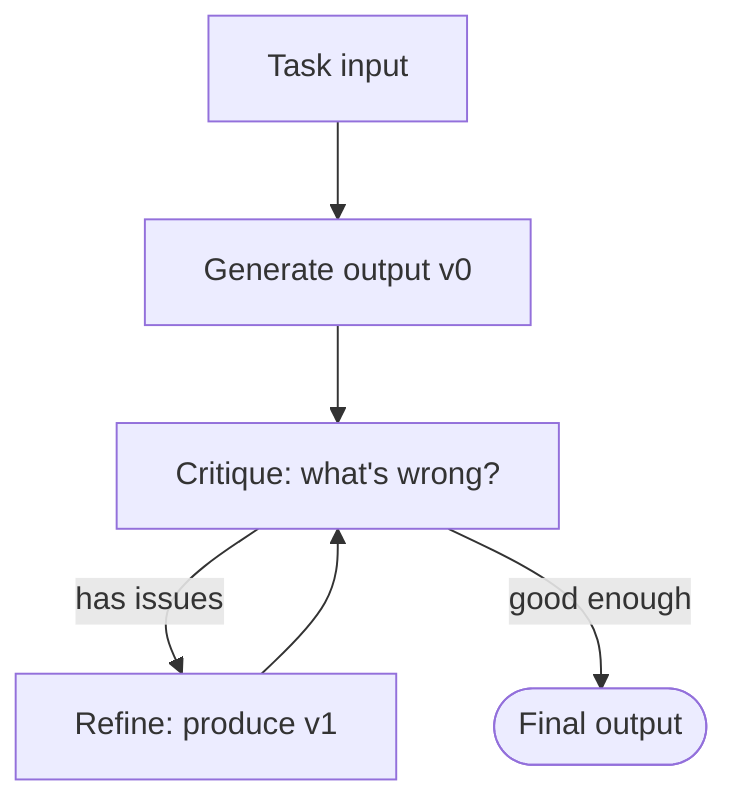

# 33 — Self-Refine (Madaan et al., 2023)

> [!info] TL;DR
> Self-Refine gives an LLM a **self-critique loop**: the model generates an output, critiques its own output, then regenerates based on the critique. This iterates until the critique is satisfied or a max-iteration limit is reached. Self-Refine improved output quality on diverse tasks (dialogue, code, math, acrostic poetry) by 5-20% with no additional training, no external tools, and no extra data — just a single LLM prompting itself. Self-Refine is the simplest instance of the broader "reflection" pattern (see [[05 - Reflection]]); [[32 - Reflexion 2023]] extended it with cross-attempt memory.

## Citation

Madaan, A., Tandon, N., Gupta, P., Hallinan, S., Gao, L., Wiegreffe, S., Alon, U., Dziri, N., Prabhumoye, S., Yang, Y., Gupta, S., Majumder, B. P., Hermann, K., Welleck, S., Yazdanbakhsh, A., & Clark, P. (2023). *Self-Refine: Iterative Refinement with Self-Feedback*. NeurIPS 2023. arXiv:2303.17651.

## The Problem Being Solved

LLMs generate outputs in a single forward pass. For complex tasks (write code, solve a math problem, write a poem with constraints), the first attempt is often imperfect:

- Code has bugs.
- Math has arithmetic errors.
- Poems don't follow the constraints.
- Dialog responses are generic or off-tone.

The standard fix would be fine-tuning on a dataset of (input, improved output) pairs. But this requires:

1. Curating such a dataset (expensive).
2. Training a model (compute-intensive).
3. Repeating for every new task (impractical).

Self-Refine's question: can the LLM improve its own output at inference time, without any training?

## The Key Idea: The Self-Critique Loop

Self-Refine uses three LLM calls per iteration:

1. **Generate**: produce an initial output.
2. **Critique**: the LLM evaluates its own output, identifying specific weaknesses.
3. **Refine**: the LLM revises the output based on the critique.



The loop continues until either:

- The critique says the output is good (e.g., "No issues found.").
- A maximum iteration count is reached (typically 2-5).

### The Three Prompts

Self-Refine uses three task-specific prompts:

**Generate prompt** (initial generation):
```
Task: {task_description}
Input: {input}
Output:
```

**Critique prompt** (self-evaluation):
```
Task: {task_description}
Input: {input}
Output: {generated_output}

Identify specific issues with the output. Be precise — point to particular lines, errors, or weaknesses.
Issues:
```

**Refine prompt** (revision):
```
Task: {task_description}
Input: {input}
Previous output: {generated_output}
Issues identified: {critique}

Revise the output to address the issues. Keep what works; fix what doesn't.
Revised output:
```

The prompts are task-specific (the critique prompt for code looks different from the critique prompt for poetry), but the structure is the same across tasks.

### Example: Code Generation

**Generate** (Python function to check if a string is a palindrome):
```python
def is_palindrome(s):
    return s == s[::-1]
```

**Critique**: "The function doesn't handle case or non-alphanumeric characters. 'A man, a plan, a canal, Panama!' should return True but this returns False."

**Refine**:
```python
def is_palindrome(s):
    # Normalize: lowercase, remove non-alphanumeric
    s = ''.join(c.lower() for c in s if c.isalnum())
    return s == s[::-1]
```

**Critique**: "Looks correct. No issues."

The model identified its own bug (failure to normalize) and fixed it, without external feedback.

## Key Results

Self-Refine was evaluated on 7 diverse tasks:

| Task                          | Baseline | Self-Refine | Improvement |
|-------------------------------|----------|-------------|-------------|
| Acrostic poetry               | 0.43     | 0.57        | +33%        |
| Dialogue response (empathy)   | 3.62     | 3.89        | +7%         |
| Code optimization             | 0.65     | 0.78        | +20%        |
| Math reasoning (GSM8K)        | 0.74     | 0.79        | +7%         |
| Code readability              | 0.62     | 0.71        | +15%        |
| Constrained generation (AESOP)| 0.45     | 0.58        | +29%        |
| Mermaid diagram generation    | 0.51     | 0.62        | +22%        |

Improvements are consistent across tasks, suggesting the technique is broadly applicable. The largest gains are on tasks with clear success criteria (code, math, constrained generation) — where the model can reliably identify its own errors.

## Why It Worked

### LLMs Can Self-Evaluate

The key finding: LLMs are better at evaluating outputs than generating them. A model that produces a flawed first attempt can often identify the flaw when asked to critique. This asymmetry is what makes Self-Refine work.

This is consistent with the broader finding (from RLHF research) that LLMs make decent reward models. Self-Refine uses the LLM as its own reward model — generating, evaluating, and refining with the same underlying model.

### Critique Forces Specificity

The critique prompt asks for **specific** issues. Vague critiques ("the output could be better") don't help. By forcing the model to identify particular lines, errors, or weaknesses, the critique becomes actionable.

### Refinement Preserves What Works

The refine prompt says "keep what works; fix what doesn't." This is important — without it, the model might rewrite the output entirely, losing what was good. By framing refinement as targeted fixes, the model preserves quality while addressing issues.

## Limitations

### Diminishing Returns After 2-3 Iterations

Most improvements come in the first 1-2 refinement iterations. Beyond that, the model is either satisfied (no more issues found) or stuck (the same issues recur). Self-Refine's sweet spot is 2-3 iterations.

### Weak on Tasks Without Clear Success Criteria

For tasks like "write a creative story" where success is subjective, the model's self-critique is unreliable. It either finds trivial issues (typos) or invents issues that aren't real. Self-Refine works best when the task has clear success criteria (code that runs, math that's correct, constraints that are satisfied).

### Can Amplify Errors

Sometimes the critique is wrong — the model thinks there's an issue when there isn't. The refine step then "fixes" a non-issue, making the output worse. This is rare but happens.

### Cost Multiplier

Self-Refine uses 3 LLM calls per iteration, and typically runs 2-3 iterations. That's 6-9 LLM calls per output, vs. 1 for direct generation. For cost-sensitive applications, this multiplier is significant.

## Comparison to Related Work

### Reflexion (2023)

[[32 - Reflexion 2023]] extends Self-Refine with **cross-attempt memory**: reflections from prior attempts are stored and included in context for future attempts. Reflexion is for tasks with multiple attempts (e.g., a coding task you retry after failure); Self-Refine is for single-attempt refinement.

### Chain-of-Thought (2022)

[[02 - Chain-of-Thought]] asks the model to reason step-by-step before answering. Self-Refine is complementary — you can use chain-of-thought in the generate step, then refine the resulting answer.

### Constitutional AI (2022)

[[31 - Constitutional AI 2022]] uses self-critique to align models with principles ("is this response harmful?"). The mechanism is similar to Self-Refine; the application is alignment training rather than inference-time improvement.

## Impact and Legacy

Self-Refine established **inference-time self-improvement** as a viable technique. Before Self-Refine, improving LLM output meant fine-tuning; after Self-Refine, it could mean better prompting at inference time.

The paper influenced:

- **Agent frameworks**: LangGraph, AutoGen, and others include reflection patterns inspired by Self-Refine.
- **Production agent systems**: many use a generate-critique-refine loop for high-stakes outputs (code, content).
- **Subsequent research**: Reflexion, Self-Consistency, Tree of Thoughts, and other inference-time techniques built on Self-Refine's foundation.

## Production Use

Self-Refine is widely used in production for:

- **Code generation**: generate, critique (find bugs), refine.
- **Content creation**: generate, critique (improve quality), refine.
- **Math reasoning**: generate, critique (check arithmetic), refine.
- **Constrained generation**: generate, critique (verify constraints), refine.

The cost multiplier (3-9×) is acceptable for high-value outputs where quality matters more than latency.

## See Also

- [[05 - Reflection]] — the broader reflection pattern
- [[32 - Reflexion 2023]] — extension with cross-attempt memory
- [[02 - Chain-of-Thought]] — complementary reasoning technique
- [[06 - Tree of Thoughts and Self Consistency]] — alternative inference-time technique
- [[31 - Constitutional AI 2022]] — related self-critique for alignment
- [[15 - AI Agents/MOC|15 AI Agents]] — agent patterns Self-Refine influenced
- [[26 - Papers/MOC|26 Papers MOC]]
