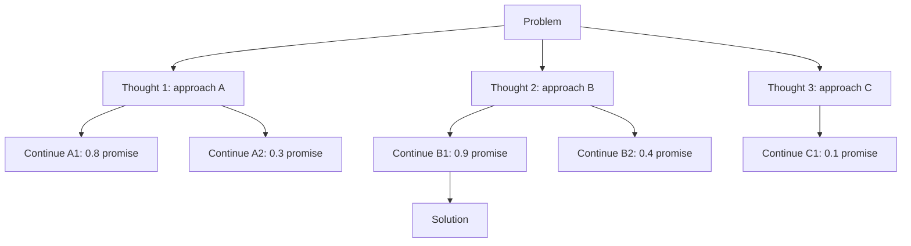

# 34 — Tree of Thoughts (Yao et al., 2023)

> [!info] TL;DR
> Tree of Thoughts (ToT) frames LLM reasoning as a **search problem**: the model generates multiple candidate "thoughts" (reasoning steps) at each point, evaluates each, and explores the most promising via breadth-first or depth-first search. This is a generalization of chain-of-thought (which explores a single reasoning path) to a tree of paths. ToT achieved state-of-the-art results on planning-heavy tasks (24 game, creative writing, crosswords) where chain-of-thought fails because the right next step isn't obvious. The cost: ToT uses 10-100× more LLM calls than direct generation, making it expensive for production use.

## Citation

Yao, S., Yu, D., Zhao, J., Shafran, I., Griffiths, T. L., Cao, Y., & Narasimhan, K. (2023). *Tree of Thoughts: Deliberate Problem Solving with Large Language Models*. NeurIPS 2023. arXiv:2305.10601.

## The Problem Being Solved

[[02 - Chain-of-Thought|Chain-of-thought]] (CoT) prompting improved LLM reasoning by asking the model to think step-by-step. But CoT has a fundamental limitation: it explores a **single** reasoning path. If the model's first step is wrong, the rest of the chain is wasted.

This is fine for tasks where the right next step is obvious (basic arithmetic, simple deductions). It fails for tasks requiring **planning** or **search**:

- **24 game**: given 4 numbers, combine them with operations to make 24. The right first operation isn't obvious; you may need to try several.
- **Creative writing**: write a coherent passage that satisfies multiple constraints. Different opening sentences lead to different (better or worse) stories.
- **Crosswords**: fill a crossword grid. Each word affects the intersecting words; you may need to backtrack.

For these tasks, humans don't think linearly — they explore options, evaluate them, and backtrack. CoT can't do this. ToT was built to enable it.

## The Key Idea: Search Over Reasoning Trees

ToT frames reasoning as a search through a tree of "thoughts":

- **Thought**: a coherent reasoning step (a sentence, a code snippet, a partial solution).
- **Tree**: each node is a thought; children are continuations of that thought.
- **Evaluation**: each thought is scored (by the LLM) for promise.
- **Search**: explore the tree using BFS, DFS, or beam search.



The search algorithm (BFS with beam width K, or DFS with pruning) explores the most promising thoughts and prunes the rest. The final answer is the thought at the deepest explored level (or the highest-scoring leaf).

## The Four Components

ToT requires four LLM-driven components, each with its own prompt:

### 1. Thought Generation

Given the current state (problem + prior thoughts), generate K candidate next thoughts:

```
Problem: {problem}
Prior thoughts: {thoughts_so_far}

Generate 3 different candidate next thoughts. Each should be a coherent reasoning step.
```

The thoughts should be **diverse** — different approaches, not minor variations. The model is prompted to think differently.

### 2. State Evaluation

Given a candidate thought, evaluate its promise:

```
Problem: {problem}
Thought: {candidate_thought}

Evaluate this thought on a scale of 1-10 for promise (how likely is this to lead to a correct solution?).
Also provide a brief justification.
```

The evaluation can be:

- **Numeric**: score 1-10.
- **Categorical**: "definitely sure", "likely", "impossible".
- **Comparative**: rank multiple candidates.

The evaluator is the same LLM (no separate reward model). This works surprisingly well — LLMs can evaluate reasoning steps better than they can generate them (see [[33 - Self-Refine 2023]]).

### 3. Search Algorithm

The search algorithm determines how to explore the tree:

- **BFS (Breadth-First Search)**: keep the top-K thoughts at each level, expand all of them. Good for shallow trees with bounded branching.
- **DFS (Depth-First Search)**: explore one path deeply; backtrack if evaluation drops below a threshold. Good for deep trees.
- **Beam search**: like BFS but keep only the top-K thoughts across all current leaves. A common middle ground.

The choice depends on the task. The 24 game uses BFS (broad but shallow); creative writing uses beam search (limited depth, multiple branches).

### 4. Termination

When to stop:

- **Goal reached**: a thought satisfies the success criterion (correct answer to the 24 game).
- **Max depth**: reached the maximum tree depth.
- **No promising thoughts**: all current leaves have low evaluations.
- **Budget exhausted**: hit the LLM call budget.

## Example: The 24 Game

The 24 game: given 4 numbers (e.g., 4, 7, 8, 8), combine them with +, -, ×, ÷ to make 24.

**Standard LLM (CoT)**: tries one approach. Often fails because the right first operation isn't obvious.

**ToT**:

1. Generate 3 candidate first operations: `4 + 7 = 11`, `8 / 8 = 1`, `7 - 4 = 3`.
2. Evaluate each: `4 + 7 = 11` looks hard (11 with 8, 8 to make 24); `8 / 8 = 1` looks promising (1 with 4, 7 to make 24); `7 - 4 = 3` looks promising (3 with 8, 8 to make 24).
3. Expand the top 2: from `8 / 8 = 1`, generate `1 + 4 = 5`, `1 × 4 = 4`, `7 - 1 = 6`. From `7 - 4 = 3`, generate `3 × 8 = 24`, `3 + 8 = 11`, `8 / 3 = ...`.
4. Evaluate: `3 × 8 = 24` looks like a near-solution (24 with one more 8 to combine).
5. Continue: from `3 × 8 = 24`, generate `24 - 8 = 16`, `24 / 8 = 3`, `24 + 8 = 32`, `24 × 8 = 192`. None give 24.
6. Backtrack: try `8 × (3 - 8/8) = 8 × 2 = 16`. No.
7. Eventually find: `(7 - (8 / 8)) × 4 = (7 - 1) × 4 = 24`. ✓

ToT solves 74% of 24-game problems; CoT solves 4%.

## Key Results

| Task                          | CoT       | ToT       | Improvement |
|-------------------------------|-----------|-----------|-------------|
| 24 Game                       | 4%        | 74%       | +70 pp      |
| Creative writing (coherence)  | 7.56      | 7.56      | (judges preferred ToT 7.6/10 vs CoT 7.0/10) |
| Crosswords (mini)             | 1%        | 60%       | +59 pp      |

The 24 game result is striking: ToT is 18× better than CoT. This isn't a marginal improvement — it's a qualitative difference in capability.

## Why It Worked

### Search Is the Right Frame for Planning Tasks

For tasks where the right next step isn't obvious, search is the right algorithmic frame. Humans solve these tasks by trying things, evaluating, and backtracking. ToT gives LLMs the same capability.

### LLMs Are Decent Evaluators

The state evaluator doesn't need to be perfect — it just needs to be better than random. LLMs evaluating "is this thought promising?" are correct ~70-80% of the time. That's enough signal for search to find good paths.

### Diversity Helps

Generating diverse candidates at each step is essential. If all 3 candidates are minor variations of the same approach, search has nothing to choose between. ToT's prompts explicitly encourage diversity.

## Limitations

### Cost

ToT uses 10-100× more LLM calls than direct generation. For the 24 game, a typical ToT run uses ~50 LLM calls (thought generation + evaluation, multiple levels). For complex tasks, it can be 100s of calls.

This makes ToT impractical for production use at scale. It's a research technique for hard problems where the cost is justified.

### Doesn't Help on Tasks Where CoT Already Works

For tasks where the right next step is obvious (basic arithmetic, simple deduction), ToT adds no value over CoT. It just adds cost. ToT is for tasks requiring **deliberation** — where multiple approaches should be considered.

### Evaluator Quality Bounds Search Quality

If the evaluator is bad (gives high scores to wrong thoughts), search wastes time on bad branches. The evaluator is the bottleneck. Better evaluators (e.g., trained reward models) would improve ToT, but the paper uses the same LLM as evaluator.

### Hard to Tune

ToT has many hyperparameters: branching factor, search depth, evaluation prompt, search algorithm. Tuning these per task is fiddly. There's no "default ToT" that works for all tasks.

## Comparison to Related Work

### Chain-of-Thought (2022)

CoT explores a single path. ToT explores a tree. ToT strictly generalizes CoT (set branching factor to 1, depth to N).

### Self-Consistency (2022)

Self-Consistency (Wang et al., 2022) samples multiple CoT paths independently and majority-votes. ToT searches a tree with evaluation. Self-Consistency is cheaper but doesn't backtrack; ToT is more expensive but smarter.

### Reflexion (2023)

[[32 - Reflexion 2023]] is for tasks with multiple attempts (retry after failure). ToT is for single-attempt search. They're complementary: ToT for search within an attempt, Reflexion for learning across attempts.

### ReAct (2022)

[[03 - ReAct Pattern|ReAct]] interleaves reasoning and action. ToT is pure reasoning (no actions/tools). They could be combined: ToT for reasoning, ReAct for tool use.

## Impact and Legacy

ToT established **search as a viable inference-time technique for LLMs**. It inspired:

- **Graph of Thoughts** (Besta et al., 2023): generalizes trees to graphs.
- **LLM+P** (Liu et al., 2023): uses external planners with LLMs.
- **Reasoning via Planning** (RAP): uses MCTS-style search.
- **Production agent frameworks**: many include ToT-style search for hard reasoning tasks.

The broader lesson: LLMs can do more than generate. With the right scaffolding (search, evaluation, backtracking), they can solve problems that single-pass generation can't.

## Production Use

ToT is rarely used in production due to cost. Exceptions:

- **Hard reasoning tasks** where the cost is justified (e.g., complex math, code planning).
- **High-value decisions** where one wrong answer is expensive (e.g., legal analysis).
- **Research and evaluation** where understanding LLM capability matters.

For most production use cases, simpler techniques (CoT, Self-Consistency, Self-Refine) provide most of the benefit at lower cost.

## See Also

- [[02 - Chain-of-Thought]] — the predecessor ToT generalizes
- [[06 - Tree of Thoughts and Self Consistency]] — chapter 15 deep dive
- [[33 - Self-Refine 2023]] — complementary inference-time technique
- [[32 - Reflexion 2023]] — cross-attempt learning
- [[03 - ReAct Pattern]] — reasoning + acting
- [[26 - Papers/MOC|26 Papers MOC]]
