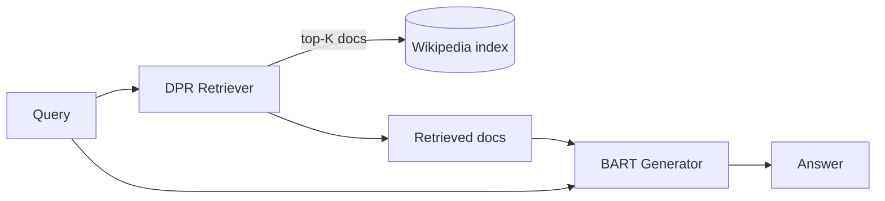

# 35 — RAG (Lewis et al., 2020)

> [!info] TL;DR
> The original RAG paper by Lewis et al. (2020) introduced retrieval-augmented generation: combine a pre-trained seq2seq model (BART) with a differentiable retriever (DPR) over a non-parametric memory (Wikipedia). At inference time, the retriever finds relevant documents for the query, and the generator conditions on the query + retrieved documents to produce the answer. RAG enabled LLMs to access up-to-date information, attribute claims to sources, and handle knowledge-intensive tasks without retraining. The paper defined the field; modern RAG systems differ in implementation but follow the same architecture.

## Citation

Lewis, P., Perez, E., Piktus, A., Petroni, F., Karpukhin, V., Goyal, N., Küttler, H., Lewis, M., Yih, W., Rocktäschel, T., Riedel, S., & Kiela, D. (2020). *Retrieval-Augmented Generation for Knowledge-Intensive NLP Tasks*. NeurIPS 2020. arXiv:2005.11401.

## The Problem Being Solved

Pretrained LLMs (T5, BART, GPT-2/3) stored all their knowledge in their parameters. This had three problems:

### 1. Knowledge Is Static

Once trained, the model's knowledge is frozen. To update it (e.g., new president elected, new scientific discovery), you must retrain — prohibitively expensive. The model gives wrong answers about anything that changed after its training cutoff.

### 2. No Source Attribution

The model produces answers from its parameters, but can't say where the knowledge came from. For fact-checking, citation, or trust, this is a problem. Users can't verify whether the answer is correct.

### 3. Hallucination on Knowledge-Intensive Tasks

For knowledge-intensive tasks (Jeopardy!, trivia, factual QA), the model's parametric knowledge is insufficient. It hallucinates plausible-sounding but wrong answers. This is especially bad for long-tail facts (rare entities, recent events).

The standard fix would be fine-tuning on the target knowledge. But:

- Fine-tuning is expensive.
- Fine-tuning on knowledge leads to overfitting on the training set.
- Fine-tuning doesn't solve the source attribution problem.

RAG's question: can we give the model access to external knowledge **at inference time**, without retraining?

## The Key Idea: Non-Parametric Memory

RAG augments the parametric memory (model weights) with **non-parametric memory** (an external document index). At inference time:

1. The retriever finds documents relevant to the query.
2. The generator conditions on the query + retrieved documents.
3. The generator produces the answer.

The model's parametric memory handles language understanding; the non-parametric memory handles factual knowledge. This separation solves all three problems:

- **Updatable**: change the document index without retraining the model.
- **Attributable**: the retrieved documents are the source.
- **Less hallucination**: the model has the relevant facts in context.

## The Two Components

### The Retriever: DPR (Dense Passage Retrieval)

DPR (Karpukhin et al., 2020) is a dual-encoder retriever:

- **Question encoder**: encodes the query into a vector.
- **Passage encoder**: encodes each Wikipedia passage into a vector (precomputed offline).
- **Retrieval**: dot-product similarity; return top-K passages.

Both encoders are BERT-based, fine-tuned on QA datasets (NQ, TriviaQA, WQ). The dual-encoder design enables fast retrieval (FAISS index over precomputed passage vectors).

### The Generator: BART

BART (Lewis et al., 2020, different Lewis) is a seq2seq transformer. The input is the query concatenated with the top-K retrieved passages. The output is the answer.

The generator is fine-tuned end-to-end on QA tasks. It learns to attend to the relevant passages and ignore the irrelevant ones.

## The Two Variants

The paper introduced two RAG variants:

### RAG-Sequence

The generator produces a single answer per (query, document) pair, then marginalizes over documents:

$$p(y | x) = \sum_{z \in \text{top-K}(x)} p(z | x) p(y | x, z)$$

The generator attends to one document at a time, producing K candidate answers. The final answer is the weighted sum (by retrieval probability).

### RAG-Token

The generator can attend to different documents at each token:

$$p(y | x) = \prod_i \sum_{z \in \text{top-K}(x)} p(z | x) p(y_i | x, z, y_{<i})$$

Each token can come from a different document. More flexible but more expensive.

In practice, RAG-Sequence is simpler and performs similarly. RAG-Token is rarely used in production.

## Key Results

RAG was evaluated on knowledge-intensive QA tasks:

| Task                  | T5/BART (closed-book) | RAG       |
|-----------------------|----------------------|-----------|
| Open-domain QA (NQ)   | 27.0                 | 44.1      |
| TriviaQA              | 25.5                 | 56.8      |
| WebQuestions          | 25.3                 | 44.5      |
| Jeopardy! generation  | BLEU 11.3            | BLEU 19.0 |

RAG roughly doubled QA accuracy. The improvement comes from having the relevant facts in context — the model doesn't need to recall them from parameters.

Importantly, RAG matched closed-book T5/BART on non-knowledge-intensive tasks (no regression). The retrieval is helpful when needed; the generator ignores it when not.

## Why It Worked

### Separation of Concerns

Parametric memory (language understanding, reasoning) and non-parametric memory (facts, knowledge) serve different purposes. Specializing each component is more effective than trying to put everything in one.

### Differentiable Retrieval

DPR is differentiable — the retriever can be fine-tuned end-to-end with the generator. This means the system learns what to retrieve based on what helps generation.

(Modern RAG systems often freeze the retriever and only train the generator, but the original paper trained both.)

### Precomputed Index

The passage encoder's outputs are precomputed and indexed with FAISS. Retrieval is sub-second even with millions of passages. This makes RAG practical for production.

## Limitations

### Single-Round Retrieval

The original RAG retrieves once, then generates. There's no iterative retrieval or multi-hop reasoning. For complex questions requiring multiple sources, single-round retrieval is insufficient. Modern RAG systems add iterative retrieval (FLARE, Self-RAG) to address this.

### Fixed Document Index

The paper uses Wikipedia. Real-world applications have dynamic documents (web pages, internal docs) that change. The index must be updated, which is expensive for large corpora.

### Retrieval Quality Bounds Generation Quality

If the retriever finds irrelevant documents, the generator can't produce a good answer. Retrieval quality (recall@K) is the bottleneck. The original DPR retriever had ~70-80% recall@5; modern retrievers achieve 90%+.

### Cost of Retrieval

Retrieval adds latency and infrastructure cost. For real-time applications, the retrieval step (~50-200ms) is significant. Modern systems use approximate nearest neighbor (ANN) search to make retrieval fast.

## Comparison to Modern RAG

The original RAG paper defined the architecture, but modern RAG systems differ in implementation:

| Aspect                  | Original RAG (2020)            | Modern RAG (2026)                       |
|-------------------------|-------------------------------|------------------------------------------|
| Retriever               | DPR (BERT dual-encoder)       | BGE, E5, GTE, OpenAI embeddings          |
| Generator               | BART (seq2seq, 400M)          | Llama 3, Qwen 2.5, Claude (7B-70B+)      |
| Document store          | Wikipedia (21M passages)      | pgvector, Qdrant, Milvus (custom corpora)|
| Chunking                | Pre-split Wikipedia passages  | Custom chunking (recursive, semantic)    |
| Retrieval               | Single-round, top-K           | Multi-stage (retrieve, rerank, fuse)     |
| Reranking               | None                          | Cross-encoder rerankers (Cohere, bge)    |
| Query rewriting         | None                          | HyDE, multi-query, step-back             |
| Source attribution      | Implicit (via attention)      | Explicit citations with chunk IDs        |
| Evaluation              | Exact match, BLEU             | RAGAS, TruLens (faithfulness, relevance) |

Modern RAG is more sophisticated, but the core insight is the same: retrieve relevant context, condition generation on it.

## Impact and Legacy

RAG defined the field of retrieval-augmented generation. Its impact:

- **Production AI**: RAG is the standard architecture for question-answering over private data. Every major AI platform (ChatGPT with browse, Claude with artifacts, Perplexity, custom enterprise AI) uses RAG.
- **Vector databases**: the rise of pgvector, Pinecone, Qdrant, Weaviate, Milvus was driven by RAG adoption.
- **Embedding models**: the demand for better retrievers drove embedding model development (BGE, E5, GTE).
- **Subsequent research**: Self-RAG, Corrective RAG, FLARE, GraphRAG, Agentic RAG — all build on the original RAG architecture.
- **The "RAG" term itself**: the paper coined "retrieval-augmented generation," now standard terminology.

## Why It's Still Relevant

Despite being from 2020, the original RAG paper remains relevant because:

- The architecture is simple and effective.
- Modern systems are implementations of the same idea with better components.
- The limitations the paper identified (single-round retrieval, fixed index) are still the active research directions.

Reading the original paper is the fastest way to understand what RAG is and why it works.

## See Also

- [[01 - RAG Pipeline Overview]] — modern RAG architecture
- [[02 - Chunking Hybrid Search Reranking]] — modern retrieval techniques
- [[03 - Advanced RAG Patterns]] — Self-RAG, FLARE, GraphRAG
- [[02 - Embedding Models for Retrieval]] — modern retrievers
- [[04 - Vector Memory Backends]] — vector databases
- [[35 - RAG 2020]] — this paper (cross-link)
- [[26 - Papers/MOC|26 Papers MOC]]
- [[17 - RAG/MOC|17 RAG MOC]]
