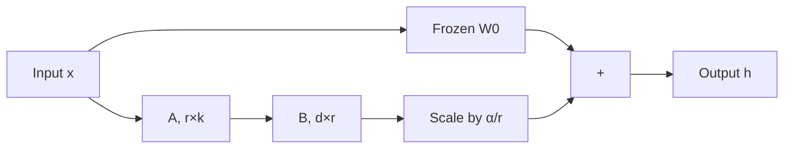

# 06 — LoRA (Hu et al., 2021)

> [!info] TL;DR
> LoRA (Low-Rank Adaptation) freezes the pretrained weights and learns two small matrices `A` and `B` whose product `BA` is added to the frozen weight as a low-rank update. The result: fine-tuning quality matches full fine-tuning while storing <1% of the parameters per task. LoRA became the default parameter-efficient fine-tuning (PEFT) method for LLMs and underpins nearly every adapter-based deployment in 2024–2026.

## Citation

Hu, E. J., Shen, Y., Wallis, P., Allen-Zhu, Z., Li, Y., Wang, S., Wang, L., & Chen, W. (2022). *LoRA: Low-Rank Adaptation of Large Language Models*. ICLR 2022. arXiv:2106.09685.

## The Problem Being Solved

By 2021, fine-tuning LLMs was economically painful. A 175B-parameter model (e.g., GPT-3) needed ~700GB of GPU memory just to load the weights in fp16. Full fine-tuning required:
1. **Optimizer state**: Adam stores two fp32 buffers per parameter → 4× the model size in optimizer state alone.
2. **Gradients**: another fp16 copy → 1× the model size.
3. **Activations**: large for long sequences.

Total: ~10× the model size in GPU memory. For a 175B model that was ~7TB — clearly impractical.

Existing PEFT methods (adapter layers, prefix tuning) reduced memory but added inference latency, because they inserted new layers into the forward pass. The community wanted a method that:
- Matched full fine-tuning quality.
- Stored only a tiny fraction of parameters per task.
- Added **zero** inference latency.
- Allowed task swapping without reloading the base model.

LoRA achieved all four by exploiting a key empirical observation: the *weight updates* during fine-tuning have low intrinsic rank.

## The Key Idea: Low-Rank Updates

Consider a pretrained weight matrix `W₀ ∈ R^{d×k}`. Full fine-tuning learns an update `ΔW` so that the fine-tuned weight is `W = W₀ + ΔW`. The hypothesis: `ΔW` has low rank — it can be factored as `ΔW = B A` where `B ∈ R^{d×r}`, `A ∈ R^{r×k}`, and `r << min(d, k)`.

LoRA freezes `W₀` and learns `A` and `B` instead:

```
h = W₀ x + ΔW x = W₀ x + B A x
```

- `A` is initialized with a random Gaussian.
- `B` is initialized with zeros, so `BA = 0` at the start of training (the model starts identical to the pretrained model).
- The rank `r` is typically 4, 8, 16, 32, or 64.

For a `d = k = 4096` weight (typical of 7B LLMs), full fine-tuning learns 16.7M parameters. LoRA with `r = 8` learns only `2 × 4096 × 8 = 65K` parameters — a 250× reduction.

## The Architecture

LoRA is applied to specific linear layers, typically:
- The Q, K, V projections of every attention layer (most common).
- The output projection of attention.
- The feed-forward up- and down-projections (for full coverage).

In practice, applying LoRA to *all* linear layers (the "LoRA on all linear" recipe) gives the best quality at a given parameter budget, but the conventional recipe of Q/K/V/O is a reasonable default and is what most open-source adapters use.



### Scaling Factor α
The update is scaled by `α/r`, where `α` is a hyperparameter typically set equal to `r` or 2× `r`. This decouples the learning rate from the rank — you can change `r` without retuning the LR.

### No Inference Latency
After training, you can compute `W' = W₀ + (α/r) BA` once and store it as a single weight matrix. The forward pass is then identical to the original model — no extra computation. This is the key advantage over adapter layers.

For multi-task deployment, you keep `W₀` frozen and store a separate `(A, B)` per task. Swapping tasks is just a small matrix load (a few MB) instead of reloading the full model (tens of GB).

## Mathematical Insight

The paper's theoretical justification comes from the **intrinsic dimension** hypothesis. Aghajanyan et al. (2020) showed that fine-tuning RoBERTa works well even when restricted to a random subspace of dimension ~200. LoRA generalizes this: the update does not need to be full-rank, and `r` of 4–8 is usually enough for fine-tuning.

Empirically, the authors showed that the singular values of full fine-tuning updates concentrate in the top few components — strong evidence that the useful information is low-rank.

## Key Results

The paper evaluated LoRA on GPT-3 175B for instruction-following, natural-language inference, and other tasks. Highlights:

| Method                  | Trainable params | GPU memory | Quality vs full FT |
|-------------------------|------------------|------------|--------------------|
| Full fine-tune          | 100%             | ~10× model | baseline           |
| Adapter layers          | ~3%              | ~3× model  | slightly worse     |
| Prefix tuning           | ~0.1%            | ~2× model  | slightly worse     |
| LoRA (r=8 on Q/V)       | ~0.2%            | ~1.5× model| matches full FT    |

LoRA matched or exceeded full fine-tuning quality on most tasks while training a tiny fraction of the parameters. The reduction in optimizer memory was the decisive win — LoRA made it possible to fine-tune 65B+ models on a single 80GB GPU.

## Why It Worked

### Low Intrinsic Dimension of Updates
The fundamental insight — that fine-tuning updates are low-rank — turned out to be broadly true across architectures, model sizes, and tasks. This is not a property of language models specifically; it holds for vision models, diffusion models, and graph neural networks.

### No Forward-Pass Overhead
Because the LoRA matrices can be merged into the base weight at inference, there is zero latency penalty. This made LoRA strictly better than adapter layers in production.

### Modular Task Switching
Storing 100 LoRA adapters for 100 tasks is feasible (~5GB total for a 7B model). Storing 100 full fine-tunes is not (~700GB). This enables the "one base model + many adapters" deployment pattern that has become standard in 2024+.

### Gradient Quality
Counterintuitively, LoRA sometimes outperforms full fine-tuning on small datasets. The low-rank constraint acts as a regularizer, preventing the model from overfitting to the fine-tuning data.

## Limitations and Extensions

- **Capacity ceiling**: for hard domain shifts (e.g., English → code, or adding a new language), `r=8` may not be enough. Practitioners increase `r` or apply LoRA to more layers.
- **Multi-adapter interference**: when running multiple LoRAs concurrently, merging them is non-trivial. Methods like LoRAHub and TIES address this.
- **Not for continual learning**: LoRA adapters can forget each other if applied sequentially without replay.

Successors and extensions:
- **QLoRA** (Dettmers et al., 2023): LoRA on top of a 4-bit quantized base model — fine-tune a 65B model on a single 48GB GPU. See [[02 - QLoRA]].
- **DoRA** (2024): decomposes weights into magnitude and direction, applies LoRA only to direction — modest quality gain.
- **ReLoRA** (2024): periodically merges LoRA updates into the base weight and resets the adapter — simulates full fine-tuning with low memory.
- **PiSSA** (2024): initializes LoRA from the principal singular components of the base weight — better starting point than random.

## Impact and Legacy

LoRA is arguably the most consequential PEFT method ever published:

1. **Default for fine-tuning**. In 2024–2026, virtually all open-weights LLM fine-tuning uses LoRA or QLoRA. HuggingFace's `peft` library made it the path of least resistance.
2. **Enabled the open-source LLM ecosystem**. Without LoRA, community fine-tunes of Llama, Mistral, and Qwen would have been economically out of reach for individuals and small labs.
3. **Custom models as a service**. Together with quantization, LoRA made it possible to serve thousands of custom fine-tunes from one base model — the foundation of businesses like Together, Anyscale, and Replicate's model-hosting offerings.
4. **Diffusion models**. The same technique was adopted for fine-tuning Stable Diffusion, where LoRA adapters are now the standard way to add characters, styles, or concepts to a base model.

The communityfine-tunes ecosystem of Stable Diffusion — where users trade LoRA files for specific art styles, characters, and concepts — is the most visible consumer-facing application of the technique.

## Further Reading

- Original paper: arXiv:2106.09685
- Aghajanyan et al. (2020), *Intrinsic Dimensionality Explains the Effectiveness of Language Model Fine-Tuning* — the theoretical foundation.
- QLoRA: arXiv:2305.14314 — quantization + LoRA.
- DoRA: arXiv:2402.09353 — magnitude-direction decomposition.
- HuggingFace `peft` library — production implementation.

## See Also

- [[01 - LoRA]]
- [[02 - QLoRA]]
- [[03 - Instruction Tuning and Chat Templates]]
- [[05 - RLHF with PPO]]
- [[26 - Papers/MOC|Papers MOC]]
