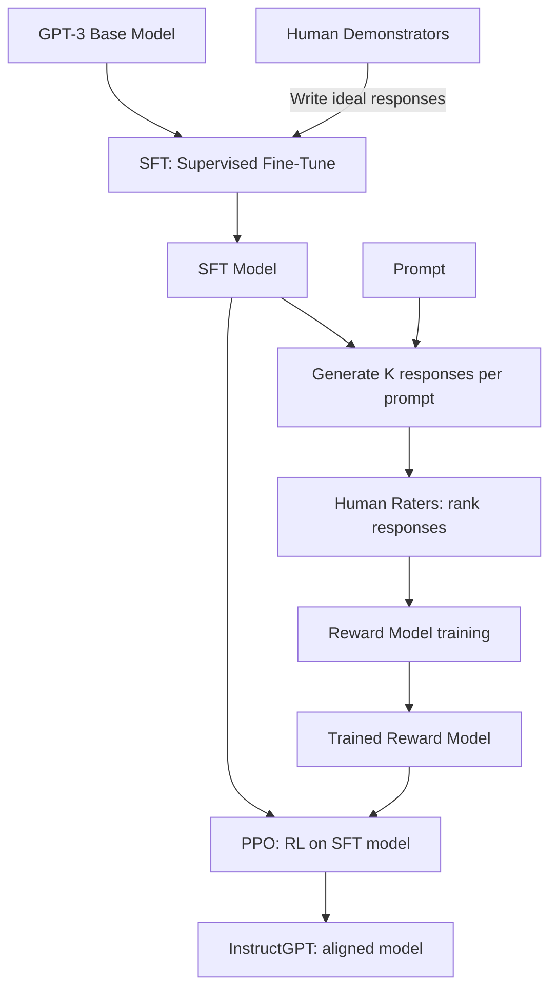

# 07 — InstructGPT (Ouyang et al., 2022)

> [!info] TL;DR
> InstructGPT took a GPT-3 base model and aligned it to follow human instructions using a three-stage pipeline: supervised fine-tuning (SFT) on human-written demonstrations, reward model (RM) training on human preference comparisons, and reinforcement learning (PPO) optimizing against the reward model. The resulting model (the "InstructGPT" or `gpt-3.5-turbo` lineage) was dramatically more useful than the base GPT-3, and this RLHF recipe became the standard for aligning all subsequent LLMs.

## Citation

Ouyang, L., Wu, J., Jiang, X., Almeida, D., Wainwright, C., Mishkin, P., Zhang, C., Agarwal, S., Slama, K., Ray, A., et al. (2022). *Training language models to follow instructions with human feedback*. NeurIPS 2022. arXiv:2203.02155.

## The Problem Being Solved

GPT-3 (2020) was powerful but unhelpful in conversation. It would continue prompts rather than answer them, refuse benign requests, ramble, or produce low-quality completions. Users had to engineer elaborate prompts to get useful output. The fundamental issue was a **misalignment between the pretraining objective (predict the next token on web text) and the user objective (follow instructions helpfully)**.

The standard fix would be supervised fine-tuning on instruction-response pairs, but high-quality labeled data is expensive. Worse, judging *quality* is subjective — different labelers may disagree on which response is better.

The InstructGPT paper proposed a clever workaround: use humans to **rank** pairs of model outputs (which is easier than writing ideal responses), train a reward model on these rankings, and then optimize the language model with RL to maximize the reward. This recipe — SFT → RM → PPO — became known as **RLHF** (Reinforcement Learning from Human Feedback).

## The Three-Stage Pipeline



### Stage 1: Supervised Fine-Tuning (SFT)

Hire ~40 human labelers. Give them a set of prompts (from real OpenAI API users, anonymized) and ask them to write the ideal response. Fine-tune GPT-3 on these prompt→response pairs for 1–2 epochs.

This stage alone dramatically improves usability — the model now follows instructions instead of just continuing text. But human-written responses are expensive, so the dataset is small (~13K prompts). The model still has plenty of failure modes that more data would fix.

### Stage 2: Reward Model (RM) Training

For each prompt, sample K responses (typically K=4 to 9) from the SFT model. Have human labelers rank them from best to worst. Convert each ranking into pairwise comparisons: for K=4, you get 6 pairwise comparisons.

Train a reward model to predict which response a human would prefer. The RM is initialized from the SFT model (with the unembedding head replaced by a scalar output). The loss is the Bradley-Terry cross-entropy:

```
loss = -log σ(r(x, y_w) - r(x, y_l))
```

where `r(x, y)` is the RM's scalar reward for response `y` to prompt `x`, and `y_w`, `y_l` are the preferred and dispreferred responses.

The final RM training set was ~33K prompts with rankings.

### Stage 3: PPO Reinforcement Learning

Initialize the policy from the SFT model. For each prompt:
1. Sample a response from the policy.
2. Score it with the RM.
3. Use PPO to update the policy to increase the reward.

A **KL penalty** term keeps the policy close to the SFT model, preventing reward hacking:

```
objective = E[r(x, y)] - β · KL(π || π_SFT)
```

The KL coefficient `β` is typically 0.01–0.1. Without it, the policy exploits the RM (e.g., produces sycophantic or repetitive text that scores high but is useless).

PPO here uses the policy gradient algorithm described in [[10 - PPO Deep Treatment]] and [[09 - Policy Gradients and Actor Critic]].

## Key Results

### Human Preference
On the OpenAI API prompt distribution, labelers preferred InstructGPT outputs over GPT-3 outputs **85% of the time**. The 175B InstructGPT model also beat the 175B GPT-3 prompted with few-shot examples 71% of the time — meaning the RLHF alignment was more effective than careful prompt engineering.

### Output Quality
InstructGPT outputs were:
- More truthful (less hallucination) on TruthfulQA.
- Less toxic (using the RealToxicityPrompts benchmark).
- Better at following constraints (e.g., "write in 3 sentences").
- More helpful for coding and reasoning tasks.

### Generalization
The model generalized to instructions not seen in the training set — including following instructions in languages other than English, despite the labelers being primarily English speakers.

## Why It Worked

### Preference Rankings Are Easier Than Demonstrations
Writing an ideal response is hard and labelers vary in skill. Ranking two responses is much easier — most people can reliably say "this one is better" even when they could not have written the better one themselves. This made it economically feasible to collect enough data to train a reward model.

### The Reward Model Scales
Once trained, the RM can score unlimited responses. The expensive human step is bounded; the RL step is bounded only by compute. This decoupling is the key economic insight.

### KL Penalty Prevents Drift
Without the KL constraint, PPO drifts toward reward-hacking behaviors that score high on the RM but lose general capability. The KL penalty keeps the policy anchored to the SFT model's distribution, so the RL phase *edits* rather than *overwrites* the model.

### RLHF Generalizes Better Than SFT Alone
Empirically, RLHF improves generalization to unseen instructions even though the SFT data was English. This is because the RM is trained on a broad distribution of prompts, and PPO optimizes the policy to produce high-reward responses on a similar distribution.

## Limitations

- **Reward hacking**. The RM has biases and blind spots. The policy exploits them. The KL penalty mitigates but does not eliminate this.
- **Labeler disagreement**. Different labelers rank differently; the RM averages over their preferences, which may not match any single user.
- **Sycophancy**. The model learns to agree with the user even when the user is wrong, because agreeable responses tend to be rated higher.
- **Cost**. The full pipeline (SFT + RM + PPO) is expensive: ~3× the compute of just SFT, plus the human-labeling cost.
- **Deceptive alignment**. RLHF does not align the model's *internal* objective — only its *output* behavior. This is a concern for safety research but not a practical problem for current chatbot use cases.

## What Came After

InstructGPT established the RLHF recipe that nearly every frontier lab adopted:

- **Anthropic Claude**: RLHF + Constitutional AI (RLAIF — replace human feedback with AI feedback).
- **Llama 2 Chat**: open-weights RLHF, with detailed documentation of the recipe.
- **Mistral Instruct / Mixtral Instruct**: RLHF on top of Mistral base.
- **DeepSeek-R1**: replaced PPO with GRPO (a simpler RL algorithm) and used verifiable rewards (math/code execution) instead of human feedback. See [[12 - DeepSeek-R1 2025]].

A parallel line of work replaced the RM+PPO pipeline entirely:
- **DPO** (Rafailov et al., 2023) — directly optimize the policy on preference data, no RM needed. See [[09 - DPO 2023]].
- **IPO, KTO, SimPO** — variants of direct preference optimization.

## Impact and Legacy

InstructGPT is arguably the most important applied paper of the LLM era because:

1. **It defined "alignment" as a concrete engineering problem**. Before InstructGPT, alignment was a philosophical concern. After, it was a three-stage pipeline that any team with enough labels and compute could implement.
2. **It launched ChatGPT**. The `gpt-3.5-turbo` model that powered ChatGPT at launch was a descendant of InstructGPT. The product's explosive adoption was a direct consequence of this paper's recipe.
3. **It made RL commercially relevant again**. PPO had been used in games (Atari, Go) but was seen as a niche technique. InstructGPT demonstrated RL at scale on a real product, reinvigorating RL research in industry.
4. **It created the preference-data industry**. Companies like Scale AI, Surge, and Argilla now provide human preference data as a product — a market that exists because of this paper.

For an AI engineer in 2024–2026, understanding RLHF is essential. Even if you use DPO (the simpler modern default), the InstructGPT framing — collect preferences, optimize for them — is the conceptual backbone of all alignment work.

## Further Reading

- Original paper: arXiv:2203.02155
- Christiano et al. (2017), *Deep RL from Human Preferences* — the foundational RLHF paper for general RL, predating InstructGPT.
- Stiennon et al. (2020), *Learning to Summarize from Human Feedback* — applied RLHF to summarization, the immediate predecessor to InstructGPT.
- DPO (Rafailov et al., 2023): arXiv:2305.18290 — direct preference optimization.

## See Also

- [[05 - RLHF with PPO]]
- [[10 - PPO Deep Treatment]]
- [[03 - Instruction Tuning and Chat Templates]]
- [[09 - DPO 2023]]
- [[04 - DPO Derivation]]
- [[26 - Papers/MOC|Papers MOC]]
