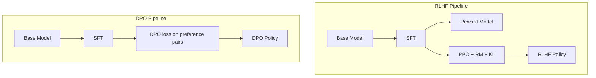

# 09 — DPO (Rafailov et al., 2023)

> [!info] TL;DR
> Direct Preference Optimization (DPO) replaces the standard RLHF pipeline (SFT → reward model → PPO) with a single supervised classification loss on preference pairs. The trick: under the KL-constrained RLHF objective, the optimal policy can be written in closed form as a function of the reward, so you can substitute that closed form back into the loss and skip the reward model entirely. DPO is simpler, more stable, and cheaper than PPO-RLHF, and has become the default alignment method for open-weights LLMs in 2024–2026.

## Citation

Rafailov, R., Sharma, A., Mitchell, E., Ermon, S., Manning, C. D., & Finn, C. (2023). *Direct Preference Optimization: Your Language Model is Secretly a Reward Model*. NeurIPS 2023. arXiv:2305.18290.

## The Problem Being Solved

Standard RLHF ([[07 - InstructGPT 2022|InstructGPT]]) has three stages: SFT, reward modeling, and PPO. Each stage adds complexity:

- **Reward modeling** requires a separate training run on preference data, and the RM is a separate model from the policy.
- **PPO** is unstable: it has many hyperparameters (learning rate, KL coefficient, clip ratio, GAE lambda, value-function coefficient, batch size, sampling temperature). Tuning is painful, and bad runs produce sycophantic or degenerate policies.
- **Memory footprint**: PPO keeps the policy, the reference policy, the reward model, and the value model in memory simultaneously. For a 7B model, that is ~4×7B = 28B parameters in GPU memory during training. For a 70B model, it is often infeasible.
- **Compute cost**: PPO samples multiple responses per prompt, scores them, and updates the policy. The cost per step is much higher than supervised learning.

The community wanted a method that used the *same* preference data as RLHF but skipped the reward model and PPO. DPO provides exactly that.

## The Key Idea: Closed-Form Optimal Policy

### The RLHF Objective
InstructGPT optimizes:

```
max_π E_{x ~ D, y ~ π(·|x)} [r(x, y)] - β · KL(π || π_ref)
```

where:
- `r(x, y)` is the reward model's score for response `y` to prompt `x`.
- `π_ref` is the reference (SFT) policy.
- `β` is the KL penalty coefficient.

The KL term keeps the policy close to the reference, preventing reward hacking.

### The Closed-Form Solution
This is a standard KL-constrained reward maximization problem, and it has a closed-form solution:

```
π*(y|x) = π_ref(y|x) · exp(r(x, y) / β) / Z(x)
```

where `Z(x) = Σ_y π_ref(y|x) · exp(r(x, y) / β)` is a partition function (normalizing constant).

This says: the optimal policy is the reference policy reweighted by `exp(reward / β)`. Higher-reward responses get more probability mass; lower-reward responses get less.

### Inverting for the Reward
Rearranging the closed-form solution to solve for the reward in terms of the policy:

```
r(x, y) = β · log(π(y|x) / π_ref(y|x)) + β · log Z(x)
```

This is the key insight: **the reward is implicit in the log-probability ratio between the policy and the reference**. You do not need a separate reward model — the policy *is* the reward model (in a sense).

### The DPO Loss
Substitute this expression for `r` into the Bradley-Terry preference loss (the standard RM training loss):

```
L_BT = -log σ(r(x, y_w) - r(x, y_l))
```

After substitution, `log Z(x)` cancels (it appears in both terms), and you get:

```
L_DPO = -log σ( β · log(π(y_w|x) / π_ref(y_w|x)) - β · log(π(y_l|x) / π_ref(y_l|x)) )
```

This is the DPO loss. It is a **binary classification loss on preference pairs**, where the model's "logit" is `β · (log π(y_w) - log π_ref(y_w)) - β · (log π(y_l) - log π_ref(y_l))`.

Training minimizes `L_DPO` directly on the policy — no reward model, no PPO, no value function, no sampling. It looks exactly like SFT, except the loss is over preference pairs rather than single responses.



## The Algorithm

Pseudocode:

```python
def dpo_loss(policy, ref_policy, prompt, y_w, y_l, beta=0.1):
    # Log-probs under the policy
    logp_w = -policy.loss(prompt, y_w)   # cross-entropy = -log p
    logp_l = -policy.loss(prompt, y_l)
    
    # Log-probs under the reference (no grad)
    with torch.no_grad():
        ref_logp_w = -ref_policy.loss(prompt, y_w)
        ref_logp_l = -ref_policy.loss(prompt, y_l)
    
    # The implicit reward difference
    pi_log_ratio_w = logp_w - ref_logp_w
    pi_log_ratio_l = logp_l - ref_logp_l
    
    logits = beta * (pi_log_ratio_w - pi_log_ratio_l)
    loss = -F.logsigmoid(logits).mean()
    
    return loss

# Training loop
for prompt, y_w, y_l in preference_dataset:
    loss = dpo_loss(policy, ref_policy, prompt, y_w, y_l, beta=0.1)
    loss.backward()
    optimizer.step()
```

The reference policy is frozen — you only need to compute its log-probs once per example, with no gradient. The whole thing has the memory footprint of SFT (one model + one frozen reference), not the 4-model footprint of PPO.

## Key Results

The paper showed DPO matches or exceeds PPO-RLHF on TL;DR summarization and IMDb sentiment, with much less compute and hyperparameter tuning.

Subsequent open-weights work (Zephyr, OpenHermes, Tulu, Starling) showed DPO is competitive with PPO across many tasks. By 2024, DPO had effectively replaced PPO for most open-weights LLM alignment. Many production LLM teams also use DPO internally, especially for smaller models where PPO's instability is hardest to manage.

## Why It Worked

### Mathematical Equivalence
DPO is not an approximation of RLHF — it solves the *same* optimization problem, just with a different parameterization. The optimal policy under the KL-constrained objective is achieved by DPO (given enough data and capacity).

### Stability
Supervised classification losses are well-behaved: smooth gradients, no value function to bootstrap, no sampling variance. Training is much more reliable than PPO.

### Memory Efficiency
DPO needs two models (policy + reference) vs PPO's four (policy + reference + reward + value). For a 7B model, that is ~14B params vs ~28B — the difference between "fits on one GPU" and "needs a multi-GPU setup."

### Simplicity
The whole training loop is ~50 lines of PyTorch. No PPO clipping, no GAE, no advantage normalization, no separate RM training. This makes it accessible to small teams and individual researchers.

## Limitations

DPO is not a strict improvement over PPO. Known limitations:

- **Offline only**. DPO trains on a fixed preference dataset; it cannot sample new responses during training. PPO can (and does) sample from the current policy, which means the policy's training distribution shifts toward its own outputs. This is bad for stability but good for exploration — PPO sometimes finds better policies that DPO cannot reach from a fixed dataset.
- **Out-of-distribution pairs**. If the preference dataset has responses very different from what the policy would generate, the gradient may push the policy in unhelpful directions.
- **No reward signal for new prompts**. PPO can compute a reward for any new prompt using the RM; DPO cannot.
- **Performance ceiling**. Some recent work suggests PPO still beats DPO when you have access to a high-quality RM and lots of compute. The gap is small but real.

## Variants and Extensions

Because DPO is so simple, it spawned a family of variants:

- **IPO** (Identity Preference Optimization) — replaces the sigmoid with a squared loss; more robust to overfitting on noisy preferences.
- **KTO** (Kahneman-Tversky Optimization) — does not need paired preferences; can train on binary "thumbs up / thumbs down" labels. Much easier data collection.
- **SimPO** (Simple Preference Optimization) — removes the reference model entirely, normalizing by response length. Even simpler and cheaper than DPO.
- **ORPO** — combines SFT and preference optimization in a single stage, skipping the separate SFT step.
- **NPO** (Negative Preference Optimization) — trains on *unpaired* negative examples (responses to avoid). Useful for unlearning.

For most open-weights practitioners in 2024–2026, the typical alignment recipe is: SFT → DPO. SimPO and ORPO are gaining traction as "even simpler" alternatives.

## Impact and Legacy

DPO changed the alignment landscape:

1. **Democratized alignment**. A single H100 can DPO-align a 7B model in a few hours. PPO requires much more compute and expertise. DPO made alignment research accessible to academic labs and individual researchers.
2. **Open-weights LLM quality leap**. The 2023 wave of high-quality open-weights chat models (Zephyr, OpenHermes, Tulu) was largely enabled by DPO. Without it, the gap to closed-source models would have been much larger.
3. **Renewed theoretical interest in RLHF**. The closed-form derivation inspired a wave of papers deriving new objectives from first principles, including the variants above.
4. **Convergence on "preference optimization"** as the conceptual frame. DPO made clear that the *unit of alignment data* is a preference pair, not a reward. This affected everything from data labeling practices to evaluation metrics.

## Further Reading

- Original paper: arXiv:2305.18290
- The HuggingFace TRL library — production DPO implementation.
- Zephyr-7B (Tunstall et al., 2023) — the first widely-used DPO-aligned open model.
- SimPO: arXiv:2405.14734 — reference-free DPO variant.
- KTO: arXiv:2402.01306 — unpaired preference optimization.

## See Also

- [[04 - DPO Derivation]]
- [[05 - RLHF with PPO]]
- [[07 - InstructGPT 2022]]
- [[10 - PPO Deep Treatment]]
- [[26 - Papers/MOC|Papers MOC]]
