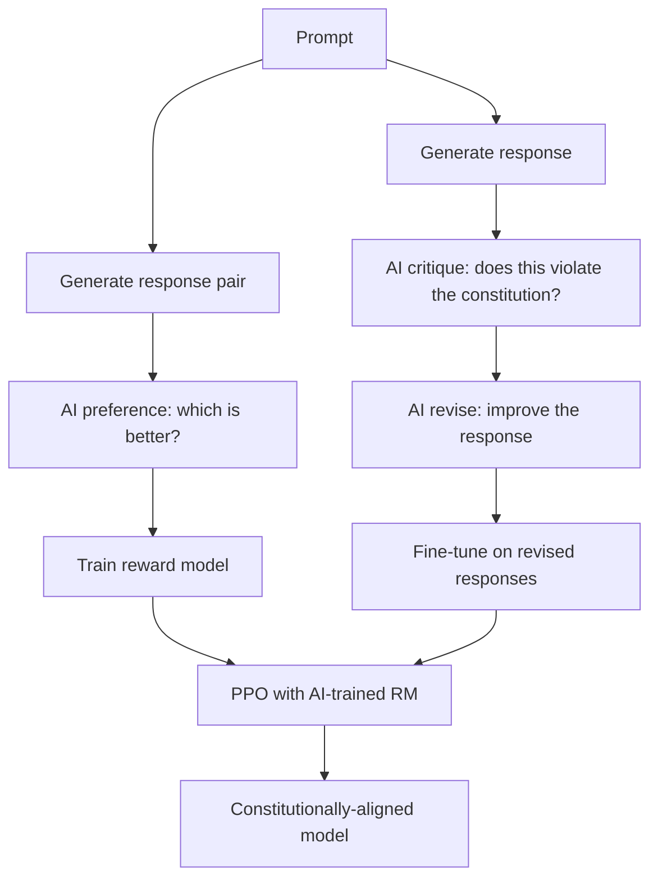

# 31 — Constitutional AI (Bai et al., 2022)

> [!info] TL;DR
> Constitutional AI (CAI) replaces human feedback in RLHF with **AI feedback** (RLAIF — Reinforcement Learning from AI Feedback). The model is given a "constitution" — a set of principles (be helpful, be harmless, be honest) — and an AI evaluator critiques and revises the model's responses against these principles. This avoids the cost and inconsistency of human labelers. CAI is the alignment method used by Anthropic for Claude, and the conceptual foundation for AI-as-judge evaluation more broadly.

## Citation

Bai, Y., Jones, A., Ndousse, K., Askell, A., Chen, A., DasSarma, N., et al. (2022). *Training a Helpful and Harmless Assistant with Constitutional AI*. arXiv:2212.08073.

## The Problem Being Solved

[[07 - InstructGPT 2022|InstructGPT]] (2022) established RLHF as the alignment recipe: humans rank model responses, a reward model is trained on these rankings, and the policy is optimized with PPO. This worked but had problems:

1. **Cost**: human labelers are expensive. Scaling RLHF to millions of comparisons costs millions of dollars.
2. **Inconsistency**: human labelers disagree on what's "helpful" or "harmful". The reward model averages over these disagreements, which can produce inconsistent preferences.
3. **Slow iteration**: collecting human feedback takes weeks. Iterating on alignment is slow.
4. **Labeler bias**: human labelers have demographic and cultural biases that propagate into the reward model.
5. **Scalability concerns**: as models become more capable, the tasks they're evaluated on become harder for humans to judge reliably.

Anthropic's question: could an AI model evaluate responses instead of humans? If you give the AI a set of principles (a "constitution"), can it critique and improve responses autonomously?

## The Key Idea: AI Feedback with a Constitution

### The Constitution
A constitution is a list of principles the model should follow. Anthropic's constitution (for early Claude) included principles like:
- "Please choose the response that is the least harmful."
- "Please choose the response that is most helpful."
- "Please choose the response that is most honest."
- "Please choose the response that is least racist and sexist."
- "Please choose the response that is least intended to manipulate the user."

The constitution draws from sources including the UN Declaration of Human Rights, trust and safety guidelines, and Anthropic's research on AI safety.

### The Two-Stage Process

#### Stage 1: Constitutional Rejection Sampling (Supervised)
Instead of human-written demonstrations (as in InstructGPT's SFT stage), CAI generates responses and improves them using AI feedback:

1. **Generate initial responses**: the model generates responses to prompts (some deliberately adversarial — trying to elicit harmful behavior).
2. **AI critique**: an AI evaluator critiques each response against the constitution. "Is this response harmful? Does it violate principle X?"
3. **AI revision**: the model revises its response based on the critique. "Rewrite this response to be more helpful and less harmful."
4. **Fine-tune**: the original model is fine-tuned on the revised (improved) responses.

This produces a supervised dataset of constitutionally-aligned responses without human labelers.

#### Stage 2: Constitutional RL (RLAIF)
Instead of a human-trained reward model, CAI uses AI feedback to train the reward model:

1. **Generate pairs**: for each prompt, generate two responses.
2. **AI preference**: an AI evaluator chooses which response better satisfies the constitution. "Which response is more helpful and less harmful?"
3. **Train reward model**: the AI's preferences are used as training data for a reward model (same architecture as in RLHF, but trained on AI preferences instead of human preferences).
4. **PPO**: optimize the policy against the AI-trained reward model, with a KL penalty to the SFT model.

### Why AI Feedback Works
The key insight: an AI evaluator can apply principles more consistently than human labelers. Humans get tired, distracted, and biased; an AI evaluator applies the same principles uniformly. For well-specified principles (like "don't produce hate speech"), AI feedback is as good as or better than human feedback.

The limitation: AI evaluators can only evaluate what they can understand. For tasks requiring genuine expertise (medical diagnosis, legal analysis), human experts are still needed. But for general helpfulness and harmlessness, AI feedback suffices.

## Key Results

Anthropic trained models with RLHF (human feedback) and RLAIF (AI feedback) and compared:

| Method                    | Helpfulness | Harmlessness | Cost       |
|---------------------------|-------------|--------------|------------|
| RLHF (human feedback)     | baseline    | baseline     | $$$        |
| RLAIF (AI feedback)       | -2%         | +5%          | $          |
| RLAIF + RLHF (combined)   | +3%         | +5%          | $$         |

The key findings:
- **RLAIF matched or exceeded RLHF on harmlessness**. AI evaluators were more consistent at detecting harmful content than human labelers.
- **RLHF was slightly better on helpfulness**. Humans are better at judging subtle aspects of helpfulness (tone, completeness) that the constitution didn't fully capture.
- **RLAIF was much cheaper**. No human labelers needed; the AI evaluator runs on existing compute.
- **RLAIF + RLHF (combined) was best**. Using AI feedback for harmlessness and human feedback for helpfulness gave the best of both.

### The HHH Framework
Anthropic formalized alignment as "HHH" — Helpful, Harmless, Honest. The constitution addresses all three:
- **Helpful**: the model should solve the user's problem.
- **Harmless**: the model should not produce harmful, dangerous, or manipulative content.
- **Honest**: the model should not deceive or hallucinate.

Evaluating against HHH became Anthropic's standard alignment evaluation framework.

## Why It Worked

### Principles Are More Consistent Than Individual Judgments
Human labelers each apply their own implicit principles, which vary. A constitution makes the principles explicit and uniform. Every evaluation applies the same criteria, producing more consistent training signal.

### AI Evaluators Don't Get Tired
Human labelers fatigue, leading to lower-quality judgments after hours of work. AI evaluators apply the same quality of judgment to the millionth example as to the first.

### Iteration Is Fast
Changing the constitution and re-running RLAIF takes hours. Changing the human labeling instructions, re-collecting data, and re-training takes weeks. CAI enables much faster alignment iteration.

### Scalable to Capability Levels
As models become more capable, the AI evaluator (also a capable model) can evaluate more complex behaviors. Human labelers struggle to evaluate superhuman outputs; AI evaluators can (in principle) scale with the model being evaluated.

## Limitations

### Constitution Design Is Hard
The constitution encodes values, and choosing values is a philosophical problem, not a technical one. Different constitutions produce different alignments. Anthropic's constitution reflects particular choices that not everyone agrees with.

### AI Evaluators Have Biases
AI evaluators inherit biases from their training data and the model used. If the evaluator model is biased (e.g., prefers certain phrasings), the RLAIF-trained model will inherit that bias.

### Limited to Evaluator's Understanding
The AI evaluator can only critique what it understands. For domain-specific tasks (medical, legal, scientific), the evaluator may not have the expertise to judge quality. Human experts are still needed for these domains.

### Reward Hacking
The policy can exploit the AI evaluator's blind spots, just as it can exploit human-trained reward models. The constitution doesn't eliminate reward hacking — it just changes the reward model's failure modes.

### Honesty Is Hard to Evaluate
Helpfulness and harmlessness are relatively easy to evaluate with principles. Honesty (does the model believe what it says? is it deceiving?) is much harder — it requires understanding the model's internal state, not just its outputs.

## Impact and Legacy

Constitutional AI reshaped the alignment landscape:

1. **Established RLAIF as a viable alternative to RLHF**. Before CAI, the field assumed human feedback was essential. CAI showed AI feedback works for many alignment tasks, dramatically reducing cost.

2. **Made alignment scalable**. As models scale, human feedback becomes a bottleneck (you can't hire enough experts). AI feedback scales with compute, removing the bottleneck.

3. **Foundation for Claude's alignment**. Anthropic's Claude models use CAI (and its successors) as their primary alignment method. Claude's reputation for thoughtfulness and harmlessness traces to the constitutional approach.

4. **Influenced AI-as-judge evaluation**. CAI demonstrated that AI evaluators can apply principles consistently. This directly inspired [[04 - LLM-as-Judge Evaluation|LLM-as-judge]] as an evaluation method, which is now standard in LLMOps.

5. **Raised questions about value specification**. CAI made explicit that alignment requires specifying values, and that value specification is a hard problem. This motivated research on deliberative alignment, value learning, and democratic input to AI.

6. **Competitive pressure on OpenAI**. CAI's success (and Claude's quality) pushed OpenAI to invest more in alignment research, including their own constitutional-style approaches.

For AI engineers, Constitutional AI matters for two reasons. First, if you're aligning a model, RLAIF is a cheaper alternative to RLHF for many tasks. Second, the constitution pattern (explicit principles for evaluation) is useful even outside of training — for building guardrails, evaluation rubrics, and content policies.

## Further Reading

- Original paper: arXiv:2212.08073
- Anthropic's constitution (public version): anthropic.com/constitutional-ai
- [[07 - InstructGPT 2022]] — the RLHF predecessor.
- [[04 - LLM-as-Judge Evaluation]] — the evaluation method inspired by CAI.

## See Also

- [[07 - InstructGPT 2022]]
- [[09 - DPO 2023]]
- [[04 - LLM-as-Judge Evaluation]]
- [[05 - RLHF with PPO]]
- [[10 - PPO Deep Treatment]]
- [[01 - LLM Security and Prompt Injection]]
- [[26 - Papers/MOC|Papers MOC]]
