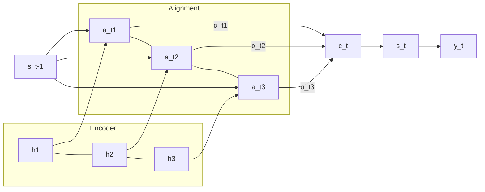

# 01 — Bahdanau Attention (2014)

> [!info] TL;DR
> Bahdanau, Cho, and Bengio (2014) introduced **additive attention** to fix the information bottleneck of encoder-decoder seq2seq models. Instead of compressing the entire source sentence into a single fixed-length vector, the decoder dynamically "looks back" at relevant encoder states at every decoding step. This paper is the conceptual birthplace of every modern attention mechanism.

## Citation

Bahdanau, D., Cho, K., & Bengio, Y. (2014). *Neural Machine Translation by Jointly Learning to Align and Translate*. arXiv:1409.0473. Published at ICLR 2015.

## The Problem Being Solved

Before this paper, neural machine translation used an [[04 - RNN LSTM GRU|RNN encoder-decoder]] architecture: the encoder RNN consumed the source sentence and produced a single fixed-length context vector `c` (typically the final hidden state). The decoder RNN then generated the target sentence conditioned only on `c` and previously generated tokens.

This design has a fundamental limitation: **the bottleneck**. A 5-word sentence and a 50-word sentence both get squashed into the same-dimensional vector. For long sentences, the encoder simply cannot preserve all the necessary information — early tokens get overwritten by later tokens as the RNN's hidden state evolves. Empirically, BLEU scores collapsed on sentences longer than ~30 tokens.

The information bottleneck was not a minor inconvenience; it was the central obstacle to scaling NMT to production-quality translation. Bahdanau et al. recognized that the fix was not a bigger RNN but a fundamentally different way to pass information from encoder to decoder.

## The Key Idea: Alignment + Attention

The paper's central insight is that the decoder should not depend on a single context vector. Instead, at every decoding step `t`, the decoder should compute a **custom context vector** `c_t` that is a weighted average of *all* encoder hidden states `h_1, ..., h_T`. The weights `α_{t,i}` reflect how relevant source position `i` is to the current target position `t`.

This accomplishes two things simultaneously:
1. **Soft alignment** between source and target tokens — interpretable weights that correspond to linguistic alignment.
2. **Differentiable retrieval** — the decoder learns *where to look* and *how much to trust* each encoder state, end-to-end with the translation objective.

The elegance is that no explicit alignment labels are needed; the model learns alignment as a side effect of optimizing translation likelihood.

## The Architecture

### Encoder
A bidirectional RNN (typically [[04 - RNN LSTM GRU|BiLSTM or BiGRU]]) reads the source sentence in both directions. For each source position `j`, the encoder produces an annotation `h_j = [h_j^→ ; h_j^←]` — the concatenation of forward and backward hidden states. This gives every annotation information about both the preceding and following context.

### Alignment Model
At decoding step `t`, given the previous decoder hidden state `s_{t-1}` and the previous predicted token `y_{t-1}`, the model computes an **alignment score** for each encoder position `j`:

```
e_{t,j} = a(s_{t-1}, h_j)
```

where `a` is a small feed-forward network with a single hidden layer:

```
a(s_{t-1}, h_j) = v_a^T · tanh(W_a · s_{t-1} + U_a · h_j)
```

Here `v_a`, `W_a`, `U_a` are learned parameters. This is called **additive attention** (or *concat attention*) because the two vectors are projected into a shared space and combined additively before the nonlinearity.

### Attention Weights
The scores are normalized with a softmax over all source positions:

```
α_{t,j} = softmax_j(e_{t,j}) = exp(e_{t,j}) / Σ_k exp(e_{t,k})
```

These `α` values are the attention weights — they sum to 1 and indicate how much the decoder "attends to" each source position at step `t`.

### Context Vector
A position-dependent context vector is computed:

```
c_t = Σ_j α_{t,j} · h_j
```

This is a weighted sum of encoder annotations, with weights chosen by the alignment model. The decoder now conditions on `c_t` instead of a fixed `c`.

### Decoder
The decoder RNN updates its state using `s_t = f(s_{t-1}, y_{t-1}, c_t)` and predicts the next token from `s_t`, `y_{t-1}`, `c_t`. Crucially, the context vector changes at every step.



## Why It Worked

The empirical results were striking. On English-to-French translation (WMT), Bahdanau's model matched or beat conventional phrase-based systems on long sentences while maintaining quality on short ones. The BLEU drop-off that plagued vanilla seq2seq on long inputs essentially disappeared.

The qualitative alignment visualizations were equally important. The paper showed attention heatmaps where the diagonal pattern mirrored human word alignments — for languages with different word orders (e.g., English SVO vs. German SOV), the model learned non-monotonic alignments that tracked the linguistic reordering. This gave researchers confidence that attention was not just a useful trick but a meaningful, interpretable mechanism.

## Mathematical Formulation

The full decoder probability is:

```
p(y_t | y_<t, x) = softmax(g(s_t, y_{t-1}, c_t))
```

where:

```
s_t = RNN(s_{t-1}, [y_{t-1}; c_t])
c_t = Σ_j α_{t,j} h_j
α_{t,j} = softmax_j(a(s_{t-1}, h_j))
```

Training is end-to-end by maximizing the log-likelihood of the training corpus. The alignment model `a` is trained jointly with the encoder and decoder — no separate alignment supervision is required.

## Limitations

Bahdanau attention was a breakthrough, but it had clear limitations that subsequent work addressed:

- **Quadratic cost**: attention is computed between every decoder step and every encoder position, giving O(T_src × T_tgt) complexity. This is fine for translation but does not scale to very long sequences.
- **Additive cost**: the alignment network `a` adds parameters and a nonlinearity per score, slower than the dot-product variant [[02 - Vaswani Attention Is All You Need 2017|Vaswani et al.] would later popularize.
- **RNN-bound**: the encoder and decoder are still RNNs, so the model cannot parallelize over the sequence. The attention itself is not the bottleneck — the RNN recurrence is.
- **No causal masking**: this is bidirectional encoder-to-decoder attention (essentially [[06 - Attention Mechanisms/MOC|cross-attention]]); it does not address decoder self-attention, which [[Self-Attention|self-attention]] would later handle.

## Impact and Legacy

This paper changed the trajectory of deep learning for sequence modeling. Its specific contributions include:

1. **Conceptual foundation of attention**. Every later attention mechanism — Luong, self-attention, multi-head, FlashAttention — can be traced back to the alignment-score + softmax + weighted-sum pattern introduced here.
2. **End-to-end learned soft alignment**. Removed the need for separate alignment models in NMT, enabling pure neural translation systems that exceeded phrase-based baselines.
3. **Bidirectional encoders as standard**. The BiLSTM/BiGRU encoder became the default for seq2seq until Transformers displaced RNNs entirely.
4. **Interpretable mid-layer activations**. The attention weights gave researchers their first widely-used tool for inspecting what a neural NLP model was "looking at" — a precursor to the entire field of [[01 - Mechanistic Interpretability|mechanistic interpretability]].

The next major step was [[03 - Luong Attention 2015|Luong et al. (2015)]], which simplified the scoring function to dot products. Two years later, [[02 - Vaswani Attention Is All You Need 2017|Vaswani et al.]] would push the idea to its logical extreme: drop the RNN entirely and make attention the only sequence-mixing operation.

## Further Reading

- Original paper: arXiv:1409.0473
- Luong et al. (2015), *Effective Approaches to Attention-based Neural Machine Translation* — the multiplicative variant. See [[03 - Luong Attention 2015]].
- Vaswani et al. (2017), *Attention Is All You Need* — drops the RNN, makes attention the only mixer. See [[02 - Vaswani Attention Is All You Need 2017]].

## See Also

- [[01 - Origins of Attention]]
- [[02 - Bahdanau Attention]]
- [[04 - Neural Networks/Architectures/05 - Seq2Seq and the Information Bottleneck]]
- [[02 - Vaswani Attention Is All You Need 2017]]
- [[26 - Papers/MOC|Papers MOC]]
