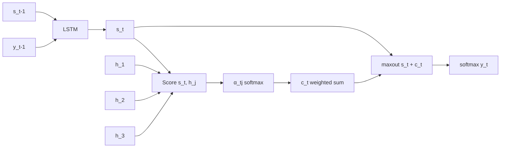

# 13 — Luong Attention (2015)

> [!info] TL;DR
> Luong, Pham, and Manning (2015) simplified Bahdanau's additive attention to **dot-product (multiplicative) attention** and introduced several alignment functions (general, concat, location-aware). The simpler dot-product form is faster and became the basis for the scaled dot-product attention used in Transformers. Luong attention is the conceptual bridge between Bahdanau's additive formulation and Vaswani's self-attention.

## Citation

Luong, M.-T., Pham, H., & Manning, C. D. (2015). *Effective Approaches to Attention-based Neural Machine Translation*. EMNLP 2015. arXiv:1508.04025.

## The Problem Being Solved

[[01 - Bahdanau Attention 2014|Bahdanau attention]] (2014) introduced attention to fix the seq2seq information bottleneck, but its scoring function was computationally expensive. The alignment model `a(s_{t-1}, h_j) = v_a^T · tanh(W_a · s_{t-1} + U_a · h_j)` required a small feed-forward network with its own parameters, and the additive combination before the nonlinearity added overhead per scoring operation.

For large vocabularies and long sequences, this overhead matters. The Luong paper asked: can we replace the learned additive alignment with a simpler multiplicative (dot-product) form, without losing quality?

The answer was yes — and the simplification turned out to be more than just a performance optimization. The dot-product formulation made the geometric intuition behind attention (queries and keys as vectors in a shared space, similarity as inner product) explicit, paving the way for the scaled dot-product attention in Transformers.

## The Key Idea: Multiplicative Scoring

Luong et al. proposed several scoring functions, of which the most influential is the **general** (dot-product) form:

```
score(s_t, h_j) = s_t^T · W_a · h_j
```

or, with `W_a = I` (the simplest variant, "dot" form):

```
score(s_t, h_j) = s_t^T · h_j
```

where `s_t` is the decoder hidden state and `h_j` is the encoder hidden state.

The full attention mechanism is then:

```
α_{t,j} = softmax_j(score(s_t, h_j))
c_t = Σ_j α_{t,j} · h_j
```

This is mathematically identical to Bahdanau attention except for the scoring function. The simplification removes the small feed-forward network and the `tanh` nonlinearity, replacing them with a single matrix multiplication.

## The Alignment Functions Compared

The paper systematically compared four scoring functions:

### 1. Dot Product
```
score(s_t, h_j) = s_t^T · h_j
```
Simplest form. Requires `s_t` and `h_j` to have the same dimension. No parameters to learn.

### 2. General
```
score(s_t, h_j) = s_t^T · W_a · h_j
```
Adds a learned matrix `W_a`. Allows `s_t` and `h_j` to have different dimensions. The matrix learns to project the two vectors into a shared space where dot product is meaningful.

### 3. Concat (Bahdanau-style)
```
score(s_t, h_j) = v_a^T · tanh(W_a · [s_t; h_j])
```
Bahdanau's original formulation. The paper included it for comparison.

### 4. Location-aware (Location)
```
score(s_t, h_j) = w_a^T · tanh(W_a · s_t + U_a · h_j + b_a)
```
A hybrid that adds a learned bias `b_a` to the Bahdanau formulation. Helps the model learn position-specific attention patterns (e.g., "attend to the previous token").

The empirical comparison showed that the **general** form (dot product with a learned matrix) performed as well as or better than the **concat** form, while being faster. This was the key finding that motivated the dot-product attention in Transformers.

## The Architecture

Luong attention differs from Bahdanau attention in three ways beyond the scoring function:

### 1. Encoder
Luong used a single-direction LSTM (not bidirectional), though the paper also tested bidirectional. The encoder produces hidden states `h_1, ..., h_T` for each source position.

### 2. Decoder Updates
In Bahdanau attention, the context vector `c_t` is computed *before* the decoder updates its state:
```
c_t = compute_context(s_{t-1}, encoder_states)
s_t = LSTM(s_{t-1}, [y_{t-1}; c_t])
```

In Luong attention, the context vector is computed *after* the decoder updates:
```
s_t = LSTM(s_{t-1}, y_{t-1})  # no context yet
c_t = compute_context(s_t, encoder_states)  # use current state
y_t = softmax(W · tanh(W_s · s_t + W_c · c_t))
```

This means Luong attention uses the *current* decoder state to compute attention, while Bahdanau uses the *previous* state. The Luong formulation is slightly more natural (the model attends based on what it's currently thinking) and became more common in subsequent work.

### 3. Output Projection
Luong feeds both `s_t` and `c_t` through a maxout layer before the output projection, which combines the two signals non-linearly rather than concatenating them.



## Key Results

On English-to-German translation (WMT 2014), Luong's general attention matched or exceeded Bahdanau attention in BLEU while being faster to train and infer. On English-to-Vietnamese (IWSLT 2015), the gap was more pronounced.

The paper's most important empirical finding was that the **dot-product form was as good as the concat form**. This contradicted a common assumption at the time that the additive nonlinearity was necessary for attention quality.

## Why It Worked

### Geometric Clarity
The dot-product formulation makes the geometric intuition behind attention explicit: queries and keys are vectors in a shared space, and the attention weight is the cosine similarity between them. This clarity made attention easier to reason about and extend.

### Computational Efficiency
Dot products are matrix multiplications, which GPUs are highly optimized for. The Bahdanau alignment network's per-element nonlinearity was harder to vectorize. The simpler form was both faster to train and faster to infer.

### Foundation for Scaling
The dot product `Q K^T` in Transformer attention is a direct generalization of Luong's "general" form. Without the simplification, Vaswani et al. might not have arrived at scaled dot-product attention. Luong attention is the conceptual stepping stone.

## Limitations

- **Still RNN-bound**: the encoder and decoder are still LSTMs. The sequential nature of RNNs remains the bottleneck. Luong attention improves the attention computation but doesn't address the RNN itself.
- **No parallelism**: the decoder cannot parallelize over time steps because each step depends on the previous.
- **Fixed context dimension**: the context vector `c_t` has the same dimension as the encoder hidden states. This limits the model's ability to use attention for multi-aspect retrieval.

## Impact and Legacy

Luong attention's influence extends well beyond NMT:

1. **Direct precursor to Transformer attention**. The scaled dot-product `softmax(Q K^T / sqrt(d_k)) V` in [[02 - Vaswani Attention Is All You Need 2017|Vaswani 2017]] is the Luong general form with `W_a = I`, scaled by `1/sqrt(d_k)` for numerical stability. The "Q, K, V" framing is a generalization of "decoder state as query, encoder state as key/value".

2. **Standardized multiplicative attention**. After Luong, multiplicative (dot-product) attention became the default. Additive (Bahdanau) attention is now rare in new architectures, though it still appears in some specialized settings (e.g., when dimensions differ greatly).

3. **Alignment as similarity**. The framing of attention weights as similarities between learned representations became the conceptual basis for many subsequent innovations — retrieval-augmented generation, contrastive learning, and dense retrieval all build on this idea.

For AI engineers, Luong attention is mostly of historical interest today. Modern models use the Transformer formulation directly. But understanding the Bahdanau → Luong → Vaswani progression clarifies *why* attention is structured the way it is, which helps when debugging or extending attention mechanisms.

## Further Reading

- Original paper: arXiv:1508.04025
- [[01 - Bahdanau Attention 2014]] — the additive predecessor.
- [[02 - Vaswani Attention Is All You Need 2017]] — the Transformer that generalized Luong attention.

## See Also

- [[03 - Luong Attention]]
- [[01 - Origins of Attention]]
- [[02 - Bahdanau Attention]]
- [[04 - Self-Attention]]
- [[26 - Papers/MOC|Papers MOC]]
