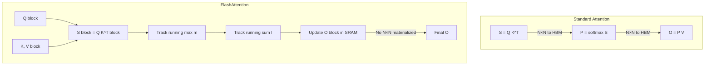

# 08 — FlashAttention (Dao et al., 2022)

> [!info] TL;DR
> FlashAttention computes the *exact* same output as standard attention but reorders the computation to minimize GPU memory traffic. By tiling the attention computation and using online softmax, it avoids materializing the full `N×N` attention matrix in HBM. Result: 2–4× wall-clock speedup, 5–10× memory reduction, and the foundation for long-context LLMs. FlashAttention-2 and FlashAttention-3 extended the idea; FlashAttention is now the default attention kernel in essentially every modern LLM.

## Citation

Dao, T., Fu, D. Y., Ermon, S., Rudra, A., & Ré, C. (2022). *FlashAttention: Fast and Memory-Efficient Exact Attention with IO-Awareness*. NeurIPS 2022. arXiv:2205.14135.

## The Problem Being Solved

Standard attention is `O(N²)` in compute *and* memory. The intermediate `N×N` matrix `Q K^T` must be written to GPU HBM (high-bandwidth memory, the main GPU memory), then read back to apply softmax, then written again. For `N=4096` and `bf16`, this intermediate is `4096² × 2 bytes = 32MB` per attention head — and a 100B-parameter model has hundreds of heads per layer.

The bottleneck is **memory traffic, not FLOPs**. Modern GPUs have ~3TB/s HBM bandwidth but ~1000+ TFLOPS of compute. For attention, the matrix reads/writes dominate wall-clock time — the GPU's compute units are starved.

Earlier work ([[12 - Sparse Attention|sparse attention]], [[13 - Linear Attention|linear attention]]) tried to reduce attention cost by approximating the computation. But approximation sacrifices quality, and modern LLMs need *exact* attention for long-context coherence.

FlashAttention's key insight: **you can compute exact attention while minimizing HBM traffic, by tiling the computation and never materializing the full N×N matrix**. The math is unchanged; only the order of operations changes.

## The Key Idea: Tiling + Online Softmax

### Tiling
Standard attention:
```
S = Q K^T            # (N, N) matrix in HBM
P = softmax(S)       # (N, N) matrix in HBM
O = P V              # (N, N) @ (N, d) → (N, d)
```

The intermediate `S` and `P` are `N×N` and dominate memory.

FlashAttention tiles the computation: load `Q` in blocks of `B_r` rows, load `K, V` in blocks of `B_c` columns. For each `Q` block, iterate over all `K, V` blocks, computing partial attention. Each partial result is accumulated into the output `O` block, which never has to store the full `N×N` matrix.

### Online Softmax
The challenge: softmax needs to normalize over the entire row, but we are computing the row incrementally (one `K` block at a time). How do we normalize without seeing the full row?

The trick (from Milakov & Gimelshein, 2018) is to track the running maximum `m` of the attention scores and the running unnormalized sum `l`. When a new block arrives:

```
m_new = max(m_old, m_block)
l_new = l_old * exp(m_old - m_new) + l_block * exp(m_block - m_new)
O_new = O_old * exp(m_old - m_new) * (l_old / l_new) + O_block * exp(m_block - m_new) * (l_block / l_new)
```

Each block contributes a normalized partial output, which is rescaled as the running maximum grows. The final output is the exact same as standard softmax attention.



### No Backward Pass Recomputation
Standard autograd saves the `N×N` attention matrix for the backward pass. FlashAttention does not materialize it — instead, it recomputes the attention in the backward pass, this time with the Q, K, V tiles in SRAM. This is *faster* than reading the saved `N×N` matrix from HBM, because the matrix is so large that reading it dominates the backward pass.

## The Algorithm

Pseudocode (simplified):

```python
def flash_attention(Q, K, V):
    # Q: (N, d), K: (N, d), V: (N, d)
    # Block sizes B_r, B_c
    O = zeros(N, d)
    l = zeros(N)         # running sum of exp scores
    m = full(N, -inf)    # running max of scores
    
    for j in range(0, N, B_c):
        Kj = K[j:j+B_c]                # load K block to SRAM
        Vj = V[j:j+B_c]                # load V block to SRAM
        
        for i in range(0, N, B_r):
            Qi = Q[i:i+B_r]            # load Q block to SRAM
            Sij = Qi @ Kj.T            # (B_r, B_c) in SRAM
            mij = Sij.max(dim=-1)
            Pij = exp(Sij - mij)
            lij = Pij.sum(dim=-1)
            
            # Rescale running statistics
            m_new = maximum(m[i:i+B_r], mij)
            l_new = l[i:i+B_r] * exp(m[i:i+B_r] - m_new) + lij * exp(mij - m_new)
            O[i:i+B_r] = (O[i:i+B_r] * (l[i:i+B_r] * exp(m[i:i+B_r] - m_new))[..., None]
                          + Pij @ Vj * exp(mij - m_new)[..., None]) / l_new[..., None]
            
            m[i:i+B_r] = m_new
            l[i:i+B_r] = l_new
    
    return O / l[..., None]
```

The actual implementation is in CUDA (or Triton), with carefully tuned block sizes for the specific GPU architecture (A100: `B_r=128, B_c=64` typically).

## Key Results

| Model           | Seq Len | Standard attn | FlashAttention | Speedup |
|-----------------|---------|---------------|----------------|---------|
| GPT-2 (small)   | 1024    | 1.2 ms         | 0.6 ms          | 2.0×    |
| GPT-2 (small)   | 4096    | 13 ms          | 4.5 ms          | 2.9×    |
| GPT-2 (small)   | 16384   | OOM            | 75 ms           | ∞       |

Memory savings are even more dramatic: FlashAttention reduces attention memory from `O(N²)` to `O(N)`.

For long-context training (8k+), FlashAttention was often the difference between "feasible" and "OOM." It enabled GPT-4 32k, Claude 100k, and the entire long-context LLM era.

## Why It Worked

### IO-Awareness
The fundamental insight is that **attention is memory-bound, not compute-bound**. Optimizing the number of FLOPs (which sparse/linear attention does) does not help if the kernel is starved for data. FlashAttention optimizes the memory access pattern, which is the actual bottleneck.

### Exact Computation
Unlike sparse or linear attention, FlashAttention produces bit-identical (up to floating point) results to standard attention. No quality is sacrificed. This made adoption frictionless — models trained with FlashAttention converge to the same loss as standard attention.

### Hardware Co-Design
The kernel is specifically tuned for GPU memory hierarchies: SRAM (per-streaming multiprocessor, ~192KB on A100), L2 cache, and HBM. The block sizes are chosen to fit Q, K, V tiles in SRAM, minimizing HBM round-trips.

### Drop-In Replacement
FlashAttention exposes the same API as standard attention. PyTorch, HuggingFace, and most training frameworks now default to FlashAttention when the input is on GPU and satisfies the constraints (causal mask, no attention bias, etc.).

## Successors

### FlashAttention-2 (2023)
Dao rewrote the kernel to better parallelize across the GPU. Key changes:
- Reduced non-matmul FLOPs (the original had overhead from the running-max/sum rescaling).
- Better work partitioning: each thread block handles one row, reducing synchronization.
- 2× speedup over FlashAttention-1 on A100.

### FlashAttention-3 (2024)
Optimized for Hopper (H100) GPUs. Uses:
- **WGMMA** (Warp Group Matrix Multiply Accumulate) — Hopper's tensor-core instruction for asynchronous matmul.
- **Asynchronous warpgroups** — overlap matmul with softmax.
- **FP8 support** — 2× throughput on FP8 tensor cores.

FlashAttention-3 reaches 1.5–2.0 PFLOPS on H100 (for FP16), close to the theoretical peak.

### Other IO-Aware Kernels
- **xformers memory-efficient attention** (Meta) — similar idea, slightly different implementation.
- **Triton attention** (OpenAI) — Triton-based implementation, easier to modify than CUDA.
- **FlashDecoding** — extension for inference with very long contexts.
- **PagedAttention** (vLLM) — applies similar tiling ideas to the KV cache. See [[10 - PagedAttention vLLM 2023]] and [[02 - PagedAttention]].

## Limitations

- **GPU-specific**. The kernel is hand-tuned for specific architectures (Ampere, Hopper). Porting to a new GPU requires re-tuning.
- **Causal mask only** (originally). Extended to support arbitrary masks in later versions, but with some overhead.
- **No attention bias**. The original kernel did not support attention biases (e.g., ALiBi). Later versions added this.
- **Tile size constraints**. Sequence lengths that do not divide cleanly into tiles may have suboptimal performance.

## Impact and Legacy

FlashAttention is one of the most impactful systems papers of the LLM era:

1. **Universal adoption**. Every major LLM training and serving framework (PyTorch, JAX, Megatron, DeepSpeed, vLLM, TGI, TensorRT-LLM) uses FlashAttention by default.
2. **Enabled long-context LLMs**. Without FlashAttention, training a 32k or 128k context model would be economically infeasible.
3. **Reframed "efficiency" research**. Before FlashAttention, the field focused on reducing FLOPs (sparse, linear). After, the field focused on memory access patterns. This reframing affected everything from kernel design to attention variants.
4. **Open-source CUDA kernel as competitive advantage**. The kernel was open-sourced, but the *expertise* to write it remained scarce. This created a class of "kernel engineer" roles that became some of the highest-paid positions in AI.

For AI engineers in 2024–2026, FlashAttention is invisible infrastructure: you almost never call it directly, but every LLM you train or serve uses it. Understanding the algorithm matters when you need to debug a slow training run, write a custom attention variant, or reason about long-context cost.

## Further Reading

- Original paper: arXiv:2205.14135
- FlashAttention-2: arXiv:2307.08691
- FlashAttention-3: arXiv:2407.08608
- Dao & Gu (2022), *FlashAttention: Fast and Memory-Efficient Exact Attention* — Dao's blog post with intuition.
- Tri Dao's `flash-attn` PyPI package — production implementation.

## See Also

- [[11 - FlashAttention]]
- [[04 - Self-Attention]]
- [[12 - Sparse Attention]]
- [[13 - Linear Attention]]
- [[02 - PagedAttention]]
- [[26 - Papers/MOC|Papers MOC]]
