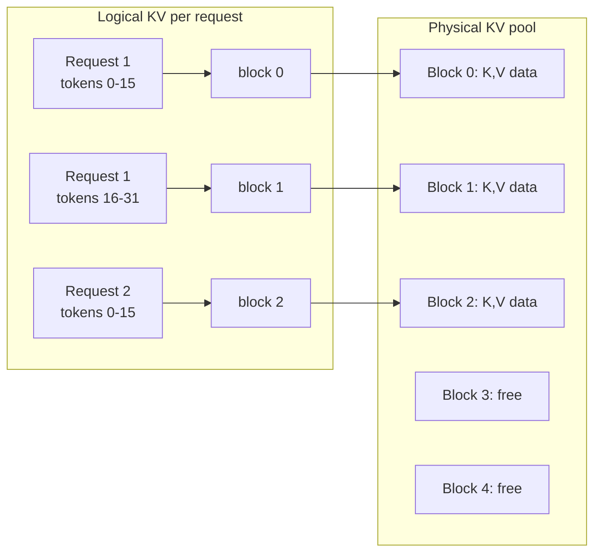
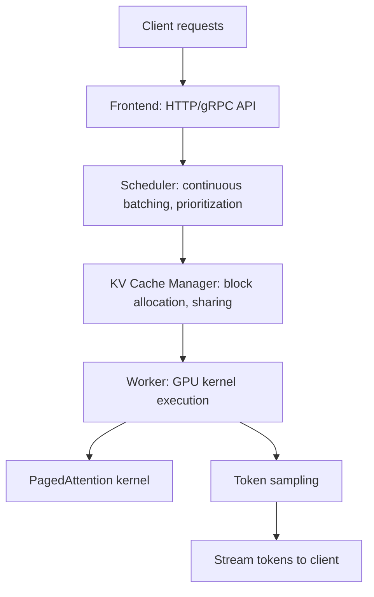

# 10 — PagedAttention / vLLM (Kwon et al., 2023)

> [!info] TL;DR
> PagedAttention applied the operating-system idea of **paging** to the LLM KV cache. Instead of allocating a contiguous block of GPU memory per request (which wastes 60–80% to internal fragmentation and over-reservation), vLLM stores the KV cache in non-contiguous blocks managed by a block table. Combined with continuous batching, this gave 2–4× throughput over prior serving systems. vLLM became the default open-source LLM inference engine and reshaped how production LLM serving is built.

## Citation

Kwon, W., Li, Z., Zhuang, S., Sheng, Y., Zheng, L., Yu, C. H., Gonzalez, J. E., Zhang, H., & Stoica, I. (2023). *Efficient Memory Management for Large Language Model Serving with PagedAttention*. SOSP 2023. arXiv:2309.06180.

## The Problem Being Solved

By 2023, LLM serving was bottlenecked by KV-cache memory management. The standard approach:

1. For each request, pre-allocate a contiguous block of GPU memory large enough for the maximum sequence length.
2. Fill this block incrementally as tokens are generated.

This had three problems:

### Internal Fragmentation
Requests rarely use their maximum sequence length. If you pre-allocate for 2048 tokens but the request stops at 200, you waste ~90% of the allocated memory. Across many requests, the wasted memory is enormous — the paper measured 60–80% waste in standard serving systems.

### External Fragmentation
As requests of different lengths come and go, the GPU memory pool becomes fragmented. New requests may not fit even if total free memory is sufficient.

### No Sharing
For techniques like beam search, parallel sampling, or shared prefixes (system prompt), the same KV cache is recomputed or duplicated across requests. There is no native mechanism to share KV memory.

The cumulative effect: throughput was 3–5× below the theoretical maximum of the GPU. Memory, not compute, was the bottleneck.

## The Key Idea: Paging the KV Cache

PagedAttention borrows directly from operating systems. In a modern OS, virtual memory uses **pages** (fixed-size blocks) and a **page table** to map virtual to physical addresses. This avoids fragmentation and enables shared memory.

vLLM applies the same idea to the KV cache:

- The KV cache is divided into fixed-size **blocks** (typically 16 tokens per block).
- Each request has a **block table** mapping its logical token positions to physical block IDs.
- Blocks are allocated on demand as the request generates tokens.
- Blocks are freed when the request completes.

### Block-Level Attention
The attention kernel must be rewritten to use the block table. For each query position, the kernel iterates over the blocks in the request's block table, loads the K and V for that block, and computes attention. This is similar to [[08 - FlashAttention 2022|FlashAttention]]'s tiling, but the blocks are scattered in physical memory rather than contiguous.

The paper's CUDA kernel achieves this efficiently by loading blocks into SRAM and computing partial attention with online softmax (the same trick as FlashAttention).

### Shared Prefixes
Because the KV cache is block-mapped, multiple requests can share blocks. If 100 requests all use the same 1000-token system prompt, vLLM allocates the system prompt's KV blocks once and references them from all 100 requests' block tables (with copy-on-write semantics if a request needs to modify a shared block).

This is enormously valuable in practice — system prompts, few-shot examples, and RAG context can all be shared, saving gigabytes of KV memory.

## The Architecture: vLLM

vLLM is the open-source serving engine built around PagedAttention. Its architecture:

### Continuous Batching
At every step, the scheduler can:
- Admit new requests (if KV blocks are available).
- Evict completed or pre-empted requests (freeing blocks).
- Reorder requests to maximize GPU utilization.

This is **continuous batching** (also called *iteration-level batching* or *dynamic batching*). Unlike static batching (which waits to fill a batch and processes it together), continuous batching processes whatever requests are currently active, admitting new ones as soon as space is available. Latency improves dramatically under mixed workloads.

### Preemption
When GPU memory is full, vLLM can preempt requests: their KV cache is either swapped to CPU memory or recomputed from scratch when re-scheduled. The system transparently handles overload, unlike prior systems which would OOM and crash.

### Prefix Caching
vLLM caches the KV blocks for recently seen prompts. If a new request's prompt starts with a cached prefix, the prefix blocks are reused without recomputation. For chat applications (where each turn repeats the prior conversation), this gives large latency and compute savings.

## Key Results

The paper compared vLLM against two prior state-of-the-art serving systems (FasterTransformer and TGI) on LLaMA-13B and LLaMA-33B workloads.

| Workload                          | FasterTransformer | TGI  | vLLM  |
|-----------------------------------|-------------------|------|-------|
| LLaMA-7B, ChatGPT-like share GPT  | 1.0×              | 1.4× | 2.2×  |
| LLaMA-13B, ChatGPT-like           | 1.0×              | 1.5× | 2.5×  |
| LLaMA-33B, ChatGPT-like           | 1.0×              | 1.4× | 2.4×  |
| LLaMA-7B, ShareGPT (long prompts) | 1.0×              | 1.6× | 3.0×  |

Throughput improvements were 2–4× across the board. The improvements came entirely from better memory utilization — the GPU compute was identical.

For shared-prefix workloads (e.g., many requests with the same system prompt), vLLM's prefix caching gave additional 1.5–2× throughput.

## Why It Worked

### Memory, Not Compute, Was the Bottleneck
Before PagedAttention, practitioners assumed LLM serving was compute-bound. The paper showed it was memory-bound, and that better memory management alone could deliver 2–4× throughput on identical hardware.

### OS-Level Insights Apply to ML Systems
The paging abstraction is decades old in OS design but had not been applied to ML serving. vLLM demonstrated that classical systems ideas — paging, virtual memory, copy-on-write — transfer cleanly to ML workloads. This insight inspired a wave of "systems for ML" research applying OS, database, and distributed-systems techniques to LLM serving.

### Block-Level Sharing Unlocks New Workloads
Prefix caching makes shared-prefix serving economically viable. This is the foundation for many production patterns: chat applications, RAG with long context, agent frameworks that reuse the same system prompt across many turns.

## Limitations and Extensions

- **Block size tradeoff**. Small blocks (e.g., 4 tokens) reduce fragmentation but increase block-table overhead. Large blocks (e.g., 64) reduce overhead but increase fragmentation. 16 is a common default.
- **No native support for non-causal attention**. PagedAttention is designed for causal LMs; encoder models need different handling.
- **Preemption is expensive**. Swapping to CPU is slow; recomputing wastes compute. The scheduler tries to avoid preemption, but under heavy load it is unavoidable.

### Successors
- **SGLang RadixAttention** — extends prefix caching with a radix tree for automatic prefix reuse across many requests.
- **TensorRT-LLM** — NVIDIA's optimized serving engine; uses similar batching ideas with kernel-level optimizations.
- **TGI** (HuggingFace) — Text Generation Inference; adopted many of vLLM's ideas.
- **DeepSeek/Mooncake** — disaggregated inference (prefill and decode on different hardware pools).

## Impact and Legacy

vLLM reshaped the LLM serving ecosystem:

1. **Open-source default**. By 2024, vLLM was the most-deployed open-source LLM server. The vast majority of self-hosted LLM deployments use it or a derivative.
2. **PagedAttention as a primitive**. The block-level KV cache became a standard abstraction, adopted by TensorRT-LLM, SGLang, and most custom inference engines.
3. **Prefix caching as default**. What was a novelty in 2023 is now expected behavior in any serious LLM server.
4. **Inspired a generation of systems papers**. The vLLM paper showed that ML systems research could deliver production-grade improvements, catalyzing work on disaggregated inference, speculative decoding, and quantized serving.

For AI engineers in 2024–2026, vLLM is the reference implementation for self-hosted LLM serving. Understanding its memory model is essential for capacity planning, debugging latency, and reasoning about cost.

## Further Reading

- Original paper: arXiv:2309.06180
- vLLM documentation and GitHub: github.com/vllm-project/vllm
- SGLang: github.com/sgl-project/sglang — RadixAttention and structured generation.
- TensorRT-LLM: developer.nvidia.com/tensorrt-llm

## See Also

- [[02 - PagedAttention]]
- [[04 - vLLM and Continuous Batching]]
- [[02 - KV Cache Mechanics]]
- [[08 - FlashAttention 2022]]
- [[10 - PagedAttention vLLM 2023]]
- [[26 - Papers/MOC|Papers MOC]]
