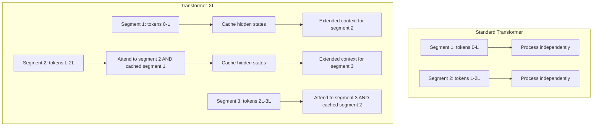

# 16 — Transformer-XL (Dai et al., 2019)

> [!info] TL;DR
> Transformer-XL addressed the fixed-context limitation of vanilla Transformers by introducing **segment-level recurrence** (carrying hidden states from previous segments into the current one) and **relative positional encoding** (encoding position as relative offsets rather than absolute positions). The result: a Transformer that could learn dependencies 80% longer than vanilla and generalize to sequences 4–5× longer than seen in training. The relative positional encoding influenced all subsequent long-context work, including RoPE.

## Citation

Dai, Z., Yang, Z., Yang, Y., Carbonell, J., Le, Q. V., & Salakhutdinov, R. (2019). *Transformer-XL: Attentive Language Models Beyond a Fixed-Length Context*. ACL 2019. arXiv:1901.02860.

## The Problem Being Solved

Vanilla Transformers ([[02 - Vaswani Attention Is All You Need 2017|Vaswani 2017]]) have a fixed context window. To process a document longer than the window, you must split it into segments and process each independently. This has two problems:

1. **No long-range dependencies**: tokens in segment N cannot attend to tokens in segment N-1. The model cannot learn dependencies that span segment boundaries.
2. **No length generalization**: absolute positional embeddings learned during training do not transfer to longer sequences at inference. The model cannot process sequences longer than its training context.

Transformer-XL solves both problems. "XL" stands for "extra long" — the model can learn dependencies across segment boundaries and extrapolate to longer sequences than it saw in training.

## The Two Key Ideas

### 1. Segment-Level Recurrence

Instead of processing each segment independently, Transformer-XL caches the hidden states from the previous segment and uses them as additional context for the current segment.

For a segment of length `L`, the model computes hidden states `h_{n-L}, ..., h_{n-1}` for the previous segment and caches them. When processing the current segment (tokens `n, n+1, ..., n+L-1`), the current tokens can attend to both the current segment's keys/values AND the cached previous segment's keys/values.

```
# Standard Transformer:
# Process segment [n, n+L): attend only to [n, n+L)
# Process segment [n+L, n+2L): attend only to [n+L, n+2L)
# No information flows across segment boundaries.

# Transformer-XL:
# Process segment [n, n+L): attend to [n, n+L) AND cached [n-L, n)
# Process segment [n+L, n+2L): attend to [n+L, n+2L) AND cached [n, n+L)
# Information flows across segment boundaries via the cache.
```

The cache is detached from the gradient graph (no backprop through the cache) to keep memory manageable. This creates a recurrence: the current segment's computation depends on the previous segment's hidden states, similar to an RNN but at the segment level rather than the token level.

This gives the model an effective context of `2L` (current segment + cached previous segment), and with multiple layers, the effective context grows further (each layer can reach back one more segment).

### 2. Relative Positional Encoding

With segment-level recurrence, absolute positional encodings break: the same position `i` in segment N and segment N+1 would have the same encoding, but they represent different absolute positions. The model would confuse them.

Transformer-XL introduces **relative positional encoding**. Instead of encoding the absolute position of each token, encode the *relative position* between the query and key:

```
Standard attention:       A_{i,j} = (W_q · h_i)^T · (W_k · h_j)  + e_i^T · e_j
Transformer-XL:           A_{i,j} = (W_q · h_i)^T · (W_k,E · h_j)  + (W_q · h_i)^T · R_{i-j}
                                                                + u^T · (W_k,E · h_j)
                                                                + v^T · (W_k,R · R_{i-j})
```

where:
- `R_{i-j}` is a sinusoidal encoding of the *relative* position `i - j`.
- `u, v` are learned global parameters (content-content and content-position bias).
- `W_k,E` projects the key content; `W_k,R` is omitted (the relative position is added directly to the query-key dot product).

The four terms decompose the attention score into:
1. Content-content: how much does the query content match the key content?
2. Content-position: how much does the query content match the relative position encoding?
3. Global content bias: a learned bias for key content (independent of query).
4. Global position bias: a learned bias for relative position (independent of query).

This relative formulation is what enables length extrapolation: the model never sees absolute positions beyond `L`, but it learns relative patterns that generalize to any length.



## Key Results

Transformer-XL achieved state-of-the-art on long-context language modeling benchmarks:

| Model           | WikiText-103 (PPL) | Enwik8 (BPC) |
|-----------------|--------------------|--------------| 
| Vanilla Transformer | 24.0           | 1.06         |
| Transformer-XL (18 layers) | 18.3       | 0.99         |
| Transformer-XL (24 layers) | 16.1       | —            |

More importantly, Transformer-XL could process sequences 4–5× longer than its training context (1600 tokens at inference, trained on 400-token segments). This was the first Transformer to demonstrate meaningful length extrapolation.

The relative positional encoding also produced sharper, more interpretable attention patterns than absolute encodings — the model learned to attend to relevant tokens regardless of their absolute position.

## Why It Worked

### Recurrence Without RNN Overhead
Segment-level recurrence gives the model the long-range dependencies of an RNN without the sequential computation bottleneck. Each segment is processed in parallel (as in a vanilla Transformer); only the cache transfer between segments is sequential.

### Relative Position Generalizes
Absolute positional encodings are a lookup table — the model has no representation for positions beyond training. Relative encodings are a function of the offset, which is defined for any pair of positions. The model learns patterns like "attend to the previous token" or "attend to the token 5 positions back" that work at any length.

### Decomposition of Attention Score
The four-term decomposition (content-content, content-position, content bias, position bias) gave the model explicit knobs for different aspects of attention. This is more expressive than a single content-position dot product.

## Limitations

- **Cache size grows with depth**: in deep models, each layer caches the previous segment's states, so memory grows linearly with depth. For very deep models or very long contexts, this becomes expensive.
- **No true infinite context**: the cache holds a fixed number of previous segments. The model cannot attend to arbitrary-length history — only to the last few segments. True infinite context requires different techniques (see [[06 - Attention Mechanisms/Efficient Attention/12 - Sparse Attention|Sparse Attention]] and Google's Infini-Attention paper, 2024).
- **Sinusoidal relative encoding**: while it generalizes, it's a fixed function. Later work (RoPE, ALiBi) showed that learned or differently-parameterized relative encodings can be more effective.

## Impact and Legacy

Transformer-XL influenced the field in several ways:

1. **Relative positional encoding as the default**. The shift from absolute to relative position was a paradigm change. [[08 - RoPE|RoPE]] (2021), [[09 - ALiBi|ALiBi]] (2021), and [[10 - YaRN and NTK-aware Scaling|YaRN]] (2023) all build on the relative position idea. Modern LLMs (Llama, Mistral, DeepSeek) use RoPE, which is a direct descendant of Transformer-XL's relative encoding.

2. **Long-context as a research direction**. Transformer-XL established long-context Transformers as a distinct research area. Subsequent work (Longformer, BigBird, LongNet, Ring Attention) extended the approach to much longer contexts.

3. **Cache-based attention patterns**. The idea of caching previous KV states for reuse became foundational. Modern inference systems ([[10 - PagedAttention vLLM 2023|PagedAttention]], prefix caching) use a similar idea, though for efficiency rather than for long-context modeling.

4. **Length extrapolation as a goal**. Transformer-XL was the first to demonstrate length extrapolation. This became a key requirement for long-context models — you want to train on short sequences (cheap) and infer on long ones (expensive to train on).

For AI engineers, Transformer-XL is mostly of historical interest — modern LLMs use RoPE rather than the original Transformer-XL relative encoding. But understanding the segment-level recurrence idea clarifies how prefix caching and KV cache management work, and the relative position framing explains *why* modern positional encodings are designed the way they are.

## Further Reading

- Original paper: arXiv:1901.02860
- [[08 - RoPE]] — the modern descendant of Transformer-XL's relative encoding.
- [[09 - ALiBi]] — an alternative relative encoding using attention biases.

## See Also

- [[06 - Positional Encoding Overview]]
- [[07 - Sinusoidal and Learned Positional]]
- [[08 - RoPE]]
- [[09 - ALiBi]]
- [[10 - YaRN and NTK-aware Scaling]]
- [[12 - Sparse Attention]]
- [[26 - Papers/MOC|Papers MOC]]
