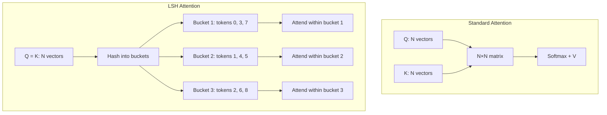

# 17 — Reformer (Kitaev et al., 2020)

> [!info] TL;DR
> Reformer tackled the O(N²) cost of attention from two angles: **locality-sensitive hashing (LSH) attention** to reduce the attention computation to O(N log N), and **reversible layers** to reduce memory from O(NL) to O(N). The goal was to handle 64K-token sequences on a single GPU. The techniques were innovative but the model did not displace standard Transformers — LSH attention sacrificed too much quality for the efficiency gains, and reversible layers were superseded by gradient checkpointing. Reformer's legacy is primarily as a proof that sub-quadratic attention is feasible.

## Citation

Kitaev, N., Kaiser, Ł., & Levskaya, A. (2020). *Reformer: The Efficient Transformer*. ICLR 2020. arXiv:2001.04451.

## The Problem Being Solved

By 2019, Transformers had become the dominant architecture for NLP, but their O(N²) attention cost was a clear bottleneck. For sequence length N:
- Memory: O(N²) for the attention matrix, plus O(NL) for activations across L layers.
- Compute: O(N² · d) for the attention dot products.

For N=8192, the attention matrix alone is 64M × 4 bytes = 256MB per layer per head. A 12-layer model with 12 heads would need ~37GB just for attention matrices — far beyond a single GPU.

Two approaches were being explored:
1. **Approximate attention**: reduce the O(N²) by computing only the most important attention weights (sparse attention, low-rank approximations).
2. **Memory-efficient training**: reduce the O(NL) activation memory through checkpointing or reversible layers.

Reformer tackled both, with two distinct innovations.

## The Two Key Ideas

### 1. LSH (Locality-Sensitive Hashing) Attention

The observation: in a well-trained Transformer, the attention matrix is sparse — most attention weight concentrates on a few tokens per query. If we could identify those few relevant tokens without computing the full N×N matrix, attention would be O(N · k) where k is the number of relevant tokens per query.

LSH attention identifies relevant tokens by hashing queries and keys into buckets. Tokens whose queries and keys hash to the same bucket are likely to have high attention weight (because similar vectors hash to the same bucket in LSH).

**Standard LSH**:
- Hash each query `q_i` and key `k_j` using a random projection.
- Tokens with the same hash are in the same bucket.
- Within a bucket, compute full attention (every query attends to every key in its bucket).
- Across buckets, no attention.

The complexity is O(N · b) where b is the average bucket size, which is O(N log N) for typical configurations.

**Shared QK attention**: Reformer uses a variant where queries and keys are the same vectors (Q = K). This ensures that a token's query and its own key hash to the same bucket, so self-attention always includes the token itself. The cost is some expressivity (separate Q and K projections allow the model to distinguish "what I'm looking for" from "what I have"), but Reformer found this acceptable.



### 2. Reversible Layers

Standard Transformer training stores activations for every layer (needed for backprop). For L layers, this is O(NL) memory — a major cost for deep models.

Reformer uses **reversible residual networks** (Gomez et al., 2017). Each layer's input is split into two parts `(x1, x2)`, and the layer computes:

```
y1 = x1 + F(x2)
y2 = x2 + G(y1)
```

where F and G are the attention and feed-forward sublayers. The key property: given the output `(y1, y2)`, you can recover the input `(x1, x2)` without storing it:

```
x2 = y2 - G(y1)
x1 = y1 - F(x2)
```

During backprop, the model recomputes the input from the output, rather than reading it from a stored activation. This reduces activation memory from O(NL) to O(N) — only one layer's activations need to be stored at a time.

The trade-off: backprop requires recomputing F and G, which adds ~33% compute overhead. But for memory-bound training (typical for Transformers), this is a good trade.

## Key Results

Reformer could process sequences of 64K tokens on a single GPU with 16GB of memory — far beyond what a vanilla Transformer could handle. On the `enwik8` character-level language modeling benchmark, Reformer achieved competitive perplexity with much lower memory and compute.

However, the empirical comparison to vanilla Transformers was not as favorable as the complexity analysis suggested:
- **Quality**: LSH attention sacrificed some quality. On standard benchmarks, Reformer underperformed full-attention Transformers at the same parameter count.
- **Speed**: the constant factors of LSH (hashing, bucketing, sorting) were high. For moderate sequence lengths (up to ~4K), vanilla Transformers with FlashAttention-style kernels were often faster in practice.
- **Reversible layers**: added compute overhead and made implementation more complex.

## Why It Didn't Displace Standard Transformers

### FlashAttention Solved the Memory Problem Differently
[[08 - FlashAttention 2022|FlashAttention]] (2022) showed that you could compute *exact* attention in O(N) memory by tiling and never materializing the N×N matrix. This removed the main motivation for LSH attention — you could have full attention quality with sub-quadratic memory.

### Sparse Attention Was Simpler
Longformer, BigBird, and other sparse attention variants reduced attention cost with simpler patterns (local windows + a few global tokens) that didn't require hashing. These were easier to implement and gave more predictable quality.

### Reversible Layers Were Superseded by Gradient Checkpointing
Gradient checkpointing (storing only some layer activations and recomputing others during backprop) achieved similar memory savings without the architectural constraint of reversible layers. It became the standard memory-reduction technique for Transformer training.

### LSH Quality Issues
The shared-QK constraint and bucket-based approximation sacrificed too much quality for production use. Models that needed long context (e.g., GPT-3, Llama) used full attention with FlashAttention, accepting the O(N²) compute cost in exchange for full quality.

## Impact and Legacy

Reformer's direct influence on production systems is limited, but its conceptual contributions were significant:

1. **Proof that sub-quadratic attention is feasible**. Reformer demonstrated that you could process 64K-token sequences on a single GPU, which was remarkable in 2020. This motivated the wave of sub-quadratic attention research (Longformer, Linformer, Performer, FlashAttention) that defined 2020–2022.

2. **LSH as an attention mechanism**. While LSH attention itself didn't catch on, the idea of hashing to identify relevant tokens influenced retrieval-augmented methods. Modern RAG systems use a similar idea (find relevant chunks via embedding similarity, attend only to those).

3. **Reversible networks for memory efficiency**. The reversible layer idea didn't become standard for Transformers, but it influenced other memory-efficient architectures. The general principle — recompute rather than store, when memory is the bottleneck — became a core technique in deep learning systems.

4. **Length extrapolation as a goal**. Reformer could process sequences longer than its training context (thanks to LSH being length-agnostic). This was an early demonstration of length extrapolation, which became a key requirement for long-context models.

For AI engineers, Reformer is mostly of historical interest. Modern long-context models use FlashAttention (for exact attention at scale), sparse attention patterns (Longformer-style), or sliding-window attention (Mistral-style). But understanding Reformer clarifies the design space: attention can be reduced via hashing (Reformer), sparsity (Longformer), low-rank approximation (Linformer), kernel methods (Performer), or tiling (FlashAttention) — each with different trade-offs.

## Further Reading

- Original paper: arXiv:2001.04451
- Gomez et al. (2017), *The Reversible Residual Network* — the source of reversible layers.
- [[12 - Sparse Attention]] — the simpler alternative that won.
- [[08 - FlashAttention 2022]] — the exact-attention approach that became standard.

## See Also

- [[12 - Sparse Attention]]
- [[13 - Linear Attention]]
- [[08 - FlashAttention 2022]]
- [[16 - Transformer-XL 2019]]
- [[26 - Papers/MOC|Papers MOC]]
