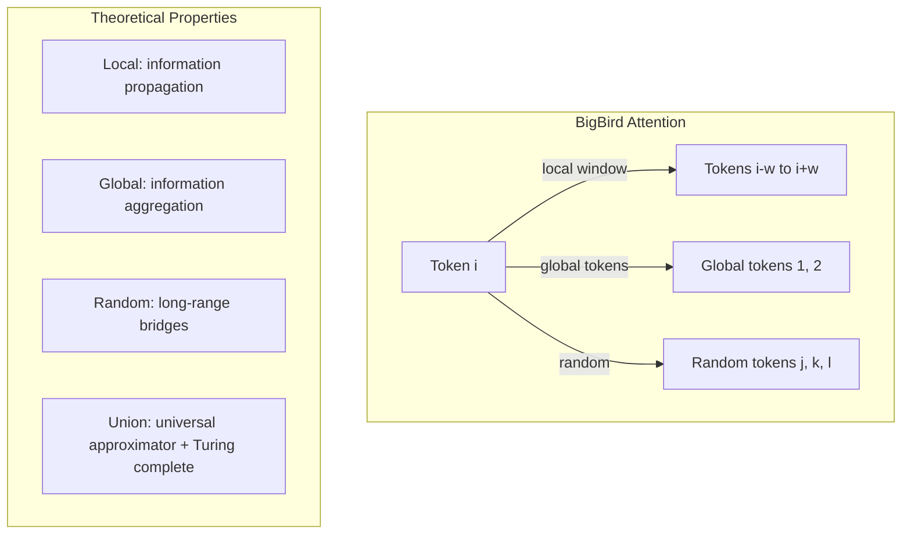

# 20 — BigBird (Zaheer et al., 2020)

> [!info] TL;DR
> BigBird combined three attention patterns — **local sliding window**, **global tokens**, and **random connections** — to achieve O(N) attention while being a universal approximator and Turing-complete. The random connections are the key innovation: they provide the "long-range bridges" that pure local attention misses, with theoretical guarantees from graph theory. BigBird achieved SOTA on long-document tasks and influenced the design of subsequent sparse attention variants.

## Citation

Zaheer, M., Guruganesh, G., Dubey, K. A., Ainslie, J., Alberti, C., Ontañón, S., Pham, P., Ravula, A., Wang, Q., Yang, L., & Ahmed, A. (2020). *Big Bird: Transformers for Longer Sequences*. NeurIPS 2020. arXiv:2007.14062.

## The Problem Being Solved

[[18 - Longformer 2020|Longformer]] showed that local + global attention works for long documents. But Longformer's pattern was designed by hand (which tokens are global? how big is the window?) and lacked theoretical justification. The community wanted:
1. A sparse attention pattern with *theoretical guarantees* — when does sparse attention preserve the expressivity of full attention?
2. A pattern that handles very long contexts (16K+) with good quality.
3. A pattern that works for general-purpose models (not just task-specific long-document QA).

BigBird addressed all three by combining three attention patterns with theoretical analysis from graph theory.

## The Three Attention Patterns

BigBird's attention is the union of three patterns:

### 1. Local Sliding Window (like Longformer)
Each token attends to `w` tokens on each side. Cost: O(N · w).

### 2. Global Tokens (like Longformer)
A few tokens (selected or learned) attend to everything, and everything attends to them. Cost: O(N · g) where g is the number of global tokens.

### 3. Random Connections
Each token attends to `r` randomly-selected tokens from anywhere in the sequence. Cost: O(N · r).

Total cost: O(N · (w + g + r)) = O(N) for fixed w, g, r.

### Why Random Connections?
The key theoretical insight: random edges in a graph provide "small-world" properties — they dramatically reduce the graph diameter (the longest shortest path between any two nodes). Without random edges, local attention requires O(N/w) layers for information to flow from token 1 to token N. With random edges, the expected path length is O(log N), so information flows in O(log N) layers regardless of sequence length.

This is the same phenomenon that makes "six degrees of separation" work in social networks — a few random connections shrink the world dramatically.

## Theoretical Results

The paper's main theoretical contribution was proving that BigBird's attention pattern is:

1. **A universal approximator**: BigBird can approximate any sequence-to-sequence function to arbitrary precision, given enough layers. Pure local attention cannot — it's limited to functions that depend only on local context.

2. **Turing complete**: BigBird can simulate any Turing machine, given enough layers and appropriate weights. This means it can in principle compute anything computable. Pure local attention is not Turing complete (it cannot maintain unbounded state).

3. **Strictly more expressive than Longformer-style local + global**: the random connections add expressivity that local + global alone cannot achieve.

These results were important because they provided theoretical justification for sparse attention — previously, sparse patterns were justified empirically ("it works"), but BigBird showed *why* it works and *which patterns* preserve expressivity.

## Key Results

BigBird achieved SOTA on several long-context benchmarks:

| Task                                | Previous SOTA | BigBird |
|-------------------------------------|---------------|---------|
| Natural Questions (long-context QA) | 51.0          | 52.3    |
| WikiHop (multi-hop QA)              | 74.1          | 74.6    |
| TriviaQA (long-context QA)          | 72.0          | 73.2    |
| arXiv summarization (ROUGE-L)       | 36.5          | 37.0    |

The improvements over Longformer were modest (0.5–1.5 points), but BigBird's advantage was its theoretical grounding and general applicability — it worked without task-specific tuning of which tokens are global.

## Why It Worked

### Random Bridges Enable Long-Range Information Flow
The random connections are the key innovation. Without them, local attention requires many layers for information to flow across the sequence. With them, information flows in O(log N) layers — much faster.

This matches the structure of real-world long documents: most information is local (within a paragraph), but a few cross-document connections (a reference to an earlier section, a definition introduced far back) are essential. Random attention captures these.

### Theoretical Guarantees
The universal approximator and Turing completeness results gave practitioners confidence that BigBird could in principle match full attention's expressivity. This mattered for adoption — sparse attention variants without such guarantees were viewed with suspicion.

### General-Purpose Pattern
Unlike Longformer (which required task-specific global token selection), BigBird's pattern is task-agnostic. The random connections provide global integration without needing to know in advance which tokens are important.

## Limitations

### Random Connections Add Implementation Complexity
Random attention requires generating and managing random patterns, which is harder to optimize than fixed patterns (Longformer's sliding window). On GPUs, the gather operations for random attention are slower than dense local attention.

### Modest Quality Improvements Over Longformer
The improvements over Longformer were small (0.5–1.5 points). For many practitioners, Longformer's simplicity (no random component) outweighed BigBird's theoretical advantages.

### Superseded by FlashAttention and Hybrid Patterns
FlashAttention (2022) made full attention practical for moderate sequence lengths (up to ~32K). For very long contexts, modern LLMs use hybrid patterns (sliding window + a few full-attention layers, as in Mistral) rather than BigBird's specific three-pattern combination.

### Theoretical Results Don't Always Translate to Practice
Universal approximation and Turing completeness are theoretical properties — they don't guarantee that BigBird trains better in practice. Empirically, the quality gap between BigBird and full attention is non-trivial, especially on tasks requiring precise long-range retrieval.

## Impact and Legacy

BigBird's influence extends beyond the specific model:

1. **Theoretical framework for sparse attention**. BigBird's analysis — connecting attention patterns to graph theory and Turing completeness — provided a framework for analyzing other sparse attention variants. Subsequent papers could ask "is this pattern a universal approximator?" and use BigBird's tools to answer.

2. **Random attention as a component**. The idea that random connections improve attention quality influenced subsequent work. Sparse Transformer (Child et al., 2019) used random patterns; some modern long-context models include random attention layers for the same reason.

3. **ETC and Pegasus influence**. BigBird's authors (Google) integrated the pattern into subsequent models (ETC for long-document understanding, Pegasus for summarization). The sparse attention pattern became a standard option in Google's model family.

4. **Foundation for hybrid attention in modern LLMs**. Modern LLMs (Llama 3, Mistral, Gemma) use hybrid attention patterns — some layers use sliding window, others use full attention. This is a simplified version of BigBird's three-pattern combination, optimized for the specific characteristics of decoder-only LLMs.

For AI engineers, BigBird is the canonical reference for sparse attention with theoretical guarantees. Understanding BigBird clarifies *why* sparse attention works (random bridges for long-range flow) and *which patterns* preserve expressivity (those with sufficient connectivity to be universal approximators).

## Further Reading

- Original paper: arXiv:2007.14062
- [[18 - Longformer 2020]] — the simpler sparse attention variant.
- [[12 - Sparse Attention]] — broader survey.

## See Also

- [[12 - Sparse Attention]]
- [[15 - Sliding Window Attention]]
- [[17 - Reformer 2020]]
- [[18 - Longformer 2020]]
- [[19 - Linformer 2020]]
- [[08 - FlashAttention 2022]]
- [[26 - Papers/MOC|Papers MOC]]
