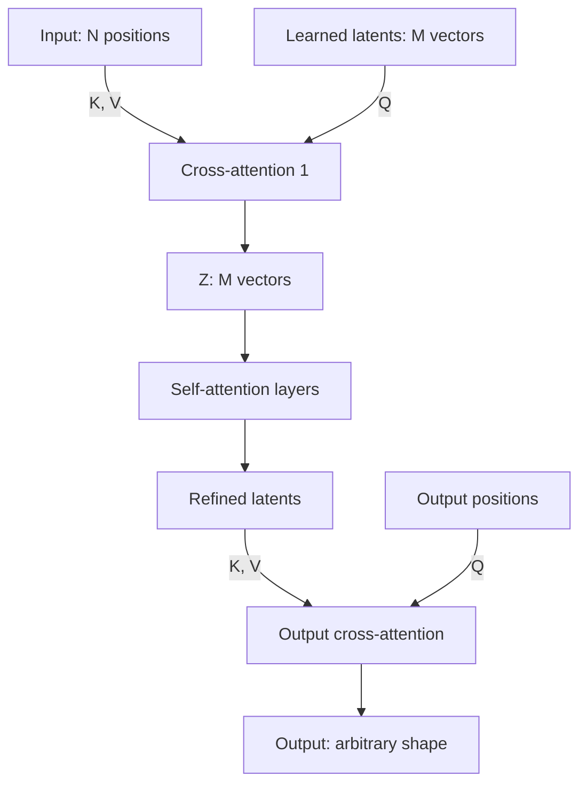

# 36 — Perceiver and Perceiver IO (Jaegle et al., 2022)

> [!info] TL;DR
> The Perceiver architecture (Jaegle et al., 2021; Perceiver IO, 2022) uses **asymmetric attention** to handle high-dimensional inputs (images, audio, point clouds) without the quadratic cost of standard attention. The key idea: a small set of learned "latent" vectors attend to the (large) input via cross-attention, then attend to each other via self-attention. This decouples the input size from the attention cost — image, audio, and video inputs of arbitrary length all produce a fixed-size latent representation. Perceiver IO extends this to produce arbitrary outputs (not just classification) via output cross-attention. Perceiver is architecturally significant because it showed attention could scale to high-dimensional modalities without domain-specific priors.

## Citation

Jaegle, A., Gimeno, F., Brock, A., Zisserman, A., Vinyals, O., & Carreira, J. (2021). *Perceiver: General Perception with Iterative Attention*. ICML 2021. arXiv:2103.03206.

Jaegle, A., Borgeaud, S., Alayrac, J.-B., Doersch, C., Ionescu, C., Ding, D., Koppula, S., Zoran, D., Brock, A., Shelhamer, E., Hénaff, O., Botvinick, M., Zisserman, A., Simonyan, K., & Carreira, J. (2022). *Perceiver IO: A General Architecture for Structured Inputs & Outputs*. ICLR 2022. arXiv:2107.14795.

## The Problem Being Solved

Standard Transformers have $O(n^2)$ attention complexity. For text, where sequences are typically 512-8K tokens, this is manageable. For other modalities, it's prohibitive:

- **Images**: a 224×224 image has 50K pixels. Attention over pixels is $50K^2 = 2.5 \times 10^9$ operations per layer — too expensive.
- **Audio**: 5 seconds of audio at 48kHz is 240K samples. $240K^2$ is infeasible.
- **Video**: 1 minute of video at 30fps and 224×224 is 40M tokens. Completely infeasible.

The standard solutions all involve domain-specific priors:

- **CNNs** for images (local receptive fields).
- **RNNs** for audio (sequential processing).
- **ViTs with patches** for images (reduce 224×224 to 14×14 = 196 patches).

These priors work but require per-modality architecture design. The Perceiver asks: can a single architecture handle all modalities, without domain-specific priors, by using attention alone?

## The Key Idea: Latent Array + Cross-Attention

The Perceiver introduces a small set of **learned latent vectors** (typically 256-512 of them, each 512-1024 dimensional). The model has three stages:

### 1. Input Cross-Attention (Encoding)

The latent array attends to the input:

$$Z = \text{softmax}\left(\frac{Q K^T}{\sqrt{d}}\right) V$$

where:
- $Q$ comes from the latents (256 vectors).
- $K, V$ come from the input (50K pixels).
- The output $Z$ is 256 vectors (same as the latents).

This is the asymmetric attention trick: the output size is determined by the query side (256 latents), not the key/value side (50K pixels). So attention is $O(M \times N)$ where $M$ is the number of latents (small) and $N$ is the input size (large). For $M=256$ and $N=50K$, this is $12.8M$ operations — feasible.

### 2. Latent Self-Attention (Processing)

The latents attend to each other via standard self-attention:

$$Z' = \text{SelfAttention}(Z)$$

This is $O(M^2) = O(256^2) = 65K$ operations — tiny. Multiple self-attention layers process the latents.

### 3. Output Cross-Attention (Decoding, Perceiver IO)

In the original Perceiver, the final latents are pooled (e.g., mean) and fed to a classifier. Perceiver IO generalizes this: the output positions attend to the latents:

$$Y = \text{softmax}\left(\frac{Q' K'^T}{\sqrt{d}}\right) V'$$

where:
- $Q'$ comes from the desired output positions (e.g., pixel positions for segmentation, token positions for text).
- $K', V'$ come from the latents.
- The output $Y$ has whatever shape you want.

This enables **arbitrary output structures**: classification (1 output), segmentation (50K outputs, one per pixel), text generation (variable-length sequences), etc.

## The Iterative Refinement

The original Perceiver applies cross-attention + self-attention multiple times (typically 6-8 iterations). Each iteration:

1. Cross-attend to the input (gets fresh information).
2. Self-attend among latents (integrates information).

Multiple iterations let the model gradually extract more information from the input, similar to how deeper CNNs extract higher-level features.

## Key Results

### Image Classification (ImageNet)

| Model             | Top-1 Accuracy |
|-------------------|----------------|
| ViT ( patches)    | 81.0%          |
| Perceiver         | 79.0%          |
| Perceiver IO      | 80.0%          |

Perceiver is slightly worse than ViT, but ViT uses a domain-specific prior (patches). Perceiver achieves this with raw pixels — no patchification, no convolutions.

### Audio Classification (AudioSet)

| Model              | mAP    |
|--------------------|--------|
| AST (audio spectogram transformer) | 27.5 |
| Perceiver          | 26.5   |

Perceiver matches specialized audio models, again without domain-specific priors.

### Multimodal (Kinetics video + audio)

Perceiver handles video + audio with the same architecture, just by concatenating inputs. Domain-specific architectures would require separate vision and audio backbones.

### Video Classification (Kinetics-600)

| Model            | Top-1   |
|------------------|---------|
| TimeSformer      | 78.8%   |
| Perceiver IO     | 74.5%   |

Slightly worse than specialized video transformers, but Perceiver handles video as just another input modality — no temporal-specific design.

## Why It's Architecturally Significant

### Decoupling Input Size from Compute

The key insight: cross-attention decouples input size from attention cost. The compute scales with the number of latents (fixed), not the input size. This is fundamental — it enables attention over arbitrarily large inputs.

This idea is now standard in multimodal models:

- **Flamingo** (2022) uses Perceiver-style resampling to compress image features before feeding to the LLM.
- **BLIP-2** (2023) uses Q-Former (similar to Perceiver) to bridge vision and language.
- **Gemini** (2023) reportedly uses Perceiver-like architectures for multimodal fusion.

### No Domain Priors

The Perceiver handles images, audio, video, point clouds, and multimodal combinations with the same architecture. This is architecturally elegant — one model for all modalities, no per-modality design.

### Perceiver IO's Output Generality

The output cross-attention enables arbitrary output structures. The same model can do classification, segmentation, detection, generation — just by changing the output positions. This is unusual; most architectures are designed for one output type.

## Limitations

### Slightly Behind Domain-Specific Models

On every benchmark, Perceiver is slightly worse than the best domain-specific model. ViT beats it on images; AST beats it on audio; TimeSformer beats it on video. The "general architecture" trades 1-3% accuracy for generality.

For production, where you typically care about one modality, the domain-specific model is usually better. Perceiver is most valuable when you need to handle multiple modalities with one model.

### Latent Bottleneck

The number of latents (typically 256-512) is a hard bottleneck on the information the model can extract from the input. For inputs with rich structure (high-resolution images, long audio), the latents may not capture everything. Increasing the latent count helps but increases compute.

### Training Cost

Perceiver is expensive to train — more parameters than ViT for similar accuracy, due to the latent array and cross-attention layers. The trade-off (general architecture vs. specialized efficiency) isn't always favorable.

### Limited Adoption

Despite its elegance, Perceiver hasn't seen wide production adoption. The reasons:

- Domain-specific models are slightly better.
- Engineers prefer to use the best tool for each modality.
- Multimodal applications often use bolt-on approaches (LLaVA) instead.

## Comparison to Related Work

### ViT (2020)

[[21 - Vision Transformer ViT 2020|ViT]] uses patches to reduce image size to a manageable sequence (196 patches for 224×224). Perceiver doesn't patchify — it attends to all pixels via cross-attention. ViT is more efficient for images; Perceiver is more general.

### Set Transformer (2019)

Set Transformer (Lee et al., 2019) introduced the "induced set attention" block, which is essentially the same as Perceiver's cross-attention with latents. Perceiver's contribution was applying this to multi-modal inputs at scale.

### Flamingo (2022)

[[37 - Flamingo 2022|Flamingo]] uses a Perceiver-style resampler to compress visual features before feeding to the language model. This is a direct descendant of the Perceiver architecture.

## Impact and Legacy

Perceiver's main impact is conceptual:

- **Asymmetric attention is a useful primitive**: many subsequent architectures use cross-attention with a fixed-size latent array.
- **General architectures are possible**: one model can handle multiple modalities, even if domain-specific models are slightly better.
- **Output cross-attention enables arbitrary outputs**: this idea influenced subsequent multitask architectures.

Perceiver itself isn't widely deployed, but its ideas are everywhere in modern multimodal AI.

## See Also

- [[37 - Flamingo 2022]] — direct descendant using Perceiver-style resampling
- [[21 - Vision Transformer ViT 2020]] — domain-specific alternative for images
- [[02 - CLIP]] — alternative vision encoder
- [[01 - Multimodal AI Overview]] — multimodal architectures
- [[05 - Multimodal Foundation Models]] — modern multimodal models
- [[06 - Cross-Modal Attention]] — cross-attention in multimodal
- [[26 - Papers/MOC|26 Papers MOC]]
