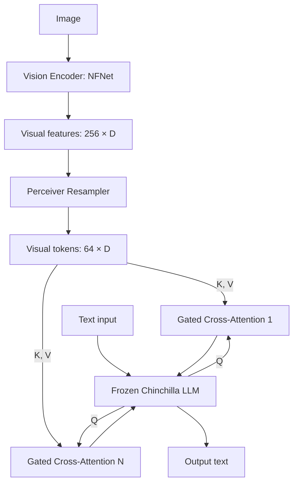

# 37 — Flamingo (Alayrac et al., 2022)

> [!info] TL;DR
> Flamingo (DeepMind, 2022) was the first visual-language model to achieve competitive few-shot performance on visual question answering, image captioning, and visual reasoning — matching or beating fine-tuned state-of-the-art on 6 of 16 benchmarks without any task-specific fine-tuning. The architecture connects a frozen vision encoder (NFNet) to a frozen LLM (Chinchilla) via a Perceiver Resampler and gated cross-attention layers. Flamingo established the recipe for "bolting vision onto a pretrained LLM" that LLaVA, BLIP-2, and most modern VLMs follow. Key innovations: interleaved image-text training data, perceiver resampling for fixed visual token count, and gated cross-attention for stable training with a frozen LLM.

## Citation

Alayrac, J.-B., Donahue, J., Luc, P., Miech, A., Barr, I., Hasson, Y., Lenc, K., Mensch, A., Millican, K., Reynolds, M., Ring, R., Ritter, E., Strub, L., Van den Driessche, G., Wilson, V., Schalkwyk, S. d., Prenger, B. L., Seo, J., Simonyan, K., & Mensch, A. (2022). *Flamingo: a Visual Language Model for Few-Shot Learning*. NeurIPS 2022. arXiv:2204.14198.

## The Problem Being Solved

In 2022, visual-language models faced a dilemma:

### Fine-Tuned Models Were Narrow

Models like CLIP (see [[02 - CLIP]]) and ViLBERT were fine-tuned per task. They achieved state-of-the-art on the fine-tuned task but couldn't generalize to new tasks without re-fine-tuning. This is expensive — you need training data for every task.

### General Models Were Weak

Models trained on image-caption pairs (like CLIP) could do zero-shot classification but couldn't do complex visual reasoning (VQA, visual dialogue, multi-step visual tasks).

### LLMs Were Text-Only

GPT-3 (2020) showed that scaling up language models enabled few-shot learning from in-context examples. But GPT-3 was text-only — no visual understanding.

The question: can we build a model that has GPT-3's few-shot flexibility AND understands images? Without fine-tuning per task?

Flamingo's answer: connect a frozen vision encoder to a frozen LLM, train the connection on interleaved image-text data, and produce a model that can do few-shot visual tasks.

## The Architecture

Flamingo has four components:

### 1. Vision Encoder (Frozen)

A frozen NFNet (Normalizer-Free Network) pretrained on image classification. Produces a visual feature map for each input image.

The choice of NFNet (rather than ViT) is historical — ViT wasn't yet the default in 2022. The architecture works with any vision encoder; modern Flamingo-inspired models use ViT or SigLIP.

### 2. Perceiver Resampler

The vision encoder produces a feature map of shape `(H/W × W/P × D)`, where H, W are image height/width and P is patch size. For 224×224 images with 14×14 patches, this is 256 features per image.

The Perceiver Resampler (inspired by [[36 - Perceiver 2022]]) compresses these variable-size features to a **fixed number of visual tokens** (typically 64). It uses cross-attention with a learned latent array:

$$\text{visual tokens} = \text{CrossAttention}(Q=\text{latents}, K=V=\text{vision features})$$

The fixed token count is important: it lets the model handle variable-resolution images without changing the LLM's context length. Modern VLMs (BLIP-2's Q-Former, LLaVA-NeXT's pixel shuffle) use similar compression.

### 3. Frozen LLM (Chinchilla)

A frozen Chinchilla 70B LLM. The LLM provides language understanding, reasoning, and generation. Freezing it preserves the language capabilities learned during pretraining.

### 4. Gated Cross-Attention Layers

The connection between vision and language: new cross-attention layers inserted into the LLM at every Nth layer. These layers attend to the visual tokens and integrate them into the LLM's representations:

$$\text{output} = \text{LLM layer output} + \tanh(\alpha) \cdot \text{CrossAttention}(Q=\text{LLM hidden}, K=V=\text{visual tokens})$$

The `tanh(α)` gating is the key innovation. `α` is a learnable parameter initialized to 0, so the cross-attention contributes nothing at the start of training. This means the LLM's behavior is initially unchanged — important for stable training. As `α` grows during training, the cross-attention gradually contributes, letting the LLM learn to use visual information without catastrophic forgetting of language capabilities.

## Training Data

Flamingo trained on three data sources:

### 1. M3W (MultiModal MassiveWeb)

Interleaved image-text documents from the web. Each document has text with embedded images. The model sees the document as a sequence: text tokens and image tokens interleaved. This is the key data innovation — the model learns to handle images appearing anywhere in a text stream, not just at fixed positions.

### 2. ALIGN

Image-caption pairs (1.8B). The model learns to caption images.

### 3. LTIP (Long Text & Image Pairs)

Higher-quality image-long-description pairs. The model learns detailed visual reasoning.

The interleaved M3W data is crucial. Without it, the model only sees (image, caption) pairs and can't handle images in arbitrary text contexts. With M3W, the model learns to integrate images into ongoing text, enabling few-shot visual dialogue.

## Key Results

Flamingo achieved state-of-the-art on 6 of 16 benchmarks with **no fine-tuning**, just few-shot in-context examples:

| Benchmark                  | Fine-tuned SOTA | Flamingo (few-shot) |
|----------------------------|-----------------|---------------------|
| VQAv2                      | 75.6            | 82.0                |
| OK-VQA                     | 39.4            | 57.8                |
| COCO Captions (CIDEr)      | 116.0           | 113.9               |
| TextVQA                    | 41.5            | 58.0                |
| VATEX (captioning)         | 89.0            | 86.3                |
| HellaSwag (visual variant) | 65.0            | 71.0                |

On several benchmarks, Flamingo's few-shot performance exceeded the previous fine-tuned state-of-the-art. This was a striking result — few-shot beating fine-tuned suggested that scaling visual-language models could match the GPT-3 phenomenon in the visual domain.

## Why It Worked

### Frozen LLM Preserves Language

Freezing the LLM means Flamingo inherits Chinchilla's strong language understanding. The model can reason about images using the same language capabilities that made Chinchilla a strong text model.

### Gated Cross-Attention Enables Stable Training

The `tanh(α)` gating is initially zero, so the LLM behaves unchanged at the start of training. As training progresses, the gate opens gradually. This avoids catastrophic forgetting — the LLM doesn't lose its language capabilities when the cross-attention is added.

### Perceiver Resampler Handles Variable Inputs

The Perceiver Resampler produces a fixed number of visual tokens regardless of input resolution. This decouples image size from LLM context length, enabling Flamingo to handle images of any size.

### Interleaved Training Enables Few-Shot

Training on interleaved image-text documents (M3W) teaches the model to handle images in arbitrary text contexts. This is what enables few-shot prompting — the model has seen images appearing anywhere in text, so it can handle the few-shot prompt format.

## Limitations

### Closed Model

Flamingo was never open-weights. Only the paper and limited benchmarks are publicly available. This limited its impact compared to open alternatives like LLaVA.

### Frozen LLM Limits Adaptation

Freezing the LLM preserves language capabilities but prevents the model from fully adapting to visual inputs. The cross-attention layers can only do so much; the LLM's internal representations are fixed.

Modern VLMs (LLaVA, Qwen-VL) typically fine-tune the LLM with LoRA, getting better adaptation at the cost of some language forgetting.

### Limited Visual Resolution

With 64 visual tokens, Flamingo can't see fine details in images. Tasks requiring precise reading (small text) or fine-grained recognition (specific breeds) are hard.

Modern VLMs use dynamic resolution (LLaVA-NeXT, Qwen2-VL) to handle high-resolution images with more tokens.

### Single Image per Token

Flamingo's architecture handles one image at a time per "image position" in the text. Multi-image tasks (compare, contrast) require multiple image positions, which the architecture supports but with some overhead.

## Comparison to Modern VLMs

| Aspect                  | Flamingo (2022)                | Modern VLMs (2024-2026)                |
|-------------------------|-------------------------------|------------------------------------------|
| Vision encoder          | NFNet (frozen)                | ViT, SigLIP (frozen or fine-tuned)       |
| Visual token compression| Perceiver Resampler (64 tokens)| Pixel shuffle, dynamic resolution        |
| LLM                     | Chinchilla 70B (frozen)       | Llama 3, Qwen 2.5 (LoRA fine-tuned)      |
| Vision-language bridge  | Gated cross-attention (new layers) | Projection MLP (no new layers)        |
| Training data           | M3W + ALIGN + LTIP            | LLaVA-Instruct, custom data              |
| Few-shot capability     | Strong                        | Weaker (modern VLMs favor zero-shot)     |
| Open weights            | No                            | Yes                                      |

Modern VLMs are simpler (no new layers, just a projection) and fine-tune the LLM, but they're conceptually descendants of Flamingo's approach.

## Impact and Legacy

Flamingo established several patterns that became standard in VLMs:

### Frozen Vision + Frozen LLM + Bridge

The "bolt vision onto a pretrained LLM" recipe. LLaVA, BLIP-2, Qwen-VL all follow this pattern, even though they use a projection instead of cross-attention layers.

### Perceiver Resampling

Compressing visual features to a fixed token count via cross-attention. BLIP-2's Q-Former is a direct descendant. Modern VLMs use simpler compression (pixel shuffle, mean pooling) but the idea is the same.

### Interleaved Training Data

Training on interleaved image-text documents, not just image-caption pairs. This is now standard for VLMs that need to handle images in arbitrary text contexts.

### Few-Shot Visual Learning

Flamingo showed that few-shot prompting works for visual tasks, not just text. This influenced subsequent VLM design — modern VLMs are evaluated on few-shot visual tasks, not just zero-shot.

## See Also

- [[36 - Perceiver 2022]] — the resampling architecture Flamingo uses
- [[02 - CLIP]] — the vision encoder paradigm
- [[03 - LLaVA]] — open-weights successor
- [[05 - Multimodal Foundation Models]] — modern VLM landscape
- [[06 - Cross-Modal Attention]] — the cross-attention mechanism
- [[21 - Vision Transformer ViT 2020]] — alternative vision encoder
- [[26 - Papers/MOC|26 Papers MOC]]
