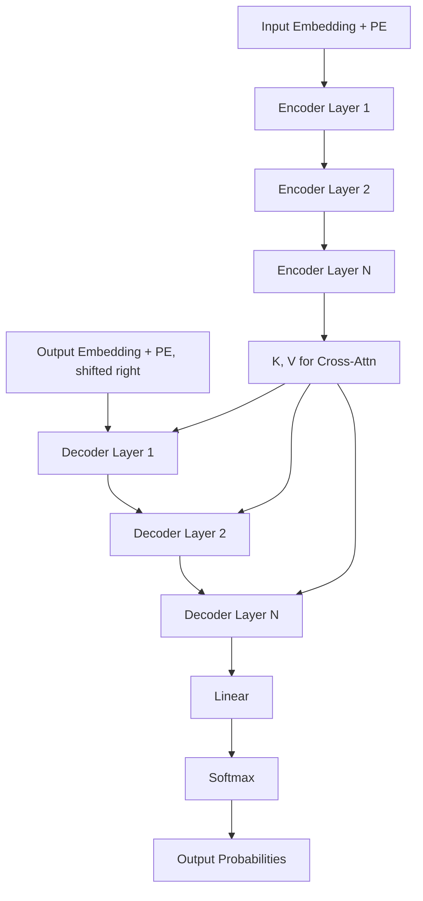

# 02 — Attention Is All You Need (Vaswani et al., 2017)

> [!info] TL;DR
> Vaswani et al. (2017) threw out the RNN entirely. They built a sequence model using only attention and feed-forward layers, with **multi-head self-attention** at its core. The result was the **Transformer** — the architecture behind GPT, BERT, T5, Llama, Claude, Gemini, and essentially every modern LLM. This is arguably the most influential neural architecture paper of the 2017–2025 era.

## Citation

Vaswani, A., Shazeer, N., Parmar, N., Uszkoreit, J., Jones, L., Gomez, A. N., Kaiser, Ł., & Polosukhin, I. (2017). *Attention Is All You Need*. NeurIPS 2017. arXiv:1706.03762.

## The Problem Being Solved

By 2017, attention-augmented RNNs ([[01 - Bahdanau Attention 2014|Bahdanau 2014]], [[03 - Luong Attention 2015|Luong 2015]]) had become the standard for NMT. They worked well but were constrained by the sequential nature of RNNs: each hidden state depended on the previous one, so training could not parallelize across the sequence. For long sentences and large corpora this was a serious throughput bottleneck.

The authors asked a provocative question: **what if attention itself is enough?** RNNs serve two purposes — they mix information across positions, and they introduce nonlinearity. Attention can do the first (and do it with arbitrary-length dependencies in O(1) path length), and feed-forward layers can do the second. Removing the recurrence gives full parallelism on GPUs.

The bet paid off. Transformers trained faster, scaled better, and produced higher-quality translations than the RNN baselines they replaced — and within five years they had spread to vision, audio, protein folding, and code generation.

## The Architecture

### Encoder
A stack of `N=6` identical layers. Each layer has two sublayers:
1. **Multi-head self-attention** over the source sequence.
2. **Position-wise feed-forward network** (a 2-layer MLP applied independently to each position).

Each sublayer is wrapped in a residual connection and followed by layer normalization: `output = LayerNorm(x + Sublayer(x))`. This is the **post-norm** formulation; later work (GPT-2, Llama) would switch to [[02 - Pre-Norm vs Post-Norm|pre-norm]] for training stability.

### Decoder
Also `N=6` identical layers, each with three sublayers:
1. **Masked multi-head self-attention** over the target prefix (causal mask prevents looking at future tokens).
2. **Encoder-decoder cross-attention** — queries from the decoder, keys and values from the encoder output. This is the Bahdanau-style attention mechanism retained from prior NMT.
3. **Position-wise feed-forward network.**

Same residual + LayerNorm wrapping.

### Multi-Head Attention
Instead of one attention operation with `d_model`-dimensional vectors, the model runs `h=8` attention "heads" in parallel, each with `d_k = d_v = d_model / h = 64` dimensions. The outputs are concatenated and linearly projected back to `d_model`:

```
MultiHead(Q, K, V) = Concat(head_1, ..., head_h) W^O
head_i = Attention(Q W_i^Q, K W_i^K, V W_i^V)
Attention(Q, K, V) = softmax(Q K^T / sqrt(d_k)) V
```

Multi-head attention lets the model attend to different relations simultaneously — one head might track syntactic dependencies, another coreference, another lexical similarity. See [[05 - Multi-Head Attention]].

### Scaled Dot-Product Attention
The scoring function is the dot product, scaled by `1/sqrt(d_k)`:

```
Attention(Q, K, V) = softmax(Q K^T / sqrt(d_k)) V
```

The scaling prevents the dot products from growing large in high dimensions, which would push softmax into regions with vanishing gradients. See [[04 - Self-Attention]] for the full derivation.

### Positional Encoding
Because attention is permutation-invariant, the model needs explicit position information. The paper uses **sinusoidal** encodings of dimension `d_model`:

```
PE(pos, 2i)   = sin(pos / 10000^{2i/d_model})
PE(pos, 2i+1) = cos(pos / 10000^{2i/d_model})
```

Different frequencies across dimensions let the model attend to relative positions via linear combinations. See [[07 - Sinusoidal and Learned Positional]] — modern LLMs typically use [[08 - RoPE|RoPE]] instead.



## Training Setup

- **Task**: English-to-German and English-to-French translation (WMT 2014).
- **Model sizes**: Base (65M params, d=512, 6 layers, 8 heads), Big (213M params, d=1024, 6 layers, 16 heads).
- **Optimizer**: Adam with a custom learning-rate schedule (`warmup_steps` then inverse sqrt decay).
- **Regularization**: Dropout (0.1), label smoothing (0.1).
- **Hardware**: 8 P100 GPUs; Base trained in 12 hours, Big in 3.5 days.

The training cost was a small fraction of prior RNN-based systems, which often took weeks. This efficiency was itself a major contribution — it made large-scale pretraining economically viable.

## Key Results

| Model                       | EN-DE BLEU | EN-FR BLEU | Training Cost |
|-----------------------------|------------|------------|---------------|
| Previous best (ensemble)    | 26.30      | 41.16      | —             |
| Transformer Base            | 27.3       | 38.1       | 3.3 PFLOPs-days |
| Transformer Big             | 28.4       | 41.0       | 2.3 PFLOPs-days |
| Transformer Big + checkpoint averaging | 28.4 | 41.8 | 2.3 PFLOPs-days |

The Big model set a new state of the art on EN-DE while using a fraction of the compute of prior systems. On EN-FR it matched the previous best with 1/4 the compute.

## Why It Worked

### Parallelism
Self-attention has no sequential dependency across positions. The encoder can process all positions in one matrix multiplication. This was the single biggest reason Transformers could scale to the data and parameter sizes that made LLMs possible.

### Path Length
In an RNN, the path from token `i` to token `j` has length `O(|i-j|)` — gradients must traverse that many recurrent steps. In self-attention the path length is `O(1)`. This dramatically improves gradient flow and makes long-range dependencies learnable.

### Expressivity
Multi-head attention is a universal sequence-mixing operator — it can implement convolution-like local patterns, global routing, and copy operations. Empirically, models trained on it generalize better than RNN-based variants.

### Hardware Alignment
Self-attention is essentially a sequence of large matrix multiplications, which map perfectly to GPU/TPU tensor cores. The architecture is *co-designed with the hardware it runs on* — a pattern that [[11 - FlashAttention|FlashAttention]] would later push further.

## Limitations of the Original Paper

- **Quadratic attention cost**: `O(n²)` memory and compute for sequence length `n`. The paper's experiments used ~50-token sentences, so this was not a problem; it became the central obstacle at long context. See [[12 - Sparse Attention]], [[13 - Linear Attention]], [[11 - FlashAttention]].
- **Post-norm instability**: training the original Transformer required careful warmup. Pre-norm ([[02 - Pre-Norm vs Post-Norm|pre-norm]]) made training much more stable and became the default.
- **Sinusoidal PE is weak**: it works but learned positional embeddings and especially [[08 - RoPE|RoPE]] gave better length generalization.
- **Encoder-decoder is overkill for many tasks**: GPT-2 would show that decoder-only is often sufficient and simpler.
- **No MoE**: every token goes through every parameter. [[15 - Mixture of Experts Transformer|MoE]] later added conditional computation for much larger effective model sizes.

## Impact and Legacy

It is hard to overstate the influence of this paper. The Transformer became the default architecture for:

- **NLP**: BERT (2018), GPT family (2018+), T5 (2019), Llama (2023+), Mistral, DeepSeek, Qwen.
- **Vision**: [[13 - Vision Transformer ViT|ViT]] (2020), Swin Transformer (2021), SAM (2023).
- **Multimodal**: CLIP, Flamingo, BLIP, LLaVA, Gemini.
- **Audio**: Whisper, Music Transformer.
- **Biology**: AlphaFold 2 (2020), ESMFold.
- **Code**: Codex, StarCoder, DeepSeek-Coder.
- **Diffusion**: [[DiT]] (2023), FLUX (2024).

Every major LLM company — OpenAI, Anthropic, Google DeepMind, Meta, Mistral, DeepSeek, Alibaba — builds on this architecture. The 2017 paper is the genetic ancestor of essentially all 2024–2026 frontier models.

## Further Reading

- Original paper: arXiv:1706.03762
- The Annotated Transformer (Harvard NLP) — line-by-line implementation in PyTorch.
- Karpathy's *nanoGPT* — minimal GPT-2 implementation that follows the same architecture.
- [[01 - Build Attention and Transformer From Scratch]] — implementation in this vault.

## See Also

- [[01 - Transformer Block]]
- [[04 - Self-Attention]]
- [[05 - Multi-Head Attention]]
- [[01 - Bahdanau Attention 2014]]
- [[07 - Sinusoidal and Learned Positional]]
- [[26 - Papers/MOC|Papers MOC]]
