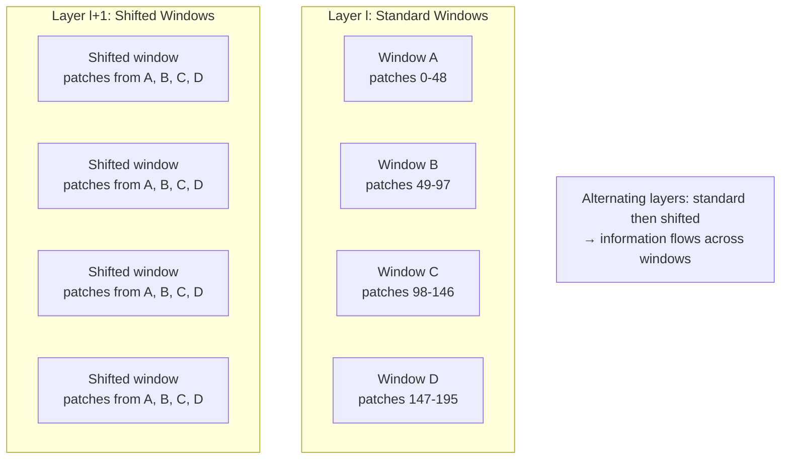

# 23 — Swin Transformer (Liu et al., 2021)

> [!info] TL;DR
> Swin Transformer introduced **shifted-window attention** — attention is computed within local windows, and the windows are shifted between layers so that information flows across window boundaries. Combined with a hierarchical architecture (patch merging reduces resolution as depth increases), Swin provides multi-scale features like CNNs while maintaining Transformer expressivity. Swin became the standard for dense vision tasks (detection, segmentation) where ViT's fixed resolution and lack of hierarchy were limitations.

## Citation

Liu, Z., Lin, Y., Cao, Y., Hu, H., Wei, Y., Zhang, Z., Lin, S., & Guo, B. (2021). *Swin Transformer: Hierarchical Vision Transformer using Shifted Windows*. ICCV 2021 (Best Paper). arXiv:2103.14030.

## The Problem Being Solved

[[21 - Vision Transformer ViT 2020|ViT]] (2020) showed that Transformers work for vision, but it had two limitations for dense prediction tasks (object detection, semantic segmentation):

1. **Fixed resolution**: ViT processes images at a single resolution (e.g., 224×224 → 14×14 patches). Dense prediction tasks require multi-scale features — coarse features for global context, fine features for localization. ViT's flat architecture doesn't provide this.

2. **Global attention cost**: ViT computes attention over all patches, which is O(N²) in the number of patches. For high-resolution images (e.g., 800×1333 for COCO detection), this is prohibitively expensive.

CNNs solve both problems via hierarchical architectures (ResNet, FPN) that produce features at multiple resolutions. Swin Transformer brings this hierarchical structure to Transformers, with a key innovation that enables local attention to flow across windows.

## The Key Ideas

### 1. Hierarchical Architecture via Patch Merging

Swin processes images in 4 stages, each reducing spatial resolution by 2× and doubling channel dimension:

| Stage | Resolution (224 input) | Channels | Patch size |
|-------|------------------------|----------|------------|
| 1     | 56×56                  | 96       | 4×4        |
| 2     | 28×28                  | 192      | (merge 2×2)|
| 3     | 14×14                  | 384      | (merge 2×2)|
| 4     | 7×7                    | 768      | (merge 2×2)|

The first stage splits the image into 4×4 patches and embeds them. Subsequent stages merge 2×2 neighboring patches (concatenate their features, project to 2× channels). This mirrors the downsampling in CNNs and provides multi-scale features for dense prediction.

### 2. Window-Based Self-Attention (W-MSA)

Instead of computing attention over all patches, Swin computes attention within local windows. For a stage with H×W patches and window size M×M, the number of patches per window is M², and the number of windows is (H/M) × (W/M). Attention cost per layer: O((H/M) × (W/M) × M⁴) = O(H × W × M²), linear in image size.

The window size M is typically 7. This gives attention over 49 patches per window — much cheaper than attention over all 784 patches (28×28) in stage 2.

### 3. Shifted Window Attention (SW-MSA)

Window attention has a problem: patches in different windows cannot communicate. Information is confined to windows, and there's no cross-window flow.

Swin solves this by shifting the windows between layers:
- Layer `l`: windows are at positions `(0, 0), (0, M), (M, 0), (M, M), ...`
- Layer `l+1`: windows are shifted by `(M/2, M/2)`, so they straddle the previous window boundaries.

With shifting, a patch in window A (layer `l`) is in a window that includes patches from windows A, B, C, D (layer `l+1`). Information flows across original window boundaries.

### 4. Cyclic Shift Implementation
Naive implementation of shifted windows is inefficient (the shifted windows at the edges are partial). Swin uses a clever trick: cyclically shift the feature map so that the shifted windows align with standard windows, compute attention, then cyclically shift back. This avoids partial windows and makes the implementation efficient.

### 5. Relative Position Bias
Swin adds a learned relative position bias to the attention scores: `Attention(Q, K, V) = softmax(Q K^T / sqrt(d) + B) V`, where `B` is a learned bias that depends on the relative position of the query and key within the window. This is similar to [[16 - Transformer-XL 2019|Transformer-XL]]'s relative positional encoding but applied to 2D vision patches.

The relative position bias is parameterized as a small learnable table (size `(2M-1) × (2M-1)` for window size M). It captures 2D spatial relationships (e.g., "attend to the token above-right") that are important for vision but not for text.

## Key Results

Swin Transformer achieved SOTA on ImageNet classification, COCO object detection, and ADE20K semantic segmentation:

| Task                          | Previous SOTA    | Swin Transformer |
|-------------------------------|------------------|------------------|
| ImageNet-1K (top-1)           | 88.5 (ViT-Huge)  | 87.3 (Swin-L)    |
| COCO detection (AP^box)       | 55.1             | 58.7 (Swin-L)    |
| ADE20K segmentation (mIoU)    | 48.4             | 53.5 (Swin-L)    |

The most striking results were on dense prediction (detection and segmentation): Swin outperformed previous SOTA by 3.6 and 5.1 points respectively. This was the first Transformer to clearly beat CNN-based methods (DetectoRS, SETR) on dense prediction, validating the hierarchical approach.

On ImageNet classification, Swin slightly underperformed ViT-Huge (which had more pretraining data), but it was much more efficient (similar accuracy with fewer parameters and FLOPs).

## Why It Worked

### Hierarchy Matches Dense Prediction
Dense prediction tasks require multi-scale features. Swin's hierarchical architecture (4 stages, each with half the resolution) provides this naturally, matching the structure of CNN feature pyramids (FPN, PAN). ViT's flat architecture doesn't.

### Shifted Windows Enable Cross-Window Flow
Without shifting, window attention is too local — each window is isolated, and the model cannot integrate information across the image. Shifting solves this elegantly: alternating layers with standard and shifted windows create cross-window connections while keeping attention local.

### Linear Complexity in Image Size
W-MSA is O(H × W × M²) — linear in image size. This makes Swin practical for high-resolution images (detection at 800×1333, segmentation at 512×2048), where ViT's O(H² W²) would be prohibitive.

### Relative Position Bias for 2D
The learned relative position bias captures 2D spatial relationships that are essential for vision. This generalizes better than absolute position embeddings, especially for variable image sizes.

## Limitations

### Fixed Window Size
The window size M is fixed at model design time. This means Swin cannot adaptively choose attention patterns based on content — the windows are the same regardless of what's in the image.

### Patch Merging Loses Information
The hierarchical downsampling (patch merging) loses spatial detail. For tasks requiring fine-grained localization (small object detection, boundary-aware segmentation), this can hurt. Modern variants (Swin-V2, CSWin) address this with adaptive merging or different window patterns.

### Complexity at Very High Resolution
While linear in image size, Swin's constant factors are still significant. For very high-resolution images (e.g., 4K satellite imagery), even Swin is expensive. Techniques like sparse attention or hierarchical dilated windows extend further.

### Replaced by Native-Resolution Approaches
NaViT (2023) and other native-resolution ViTs process images at their original resolution without fixed patch sizes. For some tasks, this is simpler and more effective than Swin's hierarchical approach.

## Successors

### Swin Transformer V2 (2022)
Improved scaling: larger window sizes, scaled cosine attention, log-spaced continuous position bias. Scaled to 3B parameters and achieved SOTA on more benchmarks.

### CSWin Transformer (2022)
Cross-shaped window attention: horizontal and vertical strips instead of square windows. Better global context with similar efficiency.

### BEiT (Microsoft, 2021)
Self-supervised pretraining for ViT-family models, including Swin. Showed that Swin can be pretrained without labels and match supervised performance.

### DINOv2 (Meta, 2023)
Self-supervised ViT pretraining at scale. Uses standard ViT (not Swin) but achieves SOTA on dense prediction, suggesting that with enough data, flat architectures can match hierarchical ones.

## Impact and Legacy

Swin Transformer's influence on computer vision:

1. **Standard for dense prediction**. Swin became the default backbone for object detection and semantic segmentation in 2022–2023. Most SOTA detection and segmentation models used Swin as the encoder.

2. **Hierarchical Transformers as a paradigm**. Swin showed that hierarchical architecture (multi-scale features) is valuable for Transformers, not just for CNNs. This influenced architectures in other domains (video, 3D, medical imaging).

3. **Shifted window as a technique**. The shifted-window idea (alternate local windows with shifted versions) appears in modified form in several subsequent architectures. The general principle — use local attention but ensure cross-window flow — became standard.

4. **Relative position bias for 2D**. Swin's relative position bias (a 2D learned table) influenced how vision Transformers handle position. Modern vision Transformers (NaViT, DINOv2) use RoPE-2D or similar relative encodings.

5. **Bridge to multimodal**. Swin's hierarchical features are used as visual encoders in some multimodal LLMs. The multi-scale features are particularly useful for tasks that require both global understanding and local detail (e.g., document understanding, chart reading).

For AI engineers working on vision tasks, Swin remains a strong choice for dense prediction. If you're doing object detection, semantic segmentation, or any task that benefits from multi-scale features, Swin (or its variants) is a standard option.

## Further Reading

- Original paper: arXiv:2103.14030
- Swin V2: arXiv:2111.09883
- CSWin: arXiv:2207.10224
- [[21 - Vision Transformer ViT 2020]] — the flat predecessor.

## See Also

- [[13 - Vision Transformer ViT]]
- [[21 - Vision Transformer ViT 2020]]
- [[15 - Sliding Window Attention]]
- [[18 - Longformer 2020]] — sliding window in NLP
- [[26 - Papers/MOC|Papers MOC]]
