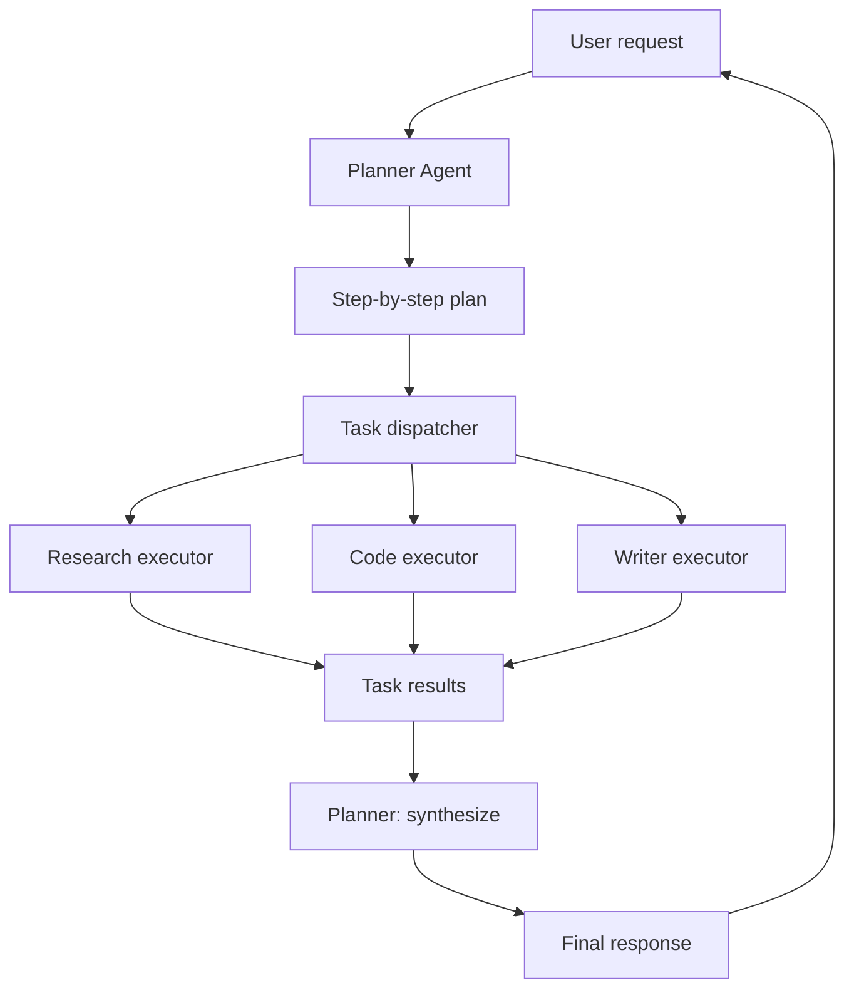

# 06 — Build a Multi-Agent System

> [!info] TL;DR
> Build a multi-agent system with a planner agent (decomposes tasks) and executor agents (specialized workers) in ~200 lines of Python. The planner creates a step-by-step plan, dispatches subtasks to specialized executors (research, code, write), and synthesizes results. This is the hierarchical multi-agent pattern used in production systems.

## Project Goals

By the end of this project, you will have built:
1. A planner agent that decomposes tasks into subtasks.
2. Specialized executor agents (research, code, write).
3. A task queue and dispatch system.
4. Result synthesis (the planner combines executor outputs).
5. Tracing and observability for the multi-agent flow.

The implementation uses OpenAI's API (or any OpenAI-compatible endpoint) and demonstrates the hierarchical pattern from [[04 - Enterprise Multi-Agent Architectures]].

## Architecture



## Prerequisites

```bash
pip install openai pydantic
```

## Step 1: Define the Agent and Task Types

```python
import openai
import json
from pydantic import BaseModel, Field
from typing import Optional

class SubTask(BaseModel):
    """A subtask in a multi-step plan."""
    id: str = Field(description="Unique task ID, e.g., 'task_1'")
    description: str = Field(description="What the subtask should accomplish")
    agent_type: str = Field(description="Which executor: 'research', 'code', or 'write'")
    dependencies: list[str] = Field(default=[], description="IDs of tasks that must complete first")

class Plan(BaseModel):
    """A plan decomposed into subtasks."""
    subtasks: list[SubTask]
    synthesis_instructions: str = Field(description="How to combine subtask results into the final answer")

class TaskResult(BaseModel):
    """The result of executing a subtask."""
    task_id: str
    success: bool
    output: str
    error: Optional[str] = None
```

## Step 2: The Planner Agent

The planner decomposes the user's request into subtasks.

```python
PLANNER_SYSTEM_PROMPT = """You are a planner agent. Your job is to decompose complex tasks into subtasks 
that can be executed by specialized agents.

Available executor types:
- research: for finding information, web search, fact-checking
- code: for writing, running, or debugging code
- write: for writing prose, summaries, explanations

Create a plan with 2-5 subtasks. Each subtask should:
1. Have a clear, specific description
2. Specify which executor type should handle it
3. List any dependencies (other subtasks that must complete first)

After the subtasks, provide synthesis instructions explaining how to combine 
the subtask results into a final answer.
"""

def plan_task(user_request: str, model: str = "gpt-4o-mini") -> Plan:
    """Use the planner to decompose the user's request."""
    response = openai.beta.chat.completions.parse(
        model=model,
        messages=[
            {"role": "system", "content": PLANNER_SYSTEM_PROMPT},
            {"role": "user", "content": f"Decompose this task: {user_request}"},
        ],
        response_format=Plan,
        temperature=0.2,
    )
    return response.choices[0].message.parsed
```

## Step 3: The Executor Agents

Each executor type has its own system prompt and capabilities.

```python
RESEARCH_PROMPT = """You are a research agent. Your job is to find information and answer factual questions.
- Provide accurate, well-sourced information
- If you're unsure, say so rather than guessing
- Cite sources when possible
- Be concise but complete
"""

CODE_PROMPT = """You are a code agent. Your job is to write, analyze, or debug code.
- Write clean, working code
- Include brief comments for non-obvious parts
- If debugging, explain the issue and the fix
- Use the appropriate language for the task
"""

WRITER_PROMPT = """You are a writing agent. Your job is to write clear, engaging prose.
- Adapt your style to the audience and purpose
- Be concise but complete
- Use structure (headings, lists) when helpful
- Proofread for clarity and grammar
"""

EXECUTORS = {
    "research": RESEARCH_PROMPT,
    "code": CODE_PROMPT,
    "write": WRITER_PROMPT,
}

def execute_subtask(subtask: SubTask, context: dict, model: str = "gpt-4o-mini") -> TaskResult:
    """Execute a subtask using the appropriate executor."""
    if subtask.agent_type not in EXECUTORS:
        return TaskResult(
            task_id=subtask.id,
            success=False,
            output="",
            error=f"Unknown agent type: {subtask.agent_type}"
        )
    
    # Build context from dependencies
    context_str = ""
    for dep_id in subtask.dependencies:
        if dep_id in context:
            context_str += f"\n\nResult from {dep_id}:\n{context[dep_id]}"
    
    user_message = f"""Task: {subtask.description}

Context from previous tasks:{context_str}

Please complete this task."""

    try:
        response = openai.chat.completions.create(
            model=model,
            messages=[
                {"role": "system", "content": EXECUTORS[subtask.agent_type]},
                {"role": "user", "content": user_message},
            ],
            temperature=0.3,
            max_tokens=1000,
        )
        
        return TaskResult(
            task_id=subtask.id,
            success=True,
            output=response.choices[0].message.content,
        )
    except Exception as e:
        return TaskResult(
            task_id=subtask.id,
            success=False,
            output="",
            error=str(e),
        )
```

## Step 4: The Dispatcher

The dispatcher manages the task queue, respecting dependencies.

```python
def dispatch_plan(plan: Plan, model: str = "gpt-4o-mini") -> dict:
    """Execute all subtasks in dependency order."""
    context = {}  # task_id -> output
    results = {}  # task_id -> TaskResult
    
    # Build dependency graph
    pending = {t.id: t for t in plan.subtasks}
    completed = set()
    
    max_iterations = len(plan.subtasks) * 2  # safety limit
    iteration = 0
    
    while pending and iteration < max_iterations:
        iteration += 1
        # Find tasks whose dependencies are all completed
        ready = [
            t for t in pending.values()
            if all(dep in completed for dep in t.dependencies)
        ]
        
        if not ready:
            # Deadlock: no task can proceed
            print(f"Deadlock! Pending tasks: {list(pending.keys())}")
            break
        
        # Execute ready tasks (could parallelize here)
        for task in ready:
            print(f"  Executing {task.id} ({task.agent_type}): {task.description[:50]}...")
            result = execute_subtask(task, context, model)
            results[task.id] = result
            
            if result.success:
                context[task.id] = result.output
                completed.add(task.id)
            else:
                print(f"  Task {task.id} failed: {result.error}")
                # Mark as completed to avoid deadlock, but with error context
                context[task.id] = f"[Task failed: {result.error}]"
                completed.add(task.id)
            
            del pending[task.id]
    
    return context
```

## Step 5: The Synthesizer

The planner combines subtask results into the final answer.

```python
SYNTHESIS_PROMPT = """You are a synthesis agent. Your job is to combine the results of multiple subtasks 
into a coherent final answer.

Guidelines:
- Integrate information from all subtask results
- Resolve any contradictions
- Present the answer clearly and completely
- Cite which subtask contributed which information
"""

def synthesize_results(user_request: str, plan: Plan, context: dict, 
                       model: str = "gpt-4o-mini") -> str:
    """Combine subtask results into the final answer."""
    context_str = ""
    for task in plan.subtasks:
        if task.id in context:
            context_str += f"\n\n--- {task.id} ({task.agent_type}) ---\n{context[task.id]}"
    
    user_message = f"""Original request: {user_request}

Synthesis instructions: {plan.synthesis_instructions}

Subtask results:{context_str}

Please synthesize these into a final answer."""

    response = openai.chat.completions.create(
        model=model,
        messages=[
            {"role": "system", "content": SYNTHESIS_PROMPT},
            {"role": "user", "content": user_message},
        ],
        temperature=0.3,
        max_tokens=1500,
    )
    
    return response.choices[0].message.content
```

## Step 6: The Orchestrator

Tie everything together with tracing.

```python
def run_multi_agent(user_request: str, model: str = "gpt-4o-mini") -> dict:
    """Run the full multi-agent pipeline."""
    trace = {
        "request": user_request,
        "steps": [],
    }
    
    # Step 1: Plan
    print("Planning...")
    plan = plan_task(user_request, model)
    trace["steps"].append({
        "step": "plan",
        "subtasks": [t.model_dump() for t in plan.subtasks],
    })
    print(f"Created plan with {len(plan.subtasks)} subtasks")
    
    # Step 2: Execute
    print("Executing...")
    context = dispatch_plan(plan, model)
    trace["steps"].append({
        "step": "execute",
        "context": context,
    })
    
    # Step 3: Synthesize
    print("Synthesizing...")
    final_answer = synthesize_results(user_request, plan, context, model)
    trace["steps"].append({
        "step": "synthesize",
        "final_answer": final_answer,
    })
    
    return {
        "answer": final_answer,
        "plan": plan,
        "context": context,
        "trace": trace,
    }

# Usage:
# result = run_multi_agent("Write a Python function to compute fibonacci numbers, 
#   explain how it works, and create documentation for it.")
# print(result["answer"])
```

## Example: Multi-Agent in Action

```python
# Example request that benefits from multi-agent decomposition
request = """
Build a simple REST API for a todo app:
1. Research best practices for REST API design
2. Write the Python code (using FastAPI)
3. Write API documentation
"""

result = run_multi_agent(request)
print("=== PLAN ===")
for task in result["plan"].subtasks:
    print(f"  {task.id} ({task.agent_type}): {task.description}")

print("\n=== FINAL ANSWER ===")
print(result["answer"])
```

## Extensions

Once the basic multi-agent system works, try:
1. **Parallel execution**: execute independent subtasks concurrently (using `asyncio` or `concurrent.futures`).
2. **Human-in-the-loop**: add approval steps for high-risk subtasks.
3. **Reflection**: let executors critique and revise their own outputs.
4. **Dynamic replanning**: if a subtask fails, let the planner create a new plan.
5. **Memory**: persist context across multiple user requests.
6. **Tool use**: give executors access to tools (web search, code execution).
7. **Visualization**: render the plan and execution as a graph.
8. **Streaming**: stream the synthesizer's output to the user as it's generated.

## Common Pitfalls

### Plans Too Granular or Too Coarse
If plans have too many subtasks, coordination overhead dominates. If too few, the multi-agent approach adds no value. Aim for 2–5 subtasks per plan.

### Dependency Deadlocks
If subtask A depends on B, and B depends on A, the dispatcher deadlocks. The planner should produce acyclic dependencies. The dispatcher includes a deadlock check.

### No Context Passing
If executors don't receive context from dependencies, they produce disconnected outputs. Always pass dependency results as context.

### Synthesizer Just Concatenates
The synthesizer should integrate, not just concatenate. Emphasize this in the synthesis prompt.

### No Error Handling
If a subtask fails and the system doesn't handle it, subsequent tasks may receive garbage context. Mark failed tasks and proceed with error context.

### No Tracing
Without traces, multi-agent bugs are impossible to debug. Log every step, every subtask, every result.

## Production Considerations

This minimal implementation is for learning. Production multi-agent systems add:
- **Async execution**: concurrent subtask execution for speed.
- **State persistence**: resume across sessions.
- **Observability**: distributed tracing (OpenTelemetry), metrics, audit logs.
- **Cost tracking**: per-subtask cost attribution.
- **Guardrails**: input/output validation for each agent.
- **Policy enforcement**: restrict which agents can call which tools.
- **Multi-tenancy**: isolate tenants' agents and context.

For production, use frameworks like LangGraph (see [[03 - LangGraph]]) or OpenAI Agents SDK (see [[06 - OpenAI SDK and Agents SDK]]).

## See Also

- [[01 - Build Attention and Transformer From Scratch]]
- [[02 - Build a Mini RAG Pipeline]]
- [[03 - Build a Mini Agent]]
- [[04 - Build a Mini MoE]]
- [[01 - Multi-Agent Architectures]]
- [[02 - Communication Patterns]]
- [[03 - Coordination and Consensus]]
- [[04 - Enterprise Multi-Agent Architectures]]
- [[03 - LangGraph]]
- [[27 - Projects/MOC|27 Projects MOC]]

## Production Hardening Checklist

1. **Typed messages**: use Pydantic models for inter-agent messages; reject untyped messages.
2. **Dead-letter queue**: failed messages go to a DLQ for inspection; don't silently drop.
3. **Idempotency keys**: every task carries an idempotency key; executors dedupe on it.
4. **Per-agent timeouts**: cap every executor at 60s; abort and re-plan on timeout.
5. **Concurrency limit**: cap parallel executors at 4–8; too many parallel calls overwhelm downstream tools.
6. **Result validation**: every executor result validated against a schema; reject and re-execute on mismatch.
7. **Tracing**: every agent message carries a `trace_id`; visualize in LangSmith / Langfuse.
8. **Cost tracking**: per-agent token cost; alert if total cost >$X per task.
9. **Checkpointing**: persist plan + completed subtasks; resume on failure.
10. **Replanning on failure**: if an executor fails 3x, the planner re-plans around the failed subtask.
11. **Human-in-the-loop**: for sensitive subtasks (e.g., code deployment), require human approval before executor runs.
12. **Observability dashboard**: per-agent task queue depth, latency, error rate, cost.

## Modern Developments (2024–2026)

### LangGraph Becomes the Standard
LangGraph (LangChain's graph-based agent framework) is the 2025–2026 default for multi-agent systems in Python. It supports stateful agents, branching, parallel execution, human-in-the-loop, and persistent state. Alternatives: OpenAI Agents SDK (simpler, OpenAI-only), AutoGen (Microsoft, research-focused), CrewAI (role-based, simpler). See [[25 - Frameworks and Tools/Agent Frameworks/03 - LangGraph]].

### Agent Communication via Structured Messages
The early "free-form text between agents" pattern is dead. Modern multi-agent systems use **structured messages**: typed payloads (Pydantic models) with clear semantics. The planner emits `SubTask` objects; executors emit `SubTaskResult` objects. This eliminates parsing failures and enables schema validation.

### Swarm Patterns (OpenAI Swarm, CrewAI)
An alternative to hierarchical planner-executor is the **swarm** pattern: agents hand off tasks to each other based on specialization. A `triage_agent` routes to `billing_agent` or `tech_support_agent` based on the query. Each agent can hand off back to triage or to another specialist. Simpler than hierarchical for customer service / routing use cases.

### Long-Running Multi-Agent Systems
Multi-day agent tasks (research, code migration) require: (1) **Checkpointing** — save state every N minutes; resume on crash. (2) **Async execution** — agents run as background jobs, not blocking the user. (3) **Human-in-the-loop checkpoints** — pause at key milestones for human review. (4) **Cost monitoring** — abort if cost exceeds budget. (5) **Audit log** — every agent decision logged for post-hoc review.

### Agent Coordination via Blackboard Pattern
For complex tasks with shared state, the **blackboard** pattern (from classic AI) is back: a shared workspace where agents post findings, claims, and hypotheses. Other agents read and respond. The blackboard enforces consistency (no two agents can contradict without a resolution step). Useful for collaborative research, design, and analysis tasks.

## Interview Questions

1. **Q: When would you use a multi-agent system instead of a single agent?**
   A: Use multi-agent when: (1) the task decomposes into specialized roles (research, code, write) — specialization beats generalization. (2) Context limits matter — each agent has its own context window, avoiding the single-agent context overflow. (3) Parallelism helps — independent subtasks run concurrently. (4) Different models for different roles — cheap model for routing, expensive model for synthesis. Avoid multi-agent when: (1) the task is simple (a single agent handles it in one tool call). (2) Latency is critical (multi-agent has coordination overhead). (3) Debugging complexity is a concern (multi-agent traces are harder to follow).

2. **Q: How do you prevent the planner from generating an unrealistic plan?**
   A: (1) **Plan schema validation** — require each subtask to have a clear objective, executor type, and success criteria. (2) **Plan critic** — a separate agent reviews the plan for feasibility before execution. (3) **Step-by-step execution with replanning** — execute one subtask, observe the result, then decide the next subtask (don't pre-commit to all subtasks). (4) **Cost estimation** — estimate per-subtask cost before execution; abort if total exceeds budget. (5) **Plan templates** — for common task types, use a pre-validated template; only free-form plan for novel tasks.

3. **Q: How do you handle executor failures in a multi-agent system?**
   A: Layered strategy: (1) **Retry** — transient failures (network, rate limit) retry 3x with backoff. (2) **Alternative executor** — if `code_executor` fails, try `code_executor_v2` or a different model. (3) **Replanning** — if a subtask fails irrecoverably, return to planner with the failure context; planner generates a new plan around the failed subtask. (4) **Graceful degradation** — if all retries fail, return partial results with a clear "incomplete" flag. (5) **Dead-letter queue** — failed tasks go to DLQ for human review; don't silently lose them.

4. **Q: How do you debug a multi-agent system?**
   A: (1) **Tracing** — every agent message carries a `trace_id`; visualize in LangSmith / Langfuse. (2) **Replay** — record all agent messages; replay offline to reproduce issues. (3) **Per-agent metrics** — latency, error rate, cost per agent; spot the bottleneck. (4) **Message inspection** — inspect every inter-agent message for correctness (was the planner's plan well-formed? was the executor's result valid?). (5) **A/B testing** — run the same task with different planner/executor configs; compare outcomes.

5. **Q: How do you handle agent coordination (avoiding conflicts)?**
   A: Depends on the pattern: (1) **Hierarchical (planner-executor)** — no conflicts; planner sequences and dispatches. (2) **Parallel** — ensure subtasks are independent; if not, run sequentially or use a shared state mediator. (3) **Blackboard** — agents post claims; a consistency checker resolves conflicts before any agent acts on them. (4) **Negotiation** — for resource conflicts (two agents want the same tool), use a bidding protocol; highest-priority bid wins.

6. **Q: How do you evaluate a multi-agent system?**
   A: Three layers: (1) **Per-agent metrics** — each agent has its own success criteria (planner: plan completeness; executor: task success rate). (2) **End-to-end metrics** — task completion rate, total cost, total latency, user satisfaction. (3) **Coordination metrics** — number of replans, number of conflicts, message overhead. Compare against a single-agent baseline to justify the multi-agent complexity.

## Connection to Other Concepts

- [[16 - Multi-Agent Systems/MOC]] — the parent chapter.
- [[16 - Multi-Agent Systems/Architectures/01 - Multi-Agent Architectures]] — architecture patterns.
- [[16 - Multi-Agent Systems/Communication/02 - Communication Patterns]] — message patterns.
- [[16 - Multi-Agent Systems/Coordination/03 - Coordination and Consensus]] — coordination protocols.
- [[16 - Multi-Agent Systems/Enterprise/04 - Enterprise Multi-Agent Architectures]] — production patterns.
- [[25 - Frameworks and Tools/Agent Frameworks/03 - LangGraph]] — LangGraph implementation.
- [[25 - Frameworks and Tools/Agent Frameworks/09 - AutoGen]] — AutoGen alternative.
- [[25 - Frameworks and Tools/Agent Frameworks/10 - CrewAI]] — CrewAI alternative.
- [[15 - AI Agents/Autonomy/08 - Autonomous Agent Lifecycles]] — long-running multi-agent.
- [[15 - AI Agents/Autonomy/09 - Human-in-the-Loop Patterns]] — HiTL in multi-agent.
- [[27 - Projects/Mini-Projects/03 - Build a Mini Agent]] — single-agent foundation.
