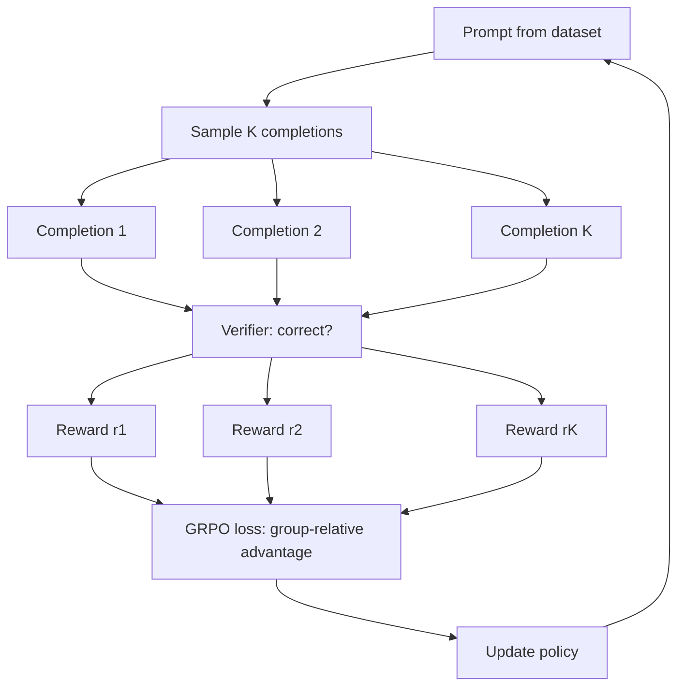

# 07 — Build a Reasoning Model Fine-Tune (GRPO with Verifiable Rewards)

> [!info] TL;DR
> Build a reasoning model fine-tune using **GRPO** (Group Relative Policy Optimization) with verifiable rewards — the recipe used by DeepSeek-R1 and similar open reasoning models. Given a base instruct model and a dataset of prompts with verifiable answers (math problems, coding tasks), the trainer generates multiple completions per prompt, scores each with a deterministic verifier (correct answer, passing tests), and updates the policy using the relative advantage within each group. This produces a model that "thinks" before answering — emitting chain-of-thought traces that improve accuracy on hard reasoning tasks.

## Project Goals

By the end of this project, you will have built:

1. A dataset of prompts with verifiable answers (math, code, logical reasoning).
2. A deterministic verifier that scores completions as correct or incorrect.
3. A multi-sample generation pipeline (K samples per prompt).
4. A GRPO loss function with group-relative advantage.
5. A training loop using PPO-style clipped updates.
6. An evaluation harness measuring pass@K before and after training.

The implementation uses HuggingFace `transformers` + `trl` (or custom training code) and demonstrates the open-weights reasoning recipe from [[12 - DeepSeek-R1 2025]].

## Why GRPO?

Standard RLHF (see [[05 - RLHF with PPO]]) uses a learned reward model trained on human preferences. The reward model scores completions, and PPO updates the policy to maximize the reward. This works for subjective tasks (helpfulness, harmlessness) but has two problems for reasoning:

1. **Reward hacking**: the policy learns to game the reward model rather than actually reason. The reward model is imperfect; the policy finds inputs that score high without being correct.
2. **Reward model cost**: training the reward model requires additional preference data and a separate training phase.

GRPO sidesteps both issues by using **verifiable rewards** — a deterministic function that checks whether the completion is actually correct. For math: parse the final answer and compare to the ground truth. For code: run the unit tests. For logical reasoning: check the conclusion against the known answer.

The verifier is perfect by construction (it's the ground truth). No reward model needed. No reward hacking possible (the verifier can't be gamed without producing a correct answer).

The "group relative" part: instead of using a learned value function (as in PPO), GRPO computes the advantage of each completion **relative to its group** (the K samples from the same prompt). This removes the need for a value network, simplifying the training setup.

## Architecture



## Prerequisites

```bash
pip install torch transformers accelerate vllm
# Optional: TRL for PPO utilities
pip install trl
```

You'll need a GPU (or multi-GPU setup) with enough memory to run the policy model and generate K samples per prompt in parallel. For a 7B model, an A100 80GB is sufficient.

## Step 1: The Dataset

A reasoning dataset is a list of (prompt, answer) pairs where the answer is verifiable. Use existing datasets like GSM8K (math), MATH (harder math), or HumanEval (code).

```python
from datasets import load_dataset

# GSM8K: grade-school math problems with numeric answers
ds = load_dataset("gsm8k", "main", split="train")

def format_prompt(example):
    return {
        "prompt": f"Solve the following problem. Show your reasoning, then end with 'Answer: <number>'.\n\nProblem: {example['question']}\n",
        "answer": example["answer"].split("#### ")[-1].strip(),  # extract numeric answer
    }

dataset = ds.map(format_prompt, remove_columns=ds.column_names)
```

The key property: the answer is **deterministically extractable** from the completion. The verifier will look for `Answer: <number>` and compare to the ground truth.

## Step 2: The Verifier

The verifier takes a completion and the ground-truth answer, and returns 1.0 (correct) or 0.0 (incorrect). For math:

```python
import re

def verify_math(completion: str, ground_truth: str) -> float:
    """Extract the final answer and compare to ground truth."""
    # Look for "Answer: <number>" pattern
    match = re.search(r"Answer:\s*([\d,\.\-]+)", completion)
    if not match:
        return 0.0  # no answer found
    extracted = match.group(1).replace(",", "")
    try:
        extracted_num = float(extracted)
        gt_num = float(ground_truth.replace(",", ""))
        return 1.0 if abs(extracted_num - gt_num) < 1e-3 else 0.0
    except ValueError:
        return 0.0
```

For code, the verifier would run the completion's code against unit tests:

```python
def verify_code(completion: str, test_cases: list) -> float:
    """Extract the code, run tests, return pass rate."""
    code = extract_code_block(completion)
    try:
        # Execute in a sandbox (Docker, subprocess with limits)
        result = run_in_sandbox(code, test_cases)
        return result.pass_rate
    except Exception:
        return 0.0
```

For logical reasoning, you might use exact-match or semantic similarity to a known answer. The verifier must be **deterministic** — the same completion always gets the same reward.

## Step 3: Multi-Sample Generation

For each prompt, generate K completions using the current policy:

```python
import torch
from vllm import LLM, SamplingParams

llm = LLM(model="Qwen/Qwen2.5-7B-Instruct")

def generate_samples(prompts: list[str], K: int = 8) -> list[list[str]]:
    """Generate K samples per prompt."""
    sampling_params = SamplingParams(
        n=K,
        temperature=0.7,  # need diversity
        top_p=0.95,
        max_tokens=512,
    )
    outputs = llm.generate(prompts, sampling_params)
    return [[o.text for o in output.outputs] for output in outputs]
```

The temperature must be > 0 to get diverse samples. K=8 is a common choice; higher K gives more reliable advantage estimates but costs more compute.

## Step 4: The GRPO Loss

GRPO computes the advantage of each completion relative to its group:

```python
def grpo_advantages(rewards: list[float]) -> list[float]:
    """Compute group-relative advantages."""
    mean = sum(rewards) / len(rewards)
    std = (sum((r - mean) ** 2 for r in rewards) / len(rewards)) ** 0.5
    # Normalize; add epsilon for numerical stability
    return [(r - mean) / (std + 1e-8) for r in rewards]
```

The advantage of completion $i$ is:
$$A_i = \frac{r_i - \bar{r}}{\sigma_r + \epsilon}$$

where $\bar{r}$ and $\sigma_r$ are the mean and std of rewards within the group.

The GRPO loss is similar to PPO's clipped objective, but with the group-relative advantage:

```python
def grpo_loss(
    log_probs_new: torch.Tensor,  # log p(c_i | prompt) under current policy
    log_probs_old: torch.Tensor,  # log p(c_i | prompt) under policy at sample time
    advantages: torch.Tensor,     # group-relative advantages
    clip_epsilon: float = 0.2,
    beta: float = 0.04,           # KL penalty coefficient
    ref_log_probs: torch.Tensor = None,  # log p under reference (frozen) policy
) -> torch.Tensor:
    """GRPO clipped loss with KL penalty to reference policy."""
    ratio = torch.exp(log_probs_new - log_probs_old)
    clipped_ratio = torch.clamp(ratio, 1 - clip_epsilon, 1 + clip_epsilon)
    surrogate = torch.min(ratio * advantages, clipped_ratio * advantages)
    
    # KL penalty to reference (prevents drift from base model)
    if ref_log_probs is not None:
        kl = log_probs_new - ref_log_probs
        return -surrogate.mean() + beta * kl.mean()
    return -surrogate.mean()
```

The KL penalty to the reference (frozen base model) keeps the policy from drifting too far. This is important for stability — without it, the policy can collapse to degenerate outputs that game the verifier.

## Step 5: The Training Loop

```python
import torch.nn.functional as F
from torch.optim import AdamW

model = ...  # load base instruct model
ref_model = ...  # frozen copy of base model
optimizer = AdamW(model.parameters(), lr=1e-6)

K = 8  # samples per prompt
batch_size = 4  # prompts per batch

for epoch in range(num_epochs):
    for batch in dataloader.batch(batch_size):
        prompts = batch["prompt"]
        answers = batch["answer"]
        
        # 1. Generate K samples per prompt
        with torch.no_grad():
            completions = generate_samples(prompts, K=K)
            log_probs_old = compute_log_probs(model, prompts, completions)
            ref_log_probs = compute_log_probs(ref_model, prompts, completions)
        
        # 2. Score with verifier
        rewards = []
        for prompt_completions, gt in zip(completions, answers):
            group_rewards = [verify_math(c, gt) for c in prompt_completions]
            rewards.append(group_rewards)
        
        # 3. Compute group-relative advantages
        advantages = [grpo_advantages(r) for r in rewards]
        advantages_tensor = torch.tensor(advantages).flatten()
        
        # 4. Update policy
        for inner_step in range(4):  # multiple update steps per batch
            log_probs_new = compute_log_probs(model, prompts, completions)
            loss = grpo_loss(
                log_probs_new, log_probs_old, advantages_tensor,
                ref_log_probs=ref_log_probs,
            )
            optimizer.zero_grad()
            loss.backward()
            torch.nn.utils.clip_grad_norm_(model.parameters(), max_norm=1.0)
            optimizer.step()
            
            # Update log_probs_old for next inner step
            log_probs_old = log_probs_new.detach()
```

The `compute_log_probs` function computes the log probability of each completion under the model. This is the standard teacher-forcing computation: feed the prompt + completion through the model, take the log-softmax of the logits at each position, gather the log-probs of the actual tokens.

## Step 6: Evaluation

Measure pass@K (the fraction of problems solved within K attempts) before and after training:

```python
def evaluate_pass_at_k(model, dataset, K=8):
    """Pass@K: fraction of problems with at least one correct in K samples."""
    prompts = dataset["prompt"]
    answers = dataset["answer"]
    completions = generate_samples(prompts, K=K)
    
    solved = 0
    for prompt_completions, gt in zip(completions, answers):
        if any(verify_math(c, gt) > 0.5 for c in prompt_completions):
            solved += 1
    return solved / len(prompts)
```

Run this before training (baseline) and after training (improved). A successful GRPO run typically improves pass@1 by 5-15 percentage points and pass@8 by 2-5 percentage points on math benchmarks.

## Common Pitfalls

### Reward Hacking on the Verifier

If the verifier is too lenient (e.g., accepts "Answer: 42" for any math problem), the policy learns to output "Answer: 42" for everything. Make the verifier strict: it must check the actual answer, not just the format.

### KL Drift

Without the KL penalty to the reference model, the policy can drift into degenerate outputs. The KL coefficient `beta` typically ranges from 0.001 to 0.1. Too high: the policy can't move; too low: the policy collapses.

### Insufficient Diversity

If temperature is too low, all K samples are similar, and the group-relative advantage is near zero. Use temperature 0.7+ for math, 0.9+ for code.

### Catastrophic Forgetting

The policy may improve on reasoning but degrade on other tasks (general chat, instruction following). To mitigate: mix in non-reasoning data during training, or use a small learning rate and short training duration.

### Memory Pressure

Generating K completions per prompt with vLLM is memory-intensive. For long completions (1K+ tokens), K=8 can OOM. Reduce K or use a smaller batch size.

## Production Extensions

### LoRA Fine-Tuning

For smaller compute budgets, fine-tune with LoRA instead of full-parameter updates. LoRA adapters can achieve most of the gains with 10x less compute:

```python
from peft import LoraConfig, get_peft_model

lora_config = LoraConfig(
    r=64, lora_alpha=128, lora_dropout=0.05,
    target_modules=["q_proj", "v_proj", "k_proj", "o_proj", "gate_proj", "up_proj", "down_proj"],
    task_type="CAUSAL_LM",
)
model = get_peft_model(model, lora_config)
```

### Multi-Verifier Ensembles

For tasks without a single ground truth (e.g., open-ended reasoning), use an ensemble of verifiers: a rule-based checker, an LLM-as-judge, and a human spot-check. Combine their scores weighted by reliability.

### Curriculum Learning

Start training with easy problems (high pass rate) and gradually increase difficulty. This is more stable than starting with hard problems (where the advantage signal is noisy because most samples fail).

### Process Reward Models

Instead of rewarding only the final answer, train a process reward model to score intermediate reasoning steps. This produces finer-grained credit assignment but requires annotated step-level data.

## See Also

- [[12 - DeepSeek-R1 2025]] — the paper this recipe is based on
- [[05 - RLHF with PPO]] — standard RLHF (with learned reward model)
- [[04 - DPO Derivation]] — alternative preference-based fine-tuning
- [[03 - Reasoning Models]] — overview of reasoning model approaches
- [[06 - Test-Time Compute Scaling]] — the inference-time paradigm this enables
- [[05 - Build a Tiny LLM Trainer]] — simpler training loop for context
- [[27 - Projects/MOC|27 Projects MOC]]

## Production Hardening Checklist

1. **Verifier determinism**: verifiers must be deterministic — same input → same reward. Non-deterministic verifiers cause training instability.
2. **Sample budget per prompt**: cap at 4–16 samples per prompt; more samples = better advantage estimate but higher cost.
3. **KL penalty**: add a KL penalty to the reference policy (β=0.04 in DeepSeek-R1) to prevent the model from drifting too far.
4. **Importance sampling correction**: when using old samples for multiple gradient steps, apply importance sampling correction (PPO-style) to avoid bias.
5. **Gradient clipping at 1.0**: RL training is more prone to gradient spikes than SFT; aggressive clipping is essential.
6. **Checkpoint every 100 steps**: RL training can diverge quickly; frequent checkpointing enables rollback.
7. **Reward hacking detection**: monitor for sudden reward spikes without quality improvement (model found an exploit). Auto-pause and alert.
8. **Format rewards**: separate the format reward ("did the model use <think>...</think><answer>...</answer>?") from the answer reward ("is the answer correct?"). Train format first.
9. **Sample diversity**: use temperature 0.7–1.0 for sampling during training; lower temperature reduces diversity and hurts advantage estimation.
10. **Eval during training**: run a held-out eval set every 100 steps; track AIME, MATH, GSM8K pass@1 to detect reward hacking.

## Common Failure Modes — Diagnostic Table

| Symptom                                | Likely Cause                                  | Fix                                                          |
|----------------------------------------|-----------------------------------------------|--------------------------------------------------------------|
| Reward spikes to 1.0                   | Reward hacking — model found an exploit       | Pause training; inspect samples; tighten verifier            |
| Model produces wrong format            | Format reward too low; or no format reward    | Increase format reward weight; add format-only warmup phase  |
| Quality drops after initial improvement| KL penalty too low; model drifted             | Increase β (KL coefficient); revert to earlier checkpoint    |
| Training is unstable                   | LR too high for RL                            | Lower LR to 1e-6; add gradient clipping at 0.5               |
| Verifier is slow                       | Code execution in sandbox is expensive        | Cache verification results; batch verifications              |
| Same answer for all samples            | Sampling temperature too low                  | Increase to 0.7+; check top_p                                |
| Loss is NaN                            | KL divergence overflow                        | Lower LR; add epsilon to KL computation; use bf16            |
| Model generates too long               | No length penalty                             | Add length penalty to reward; cap max_tokens at 4096         |

## Modern Developments (2024–2026)

### DeepSeek-R1 (2025) Open Recipe
DeepSeek-R1 (January 2025) published the first open recipe for reasoning model training: (1) cold-start SFT on thousands of long-CoT examples, (2) GRPO with verifiable rewards (math, code) + rule-based rewards (format), (3) rejection sampling + SFT on the best RL samples, (4) second-stage GRPO for safety/alignment. The recipe is fully reproducible and started the open reasoning model wave.

### Verifiable Rewards vs Learned PRMs
Verifiable rewards (deterministic checkers for math/code) have replaced learned PRMs in modern reasoning training — they're immune to reward hacking and don't require expensive annotation. PRMs (Lightman 2023) are still useful for non-verifiable domains (writing quality, helpfulness) but are being replaced by LLM-as-judge rewards in those cases.

### Test-Time Compute Scaling
Reasoning models scale with test-time compute (more thinking tokens = better answers). This is the inference-time analog of training scaling laws. Production deployments budget for test-time compute: ~1000–10000 thinking tokens per query for hard problems, ~100–500 for easy ones. See [[24 - Research Frontiers/Reasoning/06 - Test-Time Compute Scaling]].

### Distillation from Reasoning Models
Once a reasoning model is trained, its outputs can be used to distill the reasoning capability into a smaller model via SFT. DeepSeek-R1-Distill models (1.5B–70B) achieve reasoning quality close to the full R1 model at a fraction of the cost. This is the standard pattern: train one big reasoning model, distill into many smaller ones.

### Multi-Modal Reasoning
2025 saw the first multimodal reasoning models (math with diagrams, code with screenshots). The recipe extends: add image tokens to the context, use a VLM as the base model, train with multimodal verifiable rewards (e.g., "solve this geometry problem given the diagram").

## Interview Questions

1. **Q: Why GRPO instead of PPO for reasoning model training?**
   A: GRPO (Group Relative Policy Optimization) eliminates the learned value function that PPO requires. Instead of estimating per-token value, GRPO samples N responses per prompt and uses the group-relative advantage (reward - mean(group rewards)) as the advantage estimate. This is simpler (no value network to train), more stable (no bootstrapping errors), and works well when rewards are sparse (only at end of response). DeepSeek-R1 demonstrated GRPO is sufficient for state-of-the-art reasoning.

2. **Q: What's the role of the cold-start SFT phase?**
   A: Without cold-start, the base model has no concept of long CoT reasoning — it just outputs answers directly. GRPO from a base model fails because all samples are short (no reasoning), so there's no signal. Cold-start SFT on thousands of high-quality long-CoT examples teaches the model the reasoning format (<think>...</think><answer>...</answer>). Once the model can produce reasoning, GRPO has signal to optimize.

3. **Q: How do you prevent reward hacking in verifiable rewards?**
   A: (1) **Verifier determinism** — same input must always produce same reward. (2) **Verifier robustness** — code verifier must use the same environment (Python version, libraries) as eval. (3) **Format-first training** — train format rewards first, then add answer rewards; this prevents the model from finding format exploits. (4) **Reward curve monitoring** — sudden reward spikes without quality improvement signal hacking. (5) **Periodic eval on held-out set** — track real quality (AIME, MATH) to detect reward/quality divergence. (6) **Verifier versioning** — when you fix a verifier bug, re-evaluate all checkpoints.

4. **Q: Why are verifiable rewards better than learned PRMs for reasoning?**
   A: Three reasons. (1) **No reward hacking** — a deterministic math checker can't be tricked; a learned PRM can be fooled by plausible-looking but wrong reasoning. (2) **No annotation cost** — verifiers are code, not human-labeled data. (3) **Perfect calibration** — verifier reward = ground truth quality; PRM rewards are noisy. Learned PRMs are still useful for non-verifiable domains (writing, helpfulness) but for math/code, verifiable rewards win.

5. **Q: How do you handle very long reasoning traces (10k+ tokens)?**
   A: (1) **Max length cap** — typically 8192–32768 tokens; longer = expensive and diminishing returns. (2) **Length penalty** — add -0.001 * length to reward to discourage rambling. (3) **Truncation** — if model exceeds max length, treat as wrong answer. (4) **KV cache management** — at inference, use PagedAttention (vLLM) for efficient long-context generation. (5) **Compression** — train the model to use structured formats (markdown, numbered steps) which are more token-efficient than prose.

6. **Q: How would you deploy a reasoning model in production?**
   A: (1) **Test-time compute budgeting** — budget N thinking tokens per query; cap based on user tier. (2) **Streaming** — stream thinking tokens to the user for transparency. (3) **Early termination** — if the model emits <answer> early, stop generation. (4) **Caching** — cache answers for common questions (especially math problems). (5) **Fallback** — for easy queries, route to a non-reasoning model (cheaper, faster); use reasoning model only for hard queries. (6) **Monitoring** — track thinking token count distribution, answer correctness on sampled queries, user satisfaction.

## Connection to Other Concepts

- [[26 - Papers/2024-2026/12 - DeepSeek-R1 2025]] — the paper this recipe is based on.
- [[26 - Papers/Alignment/50 - Process Reward Models 2023]] — PRM alternative to verifiable rewards.
- [[24 - Research Frontiers/Reasoning/06 - Test-Time Compute Scaling]] — test-time compute paradigm.
- [[09 - Foundation Models/Reasoning Models/03 - Reasoning Models]] — reasoning model overview.
- [[12 - Fine-Tuning/RLHF/05 - RLHF with PPO]] — PPO alternative (more complex).
- [[12 - Fine-Tuning/DPO/04 - DPO Derivation]] — DPO alternative (simpler, less suited for reasoning).
- [[27 - Projects/Implementations/05 - Build a Tiny LLM Trainer]] — base training.
- [[27 - Projects/Capstones/19 - Build a Fine-Tuning Pipeline with LoRA and DPO]] — SFT+DPO alternative pipeline.
- [[15 - AI Agents/Reasoning/02 - Chain-of-Thought]] — CoT foundation.
- [[03 - Machine Learning/Reinforcement Learning/10 - PPO Deep Treatment]] — PPO theory.
