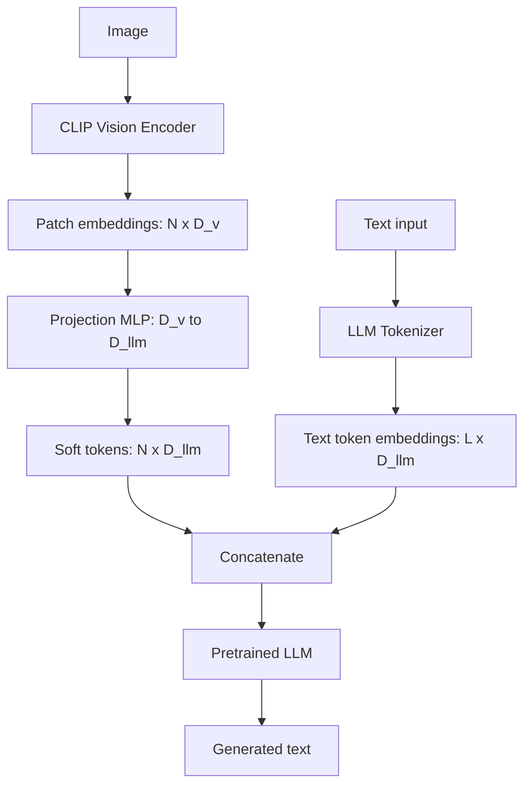

# 10 — Build a Vision-Language Model (LLaVA-style)

> [!info] TL;DR
> Build a vision-language model (VLM) by bolting a pretrained vision encoder (CLIP/SigLIP) onto a pretrained LLM. The recipe: take a CLIP visual encoder, pass images through it to get patch embeddings, project those embeddings into the LLM's embedding space via a small MLP, and treat the projected embeddings as "soft tokens" prepended to the text. Fine-tune the projection (and optionally the LLM) on image-text instruction data. This is the LLaVA recipe — the simplest VLM that achieves strong multimodal chat performance.

## Project Goals

By the end of this project, you will have built:

1. A **vision encoder wrapper** around CLIP/SigLIP.
2. A **projection module** (MLP) that maps vision embeddings to LLM embedding space.
3. A **multimodal LLM** that accepts image + text and generates text.
4. A **data pipeline** for instruction-tuning on image-text pairs.
5. A **training loop** that fine-tunes the projection (and optionally the LLM).
6. An **inference function** for image-grounded chat.

The implementation uses HuggingFace `transformers` and demonstrates the architecture from [[03 - LLaVA]] and [[02 - CLIP]].

## Why LLaVA?

Building a VLM from scratch — training a vision encoder and an LLM together from random init — requires enormous compute (millions of GPU-hours). The LLaVA recipe is the pragmatic alternative:

1. **Reuse pretrained vision encoder**: CLIP/SigLIP already learned good visual features from 400M+ image-text pairs.
2. **Reuse pretrained LLM**: Llama/Qwen already learned language understanding from trillions of tokens.
3. **Train only the bridge**: a small MLP projection (a few million parameters) connects them.

This recipe trains in hours (not months) on a single GPU, and achieves GPT-4V-class performance on many benchmarks. It's the standard approach for open-weights VLMs (LLaVA, Qwen-VL, InternVL all use variants of this recipe).

## Architecture



The "soft tokens" (projected image embeddings) are treated as if they were text token embeddings. The LLM attends to them like any other token. With instruction tuning, the LLM learns to "read" the image content from these soft tokens.

## Prerequisites

```bash
pip install torch transformers accelerate pillow
```

You'll need a GPU with at least 16GB for inference and 40GB+ for fine-tuning a 7B LLM. For smaller setups, use a 1-3B LLM and freeze it during training.

## Step 1: The Vision Encoder

Use a pretrained CLIP or SigLIP vision encoder:

```python
import torch
import torch.nn as nn
from transformers import CLIPVisionModel, SiglipVisionModel

class VisionEncoder(nn.Module):
    def __init__(self, model_name="openai/clip-vit-large-patch14", encoder_type="clip"):
        super().__init__()
        if encoder_type == "clip":
            self.vision = CLIPVisionModel.from_pretrained(model_name)
        elif encoder_type == "siglip":
            self.vision = SiglipVisionModel.from_pretrained(model_name)
        else:
            raise ValueError(f"Unknown encoder type: {encoder_type}")
        
        self.hidden_size = self.vision.config.hidden_size  # e.g., 1024 for CLIP-L
        # Freeze the vision encoder
        for param in self.vision.parameters():
            param.requires_grad = False
    
    def forward(self, pixel_values):
        """pixel_values: (batch, 3, H, W) preprocessed images."""
        with torch.no_grad():
            outputs = self.vision(pixel_values=pixel_values)
        # Use the patch embeddings (not the CLS token) as "soft tokens"
        return outputs.last_hidden_state  # (batch, num_patches+1, hidden_size)
```

Key choices:

- **Patch embeddings, not CLS**: we use the full sequence of patch embeddings (e.g., 577 for 336×336 CLIP-L: 24×24 patches + 1 CLS). The CLS token summarizes the image; patch embeddings preserve spatial detail.
- **Freeze the vision encoder**: training the vision encoder is expensive and rarely improves VLM performance. Freeze it; train only the projection and (optionally) the LLM.

## Step 2: The Projection Module

The projection maps vision embeddings to the LLM's embedding space. LLaVA-1 uses a single linear; LLaVA-1.5 uses a 2-layer MLP with GELU:

```python
class Projection(nn.Module):
    def __init__(self, vision_hidden_size, llm_hidden_size, mlp=True):
        super().__init__()
        if mlp:
            # LLaVA-1.5 style: 2-layer MLP with GELU
            self.proj = nn.Sequential(
                nn.Linear(vision_hidden_size, llm_hidden_size),
                nn.GELU(),
                nn.Linear(llm_hidden_size, llm_hidden_size),
            )
        else:
            # LLaVA-1 style: single linear
            self.proj = nn.Linear(vision_hidden_size, llm_hidden_size)
    
    def forward(self, image_features):
        """image_features: (batch, num_patches, vision_hidden_size)
        Returns: (batch, num_patches, llm_hidden_size)
        """
        return self.proj(image_features)
```

The MLP projection significantly outperforms the linear one — it gives the model more capacity to learn the mapping from vision space to language space.

## Step 3: The Multimodal LLM

Combine the vision encoder, projection, and LLM:

```python
from transformers import AutoModelForCausalLM, AutoTokenizer

class LlavaModel(nn.Module):
    def __init__(
        self,
        vision_model_name="openai/clip-vit-large-patch14",
        llm_model_name="Qwen/Qwen2.5-1.5B-Instruct",
    ):
        super().__init__()
        self.vision_encoder = VisionEncoder(vision_model_name)
        
        # Load LLM
        self.llm_tokenizer = AutoTokenizer.from_pretrained(llm_model_name)
        self.llm = AutoModelForCausalLM.from_pretrained(
            llm_model_name,
            torch_dtype=torch.bfloat16,
        )
        
        # Projection: vision_hidden_size -> llm_hidden_size
        self.projection = Projection(
            vision_hidden_size=self.vision_encoder.hidden_size,
            llm_hidden_size=self.llm.config.hidden_size,
            mlp=True,
        )
        
        # Initially freeze the LLM too (train projection only first)
        for param in self.llm.parameters():
            param.requires_grad = False
    
    def encode_images(self, pixel_values):
        """Encode images to soft tokens."""
        image_features = self.vision_encoder(pixel_values)  # (B, N, D_v)
        soft_tokens = self.projection(image_features)  # (B, N, D_llm)
        return soft_tokens
    
    def forward(self, pixel_values, input_ids, attention_mask, labels=None):
        """
        pixel_values: (B, 3, H, W)
        input_ids: (B, L) - includes <image> placeholder token
        attention_mask: (B, L)
        labels: (B, L) - for training, -100 on non-target positions
        """
        B = input_ids.size(0)
        
        # Encode images to soft tokens
        soft_tokens = self.encode_images(pixel_values)  # (B, N, D_llm)
        num_image_tokens = soft_tokens.size(1)
        
        # Get text token embeddings
        token_embeddings = self.llm.get_input_embeddings()(input_ids)  # (B, L, D_llm)
        
        # Find the <image> placeholder position and replace with soft tokens
        # Assume <image> is at position 1 (after BOS)
        # In practice, find it dynamically
        image_token_id = self.llm_tokenizer.convert_tokens_to_ids("<image>")
        
        # Replace each <image> token with the corresponding soft tokens
        # This requires careful index manipulation
        new_embeddings = []
        for b in range(B):
            # Find positions of <image> tokens
            img_positions = (input_ids[b] == image_token_id).nonzero(as_tuple=True)[0]
            if len(img_positions) == 0:
                new_embeddings.append(token_embeddings[b])
                continue
            
            # Split text embeddings around image positions and insert soft tokens
            parts = [token_embeddings[b, :img_positions[0]]]
            parts.append(soft_tokens[b])
            parts.append(token_embeddings[b, img_positions[0] + 1:])
            new_emb = torch.cat(parts, dim=0)
            new_embeddings.append(new_emb)
        
        inputs_embeds = torch.stack(new_embeddings, dim=0)  # (B, L+N-1, D_llm)
        # Adjust attention mask similarly (omitted for brevity)
        
        # Forward through LLM
        outputs = self.llm(
            inputs_embeds=inputs_embeds,
            attention_mask=None,  # build adjusted mask
            labels=labels,
        )
        return outputs
```

The key trick: the text input contains an `<image>` placeholder token. We replace that single token's embedding with the sequence of soft tokens (projected image patch embeddings). The LLM then sees the image as a sequence of "tokens" and can attend to them naturally.

## Step 4: Data Pipeline for Instruction Tuning

LLaVA is trained on image-text instruction data. Each example is (image, instruction, response):

```python
from torch.utils.data import Dataset
from PIL import Image
from transformers import CLIPImageProcessor

class InstructionDataset(Dataset):
    def __init__(self, data_path, vision_processor, llm_tokenizer):
        self.data = load_jsonl(data_path)  # list of {image, instruction, response}
        self.vision_processor = vision_processor
        self.llm_tokenizer = llm_tokenizer
        
        # Add <image> token to the tokenizer if not present
        if "<image>" not in llm_tokenizer.get_vocab():
            llm_tokenizer.add_special_tokens({"additional_special_tokens": ["<image>"]})
            # In practice, resize the LLM embeddings too
    
    def __len__(self):
        return len(self.data)
    
    def __getitem__(self, idx):
        example = self.data[idx]
        
        # Load and preprocess image
        image = Image.open(example["image"]).convert("RGB")
        pixel_values = self.vision_processor(images=image, return_tensors="pt").pixel_values[0]
        
        # Format the conversation
        prompt = f"<image>\nUser: {example['instruction']}\nAssistant:"
        response = f" {example['response']}"
        
        # Tokenize
        prompt_ids = self.llm_tokenizer(prompt, return_tensors="pt").input_ids[0]
        response_ids = self.llm_tokenizer(response, return_tensors="pt").input_ids[0]
        
        # Build labels: -100 on prompt, actual tokens on response
        input_ids = torch.cat([prompt_ids, response_ids])
        labels = torch.cat([
            torch.full_like(prompt_ids, -100),
            response_ids,
        ])
        
        return {
            "pixel_values": pixel_values,
            "input_ids": input_ids,
            "labels": labels,
        }
```

The LLaVA paper uses the LLaVA-Instruct dataset (158K examples), but for this project you can use any image-text instruction data (e.g., a subset of COCO Captions reformatted as instructions).

## Step 5: Training Loop

Two-stage training (the LLaVA recipe):

1. **Stage 1 (projection pretraining)**: train only the projection on image-caption pairs. The LLM is frozen. This teaches the projection to map vision features to the LLM's space.
2. **Stage 2 (instruction tuning)**: train the projection and the LLM (often with LoRA) on instruction data.

```python
from torch.optim import AdamW

def train_stage_1(model, dataloader, epochs=1, lr=2e-5):
    """Train only the projection; freeze vision encoder and LLM."""
    model.vision_encoder.requires_grad_(False)
    model.llm.requires_grad_(False)
    model.projection.requires_grad_(True)
    
    optimizer = AdamW(model.projection.parameters(), lr=lr)
    
    for epoch in range(epochs):
        for batch in dataloader:
            outputs = model(
                pixel_values=batch["pixel_values"],
                input_ids=batch["input_ids"],
                attention_mask=batch["attention_mask"],
                labels=batch["labels"],
            )
            loss = outputs.loss
            optimizer.zero_grad()
            loss.backward()
            optimizer.step()
        print(f"Epoch {epoch}: loss={loss.item():.4f}")

def train_stage_2(model, dataloader, epochs=3, lr=2e-5):
    """Train projection + LLM (LLM via LoRA)."""
    from peft import LoraConfig, get_peft_model
    
    # Apply LoRA to the LLM
    lora_config = LoraConfig(
        r=64, lora_alpha=128, lora_dropout=0.05,
        target_modules=["q_proj", "v_proj", "k_proj", "o_proj", "gate_proj", "up_proj", "down_proj"],
        task_type="CAUSAL_LM",
    )
    model.llm = get_peft_model(model.llm, lora_config)
    
    # Train projection + LoRA adapters
    trainable_params = list(model.projection.parameters()) + list(model.llm.parameters())
    optimizer = AdamW([p for p in trainable_params if p.requires_grad], lr=lr)
    
    for epoch in range(epochs):
        for batch in dataloader:
            outputs = model(
                pixel_values=batch["pixel_values"],
                input_ids=batch["input_ids"],
                attention_mask=batch["attention_mask"],
                labels=batch["labels"],
            )
            loss = outputs.loss
            optimizer.zero_grad()
            loss.backward()
            optimizer.step()
        print(f"Epoch {epoch}: loss={loss.item():.4f}")
```

Stage 1 is fast (hours) because only the small projection is trained. Stage 2 is slower (days) but still tractable because LoRA keeps the trainable parameter count low.

## Step 6: Inference

```python
def generate_response(model, image_path, instruction, max_new_tokens=256):
    """Generate a response to an instruction about an image."""
    image = Image.open(image_path).convert("RGB")
    pixel_values = model.vision_encoder_processor(images=image, return_tensors="pt").pixel_values.to(model.device)
    
    prompt = f"<image>\nUser: {instruction}\nAssistant:"
    input_ids = model.llm_tokenizer(prompt, return_tensors="pt").input_ids.to(model.device)
    
    # Encode images
    soft_tokens = model.encode_images(pixel_values)
    
    # Build inputs_embeds (replace <image> with soft tokens)
    inputs_embeds = model.llm.get_input_embeddings()(input_ids)
    image_pos = (input_ids[0] == model.llm_tokenizer.convert_tokens_to_ids("<image>")).nonzero()
    # Replace (omitted: see forward() for the indexing logic)
    
    # Generate
    output_ids = model.llm.generate(
        inputs_embeds=inputs_embeds,
        max_new_tokens=max_new_tokens,
        do_sample=True,
        temperature=0.7,
    )
    return model.llm_tokenizer.decode(output_ids[0], skip_special_tokens=True)
```

## Common Pitfalls

### Forgetting to Resize Embeddings

When you add the `<image>` token to the LLM tokenizer, you must resize the LLM's embedding matrix:

```python
model.llm.resize_token_embeddings(len(model.llm_tokenizer))
```

Forgetting this causes index-out-of-bounds errors when the `<image>` token appears.

### Image Preprocessing Mismatch

The vision encoder expects images preprocessed in a specific way (size, normalization). Use the processor that came with the vision encoder:

```python
from transformers import CLIPImageProcessor
processor = CLIPImageProcessor.from_pretrained("openai/clip-vit-large-patch14")
```

Using a different processor (or none) breaks the model silently — the input distribution is wrong.

### Freezing Too Much / Too Little

- Freezing the vision encoder is almost always correct.
- Freezing the LLM during stage 1 is correct.
- Freezing the LLM during stage 2 is wrong — the LLM needs to learn to attend to the soft tokens. Use LoRA to keep the trainable parameter count manageable.

### Forgetting to Adjust Attention Mask

When you replace one `<image>` token with N soft tokens, the sequence length grows by N-1. The attention mask must be adjusted accordingly. Forgetting this causes the LLM to attend to padding tokens.

### Variable Image Token Counts

Different images produce different numbers of patch tokens if you use dynamic image sizes. Either fix the image size (recommended) or handle variable token counts carefully in the data collator.

## Production Extensions

### Dynamic Resolution (LLaVA-NeXT, InternVL)

Modern VLMs use dynamic resolution: instead of resizing all images to 336×336, they tile large images into multiple 336×336 patches. This preserves detail in high-resolution images. The model sees more tokens for larger images.

### Better Vision Encoders (SigLIP, DINOv2)

SigLIP outperforms CLIP on most VLM benchmarks. DINOv2 provides even richer features for some tasks. Experiment with different vision encoders.

### Multi-Image Inputs

For multi-image tasks (compare, contrast, sequence), the input contains multiple `<image>` tokens. The model handles this naturally — each is replaced with its own soft tokens.

### Video VLMs

For video, encode each frame separately and concatenate the soft tokens. This is the simplest video VLM; more sophisticated versions use temporal attention or 3D vision encoders.

### Visual Prompting

Some VLMs (LLaVA-1.6, Qwen-VL) support visual prompting — drawing bounding boxes or arrows on the image to direct attention. This requires training on data with visual prompts.

## See Also

- [[03 - LLaVA]] — the model this project implements
- [[02 - CLIP]] — the vision encoder
- [[01 - Multimodal AI Overview]] — broader context
- [[06 - Cross-Modal Attention]] — alternative fusion approach
- [[05 - Build a Tiny LLM Trainer]] — simpler training loop for context
- [[27 - Projects/MOC|27 Projects MOC]]

## Production Hardening Checklist

1. **Vision encoder freezing**: freeze CLIP/SigLIP during stage-1 training; only the projection learns. Saves memory and prevents catastrophic forgetting of visual features.
2. **Image preprocessing**: resize + center crop to 224x224 (CLIP) or 336x336 (SigLIP); normalize with the encoder's mean/std. Mismatched preprocessing is the #1 cause of poor VLM quality.
3. **Token budget per image**: typically 256–576 tokens per image (LLaVA-1.5 uses 576). More tokens = better detail but less room for text context.
4. **Two-stage training**: (1) pretrain projection on image-caption pairs (~600k samples); (2) instruction-tune projection + LLM on multimodal instruction data (~500k samples).
5. **Loss masking**: in stage 1, mask the image tokens from loss (only train on caption tokens). In stage 2, train only on response tokens.
6. **BF16 training**: VLMs are memory-heavy; BF16 mandatory. Stage 2 typically requires 8x A100 80GB for a 7B LLM.
7. **LoRA for stage 2**: instead of full fine-tuning, LoRA the LLM (r=64) — fits on 1–2 GPUs with negligible quality loss.
8. **Visual prompt engineering**: at inference, structure prompts as "<image>\nQuestion: ...\nAnswer:" — the <image> token marks where image features are inserted.
9. **Image augmentation**: avoid heavy augmentation (no random crop, no color jitter) — VLMs need to see images as they'll appear at inference.
10. **Eval on multiple benchmarks**: VQA-v2, GQA, TextVQA, MMMU — different aspects of vision capability. Single-benchmark eval is misleading.
11. **Hallucination detection**: VLMs hallucinate image content ("I see a cat" when there's no cat). Add a refusal prompt: "If you cannot see X, say 'I cannot see X'."
12. **Per-image cost tracking**: VLM inference is ~5–10x more expensive than text; track per-query image token cost.

## Common Failure Modes — Diagnostic Table

| Symptom                                | Likely Cause                                  | Fix                                                          |
|----------------------------------------|-----------------------------------------------|--------------------------------------------------------------|
| VLM hallucinates image content         | Insufficient visual grounding; or poor eval data | Add refusal prompt; train on more (image, QA) pairs with negative examples |
| Quality drops after stage 1            | LLM catastrophically forgot text capability   | Use lower LR in stage 2; or LoRA instead of full FT           |
| Image tokens dominate context          | Too many image tokens; text gets squeezed     | Reduce image token count; use SigLIP (more efficient than CLIP) |
| Model can't read text in images        | No OCR training data                          | Add TextVQA-style data; or use a specialized OCR VLM          |
| Training is OOM                        | Image features are large                      | Freeze vision encoder; use gradient checkpointing; LoRA LLM   |
| Wrong image preprocessing              | Mismatched mean/std or resize                 | Use the exact preprocess function from CLIP/SigLIP repo       |
| Model ignores image                    | Projection didn't learn in stage 1            | Train stage 1 longer (more epochs); check that projection LR is high enough |
| Can't handle multiple images           | Only trained on single-image data             | Add multi-image instruction data; or use LLaVA-NeMo with multi-image support |

## Modern Developments (2024–2026)

### GPT-4o, Claude 3.5 Sonnet, Gemini 1.5 Pro — Frontier VLMs
2024 VLMs achieved near-human quality on chart reading, diagram interpretation, and OCR. The gap between open (LLaVA) and closed (GPT-4V) VLMs narrowed significantly. Key 2024 advances: (1) SigLIP-2 vision encoder (better than CLIP at OCR); (2) dynamic resolution (process images at native resolution, not fixed 224); (3) interleaved image-text training (documents with figures).

### ColPali — Vision-Native Document Retrieval
ColPali (2024) treats PDF pages as images and retrieves them via late interaction over VLM token embeddings — no OCR needed. Outperforms OCR-based retrieval by 15–25% on the ViDoRe benchmark. Enables vision-native RAG over complex documents. See [[26 - Papers/Multimodal/48 - ColPali 2024]].

### SigLIP-2 vs CLIP
SigLIP-2 (2024) replaces CLIP's softmax contrastive loss with a sigmoid loss — simpler, more scalable, and better at fine-grained recognition. Most 2024+ VLMs (LLaVA-NeMo, PaliGemma-2) use SigLIP-2 instead of CLIP.

### Dynamic Resolution (AnyRes)
LLaVA-1.6 and later use dynamic resolution (AnyRes): instead of resizing all images to 224x224, split high-res images into a grid of 224x224 tiles. This preserves fine detail (text in images, small objects). Cost: more image tokens (4–9x), but quality improvement is significant.

### Vision-Language Action Models (VLAs)
2024–2025 saw VLAs like RT-2 (Google) and OpenVLA — VLMs that output robot actions (motor torques, gripper commands) conditioned on visual input. The VLM architecture is the same; the training data is (image, instruction, action) tuples. Enables language-conditioned robot manipulation.

## Interview Questions

1. **Q: Walk through the LLaVA architecture and training pipeline.**
   A: (1) **Vision encoder**: CLIP ViT-L/14 (frozen) encodes the image to a sequence of patch embeddings (256–576 tokens). (2) **Projection**: an MLP (2-layer) maps CLIP embeddings to the LLM's embedding space. (3) **LLM**: a decoder-only LLM (Llama, Vicuna) processes text + image tokens jointly. Training: stage 1 pretrains the projection on 600k image-caption pairs (loss only on caption tokens); stage 2 instruction-tunes the projection + LLM on 500k multimodal instruction pairs (loss only on response tokens). At inference: image → CLIP → projection → concatenate with text tokens → LLM generates response.

2. **Q: Why freeze the vision encoder?**
   A: Three reasons. (1) **Memory**: CLIP ViT-L is 300M params; training it would 2x memory. (2) **Stability**: CLIP features are well-learned from 400M image-text pairs; fine-tuning them on a small VLM dataset would degrade them. (3) **Generalization**: frozen CLIP preserves its broad visual knowledge; fine-tuned CLIP overfits to the VLM's domain. The projection layer (the only new component) is enough to adapt CLIP features to the LLM's space.

3. **Q: How do you choose between CLIP and SigLIP for the vision encoder?**
   A: SigLIP-2 (2024) is preferred for new VLMs: (1) sigmoid loss is simpler and more scalable than CLIP's softmax; (2) better at fine-grained recognition (OCR, small objects); (3) supports higher resolution (384x384 vs 224x224). CLIP is still fine for prototypes or if you need compatibility with existing CLIP-based tooling. Most 2024+ VLMs (PaliGemma-2, LLaVA-NeMo) use SigLIP-2.

4. **Q: How do you handle high-resolution images (e.g., 4K screenshots) in a VLM?**
   A: (1) **AnyRes / dynamic resolution** (LLaVA-1.6): split the image into a grid of 224x224 tiles; process each tile separately; concatenate token sequences. Preserves fine detail but uses 4–9x more tokens. (2) **Two-pass**: first pass at low-res for global understanding; second pass crops regions of interest for high-res detail. (3) **Hierarchical**: encode at multiple resolutions; let attention pick the right level. (4) **VLM-specific preprocessing**: GPT-4V recommends specific resize ratios; follow provider guidance.

5. **Q: How do you prevent VLM hallucination?**
   A: (1) **Refusal prompts**: "If you cannot see X, say 'I cannot see X'." (2) **Grounding prompts**: "Cite the image region (bounding box) supporting your answer." (3) **Training data with negatives**: include (image, "Is there a cat?", "No") pairs so the model learns to say no. (4) **Multi-sample voting**: sample 3+ responses, take consensus. (5) **Confidence elicitation**: ask the model to rate its confidence per claim; downweight low-confidence. (6) **Cross-modal verification**: if the model claims "I see text 'EXIT'", run OCR to verify.

6. **Q: How would you deploy a VLM in production?**
   A: (1) **Quantize**: FP8 (H100) or INT8 (A100) for inference; VLMs are memory-heavy. (2) **vLLM serving**: vLLM 0.6+ supports LLaVA and Qwen-VL with OpenAI-compatible API. (3) **Image cache**: cache CLIP embeddings for frequently-seen images. (4) **Rate limiting**: VLM calls are 5–10x more expensive than text; per-user rate limit. (5) **Quality monitoring**: sample 1% of responses for human review (hallucination check). (6) **Fallback**: for text-only queries, route to a text-only model (cheaper). (7) **A/B test**: deploy alongside the previous VLM; route 10% traffic; compare quality and engagement.

## Connection to Other Concepts

- [[23 - Multimodal AI/Vision-Language/03 - LLaVA]] — the model this implements.
- [[23 - Multimodal AI/Vision-Language/02 - CLIP]] — vision encoder.
- [[23 - Multimodal AI/MOC]] — parent chapter.
- [[23 - Multimodal AI/Fusion Architectures/06 - Cross-Modal Attention]] — alternative fusion.
- [[26 - Papers/Multimodal/40 - BLIP-2 2023]] — Q-Former alternative to projection.
- [[26 - Papers/Multimodal/37 - Flamingo 2022]] — Perceiver resampler alternative.
- [[26 - Papers/Multimodal/48 - ColPali 2024]] — vision-native retrieval using VLMs.
- [[09 - Foundation Models/Multimodal/05 - Multimodal Foundation Models]] — VLM foundations.
- [[27 - Projects/Capstones/15 - Build a Multimodal Agent]] — VLM-powered agent.
- [[27 - Projects/Capstones/14 - Build a Multimodal RAG Pipeline]] — multimodal RAG using VLM.
- [[27 - Projects/Implementations/05 - Build a Tiny LLM Trainer]] — base training pipeline.
- [[12 - Fine-Tuning/MOC]] — fine-tuning techniques applied to VLMs.
