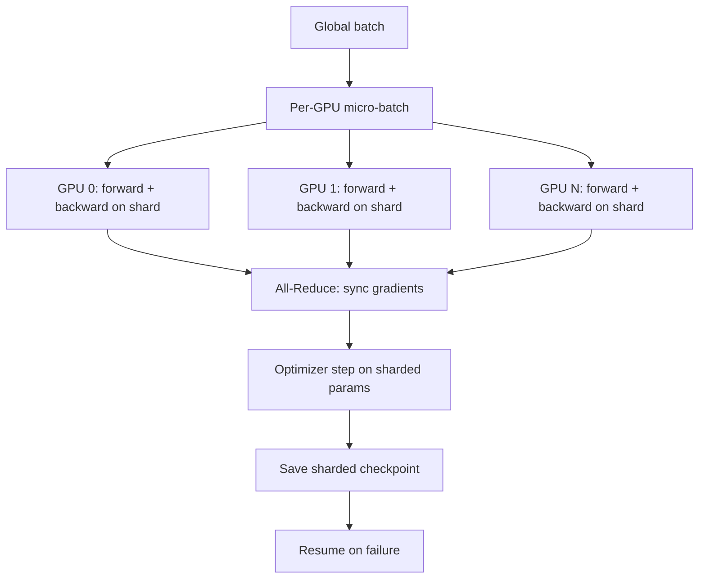

# 11 — Build a Distributed Training Pipeline

> [!info] TL;DR
> Build a distributed training pipeline that takes a small LLM (e.g., 1.5B parameters) and trains it across multiple GPUs using FSDP (Fully Sharded Data Parallel). The goal is to understand every piece of the distributed training stack: data sharding, gradient sync, parameter sharding, mixed precision, checkpoint saving/loading, and recovery from failures. By the end, you'll be able to scale training from 1 GPU to 8 GPUs with near-linear speedup, and you'll understand what production systems like DeepSpeed, Megatron-LM, and TorchTitan do under the hood.

## Project Goals

By the end of this project, you will have built a distributed training system that:

1. Shards model parameters, gradients, and optimizer states across GPUs (FSDP).
2. Uses mixed precision (bf16) for forward/backward, fp32 for optimizer state.
3. Saves and loads sharded checkpoints (each GPU saves its own shard).
4. Handles node failures gracefully (resume from checkpoint).
5. Tracks and logs training metrics across all ranks.
6. Scales near-linearly from 1 to 8 GPUs.

The implementation uses PyTorch native FSDP (no DeepSpeed, no Megatron-LM). Once you understand FSDP, those frameworks become transparent — they implement the same ideas with more optimizations.

## Architecture



## Prerequisites

- Multi-GPU machine (1+ GPUs minimum; 4+ recommended to see scaling).
- PyTorch 2.0+ (FSDP is stable since 2.0).
- A small LLM (e.g., Llama 3.2 1B from HuggingFace).
- A dataset (e.g., wikitext-103 for simplicity; or a slice of FineWeb for production-scale).

```bash
pip install torch transformers datasets accelerate wandb
```

## Step 1: Single-GPU Baseline

Before going distributed, get a single-GPU training loop working. This is your reference implementation — the distributed version should produce identical loss curves.

```python
import torch
from torch.utils.data import DataLoader
from transformers import AutoModelForCausalLM, AutoTokenizer, get_cosine_schedule_with_warmup

def train_single_gpu():
    device = "cuda:0"
    model = AutoModelForCausalLM.from_pretrained(
        "meta-llama/Llama-3.2-1B",
        torch_dtype=torch.bfloat16,
    ).to(device)

    tokenizer = AutoTokenizer.from_pretrained("meta-llama/Llama-3.2-1B")
    optimizer = torch.optim.AdamW(model.parameters(), lr=3e-4, weight_decay=0.01)

    # ... data loading, training loop ...
    for batch in dataloader:
        batch = {k: v.to(device) for k, v in batch.items()}
        outputs = model(**batch, labels=batch["input_ids"])
        loss = outputs.loss
        loss.backward()
        torch.nn.utils.clip_grad_norm_(model.parameters(), 1.0)
        optimizer.step()
        optimizer.zero_grad()
```

Run this for 100 steps and record the loss curve. This is your baseline.

## Step 2: DDP (Distributed Data Parallel)

The simplest distribution: each GPU has a full copy of the model, processes a different micro-batch, and gradients are averaged across GPUs via All-Reduce.

```python
import torch.distributed as dist
from torch.nn.parallel import DistributedDataParallel as DDP

def setup_ddp():
    dist.init_process_group(backend="nccl")
    local_rank = int(os.environ["LOCAL_RANK"])
    torch.cuda.set_device(local_rank)

def train_ddp():
    setup_ddp()
    local_rank = int(os.environ["LOCAL_RANK"])

    model = AutoModelForCausalLM.from_pretrained(
        "meta-llama/Llama-3.2-1B",
        torch_dtype=torch.bfloat16,
    ).to(local_rank)
    model = DDP(model, device_ids=[local_rank])

    # DistributedSampler ensures each GPU sees different data
    sampler = torch.utils.data.distributed.DistributedSampler(dataset)
    dataloader = DataLoader(dataset, sampler=sampler, batch_size=8)

    optimizer = torch.optim.AdamW(model.parameters(), lr=3e-4)
    for batch in dataloader:
        batch = {k: v.to(local_rank) for k, v in batch.items()}
        loss = model(**batch, labels=batch["input_ids"]).loss
        loss.backward()  # DDP auto-syncs gradients here
        optimizer.step()
        optimizer.zero_grad()
```

Launch with `torchrun --nproc_per_node=4 train.py`. DDP auto-averages gradients during `backward()` via hook-based All-Reduce. The loss curve should match the single-GPU baseline (modulo batch size differences).

**DDP memory**: each GPU holds the full model + full optimizer state + full gradients. For a 1B model in bf16 + fp32 AdamW: ~4GB model + ~8GB optimizer + ~4GB gradients = ~16GB per GPU. Works for 1B models on 24GB GPUs, but doesn't scale to 70B.

## Step 3: FSDP (Fully Sharded Data Parallel)

FSDP shards the model parameters, gradients, and optimizer states across GPUs. Each GPU holds only 1/N of the model. During forward/backward, FSDP all-gathers the parameters for the current layer, computes, then frees them.

```python
from torch.distributed.fsdp import FullyShardedDataParallel as FSDP
from torch.distributed.fsdp import ShardingStrategy, MixedPrecision, CPUOffload
from torch.distributed.fsdp.wrap import size_based_auto_wrap_policy

def train_fsdp():
    setup_ddp()
    local_rank = int(os.environ["LOCAL_RANK"])

    model = AutoModelForCausalLM.from_pretrained(
        "meta-llama/Llama-3.2-1B",
        torch_dtype=torch.bfloat16,
    ).to(local_rank)

    # FSDP config
    mp_policy = MixedPrecision(
        param_dtype=torch.bfloat16,
        reduce_dtype=torch.bfloat16,
        buffer_dtype=torch.bfloat16,
    )
    model = FSDP(
        model,
        sharding_strategy=ShardingStrategy.FULL_SHARD,
        mixed_precision=mp_policy,
        auto_wrap_policy=size_based_auto_wrap_policy(min_num_params=1_000_000),
        device_id=local_rank,
    )

    # Optimizer — FSDP handles sharding internally
    optimizer = torch.optim.AdamW(model.parameters(), lr=3e-4)

    sampler = torch.utils.data.distributed.DistributedSampler(dataset)
    dataloader = DataLoader(dataset, sampler=sampler, batch_size=8)

    for step, batch in enumerate(dataloader):
        batch = {k: v.to(local_rank) for k, v in batch.items()}
        loss = model(**batch, labels=batch["input_ids"]).loss
        loss.backward()  # FSDP all-gathers params, computes, frees
        torch.nn.utils.clip_grad_norm_(model.parameters(), 1.0)
        optimizer.step()
        optimizer.zero_grad()

        if local_rank == 0 and step % 100 == 0:
            print(f"Step {step}, loss {loss.item():.4f}")
```

**FSDP memory**: each GPU holds 1/N of model + 1/N of optimizer + 1/N of gradients. For a 1B model on 4 GPUs: ~1GB model + ~2GB optimizer + ~1GB gradients = ~4GB per GPU. The full model is "materialized" only layer-by-layer during forward/backward, so peak memory is much lower than DDP.

## Step 4: Sharded Checkpointing

Naive checkpointing (each GPU saves the full model) is wasteful and slow. FSDP supports sharded checkpoints: each GPU saves only its shard. On resume, each GPU loads its own shard and the full model is reconstructed via all-gather.

```python
from torch.distributed.checkpoint import FileSystemCheckpoint, save_state_dict, load_state_dict
import torch.distributed.checkpoint as dcp

def save_sharded_checkpoint(model, optimizer, step, path):
    """Save FSDP state — each rank saves its own shard."""
    state_dict = {
        "model": model.state_dict(),
        "optimizer": optimizer.state_dict(),
        "step": step,
    }
    dcp.save(state_dict, checkpoint_id=f"{path}/step_{step}")

def load_sharded_checkpoint(model, optimizer, path):
    """Load FSDP state — each rank loads its own shard."""
    state_dict = {
        "model": model.state_dict(),
        "optimizer": optimizer.state_dict(),
        "step": 0,
    }
    dcp.load(state_dict, checkpoint_id=path)
    model.load_state_dict(state_dict["model"])
    optimizer.load_state_dict(state_dict["optimizer"])
    return state_dict["step"]
```

For production: save every N steps (e.g., 1000), keep the last 2-3 checkpoints, and delete older ones. The `torch.distributed.checkpoint` API handles concurrent writes (each rank writes to its own file within the checkpoint directory).

## Step 5: Mixed Precision

FSDP's `MixedPrecision` policy controls dtypes for parameters, gradient reduction, and buffers:

- `param_dtype=torch.bfloat16` — parameters are stored in bf16. Halves memory; enables Tensor Cores.
- `reduce_dtype=torch.bfloat16` — gradient All-Reduce uses bf16. Halves network traffic.
- `buffer_dtype=torch.bfloat16` — non-parameter buffers (e.g., LayerNorm running stats) in bf16.

The optimizer state (AdamW's first/second moments) is kept in fp32 for stability. FSDP handles the casting automatically.

For Hopper (H100) GPUs, you can also use FP8 for parameters and gradients — but this requires careful tuning of scaling factors and is not yet production-default. See [[11 - Training/Optimization/04 - Mixed Precision Training|Mixed Precision Training]].

## Step 6: Gradient Accumulation

For large effective batch sizes without OOM, use gradient accumulation: run N micro-batches, accumulate gradients, then step the optimizer.

```python
GRAD_ACCUM_STEPS = 4

for step, batch in enumerate(dataloader):
    batch = {k: v.to(local_rank) for k, v in batch.items()}
    loss = model(**batch, labels=batch["input_ids"]).loss / GRAD_ACCUM_STEPS
    loss.backward()

    if (step + 1) % GRAD_ACCUM_STEPS == 0:
        torch.nn.utils.clip_grad_norm_(model.parameters(), 1.0)
        optimizer.step()
        optimizer.zero_grad()
```

Effective batch size = `micro_batch_size × num_gpus × GRAD_ACCUM_STEPS`. For `micro_batch=8, num_gpus=4, accum=4`: effective batch = 128.

## Step 7: Recovery from Failures

Production training runs fail. GPUs die, network drops, nodes reboot. Your training script must:

1. **Check progress on startup**: read the latest checkpoint's step count.
2. **Resume from that step**: load model, optimizer, scheduler, RNG state.
3. **Skip already-processed data**: use the step count to compute the data offset.

```python
def maybe_resume(model, optimizer, scheduler, checkpoint_dir):
    """Resume from latest checkpoint if it exists."""
    if not os.path.exists(checkpoint_dir):
        return 0  # Start from scratch

    # Find latest checkpoint
    checkpoints = sorted(glob.glob(f"{checkpoint_dir}/step_*"))
    if not checkpoints:
        return 0

    latest = checkpoints[-1]
    step = load_sharded_checkpoint(model, optimizer, latest)

    # Advance scheduler to the right position
    for _ in range(step):
        scheduler.step()

    if local_rank == 0:
        print(f"Resumed from step {step}")
    return step
```

For production: also save the dataloader state (which examples have been seen), RNG state (for reproducibility), and FSDP metadata (shard sizes, etc.). The `torch.distributed.checkpoint` API handles most of this automatically.

## Step 8: Monitoring and Logging

Each rank has its own view of the training. Only rank 0 should log to avoid 8× duplicate logs.

```python
import wandb

if local_rank == 0:
    wandb.init(project="distributed-training-demo", config={
        "model": "Llama-3.2-1B",
        "num_gpus": int(os.environ["WORLD_SIZE"]),
        "batch_size": 8,
        "grad_accum": 4,
    })

for step, batch in enumerate(dataloader):
    # ... training step ...
    if local_rank == 0 and step % 10 == 0:
        wandb.log({
            "loss": loss.item() * GRAD_ACCUM_STEPS,
            "lr": scheduler.get_last_lr()[0],
            "grad_norm": grad_norm,
            "step": global_step,
        })
```

For multi-node training, aggregate metrics across nodes (e.g., average loss across ranks) before logging. Use `dist.all_reduce` to gather metrics on rank 0.

## Verification

After implementing, verify:

1. **Loss matches single-GPU baseline** (modulo batch size differences). If the loss diverges, you have a bug in gradient sync or dtype handling.
2. **Memory scales with sharding**: with FSDP, doubling GPUs should ~halve the per-GPU memory. If memory doesn't decrease, FSDP isn't actually sharding.
3. **Throughput scales near-linearly**: 4 GPUs should give ~3.5× throughput vs 1 GPU (some overhead is expected). If throughput doesn't scale, you have a communication bottleneck.
4. **Resume produces identical state**: save a checkpoint, resume, and verify the loss on the next batch matches what you'd get without restart.

## Production Implications

- **Use FSDP for new projects** unless you need features only DeepSpeed offers (e.g., ZeRO-3 with offload to CPU/NVMe). FSDP is native PyTorch, well-supported, and matches DeepSpeed's performance for most cases.
- **For very large models (>100B)**, consider 3D parallelism (data + tensor + pipeline parallel). FSDP handles data parallelism; tensor parallelism needs Megatron-LM or TorchTitan; pipeline parallelism needs `torch.distributed.pipeline`.
- **For multi-node training**, use NCCL for GPU-to-GPU communication and a fast interconnect (InfiniBand or 400G Ethernet). Slow networks are the #1 bottleneck for multi-node scaling.
- **For checkpointing at scale**, use a distributed filesystem (e.g., S3, GCS, or a fast NFS). Don't save to local disk — nodes fail and lose local state.
- **For monitoring**, use Weights & Biases or MLflow. Track loss, gradient norm, learning rate, GPU utilization, memory, and throughput. Anomalies in these metrics are early warning signs of training instability.

## Common Pitfalls

- **Forgetting `dist.init_process_group`** — without this, FSDP/DDP silently fail or hang. Always call setup first.
- **Wrong `LOCAL_RANK` handling** — `LOCAL_RANK` is the GPU index on the current node; `RANK` is the global rank. Use `LOCAL_RANK` for `torch.cuda.set_device`, `RANK` for rank-0 logic.
- **Not using `DistributedSampler`** — without it, all GPUs see the same data, defeating the point of distribution.
- **Forgetting `model.module` after DDP/FSDP wrapping** — to access the underlying model (e.g., for saving), use `model.module`, not `model`.
- **Saving full state dict on every rank** — wasteful and slow. Use `torch.distributed.checkpoint` for sharded saves.
- **Not advancing the LR scheduler on resume** — the scheduler's internal step counter must match the training step, or the LR will be wrong.
- **Mixed dtype bugs** — if the model is bf16 but the optimizer state is fp32, FSDP's MixedPrecision handles this. If you implement it manually, you'll hit subtle bugs.

## Further Reading

- PyTorch FSDP documentation: https://pytorch.org/docs/stable/fsdp.html
- Zhao et al. (2023), *PyTorch FSDP: Experiences on Scaling Fully Sharded Data Parallel*.
- DeepSpeed ZeRO: https://www.deepspeed.ai/tutorials/zero/
- Megatron-LM: https://github.com/NVIDIA/Megatron-LM
- TorchTitan (PyTorch's reference LLM training repo): https://github.com/pytorch/torchtitan

## Connection to Other Concepts

- [[11 - Training/Distributed Training/02 - Distributed Training|Distributed Training]] — the conceptual foundation.
- [[11 - Training/Optimization/04 - Mixed Precision Training|Mixed Precision Training]] — bf16/fp8 handling.
- [[11 - Training/Optimization/05 - Loss Spikes and Stability|Loss Spikes and Stability]] — large-scale training is unstable.
- [[11 - Training/Pretraining/01 - Pretraining Objectives and Scaling Laws|Pretraining Objectives and Scaling Laws]] — what you're training toward.
- [[02 - Mathematics/Optimization/13 - Adam Derivation|Adam Derivation]] — the optimizer being distributed.
- [[02 - Mathematics/Optimization/14 - Learning Rate Schedules|Learning Rate Schedules]] — must be advanced correctly on resume.
- [[27 - Projects/Implementations/05 - Build a Tiny LLM Trainer|Build a Tiny LLM Trainer]] — the single-GPU version this project scales up.

## Interview Questions

1. **Q: What's the difference between DDP and FSDP?**
   A: DDP (Distributed Data Parallel) keeps a full copy of the model on every GPU and only shards gradients (via All-Reduce during backward). FSDP (Fully Sharded Data Parallel) shards parameters, gradients, and optimizer states across GPUs. During forward/backward, FSDP all-gathers the parameters for the current layer, computes, then frees them. Memory: DDP uses O(N) memory per GPU for an N-parameter model; FSDP uses O(N/G) memory per GPU for G GPUs. FSDP is essential for large models (70B+) that don't fit on a single GPU; DDP is simpler and faster for small models that do fit.

2. **Q: Explain the 6ND compute rule and how it interacts with distributed training.**
   A: Training a model with N parameters on D tokens requires ~6ND FLOPs (2ND forward + 4ND backward). In distributed training, this total compute is divided across GPUs: each GPU does 6ND/G FLOPs (assuming perfect scaling). The wall-clock time is `6ND / (G × FLOP/s × MFU)`. For a 70B model on 15T tokens with 16,000 H100s at 500 TFLOP/s and 50% MFU: time = 6×70e9×15e12 / (16000 × 500e12 × 0.5) ≈ 18 days. FSDP doesn't change the total compute — it just lets you fit a model that wouldn't fit on one GPU.

3. **Q: How would you resume training from a checkpoint after a node failure?**
   A: Three things to restore. (1) **Model and optimizer state** — load from the sharded checkpoint (each rank loads its own shard). (2) **Training step** — read from the checkpoint metadata, use it to advance the LR scheduler to the right position. (3) **Data position** — the dataloader must skip already-seen batches; either advance the sampler's epoch/step counter or seek the data file to the right offset. Also restore RNG state for reproducibility. The `torch.distributed.checkpoint` API handles most of this; you handle the data position manually.

4. **Q: When would you choose FSDP vs DeepSpeed ZeRO-3?**
   A: For most new projects, choose FSDP — it's native PyTorch, well-supported, and matches DeepSpeed's performance for data-parallel sharding. Choose DeepSpeed ZeRO-3 when you need: (1) CPU/NVMe offload (FSDP has CPU offload but it's less mature), (2) integration with DeepSpeed's other features (e.g., DeepSpeed-MoE), (3) specific ZeRO configurations not exposed by FSDP. As of 2025, FSDP has caught up to DeepSpeed on most features; the gap is closing.

5. **Q: How does gradient accumulation interact with distributed training?**
   A: Each GPU runs N micro-batches, accumulating gradients locally. After N micro-batches, the GPU participates in the All-Reduce to average gradients across GPUs, then the optimizer steps. The effective batch size is `micro_batch × num_gpus × N`. Key implementation detail: divide the loss by N before `backward()` so the accumulated gradient is the average, not the sum. Also, gradient clipping should happen after all accumulation, before the optimizer step.

6. **Q: What are the typical bottlenecks in distributed training and how do you diagnose them?**
   A: Three common bottlenecks. (1) **Communication overhead** — All-Reduce and All-Gather operations can dominate for small micro-batches or slow networks. Diagnose with `torch.propector` or NCCL logs; look for high communication time as a fraction of total step time. Fix: increase micro-batch size, use gradient accumulation, or use a faster interconnect. (2) **Memory pressure** — OOM or excessive activation checkpointing. Diagnose with `torch.cuda.memory_summary`; look for unexpected memory spikes. Fix: reduce micro-batch, enable activation checkpointing, or use more aggressive sharding. (3) **Data loading** — the dataloader can't keep up with GPU consumption. Diagnose with `DataLoader` timing; look for `num_workers` being too low or slow storage. Fix: increase `num_workers`, use faster storage, or pre-tokenize the dataset.

## Production Hardening Checklist

1. **Use a framework**: don't roll your own distributed training. Use Megatron-LM, DeepSpeed, TorchTitan, or FSDP — they handle edge cases you'll miss.
2. **NCCL debugging**: set `NCCL_DEBUG=INFO` to diagnose communication issues; `NCCL_DEBUG_SUBSYS=ALL` for full detail.
3. **Topology-aware placement**: TP within a node (NVLink), PP across nodes (InfiniBand), DP/ZeRO across the cluster. Wrong placement = 10x slower.
4. **Gradient accumulation math**: effective_batch_size = micro_batch × num_gpus × accumulation_steps. Divide loss by accumulation_steps before backward().
5. **Mixed precision**: BF16 over FP16 (no loss scaling needed). FP8 for H100+ (2x throughput).
6. **Activation checkpointing**: every Nth layer; ~30% compute overhead for 60% memory savings. Essential for long-context.
7. **Gradient clipping at 1.0**: prevents loss spikes from destabilizing training.
8. **Checkpointing strategy**: save every 500–1000 steps; keep last 3 + best; sharded checkpoints (one file per GPU) for fast save/load.
9. **Failure recovery**: detect dead GPUs via NCCL heartbeat; auto-restart from last checkpoint; resume without manual intervention.
10. **Monitoring**: track GPU utilization (>85% = good), communication overhead (<30% = good), loss curve, gradient norm, LR. Use Weights & Biases or TensorBoard.
11. **Data sharding**: shard the dataset across DDP workers (each worker sees a different subset); use `DistributedSampler` to avoid redundant data loading.
12. **LR scaling**: when you scale batch size by K, scale LR by sqrt(K) (sqrt scaling rule) or K (linear scaling rule with warmup).
13. **Pre-tokenize the dataset**: streaming tokenization is a bottleneck; pre-tokenize once, stream tokens.
14. **Dry-run on small model**: validate the entire pipeline (data loading, model, optimizer, checkpoint, eval) on a tiny model before scaling up.

## Common Failure Modes — Diagnostic Table

| Symptom                                | Likely Cause                                  | Fix                                                          |
|----------------------------------------|-----------------------------------------------|--------------------------------------------------------------|
| GPU utilization <50%                   | Communication-bound; or data loading slow    | Increase micro-batch; faster storage; more dataloader workers|
| OOM at large batch                     | Activations too large                         | Enable activation checkpointing; reduce batch; use FSDP       |
| Loss spikes to NaN                     | FP16 overflow; or LR too high                 | Switch to BF16; lower LR; add gradient clipping at 1.0       |
| Training 10x slower than expected      | TP across nodes (slow interconnect)           | TP within node only; PP across nodes                         |
| NCCL timeout                           | Dead GPU; or network issue                    | Check `NCCL_DEBUG=INFO`; restart dead node; check IB link    |
| Checkpoint save takes 10 min           | Single-file checkpoint on slow storage        | Use sharded checkpoints (one file per GPU); use faster storage|
| Pipeline bubble too large              | Too few micro-batches                         | Increase micro-batches; use 1F1B or interleaved scheduling   |
| Loss diverges after N steps            | LR schedule wrong; or data issue              | Check warmup length; inspect recent data batches             |
| Uneven GPU utilization                 | Imbalanced workload (e.g., PP last stage)     | Rebalance pipeline stages; use interleaved PP                |
| Can't resume from checkpoint           | Optimizer state not saved; or RNG state       | Save optimizer state + RNG state + dataloader position       |

## Modern Developments (2024–2026)

### FP8 Training on H100/B200
H100 (2022) and B200 (2024) support FP8 natively. FP8 training is 2x faster than BF16 with similar quality. Transformer Engine (NVIDIA) library makes FP8 training drop-in for Transformers. DeepSeek-V3 trained with FP8 — first frontier model to do so at scale. See [[26 - Papers/2024-2026/28 - DeepSeek-V2 and V3 2024]].

### TorchTitan — PyTorch Native Distributed Training
TorchTitan (PyTorch team, 2024) is a native PyTorch distributed training framework for LLMs (Llama 3, Mistral). Replaces Megatron-LM and DeepSpeed for new projects; uses FSDP2, native tensor parallel, native pipeline parallel. Production-ready since PyTorch 2.5+.

### 3D Parallelism as Default for >10B Models
For >10B models, 3D parallelism (DP + TP + PP) plus ZeRO-3 is the standard. TP=8 (within node), PP=4–8 (across nodes), DP/ZeRO-3 (across replicas). DeepSeek-V3 used this for 671B MoE training on 2048 H100s.

### Async Checkpointing
Save checkpoints in a background process while training continues. Reduces checkpoint overhead from 5–10 min to <30 sec. Available in PyTorch 2.4+ via `torch.distributed.checkpoint.async_save`.

### Streaming Datasets for >1T Tokens
For >1T token training, the dataset doesn't fit on disk. Use streaming data loaders (WebDataset, MosaicML streaming) that read from S3/local SSD in shards. Tokenize once, stream forever.

## See Also

- [[27 - Projects/MOC|Projects MOC]]
- [[11 - Training/Distributed Training/02 - Distributed Training|Distributed Training]]
- [[11 - Training/Optimization/04 - Mixed Precision Training|Mixed Precision Training]]
- [[11 - Training/Optimization/05 - Loss Spikes and Stability|Loss Spikes and Stability]]
- [[27 - Projects/Implementations/05 - Build a Tiny LLM Trainer|Build a Tiny LLM Trainer]]
- [[02 - Mathematics/Optimization/13 - Adam Derivation|Adam Derivation]]
- [[02 - Mathematics/Optimization/14 - Learning Rate Schedules|Learning Rate Schedules]]
