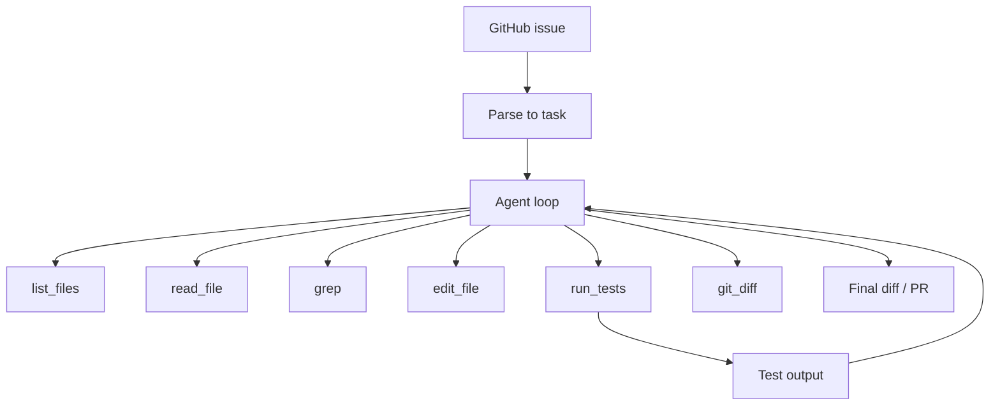

# 12 — Build a Code Agent

> [!info] TL;DR
> Build a code agent that takes a GitHub issue, navigates a real codebase, identifies the relevant files, proposes a fix, runs the tests, and iterates until the tests pass. This is a SWE-bench-style agent: not just "generate code", but "autonomously fix a bug in a real codebase". The goal is to understand every component of a production code agent: repository navigation, file editing, test execution, error recovery, and the agent loop that ties them together. By the end, you'll have a working agent that can fix real bugs in a small Python repo, and you'll understand what systems like Devin, Cursor Agent, and OpenAI Codex do under the hood.

## Project Goals

By the end of this project, you will have built a code agent that:

1. Parses a GitHub issue (title + body) into a structured task.
2. Explores the repository structure (directory listing, file reading, grep).
3. Identifies the relevant files (using LLM + retrieval).
4. Proposes a code change (diff or full file).
5. Applies the change in a sandboxed git worktree.
6. Runs the tests and reads the output.
7. Iterates: if tests fail, reads the error, proposes another fix.
8. Reports success (PR-ready diff) or failure (with diagnostic info).

The agent uses a ReAct-style loop: reason → act (call a tool) → observe → reason. Tools include file ops, grep, and test running. By the end, you'll understand why SWE-bench is hard (real codebases are messy, tests are slow, errors are ambiguous) and what makes production code agents work.

## Architecture



## Prerequisites

- OpenAI API key (or local Llama-3.1-70B via Ollama).
- A small Python repo with tests (e.g., a fork of `requests`, `flask`, or a synthetic repo).
- Docker for sandboxed test execution (or `venv` for simpler setups).

```bash
pip install openai pydantic docker gitpython
```

## Step 1: Define the Tools

The agent needs tools to interact with the repo. Each tool is a function with a clear schema.

```python
import os
import subprocess
from pathlib import Path
from pydantic import BaseModel

class ListFilesInput(BaseModel):
    path: str = "."  # Relative to repo root

def list_files(args: ListFilesInput) -> str:
    """List files in a directory."""
    repo_root = os.environ["REPO_ROOT"]
    target = Path(repo_root) / args.path
    if not target.exists():
        return f"Error: {args.path} does not exist"
    entries = []
    for entry in sorted(target.iterdir()):
        rel = entry.relative_to(repo_root)
        prefix = "dir " if entry.is_dir() else "file"
        entries.append(f"{prefix} {rel}")
    return "\n".join(entries)

class ReadFileInput(BaseModel):
    path: str

def read_file(args: ReadFileInput) -> str:
    """Read a file's contents."""
    repo_root = os.environ["REPO_ROOT"]
    target = Path(repo_root) / args.path
    if not target.exists():
        return f"Error: {args.path} does not exist"
    return target.read_text()[:8000]  # Truncate to fit in context

class GrepInput(BaseModel):
    pattern: str
    path: str = "."

def grep(args: GrepInput) -> str:
    """Search for a pattern in files."""
    repo_root = os.environ["REPO_ROOT"]
    result = subprocess.run(
        ["rg", "--max-count", "20", "-n", args.pattern, args.path],
        cwd=repo_root, capture_output=True, text=True, timeout=10
    )
    return result.stdout[:4000] if result.stdout else f"No matches for {args.pattern}"

class EditFileInput(BaseModel):
    path: str
    old_text: str
    new_text: str

def edit_file(args: EditFileInput) -> str:
    """Replace old_text with new_text in a file."""
    repo_root = os.environ["REPO_ROOT"]
    target = Path(repo_root) / args.path
    content = target.read_text()
    if args.old_text not in content:
        return f"Error: old_text not found in {args.path}"
    new_content = content.replace(args.old_text, args.new_text, 1)
    target.write_text(new_content)
    return f"Edited {args.path}"

class RunTestsInput(BaseModel):
    test_path: str = "tests/"

def run_tests(args: RunTestsInput) -> str:
    """Run pytest on the given path."""
    repo_root = os.environ["REPO_ROOT"]
    result = subprocess.run(
        ["pytest", args.test_path, "-x", "--tb=short"],
        cwd=repo_root, capture_output=True, text=True, timeout=120
    )
    output = result.stdout + result.stderr
    return output[-4000:]  # Last 4K chars (the failures)

TOOLS = [
    {"name": "list_files", "description": "List files in a directory", "fn": list_files, "schema": ListFilesInput},
    {"name": "read_file", "description": "Read a file's contents", "fn": read_file, "schema": ReadFileInput},
    {"name": "grep", "description": "Search for a pattern", "fn": grep, "schema": GrepInput},
    {"name": "edit_file", "description": "Edit a file by replacing text", "fn": edit_file, "schema": EditFileInput},
    {"name": "run_tests", "description": "Run pytest", "fn": run_tests, "schema": RunTestsInput},
]
```

## Step 2: The Agent Loop

The agent uses OpenAI's tool-calling API to interleave reasoning and tool calls.

```python
import json
from openai import OpenAI

client = OpenAI()

SYSTEM_PROMPT = """You are a code repair agent. Given a GitHub issue, your job is to:
1. Understand the bug or feature request.
2. Navigate the repository to find the relevant code.
3. Propose a fix by editing files.
4. Run the tests to verify the fix.
5. Iterate until tests pass.

You have tools to: list files, read files, grep, edit files, and run tests.

Important:
- Make minimal, targeted edits. Don't rewrite entire files.
- Run tests after every edit to verify.
- If tests fail, read the error carefully and try again.
- Give up after 10 iterations if you can't fix it.
"""

def run_agent(issue_title: str, issue_body: str, max_iterations: int = 10):
    messages = [
        {"role": "system", "content": SYSTEM_PROMPT},
        {"role": "user", "content": f"Issue: {issue_title}\n\n{issue_body}"},
    ]

    openai_tools = [
        {
            "type": "function",
            "function": {
                "name": t["name"],
                "description": t["description"],
                "parameters": t["schema"].model_json_schema(),
            }
        }
        for t in TOOLS
    ]

    for iteration in range(max_iterations):
        response = client.chat.completions.create(
            model="gpt-4o",
            messages=messages,
            tools=openai_tools,
            tool_choice="auto",
        )
        msg = response.choices[0].message
        messages.append(msg)

        if not msg.tool_calls:
            return msg.content  # Agent gave up or reported success

        for tool_call in msg.tool_calls:
            tool_name = tool_call.function.name
            tool_args = json.loads(tool_call.function.arguments)

            tool = next((t for t in TOOLS if t["name"] == tool_name), None)
            if tool is None:
                result = f"Error: unknown tool {tool_name}"
            else:
                try:
                    result = tool["fn"](tool["schema"](**tool_args))
                except Exception as e:
                    result = f"Error: {e}"

            messages.append({
                "role": "tool",
                "tool_call_id": tool_call.id,
                "content": result,
            })

    return "Max iterations reached without resolution."
```

## Step 3: Sandboxing

Running agent-generated code on your machine is dangerous. Use Docker or git worktrees to isolate.

### Git worktree approach (simpler)

```python
import git

def setup_worktree(repo_path: str, branch_name: str) -> str:
    """Create an isolated git worktree for the agent to work in."""
    repo = git.Repo(repo_path)
    worktree_path = f"{repo_path}_worktree_{branch_name}"
    repo.git.worktree("add", worktree_path, "-b", branch_name)
    os.environ["REPO_ROOT"] = worktree_path
    return worktree_path

def cleanup_worktree(repo_path: str, branch_name: str):
    """Remove the worktree after the agent is done."""
    repo = git.Repo(repo_path)
    repo.git.worktree("remove", f"{repo_path}_worktree_{branch_name}", "--force")
    repo.git.branch("-D", branch_name)
```

### Docker approach (more isolated)

```python
def run_tests_in_docker(repo_path: str, test_path: str) -> str:
    """Run tests in a Docker container with the repo mounted."""
    result = subprocess.run([
        "docker", "run", "--rm",
        "-v", f"{repo_path}:/repo",
        "-w", "/repo",
        "python:3.11-slim",
        "bash", "-c", f"pip install -e . && pytest {test_path} --tb=short"
    ], capture_output=True, text=True, timeout=300)
    return result.stdout + result.stderr
```

Docker is slower but safer. For production: use Docker with read-only root filesystem, network isolation, and resource limits.

## Step 4: Evaluation

The agent's success criterion: does the proposed fix make the failing tests pass?

```python
def evaluate_agent(repo_path: str, issue: dict, expected_tests: list[str]) -> dict:
    """Run the agent on an issue, then verify the tests pass."""
    # 1. Run the agent
    worktree = setup_worktree(repo_path, f"agent-{issue['number']}")
    try:
        result = run_agent(issue["title"], issue["body"])

        # 2. Verify tests pass
        test_results = {}
        for test in expected_tests:
            test_result = subprocess.run(
                ["pytest", test, "-x", "--tb=short"],
                cwd=worktree, capture_output=True, text=True, timeout=120
            )
            test_results[test] = test_result.returncode == 0

        # 3. Compute metrics
        passed = sum(test_results.values())
        total = len(test_results)
        return {
            "issue_number": issue["number"],
            "agent_result": result,
            "tests_passed": passed,
            "tests_total": total,
            "success_rate": passed / total if total > 0 else 0,
            "diff": get_diff(worktree),
        }
    finally:
        cleanup_worktree(repo_path, f"agent-{issue['number']}")
```

For SWE-bench-style evaluation: use the official SWE-bench dataset (300 real GitHub issues with verified tests). Measure pass@1 (does the agent fix the issue on the first try) and pass@5 (does it fix it within 5 attempts).

## Step 5: Production Patterns

### Context window management

Real codebases are large (100K+ lines). The agent can't read the whole repo. Strategies:

- **Retrieval**: embed files, retrieve top-K by similarity to the issue. Use BM25 for keyword matching (often beats embeddings for code).
- **Lazy loading**: only read files when the agent asks. Don't preload.
- **Hierarchical exploration**: list directory → read summary → read full file. Don't dump 10K-line files into context.
- **File summaries**: precompute a one-line summary of each file; include these in the system prompt.

### Iteration budget

Code agents can loop forever. Set a budget:

- Max iterations (e.g., 10–20).
- Max tool calls (e.g., 50).
- Max wall-clock time (e.g., 30 minutes).
- Max tokens consumed (e.g., 100K).

When the budget is exceeded, the agent reports failure with diagnostic info.

### Error recovery

When tests fail, the agent should:

1. Read the full error message (not just the last line).
2. Identify the failing assertion or exception.
3. Trace back to the relevant file/line.
4. Propose a fix that addresses the root cause, not the symptom.

A common failure mode: the agent "fixes" the immediate error but breaks other tests. Always run the full test suite, not just the failing test.

### Diff quality

The agent's output should be a clean, minimal diff. Force this by:

- Using `edit_file` (which requires `old_text` and `new_text`) instead of `write_file` (which overwrites).
- Validating the diff with `git diff --check` before reporting success.
- Rejecting edits that touch more than N lines (e.g., 100) — these are usually wrong.

## Verification

After implementing, verify:

1. **The agent can fix a simple bug**: write a one-line bug (e.g., `+` instead of `-`), confirm the agent finds and fixes it.
2. **The agent can navigate a real codebase**: give it an issue from a small open-source project, watch it explore.
3. **The agent gives up gracefully**: on an unsolvable issue, it should report failure with diagnostic info, not loop forever.
4. **The agent doesn't break other tests**: after a fix, the full test suite should still pass.
5. **Sandboxing works**: the agent can't escape the worktree/Docker container.

## Production Implications

- **SWE-bench is the standard benchmark**: as of 2025, SWE-bench Verified (a curated subset) is the canonical eval. State-of-the-art is ~50% pass@1 (Claude 3.5 Sonnet, GPT-4o). Your agent will likely score 10–30% — that's normal for a from-scratch implementation.
- **Cost per issue**: a typical code agent run consumes 50K–200K tokens (mostly tool outputs). At GPT-4o pricing, that's $0.50–$2 per issue. For 1000 issues: $500–$2000.
- **Latency**: 2–10 minutes per issue (mostly waiting for tests). Not suitable for real-time use; batch processing is the norm.
- **Human-in-the-loop**: for production use, the agent proposes a PR; a human reviews and merges. Don't auto-merge — code agents make subtle mistakes.
- **Tool ecosystem**: OpenAI Codex CLI, Cursor Agent, Aider, Continue, Devin are all variations of this pattern. They differ in tool design, model choice, and UX — not in the fundamental loop.

## Common Pitfalls

- **Trusting the agent too much** — code agents make plausible-but-wrong fixes. Always run the full test suite, not just the failing test.
- **No iteration budget** — the agent loops forever, burning tokens. Always set a max iterations / max tokens / max time budget.
- **Bad tool design** — vague tool descriptions cause the agent to misuse them. Spend time on tool schemas and descriptions.
- **No sandboxing** — running agent-generated code on your dev machine is asking for trouble. Use Docker or worktrees.
- **Reading entire files into context** — 10K-line files blow up the context window. Use `read_file` with line ranges or summaries.
- **Not handling test timeouts** — some tests hang. Always set a timeout and kill the test process if exceeded.
- **Forgetting to commit changes** — the agent edits files but doesn't commit. If the worktree is cleaned up, the changes are lost. Always commit before cleanup (or extract the diff first).

## Further Reading

- Jimenez et al. (2024), *SWE-bench: Can Language Models Resolve Real-World GitHub Issues?*
- OpenAI Codex CLI: https://github.com/openai/codex
- Aider: https://github.com/paul-gauthier/aider
- Cursor Agent: https://cursor.sh/
- SWE-agent (Princeton): https://github.com/princeton-nlp/SWE-agent

## Connection to Other Concepts

- [[15 - AI Agents/Architecture/01 - Agent vs Workflow vs LLM Application|Agent vs Workflow vs LLM Application]] — what makes this an agent, not a workflow.
- [[15 - AI Agents/Reasoning/03 - ReAct Pattern|ReAct Pattern]] — the loop pattern used here.
- [[15 - AI Agents/Tool Calling/04 - Function Calling|Function Calling]] — the tool-calling API.
- [[15 - AI Agents/Autonomy/08 - Autonomous Agent Lifecycles|Autonomous Agent Lifecycles]] — the broader context.
- [[15 - AI Agents/Autonomy/09 - Human-in-the-Loop Patterns|Human-in-the-Loop Patterns]] — for production PR review.
- [[27 - Projects/Mini-Projects/03 - Build a Mini Agent|Build a Mini Agent]] — the simpler precursor.
- [[22 - Production AI/Security/01 - LLM Security and Prompt Injection|LLM Security and Prompt Injection]] — sandboxing is essential because of this.
- [[17 - RAG/Ingestion and Retrieval/02 - Chunking Hybrid Search Reranking|Chunking Hybrid Search Reranking]] — for repo navigation retrieval.

## Interview Questions

1. **Q: What makes SWE-bench harder than typical coding benchmarks?**
   A: Three things. (1) **Real codebases** — the agent must navigate a real repo (100K+ lines), not a self-contained problem. (2) **Real tests** — the success criterion is passing the project's actual test suite, which may test behavior the agent didn't anticipate. (3) **Multi-step reasoning** — the agent must understand the issue, find the relevant code, propose a fix, run the tests, read the error, iterate. Typical coding benchmarks (HumanEval, MBPP) test single-function generation; SWE-bench tests the full agent loop.

2. **Q: How would you design the tools for a code agent?**
   A: Five core tools: `list_files` (navigate), `read_file` (inspect), `grep` (search), `edit_file` (modify), `run_tests` (verify). Key design principles: (1) **Targeted** — each tool does one thing; don't make a "fix_bug" mega-tool. (2) **Sandboxed** — tools operate only within the repo root; no absolute paths. (3) **Bounded** — `read_file` truncates at 8K chars; `run_tests` has a 2-minute timeout; `grep` limits to 20 matches. (4) **Inspectable** — tool calls and results are logged for debugging. (5) **Reversible** — use `edit_file` (which requires `old_text`), not `write_file` (which overwrites); this makes diffs clean and recoverable.

3. **Q: How do you prevent the agent from looping forever?**
   A: Three budgets, all enforced: (1) **Max iterations** — typically 10–20 agent steps. (2) **Max tool calls** — typically 50. (3) **Max wall-clock time** — typically 30 minutes. (4) **Max tokens consumed** — typically 100K. When any budget is exceeded, the agent reports failure with diagnostic info (last error, last diff, iterations used). The key is to set all four budgets — different failure modes hit different budgets.

4. **Q: Why is sandboxing important for code agents?**
   A: The agent generates and executes code (test runs, build scripts). Without sandboxing, a confused or malicious agent could: (a) delete files outside the repo, (b) install malicious packages, (c) exfiltrate secrets, (d) consume unbounded resources. Sandboxing options: (1) **Git worktree** — isolates changes to a branch; doesn't prevent code execution side effects. (2) **Docker** — full filesystem isolation; can restrict network, resources, capabilities. (3) **VM** — strongest isolation; slowest. For production: Docker with read-only root, network isolation, resource limits, and no secret mounting.

5. **Q: How would you evaluate a code agent?**
   A: Three levels. (1) **Unit tests on synthetic bugs** — write a one-line bug, verify the agent fixes it. Quick feedback during development. (2) **SWE-bench Lite/Verified** — the standard benchmark; ~300/500 real GitHub issues with verified tests. Reports pass@1. (3) **Internal eval on your codebase** — collect real issues from your repo, run the agent, measure resolution rate and diff quality. The internal eval is most relevant for production; SWE-bench is most comparable across systems.

6. **Q: What's the difference between your code agent and production systems like Devin or Cursor?**
   A: The fundamentals are the same: ReAct loop, tool calling, sandboxed execution, test verification. The differences are in: (1) **Tool design** — production systems have 20+ tools (browser, terminal, IDE integration); our demo has 5. (2) **Model choice** — production systems use the best available model (Claude 3.5, GPT-4o); our demo works with any. (3) **Context management** — production systems have sophisticated retrieval and summarization; our demo is naive. (4) **UX** — production systems have IDE integrations, PR creation, collaboration features; our demo is a CLI. (5) **Evaluation** — production systems are evaluated on thousands of issues; our demo on a handful. The core agent loop, however, is identical.

## Production Hardening Checklist

1. **Sandboxed execution**: every code execution in a Docker container with no network access; cap CPU/memory; timeout 30s. Code from an LLM is untrusted.
2. **Tool-call budget**: cap at 20–50 tool calls per issue; abort on limit. Prevents runaway loops.
3. **Diff-based patches**: have the model output unified diffs, not full files. Smaller, easier to verify, easier to rollback.
4. **Test verification**: always run the existing test suite after applying a patch. Reject patches that break tests.
5. **Linting and type checking**: run `ruff`/`mypy` before tests. Reject patches that introduce lint errors.
6. **Context compression**: when conversation exceeds 32k tokens, summarize old turns; preserve recent + tool outputs.
7. **Cost tracking**: per-issue cost; alert if >$5/issue (likely a runaway loop).
8. **Approval gates**: for production deployments, require human approval before pushing to main; agent opens a PR, not direct commits.
9. **Observability**: log every (thought, action, observation) to LangSmith/Langfuse; trace_id per issue.
10. **Replanning on failure**: if a patch fails tests 3x, re-plan from scratch instead of tweaking. Don't get stuck in a local minimum.
11. **Repo indexing**: pre-build a vector index of the codebase; agent retrieves relevant files instead of grepping blindly.
12. **Eval set**: maintain 50+ real issues with known fixes; run on every agent change. SWE-bench is the gold standard.

## Common Failure Modes — Diagnostic Table

| Symptom                                | Likely Cause                                  | Fix                                                          |
|----------------------------------------|-----------------------------------------------|--------------------------------------------------------------|
| Agent loops on same fix                | No re-planning on failure                     | After 3 failed attempts, force replan from scratch            |
| Patch breaks unrelated tests           | Model didn't run full test suite              | Always run full suite after patch; reject on any regression  |
| Agent can't find the right file        | No repo index; blind grep                     | Pre-build vector index; provide search_files tool            |
| Context fills up                       | Long conversations; verbose tool outputs      | Summarize old turns; truncate tool outputs to 1k chars       |
| Cost spikes to $50/issue               | Runaway loop                                  | Tool-call budget cap; cost alert >$5/issue                   |
| Agent edits the wrong file             | Misunderstanding repo structure               | Better repo map tool; require file path confirmation          |
| Sandbox breaks                         | Code needs network/filesystem access          | Whitelist specific endpoints; broader sandbox for trusted agents |
| Model hallucinates API                 | Outdated training data                        | Provide API docs as context; use search_docs tool            |
| Tests pass but fix is wrong            | Tests don't cover the bug                     | Add regression tests; require new test for the fix           |
| Agent takes 30 min per issue           | Too many tool calls; slow model                | Reduce tool budget; use faster model for routing             |

## Modern Developments (2024–2026)

### SWE-bench Becomes the Standard Benchmark
SWE-bench (2024) — 2,294 real GitHub issues with verified tests — is now the standard code agent benchmark. SWE-bench Verified (500 issues, human-verified) is the most-cited subset. State of the art (2025): ~50–60% pass@1 (Claude 3.5 Sonnet + agent framework). SWE-bench Multimodal (2025) adds UI screenshots for bug reports.

### Devin, Cursor, GitHub Copilot Workspace (2024–2025)
Production code agents shipped in 2024–2025: Devin (Cognition, autonomous SWE), Cursor (IDE-integrated, human-in-the-loop), GitHub Copilot Workspace (PR-based, GitHub-integrated), Claude Code (Anthropic, CLI). All use the same ReAct loop; differences are in tool design, model, and UX.

### Repo-Specific Fine-Tuning
Fine-tune the LLM on the team's past PRs/issues for repo-specific code style and patterns. Reduces agent errors on conventions ("we use functional style, not OOP"). LoRA fine-tuning on 1k PRs takes ~1 hour.

### Agentic Code Review
Beyond bug fixing, agents now do code review: open a PR, agent reviews it, leaves comments, suggests fixes. GitHub Copilot, CodeRabbit, and Greptile all ship this. Pattern: agent as a virtual reviewer in the PR flow.

### Long-Context Code Agents
With 1M-token context (Gemini 1.5 Pro, Claude 3.5 Sonnet), agents can load the entire codebase + issue + relevant PRs in one prompt. Eliminates the need for repo indexing for small/medium repos. For >1M LOC, still need retrieval.

## See Also

- [[27 - Projects/MOC|Projects MOC]]
- [[15 - AI Agents/Reasoning/03 - ReAct Pattern|ReAct Pattern]]
- [[15 - AI Agents/Tool Calling/04 - Function Calling|Function Calling]]
- [[15 - AI Agents/Autonomy/08 - Autonomous Agent Lifecycles|Autonomous Agent Lifecycles]]
- [[15 - AI Agents/Autonomy/09 - Human-in-the-Loop Patterns|Human-in-the-Loop Patterns]]
- [[27 - Projects/Mini-Projects/03 - Build a Mini Agent|Build a Mini Agent]]
- [[22 - Production AI/Security/01 - LLM Security and Prompt Injection|LLM Security and Prompt Injection]]
- [[17 - RAG/Ingestion and Retrieval/02 - Chunking Hybrid Search Reranking|Chunking Hybrid Search Reranking]]
