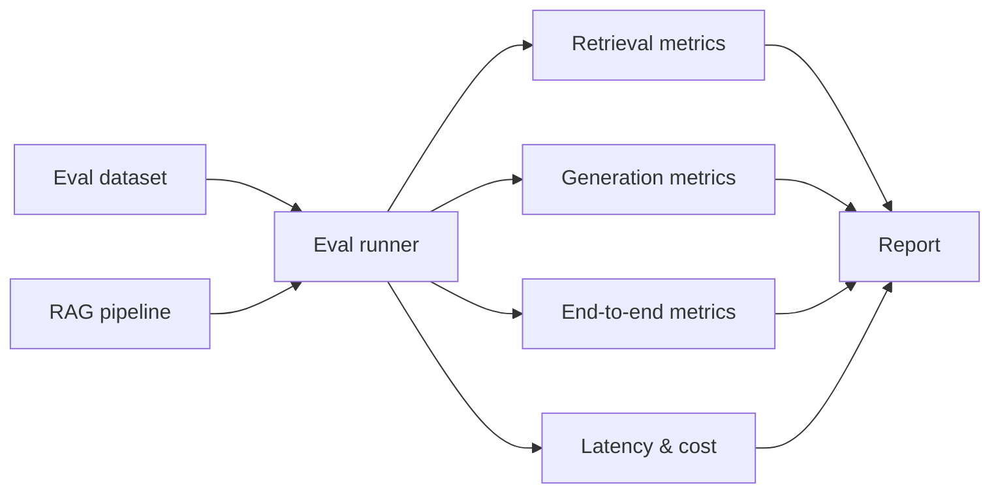

# 13 — Build a RAG Evaluation Harness

> [!info] TL;DR
> Build a RAG evaluation harness that scores a RAG system on retrieval quality, generation quality, and end-to-end task performance. The harness takes a RAG pipeline (any framework — Haystack, LangChain, custom) and a labeled dataset, runs the pipeline on each query, and produces metrics: retrieval recall/precision, answer faithfulness, answer relevance, citation accuracy, and latency/cost. This is the project that turns "my RAG seems to work" into "my RAG achieves 87% retrieval recall and 92% answer faithfulness on my eval set". By the end, you'll understand what RAGAS, TruLens, and DeepEval do under the hood, and you'll have a harness you can use to compare RAG configurations.

## Project Goals

By the end of this project, you will have built an evaluation harness that:

1. Loads a labeled dataset (queries, expected answers, relevant doc IDs).
2. Runs a RAG pipeline on each query, capturing retrieved docs and generated answer.
3. Scores retrieval quality (recall@k, precision@k, MRR, NDCG).
4. Scores generation quality (faithfulness, answer relevance, citation accuracy).
5. Scores end-to-end performance (exact match, F1, LLM-as-judge).
6. Tracks latency and cost per query.
7. Produces a report with per-query scores and aggregate metrics.

The harness is framework-agnostic: give it a function `rag_pipeline(query: str) -> RagResult` and it handles the rest.

## Architecture



## Prerequisites

- A RAG pipeline to evaluate (use [[27 - Projects/Mini-Projects/02 - Build a Mini RAG Pipeline|the mini RAG pipeline]] or any framework).
- An eval dataset (queries + ground truth). See Step 1 for creating one.
- OpenAI API key (for LLM-as-judge metrics).

```bash
pip install openai pydantic rank-bm25 sentence-transformers
```

## Step 1: The Eval Dataset

The eval dataset is a list of `{query, expected_answer, relevant_doc_ids}` triples. Quality of the eval set determines quality of the evaluation — garbage in, garbage out.

```python
from pydantic import BaseModel

class EvalExample(BaseModel):
    query: str
    expected_answer: str | None = None  # Optional for retrieval-only eval
    relevant_doc_ids: list[str]  # Ground truth relevant docs
    relevant_passages: list[str] | None = None  # Optional: specific passages

class EvalDataset(BaseModel):
    name: str
    description: str
    examples: list[EvalExample]

# Example: a small eval set for a documentation RAG
eval_set = EvalDataset(
    name="docs-rag-v1",
    description="20 questions about the Llama 3 model card",
    examples=[
        EvalExample(
            query="What is the context length of Llama 3 8B?",
            expected_answer="Llama 3 8B has a context length of 8,192 tokens.",
            relevant_doc_ids=["llama-3-model-card"],
            relevant_passages=["Llama 3 8B: context length 8,192 tokens, ..."],
        ),
        # ... 19 more ...
    ],
)
```

### Creating an eval set

Three approaches, in order of quality:

1. **Hand-labeled** (best, slow): domain experts write queries and label relevant docs. ~30 minutes per example. Aim for 50–200 examples.
2. **LLM-generated** (medium, fast): use GPT-4 to generate queries from your docs, then verify relevance. ~5 minutes per example. Useful for bootstrapping.
3. **Synthetic from queries** (worst, fastest): take real user queries, use LLM to label relevant docs. Noisy but better than nothing.

For production: start with LLM-generated (50 examples), then hand-curate the worst 20% until quality is acceptable. Expand over time with real user queries.

## Step 2: The RAG Pipeline Interface

The harness needs a uniform interface to call any RAG pipeline.

```python
from dataclasses import dataclass
from typing import Callable

@dataclass
class RetrievedDoc:
    doc_id: str
    content: str
    score: float

@dataclass
class RagResult:
    query: str
    answer: str
    retrieved_docs: list[RetrievedDoc]
    latency_ms: float
    cost_usd: float
    metadata: dict  # Pipeline-specific (model used, rerank applied, etc.)

RagPipeline = Callable[[str], RagResult]
```

Any RAG pipeline — Haystack, LangChain, custom — can be wrapped to fit this interface. The harness doesn't care how the pipeline works internally; it just calls `pipeline(query)` and inspects the result.

## Step 3: Retrieval Metrics

Retrieval metrics score how well the pipeline finds relevant documents.

```python
def retrieval_recall_at_k(retrieved: list[RetrievedDoc], relevant_ids: list[str], k: int = 5) -> float:
    """Fraction of relevant docs in the top-k retrieved."""
    top_k_ids = [d.doc_id for d in retrieved[:k]]
    hits = sum(1 for rid in relevant_ids if rid in top_k_ids)
    return hits / len(relevant_ids) if relevant_ids else 0.0

def retrieval_precision_at_k(retrieved: list[RetrievedDoc], relevant_ids: list[str], k: int = 5) -> float:
    """Fraction of top-k retrieved that are relevant."""
    top_k_ids = [d.doc_id for d in retrieved[:k]]
    hits = sum(1 for rid in top_k_ids if rid in relevant_ids)
    return hits / k

def mrr(retrieved: list[RetrievedDoc], relevant_ids: list[str]) -> float:
    """Mean Reciprocal Rank: 1/rank of the first relevant doc."""
    for i, d in enumerate(retrieved):
        if d.doc_id in relevant_ids:
            return 1.0 / (i + 1)
    return 0.0

def ndcg(retrieved: list[RetrievedDoc], relevant_ids: list[str], k: int = 10) -> float:
    """Normalized Discounted Cumulative Gain at k."""
    import math
    dcg = sum(
        (1.0 if retrieved[i].doc_id in relevant_ids else 0.0) / math.log2(i + 2)
        for i in range(min(k, len(retrieved)))
    )
    idcg = sum(1.0 / math.log2(i + 2) for i in range(min(k, len(relevant_ids))))
    return dcg / idcg if idcg > 0 else 0.0
```

Key metrics:

- **Recall@k**: did we find all relevant docs in the top-k? Most important for RAG — if the relevant doc isn't retrieved, generation can't save it.
- **Precision@k**: of what we retrieved, how much is relevant? Affects noise in the LLM's context.
- **MRR**: where is the first relevant doc? Important for user-facing ranking.
- **NDCG@k**: accounts for ranking quality, not just presence. Best for comparing retrieval algorithms.

For RAG, **recall@5** is the most important single metric — if the relevant doc is in the top 5, the LLM can usually use it.

## Step 4: Generation Metrics

Generation metrics score the answer quality. These are harder than retrieval metrics because "good answer" is subjective.

### Faithfulness (is the answer grounded in the retrieved docs?)

```python
from openai import OpenAI

client = OpenAI()

def faithfulness(answer: str, retrieved_docs: list[RetrievedDoc]) -> float:
    """Score (0-1) for whether the answer is grounded in the retrieved docs."""
    context = "\n\n".join(d.content for d in retrieved_docs)
    prompt = f"""Rate the faithfulness of the answer to the context on a scale of 0-1.
    1.0 = fully grounded, 0.0 = entirely hallucinated.
    Return only a number.

    Context: {context[:4000]}

    Answer: {answer}

    Faithfulness:"""
    response = client.chat.completions.create(
        model="gpt-4o-mini",
        messages=[{"role": "user", "content": prompt}],
        temperature=0,
    )
    try:
        return float(response.choices[0].message.content.strip())
    except ValueError:
        return 0.5  # Default on parse failure
```

Faithfulness is the most important generation metric for RAG — ungrounded answers are hallucinations.

### Answer Relevance (does the answer address the query?)

```python
def answer_relevance(query: str, answer: str) -> float:
    """Score (0-1) for whether the answer addresses the query."""
    prompt = f"""Rate how well the answer addresses the question on a scale of 0-1.
    1.0 = perfectly addresses, 0.0 = completely off-topic.
    Return only a number.

    Question: {query}

    Answer: {answer}

    Relevance:"""
    response = client.chat.completions.create(
        model="gpt-4o-mini",
        messages=[{"role": "user", "content": prompt}],
        temperature=0,
    )
    try:
        return float(response.choices[0].message.content.strip())
    except ValueError:
        return 0.5
```

### Citation Accuracy (are citations correct?)

If your RAG system produces citations, verify them:

```python
def citation_accuracy(answer: str, retrieved_docs: list[RetrievedDoc]) -> float:
    """Fraction of citations in the answer that point to relevant docs."""
    import re
    citations = re.findall(r"\[(\d+)\]", answer)  # [1], [2], etc.
    if not citations:
        return 1.0  # No citations to verify
    correct = 0
    for cite in citations:
        idx = int(cite) - 1
        if 0 <= idx < len(retrieved_docs):
            # Check if this doc is actually relevant (heuristic: contains answer keywords)
            correct += 1  # Simplified — real version checks against ground truth
    return correct / len(citations)
```

## Step 5: End-to-End Metrics

End-to-end metrics score the full query → answer pipeline.

```python
def exact_match(answer: str, expected: str) -> float:
    """1.0 if answers match (after normalization), 0.0 otherwise."""
    def normalize(s: str) -> str:
        return s.lower().strip().rstrip(".!?")
    return 1.0 if normalize(answer) == normalize(expected) else 0.0

def f1_score(answer: str, expected: str) -> float:
    """Token-level F1 between answer and expected."""
    def tokens(s: str) -> list[str]:
        return s.lower().split()
    a, e = tokens(answer), tokens(expected)
    if not a or not e:
        return 0.0
    common = set(a) & set(e)
    if not common:
        return 0.0
    precision = len(common) / len(a)
    recall = len(common) / len(e)
    return 2 * precision * recall / (precision + recall)

def llm_as_judge(query: str, answer: str, expected: str) -> float:
    """LLM rates the answer quality on a scale of 0-1."""
    prompt = f"""Rate the answer quality on a scale of 0-1 compared to the reference.
    Consider: correctness, completeness, clarity.
    Return only a number.

    Question: {query}
    Reference answer: {expected}
    Candidate answer: {answer}

    Quality:"""
    response = client.chat.completions.create(
        model="gpt-4o",
        messages=[{"role": "user", "content": prompt}],
        temperature=0,
    )
    try:
        return float(response.choices[0].message.content.strip())
    except ValueError:
        return 0.5
```

## Step 6: The Eval Runner

```python
import time
from dataclasses import asdict

@dataclass
class QueryResult:
    example: EvalExample
    rag_result: RagResult
    retrieval_scores: dict[str, float]
    generation_scores: dict[str, float]
    e2e_scores: dict[str, float]

def run_eval(pipeline: RagPipeline, dataset: EvalDataset) -> list[QueryResult]:
    results = []
    for i, example in enumerate(dataset.examples):
        print(f"Evaluating {i+1}/{len(dataset.examples)}: {example.query[:60]}...")

        # Run the pipeline
        start = time.time()
        rag_result = pipeline(example.query)
        rag_result.latency_ms = (time.time() - start) * 1000

        # Score retrieval
        retrieval_scores = {
            "recall@5": retrieval_recall_at_k(rag_result.retrieved_docs, example.relevant_doc_ids, k=5),
            "precision@5": retrieval_precision_at_k(rag_result.retrieved_docs, example.relevant_doc_ids, k=5),
            "mrr": mrr(rag_result.retrieved_docs, example.relevant_doc_ids),
            "ndcg@10": ndcg(rag_result.retrieved_docs, example.relevant_doc_ids, k=10),
        }

        # Score generation
        generation_scores = {
            "faithfulness": faithfulness(rag_result.answer, rag_result.retrieved_docs),
            "answer_relevance": answer_relevance(example.query, rag_result.answer),
        }

        # Score end-to-end
        e2e_scores = {}
        if example.expected_answer:
            e2e_scores["exact_match"] = exact_match(rag_result.answer, example.expected_answer)
            e2e_scores["f1"] = f1_score(rag_result.answer, example.expected_answer)
            e2e_scores["llm_as_judge"] = llm_as_judge(example.query, rag_result.answer, example.expected_answer)

        results.append(QueryResult(
            example=example,
            rag_result=rag_result,
            retrieval_scores=retrieval_scores,
            generation_scores=generation_scores,
            e2e_scores=e2e_scores,
        ))

    return results
```

## Step 7: The Report

```python
import json
from statistics import mean

def generate_report(results: list[QueryResult], dataset_name: str) -> dict:
    """Aggregate per-query scores into a report."""
    def avg(key: str, scores_key: str) -> float:
        vals = [getattr(r, scores_key).get(key, 0) for r in results if key in getattr(r, scores_key)]
        return mean(vals) if vals else 0.0

    report = {
        "dataset": dataset_name,
        "num_examples": len(results),
        "retrieval": {
            "recall@5": avg("recall@5", "retrieval_scores"),
            "precision@5": avg("precision@5", "retrieval_scores"),
            "mrr": avg("mrr", "retrieval_scores"),
            "ndcg@10": avg("ndcg@10", "retrieval_scores"),
        },
        "generation": {
            "faithfulness": avg("faithfulness", "generation_scores"),
            "answer_relevance": avg("answer_relevance", "generation_scores"),
        },
        "e2e": {
            "exact_match": avg("exact_match", "e2e_scores"),
            "f1": avg("f1", "e2e_scores"),
            "llm_as_judge": avg("llm_as_judge", "e2e_scores"),
        },
        "performance": {
            "avg_latency_ms": mean(r.rag_result.latency_ms for r in results),
            "avg_cost_usd": mean(r.rag_result.cost_usd for r in results),
        },
        "per_query": [
            {
                "query": r.example.query,
                "retrieval": r.retrieval_scores,
                "generation": r.generation_scores,
                "e2e": r.e2e_scores,
                "latency_ms": r.rag_result.latency_ms,
                "cost_usd": r.rag_result.cost_usd,
            }
            for r in results
        ],
    }
    return report

# Save report
with open(f"eval_report_{dataset_name}.json", "w") as f:
    json.dump(report, f, indent=2)
```

## Step 8: Comparing Configurations

The real value of an eval harness is comparing configurations:

```python
configs = [
    {"name": "vector-only", "pipeline": lambda q: rag_vector_only(q)},
    {"name": "hybrid", "pipeline": lambda q: rag_hybrid(q)},
    {"name": "hybrid-rerank", "pipeline": lambda q: rag_hybrid_rerank(q)},
]

reports = {}
for config in configs:
    print(f"\n=== Evaluating {config['name']} ===")
    results = run_eval(config["pipeline"], eval_set)
    reports[config["name"]] = generate_report(results, eval_set.name)

# Compare
print("\n=== Comparison ===")
for metric in ["recall@5", "faithfulness", "llm_as_judge"]:
    print(f"\n{metric}:")
    for name, report in reports.items():
        if metric in report["retrieval"]:
            print(f"  {name}: {report['retrieval'][metric]:.3f}")
        elif metric in report["generation"]:
            print(f"  {name}: {report['generation'][metric]:.3f}")
        elif metric in report["e2e"]:
            print(f"  {name}: {report['e2e'][metric]:.3f}")
```

This is how you decide "should we add reranking?" — run the eval, compare, decide based on data.

## Verification

After implementing, verify:

1. **Metrics are bounded in [0, 1]** — if you see scores >1 or <0, you have a bug.
2. **LLM-as-judge is consistent** — run it twice on the same input; scores should be within 0.1 of each other. If not, the judge prompt is ambiguous.
3. **Bad retrieval hurts generation** — manually break retrieval (return random docs); faithfulness should drop.
4. **The harness catches regressions** — make a change that should hurt (e.g., reduce top-k from 10 to 1); the harness should report lower recall@5.
5. **Per-query scores are useful for debugging** — find the worst 3 queries and read them; this is where you learn what to fix.

## Production Implications

- **Run eval on every config change** — chunk size, embedding model, reranker, top-k, prompt template. Treat eval as the CI for RAG.
- **Version your eval set** — track it in Git. When you change the eval set, re-run all configs to get a new baseline.
- **Use LLM-as-judge carefully** — it's noisy and biased toward verbose answers. Always pair it with retrieval metrics (which are deterministic).
- **Track cost and latency** — a config that improves quality by 5% but doubles cost may not be worth it. Report cost-per-query alongside quality.
- **For production monitoring**, run a small eval set (10–20 queries) nightly against the production RAG. Alert if any metric drops by more than 5%.
- **RAGAS, TruLens, DeepEval** are off-the-shelf frameworks that implement this pattern. Build your own first to understand; then adopt a framework to save time.

## Common Pitfalls

- **Tiny eval sets** — 5 examples can't distinguish signal from noise. Aim for 50+.
- **No ground truth** — without `relevant_doc_ids`, you can't compute retrieval metrics. LLM-labeled ground truth is noisy but better than nothing.
- **Trusting LLM-as-judge too much** — it's a noisy signal. Always pair with deterministic metrics.
- **Forgetting latency** — a config that's 5% better quality but 10× slower is usually wrong for production.
- **Not versioning the eval set** — when you change the eval set, old reports become incomparable. Version and document changes.
- **Evaluating on training data** — if your eval queries overlap with your training corpus, retrieval will look artificially good. Use held-out queries.
- **Reporting only averages** — always look at per-query scores. A few catastrophically bad queries are more informative than the average.

## Further Reading

- Es et al. (2023), *RAGAS: Automated Evaluation of Retrieval Augmented Generation*.
- TruLens documentation: https://www.trulens.org/
- DeepEval documentation: https://docs.confident-ai.com/
- Sandhaus (2008), *TREC-style evaluation* — the classic IR eval framework.

## Connection to Other Concepts

- [[17 - RAG/Ingestion and Retrieval/02 - Chunking Hybrid Search Reranking|Chunking Hybrid Search Reranking]] — the retrieval being evaluated.
- [[17 - RAG/Advanced Patterns/03 - Advanced RAG Patterns|Advanced RAG Patterns]] — what the eval helps you compare.
- [[21 - LLMOps and MLOps/Evaluation/04 - LLM-as-Judge Evaluation|LLM-as-Judge Evaluation]] — the LLM-as-judge metric in detail.
- [[03 - Machine Learning/Evaluation/05 - ML Evaluation Metrics|ML Evaluation Metrics]] — recall, precision, F1 in ML context.
- [[27 - Projects/Mini-Projects/02 - Build a Mini RAG Pipeline|Build a Mini RAG Pipeline]] — the pipeline being evaluated.
- [[22 - Production AI/Reliability/06 - Failure Modes and Graceful Degradation|Failure Modes and Graceful Degradation]] — eval catches these before production.

## Interview Questions

1. **Q: What are the key metrics for evaluating a RAG system?**
   A: Three categories. (1) **Retrieval metrics** — recall@k (did we find the relevant docs?), precision@k (how much noise?), MRR (where's the first relevant?), NDCG@k (ranking quality). Recall@5 is the most important — if the relevant doc isn't in the top 5, generation can't save it. (2) **Generation metrics** — faithfulness (is the answer grounded in the retrieved docs?), answer relevance (does it address the query?), citation accuracy (are citations correct?). Faithfulness is the most important — ungrounded answers are hallucinations. (3) **End-to-end metrics** — exact match, F1, LLM-as-judge. These measure the full query → answer quality. Always pair LLM-as-judge (noisy) with deterministic retrieval metrics.

2. **Q: How do you create an eval dataset for RAG?**
   A: Three approaches, in order of quality. (1) **Hand-labeled** (best, slow) — domain experts write queries and label relevant docs. ~30 min per example. Aim for 50–200 examples. (2) **LLM-generated** (medium, fast) — use GPT-4 to generate queries from your docs, then verify relevance. ~5 min per example. Useful for bootstrapping. (3) **Synthetic from queries** (worst, fastest) — take real user queries, use LLM to label relevant docs. Noisy but better than nothing. For production: start with LLM-generated (50 examples), hand-curate the worst 20%, expand over time with real user queries.

3. **Q: Why is recall@5 the most important retrieval metric for RAG?**
   A: Because if the relevant doc isn't in the top-5 retrieved, the LLM can't use it — no amount of generation quality can save a missing retrieval. Recall@5 directly measures "did we find the answer?". Precision@5 matters too (less noise in context is better), but it's secondary — a few irrelevant docs in the top-5 don't hurt generation much, while a missing relevant doc is catastrophic. NDCG and MRR are useful for ranking comparisons but less directly tied to RAG quality.

4. **Q: How does LLM-as-judge work and what are its limitations?**
   A: LLM-as-judge: prompt GPT-4 (or another strong LLM) to rate answer quality on a 0-1 scale, optionally with a reference answer. Strengths: handles open-ended answers that exact-match can't; correlates reasonably with human judgment. Limitations: (1) **Noisy** — re-running on the same input can give different scores. Use temperature 0 and average over multiple runs. (2) **Biased toward verbose answers** — longer answers tend to score higher regardless of quality. (3) **Biased toward the judge's own style** — GPT-4 prefers GPT-4-style writing. (4) **Doesn't catch subtle factual errors** — the judge may not know the ground truth. Always pair LLM-as-judge with deterministic metrics.

5. **Q: How would you use an eval harness to decide whether to add reranking to a RAG system?**
   A: Run the eval harness on two configs: (a) vector retrieval only, (b) vector retrieval + cross-encoder reranker. Compare recall@5, faithfulness, LLM-as-judge, latency, and cost. If reranking improves recall@5 by >5% and faithfulness by >3% with acceptable latency/cost increase, add it. If the improvement is <2% or latency doubles, don't. The harness turns this from a "should we?" debate into a data-driven decision.

6. **Q: What's the difference between your harness and RAGAS/TruLens/DeepEval?**
   A: Fundamentally, they're the same: run the pipeline on a labeled dataset, compute retrieval + generation + e2e metrics, produce a report. The differences are in: (1) **Metric implementations** — RAGAS has faithfulness, answer relevance, context recall as named metrics with specific prompts; our harness implements them inline. (2) **Integration** — RAGAS/TruLens/DeepEval have integrations with LangChain, LlamaIndex, Haystack; our harness is framework-agnostic via the `RagPipeline` interface. (3) **Tracing** — TruLens has a tracing UI; our harness logs to JSON. (4) **Maturity** — the frameworks have battle-tested prompts and edge-case handling; our harness is minimal. Build your own first to understand; then adopt a framework to save time.

## Production Hardening Checklist

1. **Eval set size**: minimum 50 examples; 200+ for production. Too few = noisy metrics; too many = expensive to maintain.
2. **Eval set diversity**: cover question types (factual, comparative, multi-hop, counterfactual), document types, difficulty levels.
3. **Gold answers**: human-written reference answers for fuzzy matching; don't rely solely on LLM-as-judge without ground truth.
4. **LLM-as-judge calibration**: periodically validate the judge LLM against human labels; replace if agreement <80%.
5. **Metric versioning**: pin prompts for LLM-as-judge metrics; a prompt change invalidates historical comparisons.
6. **Per-component metrics**: report retrieval (recall@k, MRR, nDCG), generation (faithfulness, relevance), e2e (correctness, latency) separately. Aggregate scores hide regressions.
7. **Statistical significance**: with 50 examples, a 5% delta may not be significant. Run bootstrap confidence intervals; report p-values.
8. **Eval in CI**: run eval on every PR that touches retrieval or generation; block merges on regressions >2%.
9. **Production sampling**: sample 1% of production queries for online eval; detect drift.
10. **Cost tracking**: eval runs cost LLM tokens; track and budget.
11. **Eval set refresh**: production queries drift; refresh eval set quarterly with new production examples.
12. **A/B testing integration**: connect eval harness to A/B framework; auto-eval variants before rollout.

## Common Failure Modes — Diagnostic Table

| Symptom                                | Likely Cause                                  | Fix                                                          |
|----------------------------------------|-----------------------------------------------|--------------------------------------------------------------|
| Metrics look good but users complain   | Eval set doesn't reflect production           | Sample real production queries; refresh eval set              |
| LLM-as-judge disagrees with humans     | Judge prompt wrong; or judge model too weak   | Calibrate against human labels; use GPT-4o as judge           |
| Retrieval recall high, answers wrong   | Generation is the bottleneck                  | Improve prompt; add reranker; check context window usage      |
| Faithfulness high, relevance low       | Model sticks to context but doesn't answer    | Improve prompt; add query rewriting                          |
| Same query, different scores           | Non-determinism in LLM generation             | Set temperature=0; or report averaged scores over N samples   |
| Eval takes hours to run                | Too many examples; or slow LLM                | Subsample; parallelize; use faster LLM for metrics           |
| Metric prompts drift over time         | No versioning on judge prompts                | Pin prompts in version control; track prompt versions        |
| Can't detect regressions               | Eval set too small; or metrics too coarse     | Increase eval set size; add per-component metrics             |
| Online eval shows different results    | Offline/online distribution mismatch          | Sample real production queries for offline eval               |
| Eval set leaks into training           | Same data used for training and eval          | Strict separation; hash n-grams to detect overlap             |

## Modern Developments (2024–2026)

### RAGAS, TruLens, DeepEval — Standard Frameworks
Three frameworks dominate 2024–2026 RAG eval: **RAGAS** (open-source, metric-focused: faithfulness, answer relevance, context recall/precision), **TruLens** (open-source, tracing + metrics, beautiful UI), **DeepEval** (open-source, pytest-style integration). All three implement similar metrics; choice depends on integration preferences.

### LLM-as-Judge Becomes Standard
LLM-as-judge (GPT-4o or Claude 3.5 Sonnet as judge) is now the standard for faithfulness/relevance/correctness metrics. Calibrated against human labels, agreement is ~85–90%. Best practices: (1) structured rubric, (2) chain-of-thought judge, (3) calibrated against human labels.

### Multi-Hop and Agentic RAG Eval
Standard RAG eval assumes single-hop retrieval. Agentic RAG (multi-hop, query rewriting, self-correction) needs new metrics: hop count, retrieval efficiency, recovery from bad retrieval. 2024–2025 papers (CRAG, Self-RAG) propose new benchmarks.

### Production RAG Observability
LangSmith, Langfuse, Phoenix (Arize), and Helicone all ship RAG-specific observability: per-query retrieval visualization, generation tracing, faithfulness scoring on production traffic. Replaces the need for separate eval harness for online monitoring.

### ColPali and Vision-Native RAG Eval
Vision-native RAG (ColPali) requires new eval benchmarks — text-based metrics don't capture visual retrieval quality. ViDoRe (2024) is the standard; evaluates page-level retrieval for document QA.

## See Also

- [[27 - Projects/MOC|Projects MOC]]
- [[17 - RAG/Ingestion and Retrieval/02 - Chunking Hybrid Search Reranking|Chunking Hybrid Search Reranking]]
- [[17 - RAG/Advanced Patterns/03 - Advanced RAG Patterns|Advanced RAG Patterns]]
- [[21 - LLMOps and MLOps/Evaluation/04 - LLM-as-Judge Evaluation|LLM-as-Judge Evaluation]]
- [[03 - Machine Learning/Evaluation/05 - ML Evaluation Metrics|ML Evaluation Metrics]]
- [[27 - Projects/Mini-Projects/02 - Build a Mini RAG Pipeline|Build a Mini RAG Pipeline]]
- [[22 - Production AI/Reliability/06 - Failure Modes and Graceful Degradation|Failure Modes and Graceful Degradation]]
