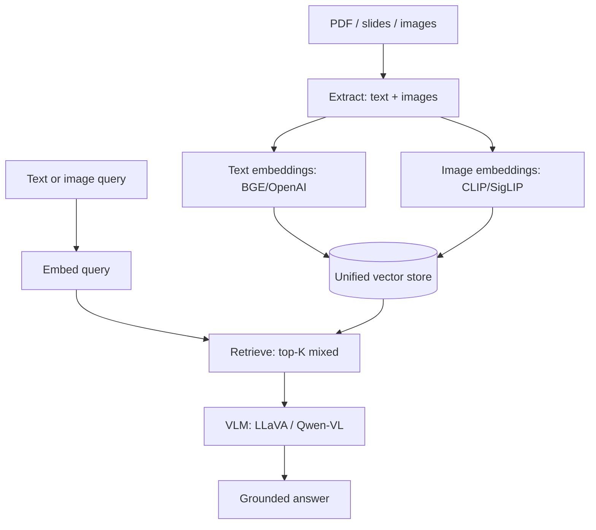

# 14 — Build a Multimodal RAG Pipeline

> [!info] TL;DR
> Build a RAG pipeline that handles documents with mixed text + images: PDFs with figures, slides with charts, screenshots with diagrams. The pipeline extracts text (OCR + layout), extracts images, embeds both modalities into a shared space, retrieves by text or image query, and generates answers using a Vision-Language Model (VLM). The key challenge is **cross-modal retrieval**: a text query like "what's the revenue trend?" should retrieve a chart image. By the end, you'll understand what systems like LlamaParse, ColPali, and VLM-based RAG do under the hood.

## Project Goals

By the end of this project, you will have built a multimodal RAG system that:

1. Ingests PDFs / slides / images and extracts both text and image content.
2. Stores text embeddings and image embeddings in a unified vector store.
3. Retrieves relevant chunks (text or image) for text or image queries.
4. Generates answers using a VLM (LLaVA, Qwen-VL, or GPT-4V) that can reason over both modalities.
5. Handles cross-modal queries (text → image, image → text, image → image).

The implementation uses CLIP for cross-modal embeddings and LLaVA for generation. By the end, you'll understand why multimodal RAG is harder than text-only RAG (modality gap, layout awareness, image quality) and what production systems do to handle these challenges.

## Architecture



## Prerequisites

- OpenAI API key (for text embeddings and optionally GPT-4V).
- A local VLM (LLaVA-NeXT or Qwen-VL via Ollama or HuggingFace).
- A test corpus: 5–10 PDFs with figures, or a set of slides.

```bash
pip install openai torch transformers pillow pypdf pdf2image
# For local VLM:
ollama pull llava:7b  # or llama3.2-vision
```

## Step 1: Document Extraction

PDFs contain both text (extractable) and images (figures, charts, scans). We need both.

```python
from pathlib import Path
from pypdf import PdfReader
from pdf2image import convert_from_path
import pillow as PIL

def extract_pdf(path: str) -> dict:
    """Extract text and page images from a PDF."""
    reader = PdfReader(path)
    text_pages = [page.extract_text() for page in reader.pages]

    # Convert each page to an image (for figure extraction and VLM input)
    page_images = convert_from_path(path, dpi=150)

    return {
        "text_pages": text_pages,
        "page_images": page_images,  # list of PIL.Image
        "num_pages": len(text_pages),
    }
```

For figure extraction (extracting embedded images from PDFs), use `PyMuPDF` (`fitz`) which can extract image XObjects:

```python
import fitz  # PyMuPDF

def extract_figures(path: str) -> list[PIL.Image]:
    """Extract embedded images from a PDF."""
    doc = fitz.open(path)
    figures = []
    for page in doc:
        for img in page.get_images():
            xref = img[0]
            pix = fitz.Pixmap(doc, xref)
            if pix.n - pix.alpha < 4:  # RGB or grayscale
                figures.append(PIL.Image.frombytes("RGB", [pix.width, pix.height], pix.samples))
            else:  # CMYK
                pix = fitz.Pixmap(fitz.csRGB, pix)
                figures.append(PIL.Image.frombytes("RGB", [pix.width, pix.height], pix.samples))
    return figures
```

For production: use LlamaParse, unstructured.io, or LayoutLM-based parsers that handle tables, captions, and figure-text relationships.

## Step 2: Cross-Modal Embeddings

The key challenge: text and images live in different embedding spaces. To retrieve images with text queries (or vice versa), we need a **shared embedding space**.

### CLIP for shared embeddings

CLIP (Contrastive Language-Image Pretraining) trains a text encoder and an image encoder to map matching text-image pairs to nearby points in a shared space. This means `embed_text("a cat")` and `embed_image(cat_image)` produce vectors that are close in cosine similarity.

```python
from transformers import CLIPProcessor, CLIPModel
import torch

clip_model = CLIPModel.from_pretrained("openai/clip-vit-base-patch32")
clip_processor = CLIPProcessor.from_pretrained("openai/clip-vit-base-patch32")

def embed_image_clip(image: PIL.Image) -> list[float]:
    inputs = clip_processor(images=image, return_tensors="pt")
    with torch.no_grad():
        embedding = clip_model.get_image_features(**inputs)
    # Normalize to unit length (CLIP works best with normalized embeddings)
    embedding = embedding / embedding.norm(dim=-1, keepdim=True)
    return embedding[0].tolist()

def embed_text_clip(text: str) -> list[float]:
    inputs = clip_processor(text=text, return_tensors="pt", truncation=True, max_length=77)
    with torch.no_grad():
        embedding = clip_model.get_text_features(**inputs)
    embedding = embedding / embedding.norm(dim=-1, keepdim=True)
    return embedding[0].tolist()
```

### Why not separate text and image embeddings?

You could use BGE for text and CLIP for images, storing them in separate indexes. But then a text query can't retrieve images directly — you'd need a separate image query, which the user didn't provide. CLIP's shared space enables cross-modal retrieval: text queries retrieve images, and image queries retrieve text.

The tradeoff: CLIP's text embeddings are weaker than BGE's for text-only retrieval. For production: use a **hybrid index** — BGE for text-to-text, CLIP for cross-modal. Route queries based on modality.

### SigLIP (better than CLIP)

SigLIP (Sigmoid Loss for Language-Image Pre-training) is a 2023 improvement over CLIP. It uses sigmoid loss instead of softmax, which works better at scale and produces better embeddings. For new projects, prefer SigLIP:

```python
from transformers import AutoProcessor, AutoModel

siglip_model = AutoModel.from_pretrained("google/siglip-base-patch16-224")
siglip_processor = AutoProcessor.from_pretrained("google/siglip-base-patch16-224")
```

## Step 3: The Unified Vector Store

Store both text chunks and image chunks in the same vector store, with metadata distinguishing modality.

```python
from dataclasses import dataclass

@dataclass
class MultimodalChunk:
    chunk_id: str
    modality: str  # "text" or "image"
    content: str  # Text content, or image description
    image: PIL.Image.Image | None  # The image itself (for image chunks)
    embedding: list[float]
    source: str  # Original document path
    page: int  # Page number
    bbox: tuple | None  # Bounding box (for images)

class MultimodalVectorStore:
    def __init__(self):
        self.chunks: list[MultimodalChunk] = []

    def add_text(self, chunk_id, text, embedding, source, page):
        self.chunks.append(MultimodalChunk(
            chunk_id=chunk_id, modality="text", content=text,
            image=None, embedding=embedding, source=source, page=page, bbox=None
        ))

    def add_image(self, chunk_id, image, description, embedding, source, page, bbox):
        self.chunks.append(MultimodalChunk(
            chunk_id=chunk_id, modality="image", content=description,
            image=image, embedding=embedding, source=source, page=page, bbox=bbox
        ))

    def search(self, query_embedding: list[float], top_k: int = 5) -> list[MultimodalChunk]:
        import numpy as np
        query = np.array(query_embedding)
        scores = []
        for chunk in self.chunks:
            emb = np.array(chunk.embedding)
            score = np.dot(query, emb) / (np.linalg.norm(query) * np.linalg.norm(emb))
            scores.append((score, chunk))
        scores.sort(reverse=True, key=lambda x: x[0])
        return [chunk for _, chunk in scores[:top_k]]
```

For production: use Qdrant or Weaviate, which natively support multimodal vectors and metadata filtering.

## Step 4: Ingestion Pipeline

```python
def ingest_document(path: str, store: MultimodalVectorStore):
    """Extract text and images from a document, embed, and store."""
    extracted = extract_pdf(path)

    # Process text pages
    for i, text in enumerate(extracted["text_pages"]):
        if not text.strip():
            continue
        # Chunk the text (simple paragraph-based chunking)
        paragraphs = text.split("\n\n")
        for j, para in enumerate(paragraphs):
            if len(para) < 50:
                continue
            embedding = embed_text_clip(para)  # Or BGE for text-only
            store.add_text(
                chunk_id=f"{path}_p{i}_para{j}",
                text=para,
                embedding=embedding,
                source=path,
                page=i,
            )

    # Process page images (full pages — useful for layout-aware retrieval)
    for i, page_image in enumerate(extracted["page_images"]):
        embedding = embed_image_clip(page_image)
        store.add_image(
            chunk_id=f"{path}_p{i}_full",
            image=page_image,
            description=f"Full page {i+1} of {path}",
            embedding=embedding,
            source=path,
            page=i,
            bbox=None,
        )

    # Process extracted figures
    figures = extract_figures(path)
    for i, fig in enumerate(figures):
        embedding = embed_image_clip(fig)
        store.add_image(
            chunk_id=f"{path}_fig{i}",
            image=fig,
            description=f"Figure {i+1} from {path}",
            embedding=embedding,
            source=path,
            page=-1,  # Unknown
            bbox=None,
        )
```

## Step 5: Retrieval

```python
def retrieve(query: str, store: MultimodalVectorStore, top_k: int = 5) -> list[MultimodalChunk]:
    """Retrieve top-k chunks for a text query."""
    query_embedding = embed_text_clip(query)
    return store.search(query_embedding, top_k=top_k)

def retrieve_by_image(query_image: PIL.Image, store: MultimodalVectorStore, top_k: int = 5) -> list[MultimodalChunk]:
    """Retrieve top-k chunks for an image query."""
    query_embedding = embed_image_clip(query_image)
    return store.search(query_embedding, top_k=top_k)
```

The same `store.search` works for both because text and image embeddings live in the same space (CLIP's shared space).

## Step 6: VLM Generation

The VLM takes the retrieved chunks (text + images) and generates an answer.

```python
import base64
from io import BytesIO

def image_to_base64(image: PIL.Image) -> str:
    buffered = BytesIO()
    image.save(buffered, format="PNG")
    return base64.b64encode(buffered.getvalue()).decode()

def generate_answer(query: str, retrieved_chunks: list[MultimodalChunk]) -> str:
    """Generate an answer using a VLM, given retrieved text and images."""
    # Build the prompt with interleaved text and images
    prompt_parts = [f"Question: {query}\n\nUse the following context to answer:\n"]

    for i, chunk in enumerate(retrieved_chunks):
        if chunk.modality == "text":
            prompt_parts.append(f"\n[Text excerpt {i+1}]: {chunk.content[:1000]}")
        else:  # image
            prompt_parts.append(f"\n[Image {i+1}]: {chunk.content}")

    prompt_parts.append("\n\nAnswer:")
    prompt = "".join(prompt_parts)

    # If we have images, use a VLM; otherwise, a text LLM suffices
    has_images = any(c.modality == "image" and c.image is not None for c in retrieved_chunks)

    if has_images:
        # Use LLaVA via Ollama
        import ollama
        images = [image_to_base64(c.image) for c in retrieved_chunks if c.image is not None]
        response = ollama.chat(
            model="llava:7b",
            messages=[{"role": "user", "content": prompt, "images": images}],
        )
        return response["message"]["content"]
    else:
        # Use a text-only LLM (cheaper, faster)
        from openai import OpenAI
        client = OpenAI()
        response = client.chat.completions.create(
            model="gpt-4o-mini",
            messages=[{"role": "user", "content": prompt}],
        )
        return response.choices[0].message.content
```

For production: use LLaVA-NeXT, Qwen-VL, or GPT-4V via API. The pattern is the same — interleave text and images in the prompt.

## Step 7: End-to-End Pipeline

```python
def multimodal_rag(query: str, store: MultimodalVectorStore) -> dict:
    """Full multimodal RAG pipeline."""
    # 1. Retrieve
    retrieved = retrieve(query, store, top_k=5)

    # 2. Generate
    answer = generate_answer(query, retrieved)

    return {
        "query": query,
        "answer": answer,
        "retrieved_chunks": [
            {
                "modality": c.modality,
                "content": c.content[:200],
                "source": c.source,
                "page": c.page,
            }
            for c in retrieved
        ],
    }

# Example usage
store = MultimodalVectorStore()
ingest_document("q3_report.pdf", store)
ingest_document("product_slides.pdf", store)

result = multimodal_rag("What was Q3 revenue and what does the trend chart show?", store)
print(result["answer"])
```

## Step 8: Cross-Modal Query Patterns

Multimodal RAG supports four query patterns:

1. **Text → Text**: traditional RAG. "What is X?" retrieves text chunks.
2. **Text → Image**: "Show me the revenue chart." retrieves image chunks.
3. **Image → Text**: given an image, retrieve related text. "What does this diagram mean?"
4. **Image → Image**: given an image, find similar images. Useful for deduplication.

```python
def multimodal_rag_with_image_query(query_image: PIL.Image, query_text: str, store: MultimodalVectorStore) -> dict:
    """RAG with both image and text query."""
    # Embed the image query
    img_embedding = embed_image_clip(query_image)
    txt_embedding = embed_text_clip(query_text)

    # Average the embeddings (simple fusion)
    import numpy as np
    fused = (np.array(img_embedding) + np.array(txt_embedding)) / 2
    fused = fused / np.linalg.norm(fused)

    retrieved = store.search(fused.tolist(), top_k=5)
    answer = generate_answer(query_text, retrieved)
    return {"query_text": query_text, "answer": answer, "retrieved": retrieved}
```

## Verification

After implementing, verify:

1. **Text queries retrieve relevant text** — "what is revenue?" should retrieve financial text.
2. **Text queries retrieve relevant images** — "show me the chart" should retrieve image chunks.
3. **Image queries retrieve relevant text** — given a chart image, retrieve the surrounding text.
4. **The VLM uses both modalities** — for "what does this chart show?", the answer should reference the image content, not just the text.
5. **Cross-modal retrieval is better than text-only** — for documents with key information in figures, multimodal RAG should outperform text-only RAG.

## Production Patterns

### Layout-aware parsing

Naive PDF extraction loses layout information (which text belongs to which figure). For production: use LlamaParse, unstructured.io, or LayoutLM-based parsers that preserve text-figure relationships. This enables "retrieve the figure and its caption together".

### ColPali-style late interaction

ColPali (2024) is a multimodal retrieval model that operates on **page images** directly, without text extraction. It embeds patches of each page image and uses late interaction (similar to ColBERT) to score query-page relevance. This bypasses OCR entirely and works well for documents with complex layouts.

### Modality routing

For most queries, text retrieval suffices. Only route to image retrieval when the query mentions visual content ("chart", "figure", "diagram", "show me"). A simple classifier on the query can route efficiently.

### Image quality

Low-resolution images hurt both embedding and VLM understanding. Use at least 150 DPI for PDFs; for screenshots, ensure they're not scaled down. VLMs typically work best with images ≥ 448×448.

### Cost management

VLM inference is 5–10× more expensive than text LLM inference. Only invoke the VLM when the retrieved context contains images. For text-only contexts, use a text LLM.

## Common Pitfalls

- **Mixing embedding spaces** — if you use BGE for text and CLIP for images without a shared space, cross-modal retrieval doesn't work. Use CLIP for both, or use a hybrid index with explicit routing.
- **Forgetting to normalize embeddings** — CLIP works best with unit-normalized embeddings. Cosine similarity assumes normalization.
- **Low-resolution images** — VLMs struggle with low-res images. Use ≥ 150 DPI for PDFs.
- **No layout awareness** — naive PDF extraction loses text-figure relationships. Use layout-aware parsers for production.
- **Treating all images equally** — a full page image and a small figure should be treated differently. Page images are for layout; figures are for content.
- **VLM hallucination** — VLMs can hallucinate image content. Always cross-check with text retrieval when possible.
- **Cost blowup** — invoking VLM for every query is expensive. Route to VLM only when images are retrieved.

## Further Reading

- Douze et al. (2024), *ColPali: Efficient Document Retrieval with Vision Language Models*.
- Laurençon et al. (2024), *Building and better understanding vision-language models: insights and future directions* (LLaVA).
- LlamaParse documentation: https://docs.llamaindex.ai/en/stable/llama_parse/
- unstructured.io: https://unstructured.io/
- CLIP: https://github.com/openai/CLIP

## Connection to Other Concepts

- [[17 - RAG/Ingestion and Retrieval/01 - RAG Pipeline Overview|RAG Pipeline Overview]] — the text-only version this extends.
- [[17 - RAG/Ingestion and Retrieval/02 - Chunking Hybrid Search Reranking|Chunking Hybrid Search Reranking]] — chunking for multimodal documents.
- [[23 - Multimodal AI/Vision-Language/02 - CLIP|CLIP]] — the cross-modal embedding model.
- [[23 - Multimodal AI/Vision-Language/03 - LLaVA|LLaVA]] — the VLM used for generation.
- [[23 - Multimodal AI/Vision-Language/01 - Multimodal AI Overview|Multimodal AI Overview]] — VLM architecture patterns.
- [[27 - Projects/Mini-Projects/02 - Build a Mini RAG Pipeline|Build a Mini RAG Pipeline]] — the text-only precursor.
- [[27 - Projects/Capstones/10 - Build a Vision-Language Model|Build a Vision-Language Model]] — building the VLM itself.
- [[09 - Foundation Models/Embedding Models/02 - Embedding Models for Retrieval|Embedding Models for Retrieval]] — text embedding models.

## Interview Questions

1. **Q: How does multimodal RAG differ from text-only RAG?**
   A: Three key differences. (1) **Cross-modal retrieval** — text queries must be able to retrieve images, and vice versa. This requires a shared embedding space (CLIP) or a hybrid index with routing. (2) **Layout awareness** — PDFs and slides have text-figure relationships that naive extraction loses. Production systems use layout-aware parsers (LlamaParse, unstructured.io). (3) **VLM generation** — when retrieved context contains images, you need a VLM (LLaVA, Qwen-VL, GPT-4V) instead of a text LLM. VLMs are 5–10× more expensive, so route to them only when images are present.

2. **Q: Why does CLIP enable cross-modal retrieval?**
   A: CLIP trains a text encoder and an image encoder to map matching text-image pairs to nearby points in a shared embedding space. After training, `embed_text("a cat")` and `embed_image(cat_image)` produce vectors that are close in cosine similarity. This means a text query can retrieve image chunks (by embedding the query as text and comparing to image embeddings), and an image query can retrieve text chunks. Without a shared space (e.g., BGE for text + ResNet for images), cross-modal retrieval requires a separate image query, which the user didn't provide.

3. **Q: What is ColPali and how does it differ from CLIP-based retrieval?**
   A: ColPali (2024) operates on **page images** directly, without text extraction. It embeds patches of each page image and uses late interaction (similar to ColBERT) to score query-page relevance. The key insight: text extraction is lossy (OCR errors, layout loss); operating on the page image preserves all information. ColPali outperforms text-based retrieval on documents with complex layouts (tables, forms, figures with captions). The downside: it requires more compute (vision encoder per page) and is harder to interpret.

4. **Q: How would you handle a document where key information is in figures, not text?**
   A: Three approaches. (1) **CLIP-based retrieval** — embed figures with CLIP, retrieve with text queries. Works for simple figures (charts, diagrams). (2) **VLM captioning** — use a VLM to generate a text description of each figure, embed the description with a text embedder (BGE), retrieve with text queries. Works for complex figures (the VLM "translates" the image to text). (3) **ColPali** — operate on page images directly, no text extraction. Works for documents with complex layouts. For production: try CLIP first (cheap); if retrieval quality is poor, try VLM captioning; if the document has complex layouts, try ColPali.

5. **Q: How do you manage cost in a multimodal RAG system?**
   A: Three strategies. (1) **Modality routing** — for most queries, text retrieval suffices. Only invoke image retrieval (and VLM generation) when the query mentions visual content ("chart", "figure", "diagram", "show me"). A simple keyword classifier on the query can route efficiently. (2) **Cache image embeddings** — images don't change; embed once and reuse. Text embeddings are also cacheable but less impactful (text is cheaper to embed). (3) **Use VLM only when images are retrieved** — for text-only contexts, use a text LLM (5–10× cheaper). The VLM is invoked only when the retrieved context contains images.

6. **Q: What are the failure modes of multimodal RAG?**
   A: Five common failures. (1) **Modality gap** — CLIP's text and image embeddings aren't perfectly aligned; some queries retrieve irrelevant images. (2) **VLM hallucination** — VLMs can hallucinate image content, especially for low-resolution or ambiguous images. Cross-check with text retrieval when possible. (3) **Layout loss** — naive PDF extraction loses text-figure relationships, leading to "retrieve the figure without its caption". Use layout-aware parsers. (4) **Image quality** — low-resolution images hurt both embedding and VLM understanding. Use ≥ 150 DPI for PDFs. (5) **Cost blowup** — invoking VLM for every query is expensive. Route to VLM only when images are retrieved.

## Production Hardening Checklist

1. **Layout-aware parsing**: use GROBID, LayoutLM, or Unstructured to preserve text-figure-table relationships. Naive PDF extraction loses critical layout info.
2. **Image preprocessing**: 150+ DPI for documents; resize to 224/336/384 for CLIP/SigLIP; normalize with the encoder's mean/std.
3. **Multi-vector indexes**: store both text embeddings (BM25 + dense) and image embeddings (CLIP/SigLIP) in the same vector DB with metadata filtering.
4. **Hybrid retrieval**: combine text retrieval + image retrieval with RRF (k=60). Pure image retrieval misses text-only queries; pure text misses image-only queries.
5. **Modality routing**: classify query as text/image/mixed; route to appropriate retriever. Saves VLM cost for text-only queries.
6. **VLM caching**: cache VLM responses by (image_hash, prompt_hash); same image+question → same answer.
7. **Image deduplication**: hash images; embed only unique images. Many documents have repeated figures.
8. **OCR fallback**: for text-heavy images (scanned PDFs), run OCR and embed the text alongside the image. Belt-and-suspenders.
9. **Hallucination guardrails**: refusal prompt ("If you cannot see X, say so"); confidence elicitation; cross-modal verification.
10. **Cost tracking**: VLM calls are 5–10x text LLM calls; track per-query cost; alert if >$0.50/query.
11. **Eval on multimodal benchmarks**: ViDoRe (document retrieval), VQA (visual QA), MMMU (multimodal understanding). Single-modality eval misses multimodal regressions.
12. **Streaming**: stream VLM generation; multimodal responses are slower and users benefit from progressive output.

## Common Failure Modes — Diagnostic Table

| Symptom                                | Likely Cause                                  | Fix                                                          |
|----------------------------------------|-----------------------------------------------|--------------------------------------------------------------|
| Image retrieval returns wrong images   | CLIP/SigLIP modality gap                      | Add text captions; use hybrid retrieval; try SigLIP-2         |
| VLM hallucinates image content         | Insufficient grounding; or low-res image     | Add refusal prompt; use higher-res images; cross-check with OCR |
| Text-figure relationships lost         | Naive PDF extraction                          | Use GROBID/Unstructured; preserve layout metadata            |
| VLM cost is 80% of total bill          | VLM invoked for every query                   | Modality routing; cache VLM responses; use text LLM fallback |
| Retrieval misses key figures           | Figure captions not embedded separately       | Embed captions as separate chunks linked to figure           |
| Slow ingestion                         | VLM captioning is expensive                   | Caption asynchronously; cache; or skip captioning if CLIP works |
| Can't handle tables                    | Tables aren't text or image                   | Use table-specific parser (Camelot, Tabula); embed as structured data |
| Low-res images degrade quality         | PDF source is low DPI                         | Re-render PDFs at 150+ DPI; or upscale images before embedding|
| Multilingual content fails             | CLIP is English-centric                       | Use multilingual CLIP; or translate captions                  |
| Eval shows high recall but users unhappy| Eval set doesn't test real queries           | Sample real production queries; refresh eval set              |

## Modern Developments (2024–2026)

### ColPali — Vision-Native Multimodal RAG
ColPali (Faysse et al., 2024) eliminates OCR entirely: treat each PDF page as a single image, embed page tokens via a VLM (PaliGemma), retrieve via late interaction (ColBERT-style MaxSim). Beats OCR-based pipelines by 15–25% on ViDoRe benchmark. Production-ready via open weights. See [[26 - Papers/Multimodal/48 - ColPali 2024]].

### SigLIP-2 Replaces CLIP
SigLIP-2 (2024) — sigmoid loss instead of softmax — is better at fine-grained recognition (OCR, small objects) and supports higher resolution. Most 2024+ multimodal RAG systems use SigLIP-2 for image embeddings.

### Multimodal Embedding Models
2024 saw specialized multimodal embedders: **VLM2Vec** (general-purpose multimodal embeddings), **EVA-CLIP** (high-res image embeddings), **Jina-CLIP-v2** (production-grade multimodal). These outperform vanilla CLIP for retrieval.

### Agentic Multimodal RAG
Combine multimodal RAG with an agent loop: the VLM decides when to retrieve, what modality, whether the results are sufficient. Self-correcting on retrieval failures. 2025 papers (Multi-RAG, CRAG-MM) extend agentic RAG to multimodal.

### Production Multimodal RAG Services
Major cloud services now offer managed multimodal RAG: Azure AI Search (multimodal), Google Vertex AI Search (multimodal), AWS Bedrock Knowledge Bases (multimodal). For teams without ML engineering, these are the fastest path to production.

## See Also

- [[27 - Projects/MOC|Projects MOC]]
- [[17 - RAG/Ingestion and Retrieval/01 - RAG Pipeline Overview|RAG Pipeline Overview]]
- [[17 - RAG/Ingestion and Retrieval/02 - Chunking Hybrid Search Reranking|Chunking Hybrid Search Reranking]]
- [[23 - Multimodal AI/Vision-Language/02 - CLIP|CLIP]]
- [[23 - Multimodal AI/Vision-Language/03 - LLaVA|LLaVA]]
- [[23 - Multimodal AI/Vision-Language/01 - Multimodal AI Overview|Multimodal AI Overview]]
- [[27 - Projects/Mini-Projects/02 - Build a Mini RAG Pipeline|Build a Mini RAG Pipeline]]
- [[27 - Projects/Capstones/10 - Build a Vision-Language Model|Build a Vision-Language Model]]
- [[09 - Foundation Models/Embedding Models/02 - Embedding Models for Retrieval|Embedding Models for Retrieval]]
