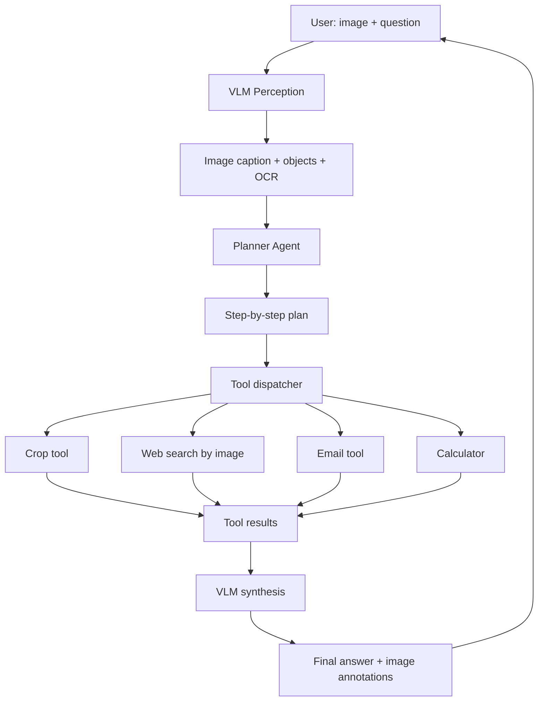

# 15 — Build a Multimodal Agent

> [!info] TL;DR
> Build an agent that can see images, reason about them, and use tools to act on the visual world. The agent combines a vision-language model (VLM) for perception, a planner for task decomposition, and tool-calling for actions (web search, image editing, file operations). This capstone integrates every major system covered in chapters 15, 19, and 23 into a single end-to-end multimodal system.

## Project Goals

By the end of this project, you will have built:
1. A VLM-backed perception layer (GPT-4V, Claude 3.5 Sonnet, Gemini 1.5 Pro).
2. A planner that decomposes multimodal tasks ("analyze this chart and email the summary").
3. Tool-calling for vision-aware actions (image cropping, OCR, web search by image).
4. Memory across turns — remember images and facts discussed earlier.
5. A working demo: upload an image, ask questions, watch the agent reason + act.

## Architecture



## Prerequisites

```bash
pip install openai anthropic Pillow requests
```

You need an API key for a VLM provider (OpenAI GPT-4V, Anthropic Claude 3.5 Sonnet, or Google Gemini 1.5 Pro).

## Step 1: Define the Vision Tools

```python
import base64
from io import BytesIO
from PIL import Image
from openai import OpenAI

client = OpenAI()

def encode_image(image_path: str) -> str:
    img = Image.open(image_path)
    if img.mode != 'RGB':
        img = img.convert('RGB')
    # Resize if too large (VLM APIs have token limits)
    max_dim = 1568  # GPT-4V recommendation
    if max(img.size) > max_dim:
        ratio = max_dim / max(img.size)
        img = img.resize((int(img.size[0] * ratio), int(img.size[1] * ratio)))
    buf = BytesIO()
    img.save(buf, format='JPEG', quality=85)
    return base64.b64encode(buf.getvalue()).decode()

def vlm_perceive(image_path: str, prompt: str = "Describe this image in detail.") -> str:
    """Use the VLM to extract information from an image."""
    b64 = encode_image(image_path)
    response = client.chat.completions.create(
        model="gpt-4o",
        messages=[{
            "role": "user",
            "content": [
                {"type": "text", "text": prompt},
                {"type": "image_url", "image_url": {"url": f"data:image/jpeg;base64,{b64}"}},
            ],
        }],
        max_tokens=500,
    )
    return response.choices[0].message.content
```

## Step 2: Define Vision-Aware Tools

```python
from PIL import Image
import requests

def crop_image(image_path: str, box: tuple[int, int, int, int], output_path: str) -> str:
    """Crop a region from an image. box = (left, top, right, bottom)."""
    img = Image.open(image_path)
    cropped = img.crop(box)
    cropped.save(output_path)
    return f"Cropped {box} from {image_path} → {output_path}"

def web_search_by_image(image_path: str) -> list[dict]:
    """Reverse image search to find similar images on the web."""
    # Use Google Lens API, TinEye, or Bing Visual Search
    b64 = encode_image(image_path)
    response = requests.post(
        "https://api.bing.microsoft.com/v7.0/images/visualsearch",
        headers={"Ocp-Apim-Subscription-Key": BING_API_KEY},
        json={"image": b64},
    )
    return [{"title": r["name"], "url": r["hostPageUrl"]} for r in response.json().get("tags", [{}])[0].get("actions", [{}])[0].get("data", {}).get("value", [])]

def ocr_image(image_path: str) -> str:
    """Extract text from an image. Uses VLM (no separate OCR needed)."""
    return vlm_perceive(image_path, "Extract all text from this image, preserving layout.")

def calculate(expression: str) -> str:
    """Safe arithmetic evaluation."""
    try:
        # Restrict to arithmetic only
        allowed = set('0123456789+-*/(). ')
        if not set(expression) <= allowed:
            return "Error: invalid characters"
        return str(eval(expression))
    except Exception as e:
        return f"Error: {e}"

TOOLS = [
    {"type": "function", "function": {
        "name": "crop_image",
        "description": "Crop a region from an image. Use when the user asks about a specific part of an image.",
        "parameters": {
            "type": "object",
            "properties": {
                "image_path": {"type": "string"},
                "box": {"type": "array", "items": {"type": "integer"}, "description": "[left, top, right, bottom]"},
                "output_path": {"type": "string"},
            },
            "required": ["image_path", "box", "output_path"],
        },
    }},
    # ... other tools
]
```

## Step 3: The Agent Loop

```python
async def multimodal_agent(image_path: str, user_query: str, max_turns: int = 10) -> str:
    """Run the multimodal agent loop."""
    messages = [
        {"role": "system", "content": "You are a multimodal assistant. You can see images, use tools, and reason step by step. Always explain what you're doing before calling tools."},
        {"role": "user", "content": [
            {"type": "text", "text": user_query},
            {"type": "image_url", "image_url": {"url": f"data:image/jpeg;base64,{encode_image(image_path)}"}},
        ]},
    ]

    for turn in range(max_turns):
        response = client.chat.completions.create(
            model="gpt-4o",
            messages=messages,
            tools=TOOLS,
            tool_choice="auto",
        )
        msg = response.choices[0].message
        messages.append(msg)

        if not msg.tool_calls:
            return msg.content  # Final answer

        for tc in msg.tool_calls:
            args = json.loads(tc.function.arguments)
            result = dispatch_tool(tc.function.name, args)
            messages.append({
                "role": "tool",
                "tool_call_id": tc.id,
                "content": str(result),
            })

    return "Max turns reached without final answer."
```

## Step 4: Memory for Cross-Turn Image References

```python
class ImageMemory:
    """Remember images and facts across turns."""
    def __init__(self):
        self.images: dict[str, str] = {}  # id → path
        self.facts: list[str] = []

    def add_image(self, path: str, description: str) -> str:
        img_id = f"img_{len(self.images) + 1}"
        self.images[img_id] = path
        self.facts.append(f"{img_id}: {description}")
        return img_id

    def get_context(self) -> str:
        """Inject memory into the system prompt."""
        if not self.facts:
            return ""
        return "\nPrevious images and facts:\n" + "\n".join(f"- {f}" for f in self.facts)
```

## Production Hardening Checklist

1. **Image size limits**: resize before upload; VLM APIs charge by image tokens.
2. **Rate limiting**: VLM calls are 5–10x more expensive than text; cap per-user.
3. **Caching**: cache VLM perceptions by image hash; same image → same perception.
4. **Privacy**: don't send user images to third-party tools (web search) without consent.
5. **Tool-call budget**: cap tool calls at 8/turn to prevent runaway loops.
6. **OCR fallback**: VLM OCR is good but not perfect; for dense text, use a dedicated OCR (Tesseract, cloud OCR) and pass the result to the VLM.
7. **Image annotation**: return bounding boxes / masks the VLM identified, overlaid on the image.
8. **Streaming**: stream the agent's reasoning + tool calls for transparency.
9. **Cost tracking**: per-turn VLM token cost; alert if >$0.50/turn.
10. **Eval**: build a 20-image test set with expected outputs; run on every change.

## Modern Developments (2024–2026)

### VLM Quality Leap (GPT-4o, Claude 3.5, Gemini 1.5)
2024 VLMs achieve near-human quality on chart reading, diagram interpretation, and OCR. The gap between text-only and vision-native RAG is closing — many tasks now work vision-natively without OCR.

### Computer Use Agents
Anthropic's Computer Use (2024) and OpenAI's Operator (2025) extended multimodal agents to GUI automation: screenshot, click, type. The agent in this project can be extended with computer-use tools.

### Vision-Native RAG (ColPali)
ColPali (2024) and follow-ups retrieve document pages as images directly, no OCR. Combined with a multimodal agent, this enables question-answering over complex documents (financial reports, scientific papers) with high accuracy. See [[26 - Papers/Multimodal/48 - ColPali 2024]].

### MCP for Vision Tools
Vision tools (crop, OCR, image search) are increasingly exposed as MCP servers. The agent in this project can be ported to use MCP for tool discovery and execution. See [[27 - Projects/Capstones/08 - Build an MCP Server]].

## Common Failure Modes — Diagnostic Table

| Symptom                                | Likely Cause                                  | Fix                                                          |
|----------------------------------------|-----------------------------------------------|--------------------------------------------------------------|
| VLM hallucinates image content         | Insufficient grounding; low-res image         | Add refusal prompt; use higher-res; cross-check with OCR      |
| Agent loops on same tool               | No tool-call budget                            | Cap tool calls at 8/turn; force-finalize on limit             |
| Image too large for VLM API            | No resize; raw 4K image                       | Resize to 1024–1568px; tile if fine detail needed             |
| Latency too high (10s+/turn)           | VLM call + tool calls + synthesis             | Use faster VLM (Haiku/Mini); parallelize tools; cache          |
| Cost spikes                            | VLM called every turn even for text queries   | Route text-only queries to text LLM; cache VLM perceptions    |
| Agent ignores retrieved images         | Images placed at end of context (lost-in-mid) | Place images near the user message; explicit reference        |
| Memory leaks across users              | ImageMemory not scoped to user                | Add user_id to memory; never share image memory across users  |
| VLM API rate limits hit                | Per-user rate too high; shared API key         | Per-user rate limit; separate API keys per tier               |
| Tool args have wrong format            | No Pydantic validation                        | Use Pydantic models for all tool args; reject invalid         |
| Cannot handle video input              | VLM doesn't support video natively            | Sample frames (1fps); process each as image; aggregate        |

## Interview Questions

1. **Q: Walk through what happens when a user uploads a chart and asks "what's the Q3 revenue?"**
   A: (1) VLM perceives the image: identifies it as a bar chart, extracts axis labels, OCR's the legend. (2) Planner decomposes: "find the Q3 bar, read its height, map to the y-axis scale, report the value." (3) Tool calls: maybe crop the Q3 region for higher-resolution VLM perception; use calculator to convert pixel height to revenue. (4) VLM synthesizes: "The Q3 bar reaches approximately 75% of the y-axis (which goes to $100M), so Q3 revenue is ~$75M." (5) Return with annotated image showing the Q3 bar highlighted.

2. **Q: How do you handle a VLM that hallucinates about image content?**
   A: (1) **Confidence elicitation**: prompt the VLM to report confidence per claim; downweight low-confidence claims. (2) **Multi-sample voting**: run perception 3 times, take the consensus. (3) **Tool verification**: if the VLM claims "the bar is 75% of the axis", use a crop tool to zoom in and re-perceive. (4) **Grounding**: require the VLM to cite image regions (bounding boxes) for claims; reject ungrounded claims. (5) **Fallback to OCR**: for text-heavy claims, use a dedicated OCR + text LLM pipeline as a sanity check.

3. **Q: How do you choose between GPT-4V, Claude 3.5 Sonnet, and Gemini 1.5 Pro?**
   A: Trade-offs: (1) **Quality**: Claude 3.5 Sonnet and GPT-4o are roughly tied; Gemini 1.5 Pro is slightly behind on chart reading but ahead on long-document tasks (1M+ tokens). (2) **Cost**: Gemini is cheapest per image; GPT-4o is mid; Claude is most expensive. (3) **Speed**: Gemini is fastest; Claude is slowest. (4) **Context**: Gemini supports 1M+ tokens (good for many-image tasks); others ~128k. (5) **Privacy**: Claude and Gemini have enterprise tiers with no-training guarantees; GPT-4V requires Zero Data Retention negotiation. Choose by use case: high-volume → Gemini; max quality → Claude or GPT-4o; many images → Gemini.

4. **Q: How do you build an evaluation set for a multimodal agent?**
   A: (1) Collect 50–100 real user images and questions. (2) For each, manually write the expected answer + expected tool calls. (3) Run the agent on each; score: (a) did it call the right tools? (b) did it produce the right final answer? (c) did it cite image regions correctly? (4) Use LLM-as-judge for fuzzy matching ("is 'about $75M' equivalent to '$74.8M'?"). (5) Track pass rate over time. (6) Add new test cases from production failures (escape hatch).

5. **Q: How do you handle very large images (e.g., 4K screenshots)?**
   A: (1) **Resize**: VLMs typically max out at 1024–1568px on the long side; resize before upload. (2) **Tile**: for tasks requiring fine detail (e.g., reading dense tables), split the image into overlapping tiles, send each tile separately, aggregate results. (3) **Hierarchical perception**: first perceive the whole image at low res to identify regions of interest; then crop and perceive those at high res. (4) **VLM-specific preprocessing**: GPT-4V recommends specific resize ratios; follow the provider's guidance.

6. **Q: How would you extend this agent to handle video?**
   A: (1) **Frame sampling**: sample 1 frame per second (or use scene-change detection to sample key frames). (2) **Per-frame perception**: run VLM on each sampled frame; collect descriptions. (3) **Temporal reasoning**: pass the sequence of frame descriptions + timestamps to the LLM for temporal reasoning ("what happens between 0:15 and 0:30?"). (4) **Tools**: add video-specific tools (extract clip, slow-motion, audio transcription). (5) **Cost control**: video at 1fps = 60 frames/minute × $0.01/frame = $0.36/minute. For long videos, use scene detection to reduce frame count.

## Connection to Other Concepts

- [[23 - Multimodal AI/MOC]] — parent chapter.
- [[23 - Multimodal AI/Vision-Language/01 - Multimodal AI Overview]] — VLM foundations.
- [[23 - Multimodal AI/Vision-Language/02 - CLIP]] — vision-language alignment.
- [[23 - Multimodal AI/Vision-Language/03 - LLaVA]] — open VLM.
- [[15 - AI Agents/MOC]] — agent patterns.
- [[15 - AI Agents/Tool Calling/04 - Function Calling]] — tool calling.
- [[19 - MCP/MOC]] — MCP for vision tools.
- [[27 - Projects/Mini-Projects/03 - Build a Mini Agent]] — text-only agent foundation.
- [[27 - Projects/Capstones/14 - Build a Multimodal RAG Pipeline]] — multimodal RAG.
- [[26 - Papers/Multimodal/48 - ColPali 2024]] — vision-native retrieval.
- [[27 - Projects/MOC]] — projects index.

## See Also

- [[27 - Projects/Mini-Projects/03 - Build a Mini Agent]]
- [[27 - Projects/Capstones/08 - Build an MCP Server]]
- [[27 - Projects/Capstones/14 - Build a Multimodal RAG Pipeline]]
- [[27 - Projects/MOC|27 Projects MOC]]
