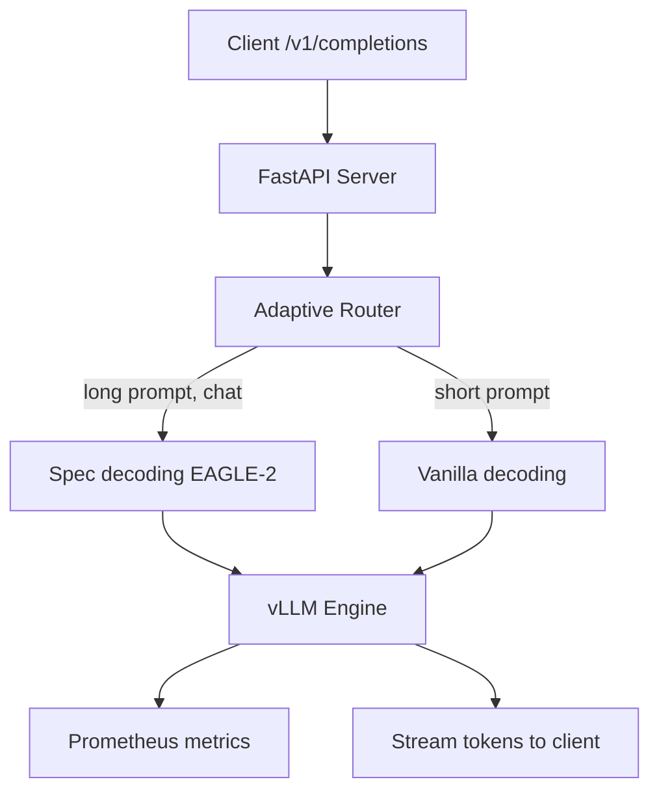

# 16 — Build a Speculative Decoding Server

> [!info] TL;DR
> Build a production inference server that uses speculative decoding (Medusa/EAGLE) to achieve 2–4x throughput on top of vLLM or TensorRT-LLM. The server wraps a base model + a draft head, exposes an OpenAI-compatible API, and adds observability for acceptance rate, speedup, and fallback to vanilla decoding. This capstone covers everything needed to deploy speculative decoding in production.

## Project Goals

By the end of this project, you will have built:
1. A FastAPI server with an OpenAI-compatible `/v1/completions` endpoint.
2. EAGLE-2 spec decoding integrated via vLLM's experimental support.
3. Per-request metrics: acceptance rate, effective speedup, draft overhead.
4. Adaptive control: fall back to vanilla decoding if acceptance rate drops.
5. A benchmarking harness comparing spec decoding vs vanilla on real workloads.

## Architecture



## Prerequisites

```bash
pip install vllm fastapi uvicorn prometheus-client
# EAGLE-2 model weights from HuggingFace (e.g., yuhuili/EAGLE-LLaMA3-Instruct-8B)
```

## Step 1: The Server with vLLM + EAGLE

```python
from fastapi import FastAPI
from fastapi.responses import StreamingResponse
from pydantic import BaseModel
from vllm import LLM, SamplingParams
import json
import time

app = FastAPI()

# Load the target model + EAGLE draft head
llm = LLM(
    model="meta-llama/Meta-Llama-3-8B-Instruct",
    # EAGLE-2 spec decoding configuration
    speculative_model="yuhuili/EAGLE-LLaMA3-Instruct-8B",
    num_speculative_tokens=5,
    use_v2_block_manager=True,
    enforce_eager=False,  # CUDA graphs for speed
    gpu_memory_utilization=0.9,
    max_model_len=8192,
)

class CompletionRequest(BaseModel):
    model: str
    prompt: str
    max_tokens: int = 512
    temperature: float = 0.7
    top_p: float = 0.9
    stream: bool = False

@app.post("/v1/completions")
async def completions(req: CompletionRequest):
    sampling = SamplingParams(
        temperature=req.temperature,
        top_p=req.top_p,
        max_tokens=req.max_tokens,
    )
    start = time.monotonic()

    if req.stream:
        async def stream_tokens():
            for output in llm.generate([req.prompt], sampling, use_tqdm=False):
                for tok in output.outputs[0].token_ids:
                    chunk = {
                        "id": "chatcmpl-xxx",
                        "object": "text_completion",
                        "choices": [{"text": llm.tokenizer.decode([tok]), "finish_reason": None}],
                    }
                    yield f"data: {json.dumps(chunk)}\n\n"
                yield "data: [DONE]\n\n"
            elapsed = time.monotonic() - start
            # Log metrics
            SPEC_DECODING_LATENCY.observe(elapsed)
        return StreamingResponse(stream_tokens(), media_type="text/event-stream")
    else:
        outputs = llm.generate([req.prompt], sampling, use_tqdm=False)
        text = outputs[0].outputs[0].text
        elapsed = time.monotonic() - start
        tokens_generated = len(outputs[0].outputs[0].token_ids)
        SPEC_DECODING_LATENCY.observe(elapsed)
        SPEC_DECODING_TOKENS_PER_SEC.inc(tokens_generated / elapsed)
        return {
            "id": "chatcmpl-xxx",
            "object": "text_completion",
            "choices": [{"text": text, "finish_reason": "stop"}],
            "usage": {
                "prompt_tokens": len(llm.tokenizer.encode(req.prompt)),
                "completion_tokens": tokens_generated,
            },
        }
```

## Step 2: Adaptive Router

```python
class AdaptiveRouter:
    """Decide whether to use spec decoding based on input characteristics."""
    def __init__(self):
        self.recent_acceptance_rates: list[float] = []
        self.min_acceptance_rate = 0.6  # Below this, fall back to vanilla

    def should_use_spec_decoding(self, prompt: str, max_tokens: int) -> bool:
        # Skip spec decoding for very short generations (overhead > benefit)
        if max_tokens < 50:
            return False
        # Skip if recent acceptance rate is poor
        if self.recent_acceptance_rates and \
           sum(self.recent_acceptance_rates[-100:]) / 100 < self.min_acceptance_rate:
            return False
        # Skip for code generation (spec decoding acceptance is lower on code)
        if "def " in prompt or "class " in prompt or "function " in prompt:
            return False
        return True

    def record_acceptance(self, rate: float):
        self.recent_acceptance_rates.append(rate)
        if len(self.recent_acceptance_rates) > 1000:
            self.recent_acceptance_rates = self.recent_acceptance_rates[-1000:]
```

## Step 3: Prometheus Metrics

```python
from prometheus_client import Counter, Histogram, Gauge

SPEC_DECODING_REQUESTS = Counter(
    "spec_decoding_requests_total",
    "Total spec decoding requests",
    ["mode"],  # mode = "spec" or "vanilla"
)
SPEC_DECODING_LATENCY = Histogram(
    "spec_decoding_latency_seconds",
    "End-to-end latency",
    ["mode"],
)
ACCEPTANCE_RATE = Gauge(
    "spec_decoding_acceptance_rate",
    "Recent spec decoding acceptance rate (0-1)",
)
EFFECTIVE_SPEEDUP = Gauge(
    "spec_decoding_effective_speedup",
    "Speedup vs vanilla decoding (1.0 = no speedup)",
)

@app.get("/metrics")
async def metrics():
    from prometheus_client import generate_latest
    return generate_latest()
```

## Step 4: Benchmarking Harness

```python
import asyncio
import time
import httpx

async def benchmark_prompts(prompts: list[str], mode: str, n_requests: int = 10):
    """Benchmark spec vs vanilla decoding."""
    async with httpx.AsyncClient() as client:
        latencies = []
        for prompt in prompts[:n_requests]:
            start = time.monotonic()
            resp = await client.post(
                "http://localhost:8000/v1/completions",
                json={"model": "llama-3-8b", "prompt": prompt, "max_tokens": 500, "stream": False},
                headers={"X-Decoding-Mode": mode},
                timeout=60.0,
            )
            latencies.append(time.monotonic() - start)
        return {
            "mean_latency": sum(latencies) / len(latencies),
            "p99_latency": sorted(latencies)[int(len(latencies) * 0.99)],
            "throughput": n_requests / sum(latencies),
        }

# Run benchmark
bench_prompts = [open(f"bench/p{i}.txt").read() for i in range(100)]
spec_results = await benchmark_prompts(bench_prompts, "spec")
vanilla_results = await benchmark_prompts(bench_prompts, "vanilla")
print(f"Spec: {spec_results}")
print(f"Vanilla: {vanilla_results}")
print(f"Speedup: {vanilla_results['mean_latency'] / spec_results['mean_latency']:.2f}x")
```

## Production Hardening Checklist

1. **Acceptance rate monitoring**: alert if rolling 1-min acceptance rate <0.6; auto-fallback to vanilla.
2. **Per-prompt-type adaptation**: track acceptance rate by prompt type (chat, code, math); route accordingly.
3. **Batched inference**: spec decoding interacts with batching — test with your typical batch sizes.
4. **Draft head versioning**: pin the draft model; don't auto-update (compatibility risk).
5. **Fallback to vanilla**: if draft head fails to load, server should still serve via vanilla decoding.
6. **GPU memory budget**: spec decoding adds ~5–10% memory overhead; account for it in `gpu_memory_utilization`.
7. **Streaming first-token latency**: spec decoding has higher TTFT (time-to-first-token) due to draft overhead; monitor and tune.
8. **Cost analysis**: spec decoding reduces per-token cost but increases GPU memory; net savings depend on utilization.
9. **A/B testing**: deploy spec and vanilla in parallel; route 50/50; measure quality (no degradation expected) and latency.
10. **Client compatibility**: spec decoding output is bit-identical to vanilla (rejection sampling preserves distribution); no client changes needed.

## Modern Developments (2024–2026)

### EAGLE-3 (2025)
EAGLE-3 adds confidence-aware scheduling: only speculate when the draft head is confident. Increases acceptance rate to 90–97% and speedup to 4–6x. Integrates with vLLM 0.6+.

### Multi-Token Prediction (MTP)
DeepSeek-V3 (2024) trains the model with multi-token prediction — every position predicts the next K tokens jointly. At inference, the MTP head acts as a draft model "for free" (no separate draft model needed). MTP is increasingly popular in 2025–2026 models.

### Speculative Decoding for Reasoning Models
Reasoning models (o1, DeepSeek-R1) generate long CoT sequences. Spec decoding on the CoT (but not the final answer) gives 2–3x speedup. The final answer is generated with vanilla decoding for maximum reliability.

### Lookahead Decoding
An alternative to spec decoding that doesn't need a draft model: uses Jacobi iteration to predict multiple tokens in parallel. Lower speedup than EAGLE (1.5–2x) but no draft model to train. Available in vLLM 0.6+.

## Common Failure Modes — Diagnostic Table

| Symptom                                | Likely Cause                                  | Fix                                                          |
|----------------------------------------|-----------------------------------------------|--------------------------------------------------------------|
| Acceptance rate <50%                   | Draft model mismatch; or code/creative queries| Fall back to vanilla; check draft model version              |
| Latency higher than vanilla            | Spec overhead > benefit at short generations  | Adaptive router: skip spec for max_tokens <50                |
| GPU OOM                                | Tree verification uses extra memory           | Reduce K (speculation length); reduce batch size              |
| Output differs from vanilla            | Bug in rejection sampling                     | Verify rejection sampling math; check distribution correction|
| First-token latency (TTFT) high        | Draft head overhead before first token        | Accept higher TTFT for throughput; or skip spec for short gen |
| Speedup degrades at high batch         | Tree verification doesn't batch well          | Use spec for batch<32; vanilla for batch>32; adaptive router |
| Draft model fails to load              | Wrong version; or quantization mismatch       | Pin draft model version; verify quantization matches target  |
| EAGLE-2 not supported in vLLM          | vLLM version too old                          | Upgrade to vLLM 0.6+; or use Medusa (broader support)        |
| Cost increases despite speedup         | Memory overhead forces smaller batch          | Measure tokens/$ not just tokens/sec; may need bigger GPU    |
| Quality regression on specific prompts | Spec decoding should be bit-identical         | Check for non-determinism; verify rejection sampling impl    |

## Interview Questions

1. **Q: Walk through what happens during one spec decoding step.**
   A: (1) Target model runs forward pass on current context, produces hidden state + next-token logits. (2) Draft head takes the hidden state, proposes K=5 candidate tokens (with their probabilities). (3) Target model runs a single forward pass on all 5 candidates in parallel (using attention masking to verify each branch independently). (4) For each candidate, compare draft probability vs target probability: accept if target's probability ≥ draft's; otherwise reject (and resample from the corrected distribution). (5) Accept the longest accepted prefix (e.g., if first 3 accepted, 4th rejected, use first 3 + a resampled 4th). (6) Repeat from step 1 with the new context.

2. **Q: When does spec decoding HURT performance?**
   A: (1) **Very short generations** (<50 tokens): draft overhead > speedup benefit. (2) **Low acceptance rate** (<50%): rejected drafts waste compute. (3) **Large batch sizes** (>32): tree verification has diminishing returns at high batch. (4) **Code generation**: draft models struggle with code's discrete structure; acceptance rate drops. (5) **Highly creative tasks** (poetry, brainstorming): draft models predict "safe" continuations that get rejected. (6) **GPU memory pressure**: spec decoding's extra memory can force smaller batch sizes, reducing throughput.

3. **Q: How does EAGLE-2's tree-based speculation differ from Medusa's?**
   A: Both use tree-structured speculation with a single forward pass for verification. Differences: (1) **Draft source**: Medusa uses K independent prediction heads (one per position); EAGLE uses an autoregressive draft model that predicts hidden features. (2) **Tree shape**: Medusa uses a static tree (fixed structure per step); EAGLE-2 dynamically chooses the tree based on predicted probabilities (more branches where the draft is confident). (3) **Acceptance rate**: EAGLE's feature-level prediction gives 85–95% acceptance; Medusa gets 70–85%. (4) **Implementation**: EAGLE requires training a small draft model; Medusa trains only K heads.

4. **Q: How would you deploy spec decoding in production with zero downtime?**
   A: (1) **Side-by-side deployment**: deploy spec decoding server alongside the existing vanilla server; route 5% of traffic to spec; monitor latency, errors, acceptance rate. (2) **Gradual rollout**: 5% → 25% → 50% → 100% over a week; auto-rollback if metrics degrade. (3) **Per-request fallback**: if spec decoding fails (draft model error, OOM), the server should serve the request via vanilla decoding without client-visible error. (4) **Quality validation**: spec decoding output is mathematically identical to vanilla (rejection sampling preserves distribution); validate this with a sample of outputs compared bit-for-bit. (5) **Cost monitoring**: spec decoding reduces per-token cost; verify the savings are realized (don't just measure latency).

5. **Q: How do you measure the actual speedup?**
   A: Three metrics: (1) **Tokens per second** (end-to-end): tokens generated / wall-clock time. (2) **Latency per request**: end-to-end time from request to last token. (3) **First-token latency (TTFT)**: time to first token — spec decoding often has higher TTFT due to draft overhead. The "real" speedup is tokens/sec; TTFT matters for interactive UX. Run a benchmark suite with representative prompts (chat, code, long-form, math) and report per-category speedup.

6. **Q: What's the difference between spec decoding and Multi-Token Prediction (MTP)?**
   A: Both predict multiple future tokens. Spec decoding uses a separate draft model (or head) at inference time, with the target model verifying. MTP is a training-time objective: the model is trained to predict the next K tokens jointly, so at inference the same model produces draft candidates "for free" — no separate draft model. MTP is conceptually cleaner but requires retraining; spec decoding works with any existing model. DeepSeek-V3 (2024) uses MTP; vLLM-based deployments use EAGLE-style spec decoding.

## Connection to Other Concepts

- [[13 - Inference/Speculative Decoding/05 - Speculative Decoding]] — chapter deep dive.
- [[13 - Inference/MOC]] — inference chapter.
- [[13 - Inference/Serving/04 - vLLM and Continuous Batching]] — vLLM integrates spec decoding.
- [[13 - Inference/Serving/08 - TensorRT-LLM]] — alternative inference engine.
- [[13 - Inference/Serving/06 - Continuous Batching Deep Dive]] — interaction with batching.
- [[26 - Papers/Efficient Attention/49 - Medusa and EAGLE 2024]] — paper this project implements.
- [[26 - Papers/2024-2026/28 - DeepSeek-V2 and V3 2024]] — MTP alternative.
- [[27 - Projects/MOC]] — projects index.

## See Also

- [[27 - Projects/MOC|27 Projects MOC]]
- [[13 - Inference/Speculative Decoding/05 - Speculative Decoding]]
