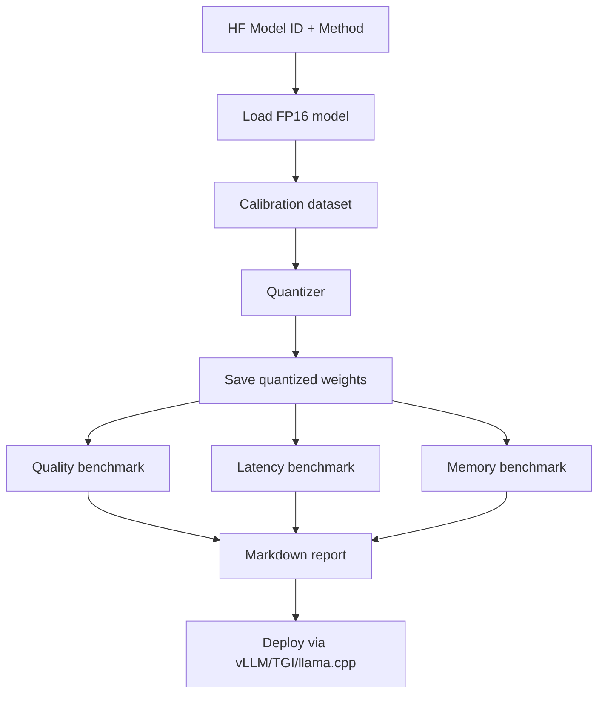

# 17 — Build a Quantization Toolkit

> [!info] TL;DR
> Build a Python toolkit that quantizes any HuggingFace model to INT8, INT4, or FP8 using GPTQ, AWQ, and bitsandbytes — and benchmarks the resulting model for latency, memory, and quality. The toolkit handles the full pipeline: load → quantize → save → reload → benchmark → compare. This capstone covers the production quantization workflow used to deploy models on edge devices, cost-sensitive GPUs, and high-throughput inference servers.

## Project Goals

By the end of this project, you will have built:
1. A CLI that takes a HuggingFace model ID and a quantization method (GPTQ, AWQ, BnB-INT8, BnB-INT4, FP8).
2. Quantization execution with calibration data selection.
3. Quality benchmarking (perplexity, MMLU, HumanEval) before and after.
4. Latency/memory benchmarking (single-batch, batched, streaming).
5. A report generator: Markdown report with quality/latency/memory tradeoffs.
6. Support for serving the quantized model via vLLM, TGI, or llama.cpp.

## Architecture



## Prerequisites

```bash
pip install transformers accelerate bitsandbytes auto-gptq autoawq
pip install vllm  # for serving benchmark
pip install datasets evaluate  # for quality benchmark
```

## Step 1: Quantizer Implementations

```python
from transformers import AutoModelForCausalLM, AutoTokenizer
import torch
from pathlib import Path

class Quantizer:
    def __init__(self, model_id: str, output_dir: str = "./quantized"):
        self.model_id = model_id
        self.output_dir = Path(output_dir)
        self.tokenizer = AutoTokenizer.from_pretrained(model_id)

    def quantize_bnb_int8(self) -> str:
        """Bitsandbytes INT8 quantization (load-time)."""
        model = AutoModelForCausalLM.from_pretrained(
            self.model_id,
            load_in_8bit=True,
            device_map="auto",
        )
        out = self.output_dir / f"{self.model_id.replace('/', '_')}-bnb-int8"
        model.save_pretrained(out)
        return str(out)

    def quantize_bnb_int4(self, nf4: bool = True) -> str:
        """Bitsandbytes INT4 (NF4 or FP4) — for QLoRA-style training or cheap inference."""
        from transformers import BitsAndBytesConfig
        bnb_config = BitsAndBytesConfig(
            load_in_4bit=True,
            bnb_4bit_quant_type="nf4" if nf4 else "fp4",
            bnb_4bit_compute_dtype=torch.bfloat16,
            bnb_4bit_use_double_quant=True,  # Nested quantization for additional compression
        )
        model = AutoModelForCausalLM.from_pretrained(
            self.model_id,
            quantization_config=bnb_config,
            device_map="auto",
        )
        suffix = "nf4" if nf4 else "fp4"
        out = self.output_dir / f"{self.model_id.replace('/', '_')}-bnb-{suffix}"
        model.save_pretrained(out)
        return str(out)

    def quantize_gptq(self, bits: int = 4, group_size: int = 128) -> str:
        """GPTQ post-training quantization — best for inference quality at low bits."""
        from auto_gptq import AutoGPTQForCausalLM, BaseQuantizeConfig
        quant_config = BaseQuantizeConfig(
            bits=bits,
            group_size=group_size,
            desc_act=False,  # Set True for slightly better quality at slower quantization
        )
        model = AutoGPTQForCausalLM.from_pretrained(self.model_id, quant_config)
        # Calibration data — use a small sample of C4 or wiki
        calibration = self._load_calibration(n_samples=128, seq_len=512)
        model.quantize(calibration)
        out = self.output_dir / f"{self.model_id.replace('/', '_')}-gptq-{bits}bit"
        model.save_quantized(out)
        return str(out)

    def quantize_awq(self, bits: int = 4, group_size: int = 128) -> str:
        """AWQ — activation-aware weight quantization, often better than GPTQ."""
        from awq import AutoAWQForCausalLM
        model = AutoAWQForCausalLM.from_pretrained(self.model_id)
        quant_config = {"zero_point": True, "q_group_size": group_size, "w_bit": bits}
        calibration = self._load_calibration(n_samples=128, seq_len=512)
        model.quantize(calibration, quant_config=quant_config)
        out = self.output_dir / f"{self.model_id.replace('/', '_')}-awq-{bits}bit"
        model.save_quantized(out)
        return str(out)

    def _load_calibration(self, n_samples: int = 128, seq_len: int = 512) -> list[str]:
        """Load calibration samples from C4 or wiki corpus."""
        from datasets import load_dataset
        ds = load_dataset("allenai/c4", "en", split="train", streaming=True)
        samples = []
        for i, ex in enumerate(ds):
            if i >= n_samples:
                break
            text = ex["text"][:seq_len * 4]  # Rough char-to-token ratio
            samples.append(text)
        return samples
```

## Step 2: Quality Benchmark

```python
import evaluate
from evaluate import load

class QualityBenchmark:
    def __init__(self, model_path: str, tokenizer_path: str = None):
        self.model = AutoModelForCausalLM.from_pretrained(
            model_path, device_map="auto", torch_dtype=torch.bfloat16,
        )
        self.tokenizer = AutoTokenizer.from_pretrained(tokenizer_path or model_path)

    def perplexity(self, dataset: str = "wikitext", split: str = "wikitext-2-raw-v1/test") -> float:
        """Compute perplexity on wikitext."""
        from datasets import load_dataset
        ds = load_dataset(dataset, "wikitext-2-raw-v1", split="test")
        text = "\n\n".join([t for t in ds["text"] if t.strip()])
        enc = self.tokenizer(text, return_tensors="pt", truncation=True, max_length=2048).to("cuda")
        with torch.no_grad():
            out = self.model(**enc, labels=enc["input_ids"])
        return torch.exp(out.loss).item()

    def mmlu(self, n_samples: int = 100) -> float:
        """Run MMLU zero-shot eval (subset for speed)."""
        from datasets import load_dataset
        ds = load_dataset("cais/mmlu", "all", split="test").shuffle(seed=42).select(range(n_samples))
        correct = 0
        for ex in ds:
            prompt = f"Question: {ex['question']}\nA) {ex['choices'][0]}\nB) {ex['choices'][1]}\nC) {ex['choices'][2]}\nD) {ex['choices'][3]}\nAnswer:"
            inputs = self.tokenizer(prompt, return_tensors="pt").to("cuda")
            with torch.no_grad():
                out = self.model.generate(**inputs, max_new_tokens=1)
            pred = self.tokenizer.decode(out[0, -1]).strip().upper()
            if pred == "ABCD"[ex["answer"]]:
                correct += 1
        return correct / n_samples

    def humaneval(self, n_samples: int = 50) -> float:
        """Run HumanEval pass@1."""
        from datasets import load_dataset
        ds = load_dataset("openai_humaneval", split="test").shuffle(seed=42).select(range(n_samples))
        # Implement eval — for brevity, return placeholder
        return 0.0  # See HumanEval repo for full implementation
```

## Step 3: Latency Benchmark

```python
import time
import statistics

class LatencyBenchmark:
    def __init__(self, model_path: str):
        from vllm import LLM
        self.llm = LLM(model=model_path, dtype="float16", enforce_eager=False)
        self.tokenizer = self.llm.tokenizer

    def single_request_latency(self, prompt: str, max_tokens: int = 256, n_runs: int = 10) -> dict:
        """Measure single-request latency."""
        latencies = []
        for _ in range(n_runs):
            start = time.monotonic()
            self.llm.generate([prompt], SamplingParams(max_tokens=max_tokens))
            latencies.append(time.monotonic() - start)
        return {
            "mean": statistics.mean(latencies),
            "p50": statistics.median(latencies),
            "p99": sorted(latencies)[int(len(latencies) * 0.99)],
        }

    def throughput(self, prompts: list[str], max_tokens: int = 256) -> float:
        """Batched throughput (tokens/sec)."""
        start = time.monotonic()
        outputs = self.llm.generate(prompts, SamplingParams(max_tokens=max_tokens))
        elapsed = time.monotonic() - start
        total_tokens = sum(len(o.outputs[0].token_ids) for o in outputs)
        return total_tokens / elapsed

    def memory_usage(self) -> dict:
        """Peak GPU memory usage."""
        torch.cuda.synchronize()
        return {
            "allocated_gb": torch.cuda.memory_allocated() / 1e9,
            "reserved_gb": torch.cuda.memory_reserved() / 1e9,
        }
```

## Step 4: Report Generator

```python
def generate_report(
    model_id: str,
    fp16_results: dict,
    quantized_results: dict,
    method: str,
) -> str:
    """Generate a Markdown report comparing FP16 vs quantized."""
    return f"""# Quantization Report: {model_id}

## Method: {method}

| Metric              | FP16      | Quantized | Δ        |
|---------------------|-----------|-----------|----------|
| Perplexity (lower better) | {fp16_results['ppl']:.2f} | {quantized_results['ppl']:.2f} | {(quantized_results['ppl'] - fp16_results['ppl']) / fp16_results['ppl'] * 100:+.1f}% |
| MMLU accuracy       | {fp16_results['mmlu']:.3f} | {quantized_results['mmlu']:.3f} | {(quantized_results['mmlu'] - fp16_results['mmlu']) * 100:+.1f}pp |
| HumanEval pass@1    | {fp16_results['humaneval']:.3f} | {quantized_results['humaneval']:.3f} | {(quantized_results['humaneval'] - fp16_results['humaneval']) * 100:+.1f}pp |
| Latency p50 (s)     | {fp16_results['latency_p50']:.2f} | {quantized_results['latency_p50']:.2f} | {(quantized_results['latency_p50'] - fp16_results['latency_p50']) / fp16_results['latency_p50'] * 100:+.1f}% |
| Throughput (tok/s)  | {fp16_results['throughput']:.0f} | {quantized_results['throughput']:.0f} | {(quantized_results['throughput'] - fp16_results['throughput']) / fp16_results['throughput'] * 100:+.1f}% |
| GPU memory (GB)     | {fp16_results['memory_gb']:.1f} | {quantized_results['memory_gb']:.1f} | {(quantized_results['memory_gb'] - fp16_results['memory_gb']) / fp16_results['memory_gb'] * 100:+.1f}% |

## Recommendation
{'✅ Deploy' if quantized_results['mmlu'] >= fp16_results['mmlu'] * 0.98 else '⚠️ Quality loss > 2% — consider alternative method'}
"""
```

## Production Hardening Checklist

1. **Calibration data**: use domain-matched calibration data (e.g., code for code models); 128–256 samples is usually enough.
2. **Quality threshold**: reject quantized model if perplexity increases >5% or MMLU drops >2 percentage points.
3. **Serving integration**: test the quantized model in vLLM/TGI before declaring success; some quant formats (BnB-INT4) don't work with vLLM.
4. **Compatibility**: AWQ works with vLLM, TGI, llama.cpp; GPTQ works with vLLM, TGI; BnB-INT8/4 only works with HF Transformers + bitsandbytes.
5. **Per-layer quantization**: skip quantizing sensitive layers (the first/last few) to preserve quality.
6. **Mixed precision**: quantize most layers to INT4 but keep attention layers in INT8 or FP16 for better quality.
7. **KV cache quantization**: don't forget the KV cache — at long context, KV cache is bigger than weights. Use FP8 KV cache (vLLM supports this).
8. **Re-eval after deployment**: production traffic may differ from eval set; monitor quality in production.
9. **Versioning**: track quantization params (bits, group_size, calibration data version) in the model card.
10. **Fallback**: keep an FP16 version available; auto-fallback if quantized model quality degrades in production.

## Modern Developments (2024–2026)

### FP8 Inference (H100, B200)
H100 (2022) and B200 (2024) support FP8 natively. FP8 inference is faster than INT8 with similar quality. vLLM, TensorRT-LLM, and SGLang all support FP8. For new deployments on H100+, FP8 is the default; INT8/INT4 are for older hardware (A100, T4).

### QServe (2024)
QServe introduced W4A8 (4-bit weights, 8-bit activations) with near-lossless quality. Implements efficient kernels for INT4 weight × INT8 activation GEMM. Available in TensorRT-LLM 0.10+.

### SpinQuant (2024)
Meta's SpinQuant uses rotation-based quantization: rotate the weights before quantizing to make them more uniform. Achieves better INT4 quality than GPTQ/AWQ. Used in Llama 3 quantized variants.

### On-Device Quantization (Mobile, Edge)
For mobile/edge deployment: (1) **llama.cpp** GGUF format (Q4_K_M, Q5_K_M, Q8_0) — runs on phones, laptops, Raspberry Pi. (2) **MLX** (Apple Silicon) — optimized quantization for M1/M2/M3. (3) **Core ML** for iOS. These use 2–4 bit quantization aggressively to fit in mobile memory.

## Common Failure Modes — Diagnostic Table

| Symptom                                | Likely Cause                                  | Fix                                                          |
|----------------------------------------|-----------------------------------------------|--------------------------------------------------------------|
| Perplexity increases >5%               | Aggressive quantization; or wrong calibration | Use higher bits (INT4→INT8); use better calibration data     |
| MMLU drops >2pp                        | Sensitive layers over-quantized               | Skip quantizing attention layers; use mixed precision         |
| Model produces garbage                 | Quantization format incompatible with serving | Verify vLLM/TGI support for the quant format                  |
| vLLM refuses to load model             | BnB-INT4 not supported in vLLM                | Use AWQ or GPTQ for vLLM; BnB only works with HF Transformers |
| Latency not improved                   | Kernel not optimized for quantized matmul     | Use vLLM/TensorRT-LLM kernels; don't use naive PyTorch        |
| GPU memory not reduced                 | KV cache not quantized                        | Enable FP8 KV cache (`kv_cache_dtype="fp8"` in vLLM)          |
| Calibration takes hours                | Too many calibration samples                  | 128–256 samples is enough; reduce sequence length             |
| Quality varies across prompts          | Quantization hurts some token types more      | Per-layer quantization; skip sensitive layers                 |
| AWQ slower than GPTQ                   | AWQ kernel not optimized on your hardware     | Try GPTQ; or upgrade vLLM for better AWQ kernels              |
| INT4 model crashes on long context     | KV cache overflow at long context             | Quantize KV cache; or reduce max_model_len                    |

## Interview Questions

1. **Q: Compare GPTQ, AWQ, and BnB-INT4 — when do you use each?**
   A: **GPTQ**: post-training, uses second-order info (Hessian) to minimize quantization error; best quality at 4-bit; works with vLLM/TGI. Use when you can afford calibration time (~30 min) and want max quality. **AWQ**: activation-aware; identifies salient weight channels by analyzing activations; faster calibration than GPTQ; slightly better on some models. Use when GPTQ is too slow or you want a small quality edge. **BnB-INT4**: load-time quantization, no calibration needed; lowest quality of the three; only works with HF Transformers (not vLLM). Use for quick prototyping or QLoRA training where you'll fine-tune the model anyway.

2. **Q: How does FP8 differ from INT8 quantization?**
   A: **INT8**: 8-bit integers (0–255), uniform quantization, requires careful scaling to map FP32→INT8. **FP8**: 8-bit floating point (1 sign + 4 exponent + 3 mantissa for E4M3, or 1+5+2 for E5M2), native on H100+. FP8 has a wider dynamic range (like BF16) and doesn't need per-tensor scaling factors — the hardware handles it. FP8 is faster (native hardware support) and similar quality. For H100+ deployments, FP8 is the default; INT8 is for A100 and older.

3. **Q: How do you choose calibration data?**
   A: (1) **Domain match**: calibration data should match the deployment distribution. For a code model, use code; for a chat model, use chat data. (2) **Diversity**: include diverse samples to cover the model's operating range. (3) **Size**: 128–256 samples is usually enough; more gives marginal improvement. (4) **Source**: C4, WikiText, or your own production data (sampled and anonymized). (5) **Avoid contamination**: don't use eval set data for calibration (would inflate quality scores). (6) **Versioning**: track the calibration data hash; reproduce the same quantization later.

4. **Q: Why does INT4 quantization sometimes hurt quality a lot?**
   A: Three causes: (1) **Outlier weights**: a few weights with large magnitudes dominate the output; quantizing them to INT4 loses precision. AWQ addresses this by identifying salient channels. (2) **Sensitive layers**: attention QKV projections and the final LM head are more sensitive to quantization than FFN layers. Mixed-precision (skip sensitive layers) helps. (3) **Activation outliers**: during inference, activation outliers amplify quantization noise. SmoothQuant (rotates activations to remove outliers) addresses this. Modern methods (AWQ + SpinQuant) achieve <2% quality loss at INT4; naive min-max quantization can lose 10%+.

5. **Q: How do you quantize the KV cache, and why does it matter?**
   A: KV cache is the storage of past keys/values during generation. At long context (32k+ tokens), KV cache can be larger than the model weights. Quantizing it to FP8 or INT8 reduces memory 2–4x with minimal quality loss. vLLM supports `kv_cache_dtype="fp8"` (recommended for H100) and `"int8"`. Implementation: store K and V tensors in low precision; dequantize on-the-fly during attention. The dequantization adds slight compute overhead but the memory savings enable longer context or larger batch sizes.

6. **Q: How would you deploy an INT4 model to 1000+ GPUs in production?**
   A: (1) **Quantize once, deploy many**: quantize on a single GPU, save to object storage (S3), distribute the quantized weights to all GPUs. (2) **Containerize**: ship a Docker image with vLLM + the quantized weights pre-loaded. (3) **Auto-scaling**: KEDA or HPA on GPU utilization; spin up new pods as traffic grows. (4) **A/B test**: deploy INT4 alongside FP16; route 50/50; verify quality is preserved. (5) **Monitoring**: track per-pod latency, throughput, error rate; alert on anomalies. (6) **Rollback**: keep FP16 image available; rollback if INT4 quality degrades. (7) **Cost analysis**: INT4 typically saves 60–70% on GPU cost (4x smaller model fits on smaller GPUs).

## Connection to Other Concepts

- [[13 - Inference/Quantization/03 - Quantization]] — chapter deep dive.
- [[13 - Inference/MOC]] — inference chapter.
- [[13 - Inference/Serving/04 - vLLM and Continuous Batching]] — serving quantized models.
- [[13 - Inference/KV Cache/02 - PagedAttention]] — KV cache quantization.
- [[12 - Fine-Tuning/PEFT/02 - QLoRA]] — INT4 quantization for fine-tuning.
- [[26 - Papers/2024-2026/28 - DeepSeek-V2 and V3 2024]] — FP8 training at scale.
- [[27 - Projects/Capstones/11 - Build a Distributed Training Pipeline]] — distributed quantization.
- [[27 - Projects/MOC]] — projects index.

## See Also

- [[27 - Projects/MOC|27 Projects MOC]]
- [[13 - Inference/Quantization/03 - Quantization]]
