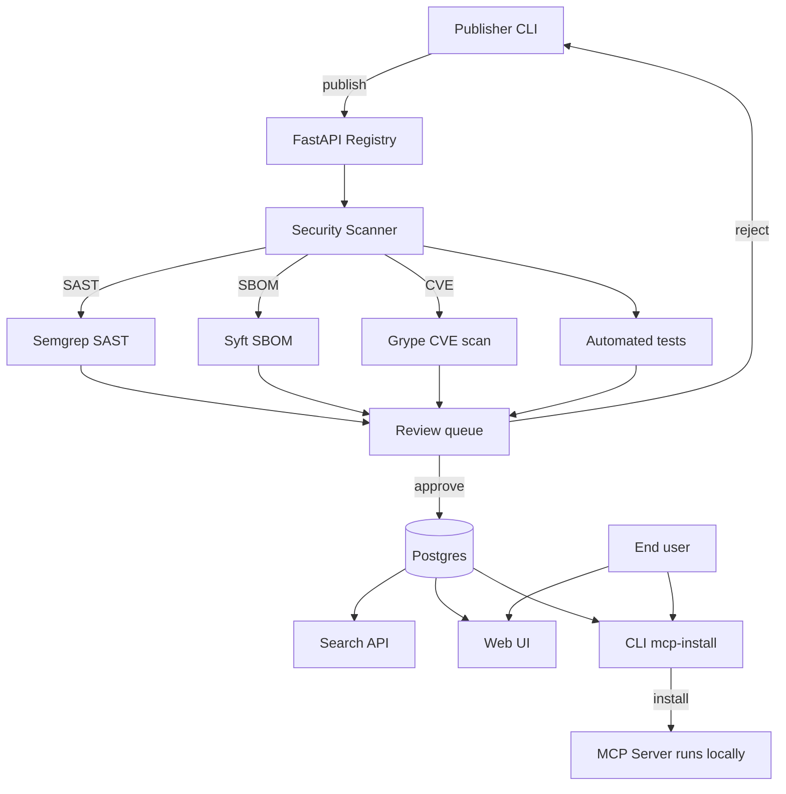

# 18 — Build an MCP Marketplace

> [!info] TL;DR
> Build a registry where developers publish, discover, and install MCP servers — like npm or PyPI but for MCP. The marketplace handles: server publishing (with security review), discovery (search, categories), installation (one-command setup), versioning (semver with security advisories), and telemetry (download counts, quality scores). This capstone combines everything from chapter 19 (MCP) and chapter 22 (Production AI) into a full SaaS product.

## Project Goals

By the end of this project, you will have built:
1. A registry backend (FastAPI + Postgres) that stores MCP server metadata.
2. A publishing flow with automated security scanning (SBOM, SAST, dependency audit).
3. A CLI (`mcp-install`) for one-command server installation.
4. A web UI for browsing and searching MCP servers.
5. Versioning with security advisories (CVE tracking).
6. Download telemetry and quality scores (user ratings + automated tests).

## Architecture



## Prerequisites

```bash
pip install fastapi uvicorn sqlalchemy pydantic semgrep syft grype
# Postgres + Redis for production
```

## Step 1: The Server Schema

```python
from sqlalchemy import Column, String, Integer, DateTime, JSON, Boolean, ForeignKey
from sqlalchemy.orm import declarative_base
from datetime import datetime

Base = declarative_base()

class MCPServer(Base):
    __tablename__ = "mcp_servers"
    id = Column(String, primary_key=True)  # e.g., "github"
    name = Column(String, unique=True, nullable=False)
    description = Column(String, nullable=False)
    publisher = Column(String, nullable=False)  # e.g., "Anthropic", "community:alice"
    homepage = Column(String)
    repository = Column(String)  # GitHub URL
    latest_version = Column(String)
    created_at = Column(DateTime, default=datetime.utcnow)
    updated_at = Column(DateTime, default=datetime.utcnow)
    download_count = Column(Integer, default=0)
    quality_score = Column(Integer, default=0)  # 0-100, computed
    security_status = Column(String, default="pending")  # pending/approved/rejected
    categories = Column(JSON, default=list)  # ["filesystem", "github", "search"]

class MCPVersion(Base):
    __tablename__ = "mcp_versions"
    id = Column(String, primary_key=True)  # f"{server_id}:{version}"
    server_id = Column(String, ForeignKey("mcp_servers.id"))
    version = Column(String)  # semver
    release_notes = Column(String)
    published_at = Column(DateTime, default=datetime.utcnow)
    artifact_url = Column(String)  # S3 URL to Docker image / wheel
    artifact_hash = Column(String)  # SHA-256
    sbom = Column(JSON)  # Software Bill of Materials
    security_scan = Column(JSON)  # Results from SAST + CVE scan
    signed_by = Column(String)  # Publisher key fingerprint
    deprecated = Column(Boolean, default=False)

class SecurityAdvisory(Base):
    __tablename__ = "security_advisories"
    id = Column(String, primary_key=True)
    server_id = Column(String, ForeignKey("mcp_servers.id"))
    version_affected = Column(String)  # semver range
    severity = Column(String)  # low/medium/high/critical
    description = Column(String)
    cve = Column(String)
    published_at = Column(DateTime, default=datetime.utcnow)
```

## Step 2: Publishing Flow

```python
from fastapi import FastAPI, HTTPException, UploadFile, File
from pydantic import BaseModel

app = FastAPI()

class PublishRequest(BaseModel):
    name: str
    description: str
    version: str
    repository: str
    categories: list[str]

@app.post("/v1/servers/publish")
async def publish_server(
    req: PublishRequest,
    artifact: UploadFile = File(...),
    publisher_token: str = Depends(verify_publisher_token),
):
    """Submit a new MCP server version for review."""
    # 1. Validate semver
    if not is_valid_semver(req.version):
        raise HTTPException(400, "Invalid semver")

    # 2. Store artifact
    artifact_url = await store_artifact(artifact, req.name, req.version)
    artifact_hash = sha256(artifact)

    # 3. Run security scans
    sbom = await generate_sbom(artifact)
    sast_results = await run_sast(artifact)
    cve_results = await run_cve_scan(sbom)

    # 4. Run automated tests
    test_results = await run_smoke_tests(artifact_url)

    # 5. Compute quality score
    quality_score = compute_quality_score(
        sbom=sbom, sast=sast_results, cve=cve_results, tests=test_results,
    )

    # 6. Decide: auto-approve or queue for manual review
    if quality_score >= 80 and not cve_results.critical:
        status = "approved"
    else:
        status = "pending_review"

    # 7. Insert into DB
    server = upsert_server(req, publisher_token.publisher)
    version = insert_version(
        server_id=server.id,
        version=req.version,
        artifact_url=artifact_url,
        artifact_hash=artifact_hash,
        sbom=sbom,
        security_scan={"sast": sast_results, "cve": cve_results},
        quality_score=quality_score,
        status=status,
    )

    return {"server_id": server.id, "version_id": version.id, "status": status}
```

## Step 3: Security Scanning

```python
async def run_sast(artifact: UploadFile) -> dict:
    """Run Semgrep static analysis on the MCP server source."""
    # Extract source from artifact
    source_dir = await extract_artifact(artifact)
    # Run Semgrep with MCP-specific rules
    result = subprocess.run(
        ["semgrep", "--config", "p/mcp-security", "--json", source_dir],
        capture_output=True,
    )
    findings = json.loads(result.stdout)["results"]
    return {
        "total_findings": len(findings),
        "critical": sum(1 for f in findings if f["extra"]["severity"] == "ERROR"),
        "warning": sum(1 for f in findings if f["extra"]["severity"] == "WARNING"),
        "findings": findings[:10],  # Top 10
    }

async def generate_sbom(artifact: UploadFile) -> dict:
    """Generate Software Bill of Materials."""
    source_dir = await extract_artifact(artifact)
    result = subprocess.run(["syft", "dir:{source_dir}", "-o", "json"], capture_output=True)
    return json.loads(result.stdout)

async def run_cve_scan(sbom: dict) -> dict:
    """Scan SBOM for known CVEs using Grype."""
    result = subprocess.run(["grype", "sbom:-", "-o", "json"], input=json.dumps(sbom), capture_output=True, text=True)
    matches = json.loads(result.stdout)["matches"]
    return {
        "total_cves": len(matches),
        "critical": sum(1 for m in matches if m["vulnerability"]["severity"] == "Critical"),
        "high": sum(1 for m in matches if m["vulnerability"]["severity"] == "High"),
        "matches": matches[:10],
    }
```

## Step 4: The CLI

```python
# mcp_install/cli.py
import typer
import subprocess
import yaml
from pathlib import Path

app = typer.Typer()

@app.command()
def install(server_name: str, version: str = "latest"):
    """Install an MCP server from the marketplace."""
    # 1. Fetch metadata from registry
    meta = requests.get(f"https://registry.mcp.dev/v1/servers/{server_name}").json()
    if version == "latest":
        version = meta["latest_version"]
    ver_meta = requests.get(f"https://registry.mcp.dev/v1/servers/{server_name}/{version}").json()

    # 2. Verify security status
    if ver_meta["security_status"] != "approved":
        typer.echo(f"⚠️  Version {version} is not approved (status: {ver_meta['security_status']})")
        if not typer.confirm("Continue anyway?"):
            raise typer.Abort()

    # 3. Check for known CVEs
    if ver_meta["security_scan"]["cve"]["critical"] > 0:
        typer.echo(f"❌ {ver_meta['security_scan']['cve']['critical']} critical CVEs in dependencies")
        raise typer.Abort()

    # 4. Download artifact
    typer.echo(f"📥 Downloading {server_name}@{version}...")
    artifact_path = download_artifact(ver_meta["artifact_url"], ver_meta["artifact_hash"])

    # 5. Install based on artifact type
    if artifact_path.endswith(".whl"):
        subprocess.run(["pip", "install", artifact_path])
    elif artifact_path.endswith(".tar"):
        # Docker image
        subprocess.run(["docker", "load", "-i", artifact_path])

    # 6. Update local config
    config_path = Path("~/.config/mcp/servers.yaml").expanduser()
    config = yaml.safe_load(config_path.read_text()) if config_path.exists() else {"servers": []}
    config["servers"].append({
        "name": server_name,
        "version": version,
        "transport": "stdio",
        "command": f"mcp-server-{server_name}",
    })
    config_path.write_text(yaml.safe_dump(config))
    typer.echo(f"✅ Installed {server_name}@{version}")

@app.command()
def search(query: str):
    """Search for MCP servers."""
    results = requests.get(
        "https://registry.mcp.dev/v1/servers/search",
        params={"q": query},
    ).json()
    for r in results["servers"][:20]:
        typer.echo(f"{r['name']:<20} ⭐{r['quality_score']}/100  {r['description'][:60]}")

@app.command()
def list_installed():
    """List installed MCP servers."""
    config_path = Path("~/.config/mcp/servers.yaml").expanduser()
    if not config_path.exists():
        typer.echo("No servers installed.")
        return
    config = yaml.safe_load(config_path.read_text())
    for s in config["servers"]:
        typer.echo(f"{s['name']}@{s['version']}  ({s['command']})")
```

## Step 5: Web UI (Sketch)

```html
<!-- React/Next.js frontend -->
<!-- Browse servers, see details, install instructions -->
<html>
  <body>
    <h1>MCP Marketplace</h1>
    <input placeholder="Search servers..." />
    <div class="categories">
      <button>Filesystem</button>
      <button>GitHub</button>
      <button>Slack</button>
      <!-- ... -->
    </div>
    <div class="server-card">
      <h3>github-mcp <span class="badge">approved</span></h3>
      <p>GitHub integration: read repos, issues, PRs.</p>
      <p>⭐ 95/100 · 📥 12k downloads · 🛡️ 0 CVEs</p>
      <code>mcp-install install github-mcp</code>
    </div>
  </body>
</html>
```

## Production Hardening Checklist

1. **Publisher verification**: require GitHub OAuth or domain verification; no anonymous publishing.
2. **Artifact signing**: publishers sign artifacts with their private key; registry verifies with public key.
3. **Immutable versions**: once published, a version cannot be modified (only deprecated).
4. **Security re-scan on CVE database updates**: when a new CVE drops, re-scan all servers and flag affected ones.
5. **Quality scoring**: combine SAST findings, test pass rate, download count, user ratings into a 0–100 score.
6. **Categories and tags**: filesystem, github, slack, search, memory, etc. — controlled vocabulary.
7. **Search ranking**: weighted by quality score, download count, recency; penalize deprecated versions.
8. **Rate limiting**: per-publisher publish rate (e.g., 10/hour) to prevent spam.
9. **Audit log**: every publish, install, deprecation logged with timestamp and actor.
10. **Mirror support**: enterprises can mirror the registry internally for air-gapped environments.

## Modern Developments (2024–2026)

### Real-World MCP Marketplaces (2025)
Several production MCP marketplaces emerged:
- **Anthropic's official registry** (`registry.mcp.anthropic.com`) — curated, verified servers.
- **Smithery** (community) — open marketplace with quality scores.
- **Pulumi MCP Hub** — enterprise-grade registry with policy-as-code.

### Composability Spec (2025-11)
The 2025-11 MCP spec formalized inter-server dependencies. Marketplaces now display dependency graphs: "this server requires the github-mcp server to be installed first."

### Signed Manifests
2025 marketplaces require signed manifests listing all tools a server can expose. At install time, the client signs the manifest; at runtime, the client rejects any tool not in the manifest (defense against rug pulls). See [[19 - MCP/Security/03 - MCP Security]].

### Private Registries for Enterprise
Enterprises run private mirrors using Artifactory or Harbor with internal review processes. The marketplace architecture is the same; only the curation policy differs.

## Common Failure Modes — Diagnostic Table

| Symptom                                | Likely Cause                                  | Fix                                                          |
|----------------------------------------|-----------------------------------------------|--------------------------------------------------------------|
| Malicious server published             | SAST/security scan missed it                  | Add more SAST rules; manual review for new publishers         |
| OAuth token theft                      | No PKCE; or shared redirect URI               | Implement OAuth 2.1+PKCE; per-server redirect URIs            |
| Rug pull (post-install malicious update)| Auto-update without re-review                 | Pin versions; sign binaries; diff tool descriptions on update|
| Server crashes under load              | Blocking I/O; or no rate limit                | Async I/O; per-user rate limit; auto-scale                    |
| Quality score manipulation             | Publisher inflates ratings                    | Weighted score (security > tests > community); audit logs     |
| Cross-tenant data leak                 | Cache key omits tenant_id                     | Cache key MUST include tenant_id + user_id                    |
| Marketplace downtime                   | Single-region; no failover                    | Multi-region deployment; anycast routing                      |
| Install fails on some clients          | Transport mismatch (stdio vs HTTP)            | Document transport requirements; auto-detect                   |
| Signed manifest verification fails     | Publisher key rotation not handled            | Key rotation protocol; grace period for old keys              |
| Search returns stale results           | Search index not synced with DB               | CDC from DB to search index; or real-time updates              |

## Interview Questions

1. **Q: Walk through what happens when a developer publishes a new MCP server.**
   A: (1) Developer authenticates via GitHub OAuth; their identity is recorded as `publisher`. (2) CLI uploads the artifact (Docker image or Python wheel) + metadata (name, version, description, categories). (3) Registry validates semver and uniqueness. (4) Security scans run: Semgrep SAST, Syft SBOM, Grype CVE scan. (5) Smoke tests execute: spin up the server, call `tools/list`, verify it responds. (6) Quality score computed from scan results + test pass rate. (7) If quality ≥80 and no critical CVEs, auto-approve; otherwise queue for manual review. (8) Insert into Postgres; publish event to search index. (9) Webhook notifies the publisher of approval/rejection.

2. **Q: How do you prevent a malicious publisher from shipping a backdoored MCP server?**
   A: Defense in depth: (1) **Publisher verification** — GitHub OAuth or domain verification; no anonymous publishing. (2) **SAST scanning** — Semgrep with MCP-specific rules catches common patterns (hidden tool descriptions with imperative language). (3) **Sandboxed smoke tests** — run the server in a Docker sandbox with no network; flag servers that try to make network connections. (4) **SBOM + CVE scan** — flag known-malicious dependencies. (5) **Code review for high-quality publishers** — the first 3 versions from a new publisher require manual review. (6) **Signed manifests** — at install time, the user signs a manifest of declared tools; runtime rejects undeclared tools. (7) **Community reports** — users can flag servers; flagged servers are auto-quarantined pending review.

3. **Q: How do you handle versioning and deprecation?**
   A: (1) **Semver**: required; breaking changes bump major version. (2) **Immutable versions**: once published, a version cannot be modified (only deprecated). (3) **Deprecation**: publishers can mark versions as deprecated with a sunset date and a recommended replacement version. (4) **Security advisories**: separate flow — any version can have an advisory attached (CVE, bug, etc.). (5) **Auto-deprecation**: if a critical CVE is found, the registry auto-deprecates the affected version and notifies users via email. (6) **Install warnings**: `mcp-install` warns if installing a deprecated version; requires `--force` to proceed.

4. **Q: How do you compute the quality score?**
   A: Weighted combination: (1) **Security scan (40%)**: -10 per SAST critical, -5 per CVE high, -20 per CVE critical. (2) **Test pass rate (20%)**: % of smoke tests passing. (3) **Documentation (15%)**: presence of README, examples, tool descriptions. (4) **Maintenance (15%)**: time since last update (newer = better); responsiveness to issues. (5) **Community (10%)**: download count, user ratings (1–5 stars). Score is 0–100; ≥80 auto-approves, 60–79 requires manual review, <60 auto-rejects.

5. **Q: How do you scale the registry to millions of installs per day?**
   A: (1) **CDN for artifacts**: store Docker images / wheels in S3 + CloudFront; cache at edge. (2) **Read replicas**: Postgres read replicas for search and metadata queries; primary for writes. (3) **Search index**: Elasticsearch or Meilisearch for full-text search; sync from Postgres via CDC. (4) **Caching**: Redis cache for hot server metadata (top 1000 servers); TTL 5 min. (5) **Async security scans**: queue scans in Celery; don't block the publish API. (6) **Multi-region**: deploy in 3+ regions; use anycast routing. (7) **Rate limiting**: per-IP and per-publisher rate limits to prevent abuse.

6. **Q: How does an enterprise run a private mirror?**
   A: (1) **Mirror software**: Artifactory or Harbor with MCP-specific plugins. (2) **Sync policy**: pull approved servers from the public registry nightly; reject servers not on the enterprise allowlist. (3) **Internal review**: any new server requires internal security review before it appears in the private mirror. (4) **SSO integration**: private mirror uses corporate SSO; tracks which teams installed which servers. (5) **Air-gapped option**: for fully air-gapped environments, sync via offline bundle (tarball + signature). (6) **Audit logs**: private mirror logs every install/uninstall to the corporate SIEM.

## Connection to Other Concepts

- [[19 - MCP/MOC]] — the protocol this marketplace serves.
- [[19 - MCP/Architecture/01 - MCP Overview]] — MCP architecture.
- [[19 - MCP/Components/02 - MCP Components]] — what gets published.
- [[19 - MCP/Security/03 - MCP Security]] — security review process.
- [[19 - MCP/Integration/04 - MCP Enterprise Integration]] — private registries.
- [[22 - Production AI/MOC]] — production patterns.
- [[22 - Production AI/Architecture/03 - Gateway and Router Patterns]] — gateway in front of marketplace.
- [[22 - Production AI/Security/01 - LLM Security and Prompt Injection]] — security scanning.
- [[27 - Projects/Capstones/08 - Build an MCP Server]] — what gets published to this marketplace.
- [[27 - Projects/MOC]] — projects index.

## See Also

- [[27 - Projects/MOC|27 Projects MOC]]
- [[27 - Projects/Capstones/08 - Build an MCP Server]]
- [[19 - MCP/Integration/04 - MCP Enterprise Integration]]
