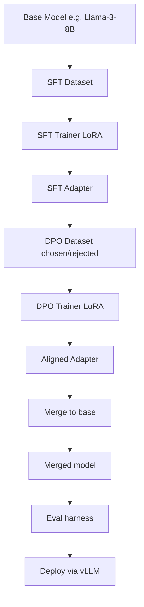

# 19 — Build a Fine-Tuning Pipeline with LoRA + DPO

> [!info] TL;DR
> Build an end-to-end fine-tuning pipeline that takes a base model + your data and produces an aligned model via SFT (Supervised Fine-Tuning) with LoRA, then DPO (Direct Preference Optimization). The pipeline handles data prep, training, evaluation, merging, and deployment — covering the standard recipe used to turn a base LLM into a chat assistant. This capstone integrates chapters 11, 12, 13, and 21 into one production-ready system.

## Project Goals

By the end of this project, you will have built:
1. A data preparation script for SFT (instruction-response pairs) and DPO (chosen-rejected pairs).
2. SFT training with LoRA via HuggingFace TRL + PEFT.
3. DPO training on top of the SFT model.
4. Evaluation harness: perplexity, MMLU, MT-Bench, hallucination rate.
5. LoRA merging back into the base model for deployment.
6. Deployment via vLLM with the merged model.

## Architecture



## Prerequisites

```bash
pip install transformers peft trl datasets accelerate bitsandbytes
pip install vllm  # for deployment
pip install lm-eval  # for MMLU
```

## Step 1: Data Preparation

```python
from datasets import load_dataset, Dataset
from transformers import AutoTokenizer

def prepare_sft_data(instruction_path: str, output_path: str):
    """Convert instruction-response pairs to chat-format SFT data."""
    tokenizer = AutoTokenizer.from_pretrained("meta-llama/Meta-Llama-3-8B-Instruct")
    raw = load_dataset("json", data_files=instruction_path, split="train")

    def to_chat(ex):
        # Apply chat template
        messages = [
            {"role": "system", "content": "You are a helpful assistant."},
            {"role": "user", "content": ex["instruction"]},
            {"role": "assistant", "content": ex["response"]},
        ]
        text = tokenizer.apply_chat_template(messages, tokenize=False)
        return {"text": text}

    processed = raw.map(to_chat, remove_columns=raw.column_names)
    processed.save_to_disk(output_path)

def prepare_dpo_data(preference_path: str, output_path: str):
    """Convert preference pairs (prompt, chosen, rejected) to DPO format."""
    raw = load_dataset("json", data_files=preference_path, split="train")
    tokenizer = AutoTokenizer.from_pretrained("meta-llama/Meta-Llama-3-8B-Instruct")

    def to_dpo(ex):
        prompt_messages = [{"role": "user", "content": ex["prompt"]}]
        prompt = tokenizer.apply_chat_template(prompt_messages, tokenize=False)
        chosen_messages = [{"role": "assistant", "content": ex["chosen"]}]
        rejected_messages = [{"role": "assistant", "content": ex["rejected"]}]
        return {
            "prompt": prompt,
            "chosen": tokenizer.apply_chat_template(chosen_messages, tokenize=False, add_generation_prompt=False),
            "rejected": tokenizer.apply_chat_template(rejected_messages, tokenize=False, add_generation_prompt=False),
        }

    processed = raw.map(to_dpo, remove_columns=raw.column_names)
    processed.save_to_disk(output_path)
```

## Step 2: SFT Training with LoRA

```python
from peft import LoraConfig, get_peft_model, prepare_model_for_kbit_training
from transformers import AutoModelForCausalLM, TrainingArguments
from trl import SFTTrainer
import torch

def train_sft(
    base_model_id: str = "meta-llama/Meta-Llama-3-8B",
    sft_data_path: str = "./data/sft",
    output_dir: str = "./checkpoints/sft",
    epochs: int = 3,
    lr: float = 2e-4,
    lora_r: int = 16,
    lora_alpha: int = 32,
):
    # Load base model in 4-bit (QLoRA)
    bnb_config = BitsAndBytesConfig(
        load_in_4bit=True,
        bnb_4bit_quant_type="nf4",
        bnb_4bit_compute_dtype=torch.bfloat16,
        bnb_4bit_use_double_quant=True,
    )
    model = AutoModelForCausalLM.from_pretrained(
        base_model_id,
        quantization_config=bnb_config,
        device_map="auto",
        attn_implementation="flash_attention_2",  # If available
    )
    model = prepare_model_for_kbit_training(model)

    # LoRA configuration
    peft_config = LoraConfig(
        r=lora_r,
        lora_alpha=lora_alpha,
        lora_dropout=0.05,
        bias="none",
        task_type="CAUSAL_LM",
        target_modules=["q_proj", "k_proj", "v_proj", "o_proj", "gate_proj", "up_proj", "down_proj"],
    )

    # Training arguments
    training_args = TrainingArguments(
        output_dir=output_dir,
        num_train_epochs=epochs,
        per_device_train_batch_size=4,
        gradient_accumulation_steps=4,  # effective batch = 16
        learning_rate=lr,
        lr_scheduler_type="cosine",
        warmup_ratio=0.03,
        weight_decay=0.0,
        max_grad_norm=0.3,
        bf16=True,
        save_strategy="epoch",
        save_total_limit=3,
        logging_steps=10,
        report_to="wandb",
    )

    # Trainer
    trainer = SFTTrainer(
        model=model,
        args=training_args,
        train_dataset=load_from_disk(sft_data_path),
        peft_config=peft_config,
        dataset_text_field="text",
        max_seq_length=2048,
        packing=True,  # Pack short examples together for efficiency
    )

    trainer.train()
    trainer.save_model(output_dir)
    return output_dir
```

## Step 3: DPO Training

```python
from trl import DPOTrainer, DPOConfig

def train_dpo(
    sft_model_path: str = "./checkpoints/sft",
    dpo_data_path: str = "./data/dpo",
    output_dir: str = "./checkpoints/dpo",
    epochs: int = 1,
    lr: float = 5e-6,
    beta: float = 0.1,  # DPO temperature
):
    # Load SFT model + LoRA adapter
    base_model = AutoModelForCausalLM.from_pretrained(
        "meta-llama/Meta-Llama-3-8B",
        quantization_config=bnb_config,
        device_map="auto",
    )
    model = PeftModel.from_pretrained(base_model, sft_model_path)

    # DPO config
    dpo_config = DPOConfig(
        output_dir=output_dir,
        num_train_epochs=epochs,
        per_device_train_batch_size=2,
        gradient_accumulation_steps=8,  # effective batch = 16
        learning_rate=lr,
        lr_scheduler_type="cosine",
        warmup_ratio=0.1,
        bf16=True,
        beta=beta,  # KL penalty strength
        max_prompt_length=1024,
        max_length=2048,
        save_strategy="epoch",
        report_to="wandb",
    )

    trainer = DPOTrainer(
        model=model,
        args=dpo_config,
        train_dataset=load_from_disk(dpo_data_path),
        processing_class=tokenizer,
    )

    trainer.train()
    trainer.save_model(output_dir)
    return output_dir
```

## Step 4: Evaluation Harness

```python
class EvalHarness:
    def __init__(self, model_path: str, tokenizer_path: str):
        self.model = AutoModelForCausalLM.from_pretrained(
            model_path, device_map="auto", torch_dtype=torch.bfloat16,
        )
        self.tokenizer = AutoTokenizer.from_pretrained(tokenizer_path)

    def perplexity(self, dataset: str = "wikitext-2-raw-v1/test") -> float:
        # ... (see Quantization Toolkit project for impl)
        pass

    def mmlu(self, n_samples: int = 200) -> float:
        # Use lm-eval-harness
        from lm_eval import simple_evaluate
        results = simple_evaluate(
            model="hf",
            model_args=f"pretrained={self.model.name_or_path}",
            tasks=["mmlu"],
            num_fewshot=5,
            limit=n_samples,
        )
        return results["results"]["mmlu"]["acc"]

    def mt_bench(self, judge_model: str = "gpt-4o") -> dict:
        """Multi-turn benchmark using GPT-4 as judge."""
        from mt_bench_eval import run_mt_bench
        return run_mt_bench(
            model=self.model,
            tokenizer=self.tokenizer,
            judge_model=judge_model,
        )

    def hallucination_rate(self, dataset: str = "truthfulqa") -> float:
        """% of responses flagged as hallucinated by GPT-4 judge."""
        # Run TruthfulQA, compute % wrong answers
        pass

    def run_all(self) -> dict:
        return {
            "perplexity": self.perplexity(),
            "mmlu": self.mmlu(),
            "mt_bench": self.mt_bench(),
            "hallucination_rate": self.hallucination_rate(),
        }
```

## Step 5: LoRA Merging

```python
def merge_lora(base_model_id: str, lora_path: str, output_path: str):
    """Merge LoRA adapter back into base model for deployment."""
    base = AutoModelForCausalLM.from_pretrained(
        base_model_id, torch_dtype=torch.bfloat16, device_map="cpu",
    )
    model = PeftModel.from_pretrained(base, lora_path)
    merged = model.merge_and_unload()
    merged.save_pretrained(output_path)
    # Also save tokenizer
    AutoTokenizer.from_pretrained(base_model_id).save_pretrained(output_path)
    print(f"Merged model saved to {output_path}")
```

## Step 6: Deployment with vLLM

```python
# deploy.py
from vllm import LLM, SamplingParams

llm = LLM(
    model="./merged_model",
    dtype="bfloat16",
    tensor_parallel_size=1,
    gpu_memory_utilization=0.9,
    max_model_len=8192,
)

# Serve via OpenAI-compatible API
# vllm serve ./merged_model --port 8000
```

## Production Hardening Checklist

1. **Data quality**: deduplicate SFT data (MinHash + LSH); filter low-quality responses (length, repetition, toxicity).
2. **Chat template**: use the base model's official chat template; mismatched templates break everything.
3. **QLoRA for memory**: 4-bit base + LoRA adapters fit a 70B model on a single 80GB GPU.
4. **Loss masking**: mask the prompt tokens in SFT loss — only train on response tokens (otherwise the model wastes capacity learning to predict prompts).
5. **LR sensitivity**: SFT LR=2e-4, DPO LR=5e-6 (10x lower — DPO is more sensitive).
6. **Beta tuning**: DPO beta=0.1 default; higher = more conservative, lower = more aggressive.
7. **Eval before/after each stage**: track metrics through SFT and DPO; DPO should improve MT-Bench without hurting MMLU.
8. **Reward hacking check**: DPO can overfit to preferences — check that the model isn't just longer/shorter than the chosen responses.
9. **Save intermediate checkpoints**: every epoch; keep the best by eval metric, not the last.
10. **Merge before deployment**: serving LoRA adapters is possible but slower; merge for production.
11. **Quantize after merge**: INT8 or FP8 the merged model for faster inference.
12. **A/B test**: deploy the fine-tuned model alongside the base; route 10% traffic; compare quality and engagement.

## Modern Developments (2024–2026)

### DPO Variants (IPO, KTO, SimPO)
- **IPO** (Identity Preference Optimization): fixes DPO's overfitting on noisy preferences.
- **KTO** (Kahneman-Tversky Optimization): uses single-sided preferences (good/bad) instead of pairs.
- **SimPO** (Simple Preference Optimization): length-normalized DPO; better for production.
- All available in TRL 0.9+; SimPO is the 2025 default for new projects.

### GRPO (Group Relative Policy Optimization)
DeepSeek-R1 (2025) uses GRPO — a PPO variant that uses group-relative advantages instead of a learned value function. Simpler than PPO, more stable than DPO, and works well for verifiable rewards (math, code). Increasingly popular for reasoning model training.

### Multimodal Fine-Tuning
Extending SFT+DPO to vision-language models: fine-tune the language model while keeping the vision encoder frozen. LLaVA-Factory, Axolotl, and LLaMA-Factory all support multimodal fine-tuning.

### Synthetic Data Generation
Use a stronger model (GPT-4, Claude) to generate SFT data for specific tasks. Distillation from a teacher model is now standard for fine-tuning smaller models. Quality control (LLM-as-judge filtering) is essential.

### LoRA Variants (DoRA, ReLoRA, PiSSA)
- **DoRA**: decomposes weights into magnitude + direction; better quality than LoRA at same rank.
- **ReLoRA**: restart LoRA training periodically to escape local minima.
- **PiSSA**: initializes LoRA with principal singular values; faster convergence.
- All drop-in replacements for LoRA in PEFT 0.10+.

## Common Failure Modes — Diagnostic Table

| Symptom                                | Likely Cause                                  | Fix                                                          |
|----------------------------------------|-----------------------------------------------|--------------------------------------------------------------|
| SFT loss plateaus                      | LR too high; or data quality poor             | Lower LR; inspect data; add more diverse examples             |
| Model produces wrong format            | Chat template mismatched                       | Use base model's official chat template exactly               |
| DPO not improving MT-Bench             | LR too low; or beta too high                  | Increase LR to 5e-6; decrease beta to 0.05                    |
| DPO reward hacking (longer responses)  | No length normalization                        | Use SimPO (length-normalized DPO); track response length      |
| MMLU drops after DPO                   | DPO overfitting; capability lost               | Lower DPO LR; fewer epochs; or use IPO (more conservative)    |
| QLoRA OOM                              | 4-bit base + LoRA + activations too large     | Reduce batch; use gradient accumulation; smaller LoRA rank    |
| Merged model differs from adapter      | Merge bug; or wrong base model                 | Verify base model SHA; use `merge_and_unload()` correctly     |
| vLLM refuses merged model              | Quantization mismatch; or wrong format        | Save in safetensors format; verify dtype matches              |
| Catastrophic forgetting                | SFT too aggressive on narrow domain            | Mix in general data (10–20%); use lower LR; LoRA over full FT |
| Eval shows improvement but users hate it| Eval set doesn't reflect production           | Sample real production queries; refresh eval set              |

## Interview Questions

1. **Q: Walk through the full fine-tuning pipeline from base model to deployed chat assistant.**
   A: (1) **Base model**: Llama-3-8B (or similar). (2) **SFT data**: 10k–100k instruction-response pairs. (3) **SFT training**: 3 epochs LoRA (r=16) on the response tokens only; LR 2e-4, cosine schedule, BF16. (4) **DPO data**: 5k–50k preference pairs (prompt, chosen, rejected). (5) **DPO training**: 1 epoch on top of SFT model; LR 5e-6, beta 0.1. (6) **Eval**: perplexity (sanity), MMLU (capability), MT-Bench (chat quality), hallucination rate. (7) **Merge**: LoRA adapters merged into base. (8) **Quantize**: INT8 or FP8 for inference. (9) **Deploy**: vLLM serving the merged+quantized model. (10) **A/B test**: 10% traffic initially; monitor quality and engagement.

2. **Q: Why use LoRA instead of full fine-tuning?**
   A: (1) **Memory**: LoRA trains only 0.1–1% of parameters; fits a 70B model on one GPU vs 8+ for full FT. (2) **Speed**: 2–3x faster training (less gradient computation). (3) **Storage**: adapters are 10–100MB vs 14GB for a 7B model. (4) **Modularity**: multiple adapters can be swapped at inference (one base model + many adapters). (5) **Quality**: LoRA matches full FT quality at rank 16+ for most tasks. (6) **Catastrophic forgetting**: LoRA preserves the base model's knowledge better than full FT. Trade-off: for very large domain shifts (continued pretraining on a new language), full FT is still better.

3. **Q: What's the difference between SFT and DPO, and why do both?**
   A: **SFT** teaches the model what good responses look like (imitation learning on chosen responses). **DPO** teaches the model to prefer good responses over bad ones (preference learning on pairs). SFT alone produces a model that mimics the training distribution but doesn't know what's "better" vs "worse". DPO refines the model's preferences, making it more aligned with human judgment. Pipeline: SFT first (gives the model basic chat capability), then DPO (refines quality). Skipping SFT and going straight to DPO usually fails — the model doesn't have basic chat ability.

4. **Q: How do you choose the LoRA rank (r)?**
   A: Trade-off: higher r = more capacity = better quality but more parameters/memory. (1) **r=8**: enough for narrow tasks (single-domain fine-tuning like medical QA). (2) **r=16**: default for general chat fine-tuning. (3) **r=32–64**: large domain shifts (continued pretraining on a new language). (4) **r=128+**: rarely needed; usually indicates you should do full FT instead. Empirically, quality saturates around r=64 for most tasks. Memory: r=16 on Llama-3-8B = ~50M trainable params (0.6% of total).

5. **Q: How do you debug DPO training that's not improving?**
   A: (1) **Check data quality**: are the preferences actually informative? Use LLM-as-judge to verify. (2) **Check LR**: too high (5e-5+) causes divergence; too low (1e-7) doesn't move. Default 5e-6. (3) **Check beta**: too high (1.0+) makes DPO too conservative; too low (0.01) causes reward hacking. Default 0.1. (4) **Check SFT quality**: if SFT is bad, DPO can't fix it. (5) **Check loss**: DPO loss should decrease; if not, gradient is wrong. (6) **Check reward margin**: if chosen and rejected rewards are too close, the model isn't learning to distinguish. (7) **Length bias**: DPO can hack by making responses longer/shorter; track response length.

6. **Q: How do you deploy a fine-tuned model for production?**
   A: (1) **Merge LoRA** into the base model (faster inference than adapter serving). (2) **Quantize**: INT8 for A100, FP8 for H100+, INT4 for edge. (3) **Benchmark**: latency, throughput, memory, quality on a representative eval set. (4) **vLLM serving**: `vllm serve merged_model --port 8000`; OpenAI-compatible API. (5) **A/B test**: route 10% of traffic to the new model; compare quality (LLM-as-judge on real prompts) and engagement (thumbs up/down, session length). (6) **Rollback plan**: keep the previous model on standby; auto-rollback if quality degrades >5%. (7) **Monitoring**: track latency, error rate, cost, quality (sample 1% of responses for LLM-as-judge). (8) **Iterate**: collect new preferences from production; retrain monthly.

## Connection to Other Concepts

- [[12 - Fine-Tuning/MOC]] — parent chapter.
- [[12 - Fine-Tuning/PEFT/01 - LoRA]] — LoRA deep dive.
- [[12 - Fine-Tuning/PEFT/02 - QLoRA]] — QLoRA (4-bit + LoRA).
- [[12 - Fine-Tuning/Instruction Tuning/03 - Instruction Tuning and Chat Templates]] — SFT details.
- [[12 - Fine-Tuning/DPO/04 - DPO Derivation]] — DPO math.
- [[12 - Fine-Tuning/RLHF/05 - RLHF with PPO]] — RLHF alternative to DPO.
- [[11 - Training/MOC]] — training chapter.
- [[13 - Inference/MOC]] — inference chapter.
- [[13 - Inference/Quantization/03 - Quantization]] — post-merge quantization.
- [[21 - LLMOps and MLOps/MOC]] — LLMOps for production.
- [[27 - Projects/Capstones/07 - Build a Reasoning Model Fine-Tune]] — reasoning-specific fine-tuning.
- [[27 - Projects/MOC]] — projects index.

## See Also

- [[27 - Projects/MOC|27 Projects MOC]]
- [[12 - Fine-Tuning/MOC]]
- [[27 - Projects/Capstones/07 - Build a Reasoning Model Fine-Tune]]
