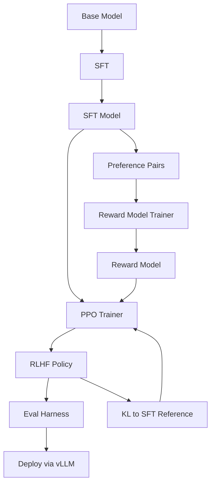

# 20 — Build an RLHF Pipeline with PPO

> [!info] TL;DR
> Build a complete RLHF (Reinforcement Learning from Human Feedback) pipeline using PPO (Proximal Policy Optimization). This capstone implements the InstructGPT recipe: SFT → Reward Model → PPO alignment. Unlike DPO (which uses preference pairs directly), PPO trains a separate reward model and then optimizes the policy via online RL. This capstone is the canonical "deep" alignment project — when you finish, you understand RLHF end-to-end, not just the simplified DPO version.

## Project Goals

By the end of this project, you will have built:
1. A SFT model (already covered in [[27 - Projects/Capstones/19 - Build a Fine-Tuning Pipeline with LoRA and DPO]]).
2. A reward model trained on human preference pairs.
3. A PPO training loop that optimizes the policy against the reward model.
4. A KL-divergence penalty to keep the policy close to the SFT model.
5. An evaluation harness comparing base / SFT / RLHF models.
6. Deployment of the final RLHF model via vLLM.

## Architecture



## Prerequisites

```bash
pip install transformers trl peft datasets accelerate bitsandbytes
pip install vllm wandb lm-eval
```

Requires: 1× 80GB GPU minimum for 7B model; 2× for 13B; 8× for 70B (or use QLoRA throughout).

## Step 1: SFT (Already Covered)

See [[27 - Projects/Capstones/19 - Build a Fine-Tuning Pipeline with LoRA and DPO]] for the SFT implementation. The output is a chat-tuned base model.

## Step 2: Reward Model Training

The reward model takes (prompt, response) and outputs a scalar reward. It's trained on preference pairs: given (prompt, chosen, rejected), the reward model should score chosen > rejected.

```python
from transformers import AutoModelForSequenceClassification, Trainer, TrainingArguments
from datasets import load_dataset
import torch

def train_reward_model(
    sft_model_path: str,
    preference_data_path: str,
    output_dir: str,
    epochs: int = 1,
    lr: float = 5e-6,
):
    """Train a reward model on preference pairs.

    The reward model is the SFT model with a scalar head (regression).
    Loss: -log(sigmoid(r(chosen) - r(rejected)))
    """
    # Load SFT model with a scalar classification head
    model = AutoModelForSequenceClassification.from_pretrained(
        sft_model_path,
        num_labels=1,  # scalar reward
        torch_dtype=torch.bfloat16,
        device_map="auto",
        attn_implementation="flash_attention_2",
    )

    # Load preference data: (prompt, chosen, rejected)
    raw = load_dataset("json", data_files=preference_data_path, split="train")

    def tokenize_pair(ex):
        tokenizer = AutoTokenizer.from_pretrained(sft_model_path)
        chosen_text = ex["prompt"] + ex["chosen"]
        rejected_text = ex["prompt"] + ex["rejected"]
        chosen_tokens = tokenizer(chosen_text, truncation=True, max_length=2048)
        rejected_tokens = tokenizer(rejected_text, truncation=True, max_length=2048)
        return {
            "chosen_input_ids": chosen_tokens["input_ids"],
            "chosen_attention_mask": chosen_tokens["attention_mask"],
            "rejected_input_ids": rejected_tokens["input_ids"],
            "rejected_attention_mask": rejected_tokens["attention_mask"],
        }

    tokenized = raw.map(tokenize_pair, remove_columns=raw.column_names)

    # Custom data collator: returns chosen and rejected batches
    def collator(features):
        return {
            "chosen_input_ids": torch.tensor([f["chosen_input_ids"] for f in features]),
            "chosen_attention_mask": torch.tensor([f["chosen_attention_mask"] for f in features]),
            "rejected_input_ids": torch.tensor([f["rejected_input_ids"] for f in features]),
            "rejected_attention_mask": torch.tensor([f["rejected_attention_mask"] for f in features]),
        }

    # Custom Trainer with Bradley-Terry loss
    class RewardTrainer(Trainer):
        def compute_loss(self, model, inputs, return_outputs=False):
            chosen_outputs = model(
                input_ids=inputs["chosen_input_ids"],
                attention_mask=inputs["chosen_attention_mask"],
            ).logits  # shape: (batch, 1)
            rejected_outputs = model(
                input_ids=inputs["rejected_input_ids"],
                attention_mask=inputs["rejected_attention_mask"],
            ).logits
            # Bradley-Terry loss: -log(sigmoid(r_chosen - r_rejected))
            logits = chosen_outputs - rejected_outputs
            loss = -torch.nn.functional.logsigmoid(logits).mean()
            return (loss, {"rewards": chosen_outputs}) if return_outputs else loss

    training_args = TrainingArguments(
        output_dir=output_dir,
        num_train_epochs=epochs,
        per_device_train_batch_size=2,
        gradient_accumulation_steps=8,
        learning_rate=lr,
        lr_scheduler_type="cosine",
        warmup_ratio=0.1,
        bf16=True,
        save_strategy="epoch",
        report_to="wandb",
    )

    trainer = RewardTrainer(
        model=model,
        args=training_args,
        train_dataset=tokenized,
        data_collator=collator,
    )
    trainer.train()
    trainer.save_model(output_dir)
    return output_dir
```

## Step 3: PPO Training

PPO optimizes the policy against the reward model. The key components:

1. **Policy model**: the SFT model (LoRA-adapted).
2. **Reference model**: frozen copy of the SFT model (for KL penalty).
3. **Reward model**: from step 2 (frozen).
4. **Value model**: optional; estimates expected reward (for advantage computation).

```python
from trl import PPOTrainer, PPOConfig, AutoModelForCausalLMWithValueHead
from transformers import AutoTokenizer
import torch

def train_ppo(
    sft_model_path: str,
    reward_model_path: str,
    prompt_data_path: str,
    output_dir: str,
    kl_coef: float = 0.05,
    epochs: int = 1,
):
    """PPO training: optimize policy against reward model with KL penalty."""

    # Load policy + value head
    policy = AutoModelForCausalLMWithValueHead.from_pretrained(
        sft_model_path,
        torch_dtype=torch.bfloat16,
        device_map="auto",
    )
    # Load reference (frozen) for KL
    ref_policy = AutoModelForCausalLMWithValueHead.from_pretrained(
        sft_model_path,
        torch_dtype=torch.bfloat16,
        device_map="auto",
    )
    for p in ref_policy.parameters():
        p.requires_grad = False

    # Load reward model
    reward_model = AutoModelForSequenceClassification.from_pretrained(
        reward_model_path,
        torch_dtype=torch.bfloat16,
        device_map="auto",
    )

    tokenizer = AutoTokenizer.from_pretrained(sft_model_path)

    # PPO config
    ppo_config = PPOConfig(
        batch_size=128,
        mini_batch_size=8,
        gradient_accumulation_steps=8,
        learning_rate=1.5e-5,
        kl_penalty="kl",
        target=kl_coef,  # KL penalty strength
        ppo_epochs=4,  # inner epochs per batch
        seed=42,
    )

    # Load prompts (just the prompts, not responses — PPO generates online)
    prompts = load_dataset("json", data_files=prompt_data_path, split="train")

    # PPO trainer
    ppo_trainer = PPOTrainer(
        config=ppo_config,
        model=policy,
        ref_model=ref_policy,
        tokenizer=tokenizer,
        dataset=prompts,
    )

    generation_kwargs = {
        "min_length": -1,
        "top_k": 0.0,
        "top_p": 1.0,
        "do_sample": True,
        "pad_token_id": tokenizer.pad_token_id,
        "max_new_tokens": 256,
    }

    for epoch in range(epochs):
        for batch in ppo_trainer.dataloader:
            query_tensors = batch["input_ids"]

            # Generate responses from policy
            response_tensors = ppo_trainer.generate(
                query_tensors, return_prompt=False, **generation_kwargs
            )
            batch["response"] = tokenizer.batch_decode(response_tensors, skip_special_tokens=True)

            # Compute rewards from reward model
            texts = [q + r for q, r in zip(batch["query"], batch["response"])]
            inputs = tokenizer(texts, return_tensors="pt", padding=True, truncation=True, max_length=2048).to(reward_model.device)
            with torch.no_grad():
                rewards = reward_model(**inputs).logits.squeeze(-1).tolist()

            # PPO step: optimize policy with KL to reference
            stats = ppo_trainer.step(query_tensors, response_tensors, rewards)
            ppo_trainer.log_stats(stats, batch, rewards)

    ppo_trainer.save_model(output_dir)
    return output_dir
```

## Step 4: Evaluation Harness

```python
class RLHFEvalHarness:
    """Compare base / SFT / RLHF models on multiple metrics."""

    def __init__(self, base_path, sft_path, rlhf_path):
        self.base = self._load(base_path)
        self.sft = self._load(sft_path)
        self.rlhf = self._load(rlhf_path)

    def _load(self, path):
        return AutoModelForCausalLM.from_pretrained(path, device_map="auto", torch_dtype=torch.bfloat16)

    def reward_model_score(self, eval_prompts: list, reward_model_path: str) -> dict:
        """Score each model's responses with the reward model."""
        # Generate responses from each model
        # Score with reward model
        # Return {base_score, sft_score, rlhf_score}
        pass

    def mt_bench(self) -> dict:
        """MT-Bench (GPT-4 judge)."""
        pass

    def helpfulness(self) -> dict:
        """Helpfulness via LLM-as-judge."""
        pass

    def harmlessness(self) -> dict:
        """Harmlessness via red-team prompts."""
        pass

    def kl_to_sft(self) -> float:
        """KL divergence of RLHF model from SFT model."""
        pass

    def run_all(self) -> dict:
        return {
            "reward_model_score": self.reward_model_score(...),
            "mt_bench": self.mt_bench(),
            "helpfulness": self.helpfulness(),
            "harmlessness": self.harmlessness(),
            "kl_to_sft": self.kl_to_sft(),
        }
```

## Step 5: Deployment

```python
# Merge LoRA into base, then deploy via vLLM
from vllm import LLM

llm = LLM(
    model="./merged_rlhf_model",
    dtype="bfloat16",
    tensor_parallel_size=1,
    gpu_memory_utilization=0.9,
    max_model_len=8192,
)
# Serve: vllm serve ./merged_rlhf_model --port 8000
```

## Production Hardening Checklist

1. **Reward model quality is everything**: if the RM is biased (longer responses, certain phrasings), PPO will exploit it. Validate RM on held-out preferences; track RM accuracy (>70% on chosen-vs-rejected).
2. **KL penalty is critical**: without KL, the policy drifts from the SFT model and loses chat capability. Default kl_coef=0.05; tune higher if the policy degrades chat quality.
3. **Online generation is expensive**: PPO generates responses online during training. This is 10–100× slower than DPO (which uses pre-collected preferences). Plan for ~3–5 days of training on a 7B model.
4. **Reward hacking detection**: track response length, vocabulary diversity, sentiment. If any of these drift significantly during PPO, the policy is likely hacking the RM.
5. **Value model**: optional but recommended. Without a value model, PPO uses simple returns as advantages (high variance). With a value model, advantages are estimated (lower variance, more stable training).
6. **Early stopping**: if the reward plateaus or chat quality degrades (monitor MT-Bench every 100 steps), stop. PPO can over-optimize and degrade.
7. **Sample efficiency**: PPO needs ~10K–100K prompts to converge. Less than 10K = underfit; more than 100K = marginal gains.
8. **Adaptive KL**: TRL's `adaptive_kl` adjusts kl_coef dynamically based on observed KL. Often better than fixed.
9. **Reference model must be the SFT model**: do NOT use the base model as reference — the policy needs to stay close to SFT, not base.
10. **Evaluate before deployment**: reward model scores are a proxy, not the goal. Always evaluate with LLM-as-judge (MT-Bench, AlpacaEval) and human review before deploying.
11. **DPO is usually enough**: for most production use cases, DPO (or SimPO) is sufficient and 10× cheaper than PPO. Use PPO only when (a) you have an existing reward model, (b) you need online exploration, or (c) DPO has been tried and underperformed.
12. **Compare to DPO baseline**: always run DPO on the same preference data; PPO should beat DPO by 1–3 points on MT-Bench to justify the 10× cost.

## Modern Developments (2024–2026)

### DPO Replaces PPO for Most Use Cases
By 2024, DPO became the default for alignment (simpler, 10× cheaper, comparable quality). PPO remains valuable for:
- Online exploration (when the policy needs to discover new strategies).
- Reward-model-based alignment (when you already have an RM).
- Reasoning models (R1 uses GRPO, a PPO variant).

### GRPO (Group Relative Policy Optimization)
DeepSeek-R1 (2025) uses GRPO — a PPO variant that uses group-relative advantages (sample N completions per prompt, use group mean as baseline) instead of a learned value model. Simpler than PPO, more stable than DPO, and works well for verifiable rewards. See [[26 - Papers/2024-2026/12 - DeepSeek-R1 2025]].

### RLVR Replaces RLHF for Reasoning
For math/code reasoning, RLVR (Reinforcement Learning with Verifiable Rewards) replaces RLHF — the reward is a rule-based verifier (math grader, test runner), not a trained reward model. Simpler, cheaper, no reward hacking. See [[26 - Papers/Alignment/53 - Verifiable Rewards vs PRMs]].

### Constitutional AI (RLAIF)
Anthropic's Constitutional AI (2022) replaces human feedback with AI feedback — the reward model is trained on AI-generated preferences (using a written constitution). Cheaper than human annotation; comparable quality. See [[26 - Papers/Alignment/31 - Constitutional AI 2022]].

### Online DPO
A 2024–2025 research direction: DPO with online generation (like PPO) instead of pre-collected preferences. Combines DPO's simplicity with PPO's exploration. Implemented in TRL 0.9+ as `OnlineDPOTrainer`.

### Reward Model Ensembles
Use multiple reward models (different initializations, different data) and average their scores. Reduces reward hacking (any single RM's biases are averaged out). Used in production frontier alignment.

## Common Failure Modes — Diagnostic Table

| Symptom                                  | Likely Cause                                      | Fix                                                              |
|------------------------------------------|----------------------------------------------------|------------------------------------------------------------------|
| Reward increases but chat quality drops  | Reward hacking; RM biases being exploited          | Increase KL coef; check response length/vocab drift              |
| PPO loss diverges                        | LR too high; or KL too low                         | Lower LR to 1e-5; increase KL coef to 0.1                        |
| Reward model accuracy <60%               | Bad preference data; or RM undertrained          | Filter preference data; train RM longer (more epochs)            |
| KL explodes (policy drifts from SFT)     | KL coef too low; or LR too high                    | Increase KL coef; lower LR; enable adaptive KL                  |
| PPO training crashes (OOM)               | Batch too large; or sequences too long             | Reduce batch size; reduce max_new_tokens to 128                  |
| Policy generates gibberish               | Catastrophic forgetting from overaggressive PPO    | Reduce LR; reduce PPO epochs per batch; increase KL coef         |
| MT-Bench drops after PPO                 | Over-optimization; reward hacking                  | Early stop; switch to DPO; or use reward model ensemble           |
| Response length grows unboundedly        | RM biases toward longer responses                  | Length-normalize RM; or penalize length in reward                |
| PPO slower than expected                 | Online generation is the bottleneck                | Use shorter max_new_tokens; larger batch; or switch to DPO       |
| Reward variance too high                 | No value model; or batch too small                 | Add value model; increase batch size                             |

## Interview Questions

1. **Q: Walk through the full RLHF pipeline from base model to deployed aligned chat assistant.**
   A: (1) **Base model**: Llama-3-8B (or similar). (2) **SFT**: 10K–100K instruction-response pairs; LoRA SFT, 3 epochs, LR 2e-4. (3) **Preference data**: 5K–50K (prompt, chosen, rejected) pairs. (4) **Reward model**: train SFT model with scalar head on preferences; Bradley-Terry loss; 1 epoch, LR 5e-6. (5) **PPO**: optimize SFT policy against RM with KL penalty to SFT reference; 1–3 days training, KL coef 0.05, LR 1.5e-5. (6) **Eval**: reward model score (proxy), MT-Bench (chat quality), harmlessness (red-team), KL to SFT (drift). (7) **Merge + deploy**: merge LoRA, quantize, deploy via vLLM. (8) **A/B test**: 10% traffic; monitor quality + engagement. Total: ~5–7 days of compute on a 7B model.

2. **Q: When would you choose PPO over DPO?**
   A: Three cases. (1) **Existing reward model**: if you already have a trained RM (e.g., from prior work), PPO can leverage it directly; DPO would need to retrain on preference data. (2) **Online exploration**: if the policy needs to discover new strategies (e.g., reasoning, agentic tool use), PPO's online generation is essential; DPO is offline. (3) **DPO has been tried and underperforms**: PPO is strictly more expressive than DPO (DPO is a special case of PPO with a specific reward parameterization); if DPO underperforms, PPO might do better. For most production chat alignment, DPO is sufficient and 10× cheaper. Use PPO only when justified.

3. **Q: How do you prevent reward hacking in PPO?**
   A: Five techniques. (1) **KL penalty**: keeps the policy close to the SFT model, preventing drift toward RM biases. Default kl_coef=0.05; tune higher if hacking. (2) **Reward model ensembles**: average multiple RMs (different initializations); any single RM's biases are averaged out. (3) **Length normalization**: penalize response length in the reward (or use a length-normalized RM) to prevent the policy from gaming via verbosity. (4) **Monitor drift**: track response length, vocabulary diversity, sentiment every 100 steps; stop if drift is detected. (5) **Evaluate with held-out metrics**: MT-Bench, AlpacaEval, red-team — these don't depend on the RM and catch RM-specific hacking.

4. **Q: How does GRPO differ from PPO?**
   A: GRPO (Group Relative Policy Optimization, DeepSeek-R1) is a PPO variant that uses **group-relative advantages** instead of a learned value model. For each prompt, sample N completions (typically 4–16), compute their rewards, and use the group mean as the baseline. The advantage of completion i is r_i - mean(r). This eliminates the value model (simpler, less memory) and works well for verifiable rewards (where the reward signal is sharp). GRPO is what made DeepSeek-R1's reasoning recipe practical. PPO with a learned value model remains valuable for non-verifiable rewards (chat alignment).

5. **Q: Why is PPO 10× more expensive than DPO?**
   A: PPO generates responses **online** during training — for every batch of prompts, the policy generates N completions, the RM scores them, and the policy is updated. Generation is the bottleneck (~1s per 256-token completion on a 7B model). DPO uses pre-collected preferences — no generation during training, just forward passes on (prompt, chosen, rejected) triples. DPO trains in hours; PPO trains in days. For most chat alignment, DPO is sufficient. PPO is justified only when online exploration is essential.

6. **Q: What's the role of the value model in PPO?**
   A: The value model estimates the expected reward for a given (prompt, partial-response) state. This is used to compute advantages: advantage = actual_reward - value_estimate. Without a value model, PPO uses simple returns as advantages (high variance). With a value model, advantages are estimated (lower variance, more stable training). The value model adds ~30% to training cost (extra forward pass + extra model in memory) but typically improves stability enough to justify it. For RLVR (verifiable rewards), the reward signal is sharp enough that value model is less critical — GRPO uses group-relative baselines instead.

## Connection to Other Concepts

- [[12 - Fine-Tuning/MOC]] — parent chapter.
- [[12 - Fine-Tuning/RLHF/05 - RLHF with PPO]] — RLHF deep dive.
- [[12 - Fine-Tuning/DPO/04 - DPO Derivation]] — DPO alternative.
- [[27 - Projects/Capstones/19 - Build a Fine-Tuning Pipeline with LoRA and DPO]] — DPO capstone.
- [[27 - Projects/Capstones/07 - Build a Reasoning Model Fine-Tune]] — GRPO + RLVR.
- [[26 - Papers/Alignment/07 - InstructGPT 2022]] — original RLHF recipe.
- [[26 - Papers/Alignment/09 - DPO 2023]] — DPO alternative.
- [[26 - Papers/Alignment/31 - Constitutional AI 2022]] — RLAIF.
- [[26 - Papers/Alignment/50 - Process Reward Models 2023]] — step-level rewards.
- [[26 - Papers/Alignment/53 - Verifiable Rewards vs PRMs]] — RLVR vs PRM comparison.
- [[26 - Papers/2024-2026/12 - DeepSeek-R1 2025]] — GRPO recipe.
- [[11 - Training/MOC]] — training chapter.
- [[13 - Inference/MOC]] — inference chapter.
- [[21 - LLMOps and MLOps/MOC]] — LLMOps.
- [[27 - Projects/MOC]] — projects index.

## See Also

- [[27 - Projects/MOC|27 Projects MOC]]
- [[12 - Fine-Tuning/MOC|12 Fine-Tuning MOC]]
