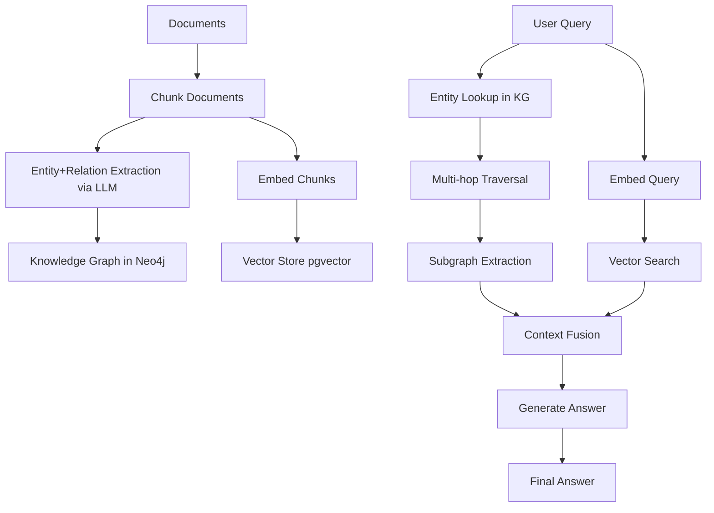

# 21 — Build a Knowledge-Graph Construction Pipeline (GraphRAG)

> [!info] TL;DR
> Build an end-to-end GraphRAG pipeline that constructs a knowledge graph from documents (entity extraction, relation extraction, graph storage) and uses it for retrieval-augmented generation. GraphRAG excels at multi-hop reasoning, entity-centric queries, and questions that require connecting information across documents — cases where vector RAG fails. This capstone integrates chapters 17 (RAG) and 18 (Memory Systems) and produces a production-grade GraphRAG system.

## Project Goals

By the end of this project, you will have built:
1. An entity-and-relation extraction pipeline (LLM-based, with prompts).
2. A knowledge graph storage layer (Neo4j or NetworkX).
3. A graph query layer (entity lookup, multi-hop traversal, subgraph extraction).
4. A hybrid retrieval layer (vector + graph, with fusion).
5. A generation layer that uses graph context alongside vector context.
6. An evaluation harness comparing vector RAG vs GraphRAG vs hybrid.

## Architecture



## Prerequisites

```bash
pip install neo4j pyvis networkx openai sentence-transformers
pip install neo4j-graphrag  # Microsoft's GraphRAG library (optional)
# Or use Microsoft GraphRAG directly: pip install graphrag
docker run -d -p 7474:7474 -p 7687:7687 neo4j:latest  # local Neo4j
```

Requires: OpenAI API key (or local LLM via Ollama), Neo4j instance.

## Step 1: Document Ingestion and Chunking

```python
from langchain.text_splitter import RecursiveCharacterTextSplitter
from datasets import load_dataset

def ingest_documents(doc_path: str) -> list:
    """Load and chunk documents."""
    splitter = RecursiveCharacterTextSplitter(
        chunk_size=1200,
        chunk_overlap=200,
        separators=["\n\n", "\n", ". ", " "],
    )
    docs = load_dataset("json", data_files=doc_path, split="train")
    chunks = []
    for doc in docs:
        texts = splitter.split_text(doc["text"])
        for i, text in enumerate(texts):
            chunks.append({
                "id": f"{doc['id']}_chunk_{i}",
                "doc_id": doc["id"],
                "text": text,
                "chunk_idx": i,
            })
    return chunks
```

## Step 2: Entity and Relation Extraction

This is the core GraphRAG step. For each chunk, an LLM extracts entities and relations.

```python
import json
from openai import OpenAI

client = OpenAI()

EXTRACTION_PROMPT = """You are a knowledge-graph extractor. Given a text chunk, extract all entities and relations.

Return JSON with this schema:
{
  "entities": [
    {"id": "entity_unique_id", "name": "Entity Name", "type": "person|organization|location|event|concept|other", "description": "Brief description"}
  ],
  "relations": [
    {"source": "entity_id", "target": "entity_id", "type": "relation_type", "description": "Brief description"}
  ]
}

Common relation types: WORKS_FOR, FOUNDED_BY, LOCATED_IN, ACQUIRED, PARTNERS_WITH, EMPLOYS, MEMBER_OF, CREATED, OWNS, COMPETES_WITH, INVESTED_IN, SUPPLIES_TO.

Be conservative: only extract relations explicitly stated or strongly implied in the text.

TEXT CHUNK:
{text}

EXTRACTION:"""


def extract_entities_relations(chunk_text: str, model: str = "gpt-4o") -> dict:
    """Extract entities and relations from a text chunk via LLM."""
    response = client.chat.completions.create(
        model=model,
        messages=[
            {"role": "system", "content": "You are a knowledge-graph extractor. Always return valid JSON."},
            {"role": "user", "content": EXTRACTION_PROMPT.format(text=chunk_text)},
        ],
        response_format={"type": "json_object"},
        temperature=0.0,
    )
    return json.loads(response.choices[0].message.content)


def extract_corpus(chunks: list, model: str = "gpt-4o") -> tuple:
    """Extract entities and relations across all chunks."""
    all_entities = {}
    all_relations = []
    for chunk in chunks:
        result = extract_entities_relations(chunk["text"], model=model)
        for ent in result.get("entities", []):
            if ent["id"] not in all_entities:
                all_entities[ent["id"]] = {**ent, "source_chunks": [chunk["id"]]}
            else:
                # Merge: append source chunk
                all_entities[ent["id"]]["source_chunks"].append(chunk["id"])
                # Merge descriptions (use longer)
                if len(ent.get("description", "")) > len(all_entities[ent["id"]].get("description", "")):
                    all_entities[ent["id"]]["description"] = ent["description"]
        for rel in result.get("relations", []):
            all_relations.append({**rel, "source_chunk": chunk["id"]})
    return list(all_entities.values()), all_relations
```

## Step 3: Knowledge Graph Storage (Neo4j)

```python
from neo4j import GraphDatabase

class KnowledgeGraph:
    def __init__(self, uri="bolt://localhost:7687", user="neo4j", password="password"):
        self.driver = GraphDatabase.driver(uri, auth=(user, password))

    def close(self):
        self.driver.close()

    def create_schema(self):
        with self.driver.session() as session:
            session.run("CREATE CONSTRAINT entity_id IF NOT EXISTS FOR (e:Entity) REQUIRE e.id IS UNIQUE")

    def add_entity(self, entity: dict):
        with self.driver.session() as session:
            session.run(
                """
                MERGE (e:Entity {id: $id})
                SET e.name = $name,
                    e.type = $type,
                    e.description = $description,
                    e.source_chunks = $source_chunks
                """,
                id=entity["id"],
                name=entity["name"],
                type=entity.get("type", "other"),
                description=entity.get("description", ""),
                source_chunks=entity.get("source_chunks", []),
            )

    def add_relation(self, relation: dict):
        with self.driver.session() as session:
            session.run(
                """
                MATCH (s:Entity {id: $source}), (t:Entity {id: $target})
                MERGE (s)-[r:RELATES {type: $type, source_chunk: $source_chunk}]->(t)
                SET r.description = $description
                """,
                source=relation["source"],
                target=relation["target"],
                type=relation["type"],
                description=relation.get("description", ""),
                source_chunk=relation.get("source_chunk", ""),
            )

    def entity_lookup(self, name: str) -> list:
        """Find entities by name (fuzzy match)."""
        with self.driver.session() as session:
            result = session.run(
                "MATCH (e:Entity) WHERE toLower(e.name) CONTAINS toLower($name) RETURN e",
                name=name,
            )
            return [r["e"] for r in result]

    def multi_hop_traversal(self, start_entity_id: str, max_hops: int = 2) -> dict:
        """BFS traversal up to max_hops from start entity."""
        with self.driver.session() as session:
            result = session.run(
                """
                MATCH path = (start:Entity {id: $id})-[*1..$max_hops]-(target:Entity)
                RETURN path, nodes(path) as nodes, relationships(path) as rels
                LIMIT 50
                """,
                id=start_entity_id,
                max_hops=max_hops,
            )
            paths = []
            for r in result:
                paths.append({
                    "nodes": [dict(n) for n in r["nodes"]],
                    "rels": [dict(rel) for rel in r["rels"]],
                })
            return paths

    def subgraph_extraction(self, entity_ids: list, radius: int = 1) -> dict:
        """Extract a subgraph around the given entities."""
        with self.driver.session() as session:
            result = session.run(
                """
                MATCH (e:Entity) WHERE e.id IN $ids
                MATCH (e)-[*0..$radius]-(n:Entity)
                WITH DISTINCT n
                MATCH (n)-[r]-(m:Entity)
                RETURN n, r, m
                """,
                ids=entity_ids,
                radius=radius,
            )
            nodes, rels = {}, []
            for r in result:
                nodes[r["n"]["id"]] = dict(r["n"])
                nodes[r["m"]["id"]] = dict(r["m"])
                rels.append({"source": r["n"]["id"], "target": r["m"]["id"], **dict(r["r"])})
            return {"nodes": list(nodes.values()), "rels": rels}
```

## Step 4: Hybrid Retrieval (Vector + Graph)

```python
class HybridRetriever:
    def __init__(self, kg: KnowledgeGraph, vector_store, embedder, top_k: int = 5):
        self.kg = kg
        self.vector_store = vector_store
        self.embedder = embedder
        self.top_k = top_k

    def retrieve(self, query: str, mode: str = "hybrid") -> dict:
        """Retrieve context: 'vector', 'graph', or 'hybrid'."""
        result = {"query": query, "vector_chunks": [], "graph_subgraph": None, "entities": []}

        # Vector retrieval
        if mode in ("vector", "hybrid"):
            query_embed = self.embedder.encode([query])[0]
            vector_results = self.vector_store.search(query_embed, top_k=self.top_k)
            result["vector_chunks"] = vector_results

        # Graph retrieval
        if mode in ("graph", "hybrid"):
            # Step 1: extract entities from query (via LLM)
            query_entities = self._extract_query_entities(query)
            # Step 2: lookup entities in KG
            kg_entities = []
            for ent_name in query_entities:
                kg_entities.extend(self.kg.entity_lookup(ent_name))
            # Step 3: multi-hop traversal
            subgraph = self.kg.subgraph_extraction(
                [e["id"] for e in kg_entities[:5]],  # top 5 entities
                radius=2,
            )
            result["entities"] = kg_entities
            result["graph_subgraph"] = subgraph

        return result

    def _extract_query_entities(self, query: str) -> list:
        """Extract entity names from query via LLM."""
        response = client.chat.completions.create(
            model="gpt-4o-mini",
            messages=[
                {"role": "system", "content": "Extract entity names from the query. Return JSON: {\"entities\": [\"name1\", \"name2\"]}."},
                {"role": "user", "content": f"Query: {query}\n\nEntities:"},
            ],
            response_format={"type": "json_object"},
            temperature=0.0,
        )
        return json.loads(response.choices[0].message.content).get("entities", [])
```

## Step 5: Generation with Graph Context

```python
def generate_answer(query: str, retrieved: dict, model: str = "gpt-4o") -> str:
    """Generate answer using both vector chunks and graph context."""
    vector_context = "\n\n".join([c["text"] for c in retrieved["vector_chunks"]])

    graph_context = ""
    if retrieved["graph_subgraph"]:
        sg = retrieved["graph_subgraph"]
        entity_str = "\n".join([f"- {n['name']} ({n.get('type', 'unknown')}): {n.get('description', '')}" for n in sg["nodes"][:20]])
        rel_str = "\n".join([f"- {r['source']} --{r.get('type', 'relates_to')}--> {r['target']}" for r in sg["rels"][:30]])
        graph_context = f"Knowledge Graph Context:\nEntities:\n{entity_str}\n\nRelations:\n{rel_str}"

    prompt = f"""Answer the question using both vector and graph context. Cite sources.

Vector Context (chunks from documents):
{vector_context}

{graph_context}

Question: {query}

Answer (with citations [chunk_id] or [entity_id]):"""

    response = client.chat.completions.create(
        model=model,
        messages=[{"role": "user", "content": prompt}],
        temperature=0.0,
    )
    return response.choices[0].message.content
```

## Step 6: Evaluation Harness

```python
class GraphRAGEvalHarness:
    """Compare vector RAG vs GraphRAG vs hybrid on a multi-hop QA dataset."""

    def __init__(self, retriever: HybridRetriever, generator, eval_set: list):
        self.retriever = retriever
        self.generator = generator
        self.eval_set = eval_set  # list of {"question": ..., "answer": ..., "type": "single_hop"|"multi_hop"}

    def evaluate(self, mode: str) -> dict:
        results = []
        for item in self.eval_set:
            retrieved = self.retriever.retrieve(item["question"], mode=mode)
            generated = self.generator(item["question"], retrieved)
            results.append({
                "question": item["question"],
                "expected": item["answer"],
                "generated": generated,
                "type": item["type"],
            })
        # LLM-as-judge
        accuracy = self._llm_judge(results)
        return {"mode": mode, "accuracy": accuracy, "n": len(results)}

    def _llm_judge(self, results: list) -> float:
        # Use GPT-4o as judge
        correct = 0
        for r in results:
            judge_prompt = f"""Question: {r['question']}
Expected: {r['expected']}
Generated: {r['generated']}

Is the generated answer correct (semantically equivalent to expected)? Yes/No."""
            response = client.chat.completions.create(
                model="gpt-4o",
                messages=[{"role": "user", "content": judge_prompt}],
                temperature=0.0,
            )
            if "yes" in response.choices[0].message.content.lower():
                correct += 1
        return correct / len(results)
```

## Production Hardening Checklist

1. **Entity deduplication**: the same entity may be extracted under different names ("OpenAI" vs "OpenAI Inc" vs "OpenAI, Inc."). Implement fuzzy matching (Levenshtein, embeddings) to merge.
2. **Relation confidence**: not all LLM-extracted relations are accurate. Store a confidence score (LLM log-prob or self-consistency vote); filter low-confidence relations.
3. **Incremental updates**: as new documents arrive, extract their entities/relations and merge into the existing graph. Avoid full re-extraction.
4. **Schema validation**: enforce a schema (allowed entity types, relation types). Reject extractions that don't fit. Otherwise the graph becomes a mess of unique types.
5. **Multi-hop limit**: traversal >3 hops often produces noisy, irrelevant subgraphs. Default to 2 hops; increase only if needed.
6. **Hybrid fusion**: simply concatenating vector + graph context works; smarter fusion (reciprocal rank fusion, learned fusion) gives 5–10% improvement.
7. **Cost control**: LLM-based extraction is expensive (1 GPT-4o call per chunk). For large corpora (100K+ chunks), use a smaller model (gpt-4o-mini) for extraction and reserve GPT-4o for difficult cases.
8. **Graph visualization**: use Pyvis or Neo4j Bloom to visualize the graph; helps debugging and intuition.
9. **Caching**: cache entity extraction results; re-extraction is wasteful. Use content-hash-based caching.
10. **Evaluation**: separate eval sets for single-hop (where vector RAG excels) and multi-hop (where GraphRAG excels). Don't expect GraphRAG to beat vector RAG on single-hop.
11. **Microsoft GraphRAG library**: for production, use Microsoft's official GraphRAG library (pip install graphrag) rather than rolling your own. Handles entity dedup, hierarchical summarization, and query routing.
12. **Hierarchical summarization**: for very large graphs, summarize subgraphs hierarchically (Microsoft GraphRAG's "community summaries"). Allows answering global questions ("what are the main themes in this corpus?") that pure entity lookup can't.

## Modern Developments (2024–2026)

### Microsoft GraphRAG (2024)
Microsoft released an open-source GraphRAG library that implements the full pipeline with hierarchical summarization, community detection, and query routing. The reference implementation; most production GraphRAG deployments are based on it.

### LightRAG (2024)
A lightweight GraphRAG alternative that skips hierarchical summarization. Faster, simpler, slightly lower quality than Microsoft GraphRAG. Good for smaller corpora.

### Agentic GraphRAG (2025)
LLM agents that decide when to use graph retrieval vs vector retrieval. The agent extracts entities from the query, decides if multi-hop reasoning is needed, and routes accordingly. More flexible than fixed hybrid retrieval.

### Multimodal GraphRAG (2025)
Extend entity extraction to images, tables, and figures. A diagram of a system architecture becomes entities (components) and relations (data flow). Used for technical document Q&A.

### Knowledge-Graph-Enhanced Long-Context (2026)
With frontier models supporting 1M+ context, the role of GraphRAG shifts: instead of retrieving subgraphs to fit in context, retrieve subgraphs to *focus* the model's attention on the relevant parts of an already-large context.

## Common Failure Modes — Diagnostic Table

| Symptom                                  | Likely Cause                                        | Fix                                                              |
|------------------------------------------|------------------------------------------------------|------------------------------------------------------------------|
| Graph too sparse (few relations)          | Extraction too conservative; or model too weak       | Use GPT-4o for extraction; relax prompt                          |
| Graph too dense (too many relations)     | Extraction too aggressive; lots of noise              | Tighten prompt; filter low-confidence relations                  |
| Same entity multiple times               | No entity deduplication                              | Fuzzy match on entity names; merge                                |
| Multi-hop retrieval misses answers       | Hops too shallow; or relations not extracted          | Increase max_hops; check extraction coverage                      |
| GraphRAG worse than vector RAG           | Eval set is single-hop; GraphRAG shines on multi-hop | Use multi-hop eval set; or use hybrid retrieval                  |
| Slow queries                             | Neo4j not indexed; or subgraph too large              | Add indexes on entity id/name; limit subgraph radius to 2        |
| LLM extraction costs explode             | One LLM call per chunk on huge corpus                | Use smaller model (gpt-4o-mini); or batch extraction              |
| Entity names don't match query           | Query entity extraction different from doc extraction | Use same model + prompt for both                                  |
| Generated answers hallucinate entities   | Graph context not properly grounded in chunks         | Cross-reference entities to source chunks; cite chunks            |
| Graph becomes stale after doc updates     | No incremental update pipeline                       | Implement incremental extraction; merge into existing graph      |

## Interview Questions

1. **Q: When does GraphRAG outperform vector RAG?**
   A: Three cases. (1) **Multi-hop reasoning**: questions that require connecting information across documents ("Who founded the company that acquired the startup that developed X?"). Vector RAG retrieves chunks independently; GraphRAG traverses the graph. (2) **Entity-centric queries**: questions about a specific entity ("What do we know about OpenAI?"). GraphRAG retrieves all relations involving OpenAI; vector RAG retrieves chunks mentioning OpenAI (less structured). (3) **Global questions**: questions about the whole corpus ("What are the main themes?"). Vector RAG can't answer; GraphRAG with hierarchical summarization can. For single-hop factual questions, vector RAG is sufficient and faster.

2. **Q: How do you handle entity deduplication?**
   A: The same entity may be extracted under different names ("OpenAI" vs "OpenAI Inc" vs "OpenAI, Inc."). Three approaches. (1) **String normalization**: lowercase, strip punctuation, remove legal suffixes (Inc, Corp, Ltd). Catches obvious cases. (2) **Embedding similarity**: embed entity names, cluster by cosine similarity (>0.9), merge clusters. Catches semantic duplicates. (3) **LLM-based matching**: for each new entity, ask an LLM "is this the same as any existing entity?" Catches subtle cases (acronyms, aliases). Production: combine all three — normalization first (cheap), then embedding (medium cost), then LLM (expensive, only for ambiguous cases).

3. **Q: How do you evaluate a GraphRAG system?**
   A: Three eval dimensions. (1) **Extraction quality**: precision/recall of extracted entities and relations vs ground-truth annotations. Sample 100 chunks, manually annotate, compute metrics. (2) **Retrieval quality**: for each eval question, did the retrieval return the relevant subgraph? Use recall@k. (3) **End-to-end accuracy**: LLM-as-judge (GPT-4o) on generated answers. Compare vector RAG vs GraphRAG vs hybrid on the same eval set. Critical: separate single-hop and multi-hop questions — GraphRAG should win on multi-hop; vector RAG may win on single-hop.

4. **Q: How does Microsoft GraphRAG differ from a basic GraphRAG pipeline?**
   A: Two key additions. (1) **Hierarchical summarization**: Microsoft GraphRAG detects communities (clusters of related entities) and summarizes each community into a higher-level description. This enables global questions ("what are the main themes?") that pure entity-lookup can't answer. (2) **Query routing**: Microsoft GraphRAG detects whether a query is "local" (specific entity, multi-hop) or "global" (corpus-wide theme) and routes to different retrieval strategies. Local queries use entity lookup + subgraph extraction; global queries use community summaries. The basic pipeline (this project) handles local queries; Microsoft GraphRAG handles both.

5. **Q: How do you keep the graph fresh as documents change?**
   A: Three strategies. (1) **Incremental extraction**: only re-extract entities/relations for new or modified chunks. Use content-hash-based caching to detect which chunks changed. (2) **Soft deletes**: when a chunk is removed, mark its entities/relations as "stale" rather than deleting them (other chunks may reference them). Periodic garbage collection removes truly orphaned entities. (3) **Versioning**: store graph snapshots; allow rollback if a bad extraction corrupts the graph. Production: combine all three; run incremental extraction daily, garbage collection weekly, snapshots before each major update.

## Connection to Other Concepts

- [[17 - RAG/MOC]] — parent chapter.
- [[17 - RAG/Ingestion and Retrieval/01 - RAG Pipeline Overview]] — vector RAG pipeline.
- [[17 - RAG/Advanced Patterns/03 - Advanced RAG Patterns]] — advanced RAG.
- [[18 - Memory Systems/MOC]] — memory systems (KG memory).
- [[18 - Memory Systems/Types/01 - Memory Types]] — semantic memory.
- [[20 - AI Infrastructure/Storage/02 - Vector Storage with pgvector]] — vector storage.
- [[27 - Projects/Mini-Projects/02 - Build a Mini RAG Pipeline]] — simpler RAG capstone.
- [[27 - Projects/Capstones/13 - Build a RAG Evaluation Harness]] — RAG eval.
- [[27 - Projects/Capstones/14 - Build a Multimodal RAG Pipeline]] — multimodal RAG.
- [[27 - Projects/MOC]] — projects index.

## See Also

- [[27 - Projects/MOC|27 Projects MOC]]
- [[17 - RAG/MOC|17 RAG MOC]]
