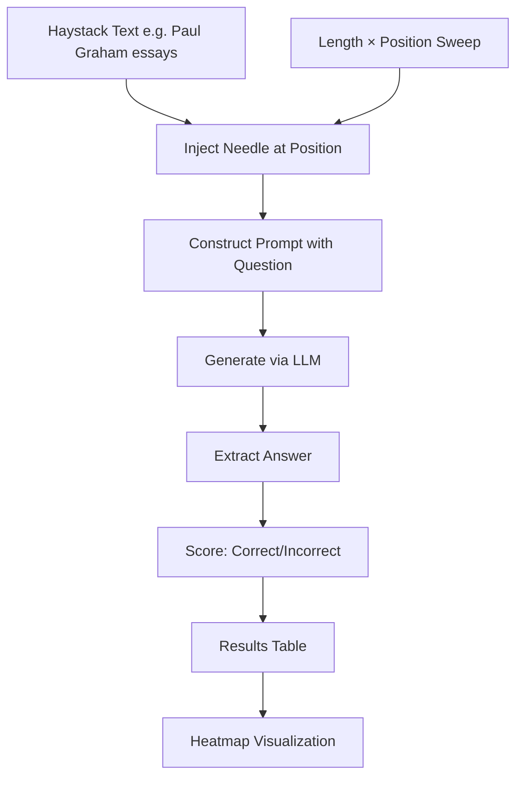

# 22 — Build a Long-Context Evaluation Harness

> [!info] TL;DR
> Build a long-context evaluation harness that tests LLMs on needle-in-haystack and multi-needle tasks across context lengths from 4K to 1M+ tokens. This capstone implements the standard evaluation methodology used by labs (OpenAI, Anthropic, Google, Moonshot) to benchmark long-context models. The output is a reproducible benchmark suite that can validate any model's long-context claims.

## Project Goals

By the end of this project, you will have built:
1. A needle-in-haystack (NIAH) evaluator (single fact retrieval).
2. A multi-needle evaluator (multiple facts, with distractors).
3. A multi-hop reasoning evaluator (need to combine facts across the context).
4. A context-length sweep (4K, 8K, 16K, 32K, 64K, 128K, 256K, 512K, 1M).
5. A position-sensitivity test (needle at start, middle, end).
6. A visualization layer (heatmap of accuracy vs position vs length).

## Architecture



## Prerequisites

```bash
pip install vllm transformers matplotlib seaborn
pip install datasets  # for Paul Graham essays or other haystack text
```

Requires: a long-context LLM (Llama-3.1-8B-Instruct 128K, Qwen-2.5-7B-Instruct 128K, or a frontier API model with 128K+ context).

## Step 1: Haystack Preparation

The "haystack" is the filler text that pads the context to the target length. It should be:
- **Long enough** to fill 1M+ tokens.
- **Diverse enough** to avoid the model finding patterns.
- **Topically coherent** (so the needle doesn't stand out trivially).

```python
from datasets import load_dataset
import tiktoken

def load_haystack(target_tokens: int = 1_000_000) -> str:
    """Load Paul Graham essays as haystack text."""
    # Option 1: Paul Graham essays (popular choice)
    # Option 2: Project Gutenberg public domain books
    # Option 3: Concatenate Wikipedia articles
    essays = load_dataset("paul-graham-essays")  # hypothetical dataset
    text = "\n\n".join([e["text"] for e in essays])
    # Truncate to target length
    enc = tiktoken.encoding_for_model("gpt-4")
    tokens = enc.encode(text)[:target_tokens]
    return enc.decode(tokens)
```

## Step 2: Needle Injection

The "needle" is the fact we want the model to retrieve. Classic example: "The magic number is 42,193."

```python
import random

NEEDLES = [
    "The magic number is 42,193.",
    "The secret password to the vault is 'sunset-elephant-42'.",
    "On May 7th, 2024, the AI research team completed Project Aurora.",
    "The CEO's favorite book is 'The Beginning of Infinity' by David Deutsch.",
    "The hidden treasure is buried at coordinates 35.6762° N, 139.6503° E.",
]

def inject_needle(haystack: str, needle: str, position_pct: float, tokenizer) -> str:
    """Inject the needle at the given position (0.0 = start, 1.0 = end).

    Position is measured in tokens, not characters.
    """
    tokens = tokenizer.encode(haystack)
    needle_tokens = tokenizer.encode(needle)
    insert_at = int(len(tokens) * position_pct)
    # Insert needle + newlines
    new_tokens = tokens[:insert_at] + tokenizer.encode("\n\n") + needle_tokens + tokenizer.encode("\n\n") + tokens[insert_at:]
    return tokenizer.decode(new_tokens)
```

## Step 3: Single-Needle Evaluation (NIAH)

```python
import re

def evaluate_single_needle(
    model,
    tokenizer,
    haystack: str,
    needle: str,
    question: str,
    expected_answer: str,
    position_pct: float,
) -> dict:
    """Evaluate single-needle retrieval at a given position.

    Returns: {position, expected, generated, correct}
    """
    context = inject_needle(haystack, needle, position_pct, tokenizer)
    prompt = f"{context}\n\nQuestion: {question}\nAnswer (be concise):"

    inputs = tokenizer(prompt, return_tensors="pt").to(model.device)
    outputs = model.generate(
        **inputs,
        max_new_tokens=50,
        do_sample=False,
        pad_token_id=tokenizer.eos_token_id,
    )
    generated = tokenizer.decode(outputs[0][inputs["input_ids"].shape[1]:], skip_special_tokens=True)

    # Check if expected answer appears in generated text
    correct = expected_answer.lower() in generated.lower()
    return {
        "position_pct": position_pct,
        "expected": expected_answer,
        "generated": generated,
        "correct": correct,
    }


def niah_sweep(
    model,
    tokenizer,
    haystack: str,
    needle: str,
    question: str,
    expected_answer: str,
    positions: list = None,
) -> list:
    """Run NIAH at multiple positions."""
    if positions is None:
        positions = [0.0, 0.1, 0.25, 0.5, 0.75, 0.9, 1.0]
    results = []
    for pos in positions:
        result = evaluate_single_needle(
            model, tokenizer, haystack, needle, question, expected_answer, pos
        )
        results.append(result)
    return results
```

## Step 4: Multi-Needle Evaluation

Multi-needle tests whether the model can retrieve multiple facts scattered across the context, with distractors.

```python
def evaluate_multi_needle(
    model,
    tokenizer,
    haystack: str,
    needles: list,  # list of (needle, position_pct)
    questions: list,  # list of (question, expected_answer)
) -> dict:
    """Inject multiple needles, ask questions about each."""
    # Inject all needles
    tokens = tokenizer.encode(haystack)
    for needle, pos in sorted(needles, key=lambda x: x[1]):
        insert_at = int(len(tokens) * pos)
        tokens = tokens[:insert_at] + tokenizer.encode("\n\n") + tokenizer.encode(needle) + tokenizer.encode("\n\n") + tokens[insert_at:]
    context = tokenizer.decode(tokens)

    # Ask each question
    correct = 0
    for question, expected in questions:
        prompt = f"{context}\n\nQuestion: {question}\nAnswer:"
        inputs = tokenizer(prompt, return_tensors="pt").to(model.device)
        outputs = model.generate(
            **inputs,
            max_new_tokens=50,
            do_sample=False,
            pad_token_id=tokenizer.eos_token_id,
        )
        generated = tokenizer.decode(outputs[0][inputs["input_ids"].shape[1]:], skip_special_tokens=True)
        if expected.lower() in generated.lower():
            correct += 1

    return {
        "n_needles": len(needles),
        "n_questions": len(questions),
        "n_correct": correct,
        "accuracy": correct / len(questions),
    }
```

## Step 5: Multi-Hop Reasoning

Multi-hop tests whether the model can *combine* facts across the context, not just retrieve them.

```python
def evaluate_multi_hop(
    model,
    tokenizer,
    haystack: str,
    needles: list,  # facts that need to be combined
    question: str,
    expected_answer: str,
) -> dict:
    """Multi-hop: model must combine facts across context."""
    # Inject needles at different positions
    tokens = tokenizer.encode(haystack)
    for needle, pos in needles:
        insert_at = int(len(tokens) * pos)
        tokens = tokens[:insert_at] + tokenizer.encode("\n\n" + needle + "\n\n") + tokens[insert_at:]
    context = tokenizer.decode(tokens)

    prompt = f"{context}\n\nQuestion: {question}\nAnswer (be concise, show reasoning):"
    inputs = tokenizer(prompt, return_tensors="pt").to(model.device)
    outputs = model.generate(
        **inputs,
        max_new_tokens=200,  # allow reasoning
        do_sample=False,
        pad_token_id=tokenizer.eos_token_id,
    )
    generated = tokenizer.decode(outputs[0][inputs["input_ids"].shape[1]:], skip_special_tokens=True)

    correct = expected_answer.lower() in generated.lower()
    return {"question": question, "expected": expected_answer, "generated": generated, "correct": correct}
```

## Step 6: Context-Length Sweep

```python
def length_sweep(
    model,
    tokenizer,
    full_haystack: str,
    needle: str,
    question: str,
    expected_answer: str,
    lengths: list = None,
) -> dict:
    """Run NIAH at multiple context lengths and positions."""
    if lengths is None:
        lengths = [4096, 8192, 16384, 32768, 65536, 131072, 262144, 524288, 1_000_000]
    positions = [0.0, 0.1, 0.25, 0.5, 0.75, 0.9, 1.0]

    results = {}
    for length in lengths:
        if length > len(tokenizer.encode(full_haystack)):
            continue  # skip if haystack too short
        # Truncate haystack to length - prompt_overhead
        prompt_overhead = 200  # for question + formatting
        haystack_tokens = tokenizer.encode(full_haystack)[:length - prompt_overhead]
        haystack = tokenizer.decode(haystack_tokens)
        results[length] = niah_sweep(
            model, tokenizer, haystack, needle, question, expected_answer, positions
        )
    return results
```

## Step 7: Heatmap Visualization

```python
import matplotlib.pyplot as plt
import seaborn as sns
import pandas as pd

def plot_heatmap(results: dict, model_name: str, output_path: str):
    """Plot accuracy heatmap: position (x) vs context length (y)."""
    # Convert results to DataFrame
    rows = []
    for length, sweep in results.items():
        for r in sweep:
            rows.append({
                "context_length": length,
                "position_pct": r["position_pct"],
                "correct": int(r["correct"]),
            })
    df = pd.DataFrame(rows)
    pivot = df.pivot(index="context_length", columns="position_pct", values="correct")

    plt.figure(figsize=(10, 6))
    sns.heatmap(pivot, annot=True, fmt="d", cmap="RdYlGn", cbar_kws={"label": "Correct (1) / Incorrect (0)"})
    plt.title(f"Needle-in-Haystack Accuracy — {model_name}")
    plt.xlabel("Needle Position (% of context)")
    plt.ylabel("Context Length (tokens)")
    plt.tight_layout()
    plt.savefig(output_path, dpi=150)
    plt.close()
```

## Production Hardening Checklist

1. **Tokenizer consistency**: use the same tokenizer for haystack truncation, needle injection, and prompt construction. Token count mismatches cause silent off-by-one errors.
2. **Reproducibility**: fix random seeds for needle position sampling. Use `do_sample=False` for deterministic generation.
3. **Caching**: haystack construction is expensive (tokenization of 1M tokens). Cache the haystack; only re-tokenize if it changes.
4. **VRAM management**: 1M-token contexts at FP16 need ~2GB just for KV cache (per layer). Use a model that supports PagedAttention (vLLM) or chunked attention.
5. **Time budget**: 1M-token generation is slow (~30s for a 50-token answer on H100). Plan for ~1 hour per length × position combination.
6. **Multiple needles**: when injecting multiple needles, ensure they don't overlap (positions far apart). Track needle positions for ground-truth verification.
7. **Question phrasing**: the model may fail at retrieval if the question is phrased differently from the needle. Use paraphrased questions in the eval to test robustness.
8. **Distractors**: for multi-needle eval, add distractor needles (facts that look like real needles but aren't being asked about). Tests whether the model can ignore irrelevant facts.
9. **Stratified sampling**: positions should cover the full range (0%, 25%, 50%, 75%, 100%), not just middle. Some models fail specifically at the start or end of context.
10. **Position encoding sensitivity**: some models (older RoPE without YaRN) fail at positions beyond training length. Note this in the eval report.
11. **Generation parameters**: use greedy decoding (do_sample=False) for reproducibility. Sample-based decoding adds variance that masks retrieval failures.
12. **Compare to short-context baseline**: always run the same question with a short context (just the needle + question). If the model fails even on short context, the question is bad, not the model.

## Modern Developments (2024–2026)

### RULER (2024)
NVIDIA's RULER benchmark extends NIAH with: multi-needle, multi-hop, aggregation (counting, summarization), and variable tracing. The standard long-context benchmark in 2025–2026.

### InfiniteBench (2024)
A long-context benchmark with realistic tasks (book summarization, code reasoning, mathematical reasoning) at 100K+ tokens. Complements NIAH by testing reasoning, not just retrieval.

### LongBench v2 (2025)
Updated LongBench with: harder reasoning tasks, longer contexts (up to 1M), and more languages. The standard Chinese long-context benchmark.

### Multi-Modal NIAH (2025)
Extends NIAH to multimodal context: inject needles into images (e.g., text in a chart) and ask the model to retrieve. Used to evaluate VLMs' long-context capability.

### Needle-in-Image-Haystack (2026)
For video models: inject a needle frame into a long video and ask the model to retrieve it. Tests temporal attention.

### Reasoning-In-Long-Context (2026)
Beyond retrieval: test multi-step reasoning over long context (e.g., "trace the data flow through these 5 architecture diagrams"). Combines retrieval + reasoning.

## Common Failure Modes — Diagnostic Table

| Symptom                                  | Likely Cause                                        | Fix                                                              |
|------------------------------------------|------------------------------------------------------|------------------------------------------------------------------|
| 0% accuracy at all positions              | Question phrasing doesn't match needle               | Rephrase question; or use exact-match question                   |
| 100% at start, 0% at end                  | RoPE extrapolation failure                            | Use YaRN/NTK scaling; or limit context to training length       |
| 100% at start and end, 50% in middle      | Lost-in-the-middle phenomenon                         | Known issue; report it; consider reordering context to put important info at edges |
| Accuracy drops sharply at one length       | Context length exceeds model's effective context       | Note as the model's effective context limit                      |
| Multi-needle accuracy << single-needle    | Model overwhelmed by distractors                      | Reduce distractor count; or upgrade to a model with stronger long-context |
| Multi-hop accuracy near 0%                | Model retrieves facts but can't combine               | Use a reasoning model (R1, o1); or allow longer generation        |
| Very slow generation (hours)              | KV cache OOM; or model not optimized for long context | Use vLLM with PagedAttention; or use a smaller model              |
| Non-reproducible results                  | do_sample=True (sampling adds variance)              | Set do_sample=False; or run 5 trials and average                 |
| Heatmap shows NaN at long lengths         | Context exceeds model's max length; or OOM             | Skip those lengths; or upgrade GPU                                |
| Position sensitivity spikes                | Tokenization edge cases at needle boundary             | Ensure needle is injected at token boundaries, not character boundaries |

## Interview Questions

1. **Q: What is needle-in-haystack and what does it measure?**
   A: Needle-in-haystack (NIAH) tests whether a model can retrieve a specific fact (the "needle") embedded in a long, otherwise-uniform context (the "haystack"). You inject "The magic number is 42,193" at a specific position in a 100K-token context, then ask "What is the magic number?". The model succeeds if it retrieves 42,193. NIAH measures **retrieval capability** — can the model find a specific fact in long context? It doesn't measure reasoning or aggregation. NIAH is the simplest long-context test; passing it is necessary but not sufficient for true long-context capability.

2. **Q: What is "lost in the middle" and how do you detect it?**
   A: "Lost in the middle" is the phenomenon where models retrieve information well at the start and end of context but fail in the middle. The heatmap (position × accuracy) shows a U-shape: high accuracy at 0% and 100%, low in 50%. To detect: run NIAH with positions at 0%, 10%, 25%, 50%, 75%, 90%, 100%. If accuracy is high at edges and low in middle, the model has lost-in-the-middle. Mitigations: (1) reorder context to put important info at edges, (2) use a model with better position encoding (YaRN, NTK-aware), (3) use a hybrid attention model (Jamba, MiniMax-01) which is more uniform.

3. **Q: How do you evaluate multi-hop reasoning over long context?**
   A: Multi-hop tests whether the model can *combine* facts across the context, not just retrieve them. Inject multiple needles at different positions, then ask a question that requires combining them. Example: inject "Alice works at Company X" at position 20% and "Company X was acquired by Y" at position 80%. Ask "Where does Alice work now?" The model must retrieve both facts and combine them. Multi-hop is harder than retrieval — most models that pass NIAH fail multi-hop. Use a reasoning model (R1, o1) or allow longer generation (with chain-of-thought) for multi-hop to work.

4. **Q: What context length should you test up to?**
   A: Up to the model's claimed maximum, plus a margin. If a model claims 128K context, test at 4K, 8K, 16K, 32K, 64K, 128K, and 192K (1.5× claimed max). The 192K test reveals whether the model truly handles 128K or degrades near the limit. For frontier models claiming 1M context, test at 4K → 1M in doubling steps. Always report the **effective context length** — the longest length at which accuracy stays above a threshold (e.g., 80%). Many models' effective context is much shorter than their claimed max.

5. **Q: Why is multi-needle harder than single-needle?**
   A: Two reasons. (1) **Distractors**: with multiple needles, the model must distinguish the relevant needle from irrelevant ones. Single-needle has no distractors. (2) **Interference**: multiple needles may share vocabulary or topic, making the model confuse them. A model that scores 100% on single-needle may score 60% on 5-needle because of interference. Multi-needle is a more realistic test of long-context capability — real-world long-context use (document Q&A, code reasoning) always has multiple facts to track.

6. **Q: How do you compare long-context models fairly?**
   A: Five principles. (1) **Same haystack**: use identical haystack text for all models. Different haystacks make comparisons invalid. (2) **Same needles and questions**: identical across models. (3) **Same positions**: same needle positions for all models. (4) **Same lengths**: test all models at the same set of context lengths. (5) **Same generation parameters**: greedy decoding, same max_new_tokens. Report results as a heatmap (position × length × accuracy) for each model, plus aggregate metrics (mean accuracy, effective context length). Don't compare apples-to-oranges — a model with 200K effective context is not comparable to one with 50K effective context, even if both claim "1M context".

## Connection to Other Concepts

- [[08 - LLMs/Evaluation/06 - LLM Benchmarks]] — LLM benchmarks.
- [[08 - LLMs/Context and KV Cache/02 - KV Cache Mechanics]] — KV cache.
- [[24 - Research Frontiers/Long-Context/07 - Long-Context Architectures]] — long-context architectures.
- [[06 - Attention Mechanisms/Positional Information/10 - YaRN and NTK-aware Scaling]] — RoPE scaling.
- [[26 - Papers/2024-2026/30 - Kimi Linear 2025]] — 1M context model.
- [[26 - Papers/2024-2026/43 - MiniMax-01 2025]] — 1M context model.
- [[10 - Model Architecture Research/Closed Source/09 - Gemini Architecture]] — 1M context.
- [[27 - Projects/MOC]] — projects index.

## See Also

- [[27 - Projects/MOC|27 Projects MOC]]
- [[08 - LLMs/Evaluation/06 - LLM Benchmarks|LLM Benchmarks]]
