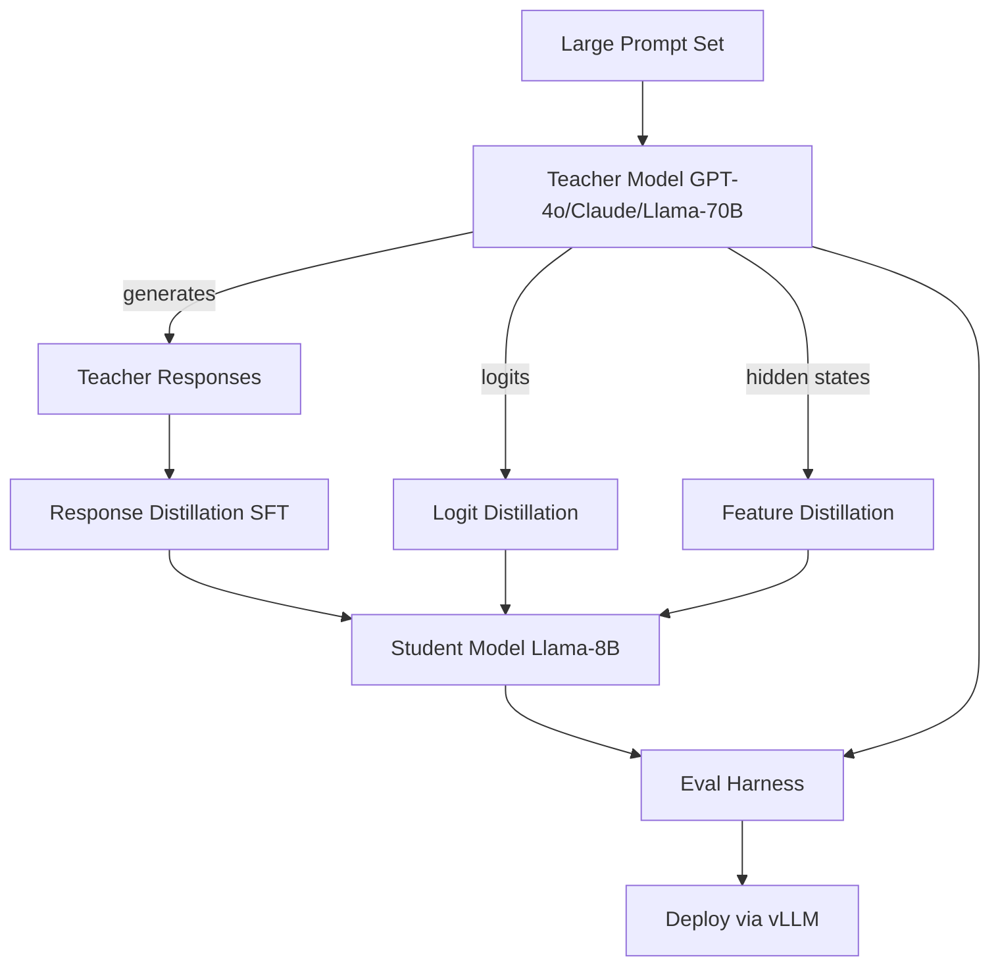

# 24 — Build a Model Distillation Pipeline

> [!info] TL;DR
> Build a knowledge distillation pipeline that takes a large "teacher" model (GPT-4o, Claude 3.5, Llama-3-70B) and produces a smaller "student" model (Llama-3-8B, Mistral-7B) that approximates the teacher's quality at a fraction of the cost. The pipeline covers three distillation approaches: (1) response distillation (SFT on teacher's outputs), (2) logit distillation (KL divergence on teacher's logits), and (3) feature distillation (mimic teacher's hidden states). This capstone integrates chapters 11 (Training) and 12 (Fine-Tuning) into the canonical "compress a frontier model into something servable" project.

## Project Goals

By the end of this project, you will have built:
1. A teacher model interface (API-based or local).
2. A data generation pipeline (generate teacher responses on a large prompt set).
3. Response distillation (SFT on teacher responses).
4. Logit distillation (KL divergence on teacher logits — requires white-box teacher).
5. Feature distillation (mimic teacher hidden states — requires white-box teacher).
6. An evaluation harness comparing teacher / student / baseline.
7. Deployment of the distilled student via vLLM.

## Architecture



## Prerequisites

```bash
pip install transformers peft trl datasets accelerate bitsandbytes
pip install openai anthropic  # for API-based teacher
pip install vllm lm-eval
```

Requires: a teacher model (API access or local), a student model (8B-class, fits on 1× 80GB GPU), and a large prompt set (10K–100K prompts).

## Step 1: Teacher Interface

```python
from openai import OpenAI
import anthropic
from typing import Optional

class TeacherModel:
    """Abstract teacher model interface."""

    def generate(self, prompt: str, max_tokens: int = 1024, temperature: float = 0.7) -> str:
        raise NotImplementedError

    def generate_batch(self, prompts: list, **kwargs) -> list:
        return [self.generate(p, **kwargs) for p in prompts]


class OpenAITeacher(TeacherModel):
    def __init__(self, model: str = "gpt-4o"):
        self.client = OpenAI()
        self.model = model

    def generate(self, prompt: str, max_tokens: int = 1024, temperature: float = 0.7) -> str:
        response = self.client.chat.completions.create(
            model=self.model,
            messages=[{"role": "user", "content": prompt}],
            max_tokens=max_tokens,
            temperature=temperature,
        )
        return response.choices[0].message.content


class AnthropicTeacher(TeacherModel):
    def __init__(self, model: str = "claude-3-5-sonnet-20241022"):
        self.client = anthropic.Anthropic()
        self.model = model

    def generate(self, prompt: str, max_tokens: int = 1024, temperature: float = 0.7) -> str:
        response = self.client.messages.create(
            model=self.model,
            max_tokens=max_tokens,
            temperature=temperature,
            messages=[{"role": "user", "content": prompt}],
        )
        return response.content[0].text


class LocalTeacher(TeacherModel):
    """For logit/feature distillation — requires white-box access."""
    def __init__(self, model_path: str):
        from transformers import AutoModelForCausalLM, AutoTokenizer
        import torch
        self.model = AutoModelForCausalLM.from_pretrained(
            model_path, device_map="auto", torch_dtype=torch.bfloat16,
            attn_implementation="flash_attention_2",
        )
        self.tokenizer = AutoTokenizer.from_pretrained(model_path)

    def generate(self, prompt: str, max_tokens: int = 1024, temperature: float = 0.7) -> str:
        inputs = self.tokenizer(prompt, return_tensors="pt").to(self.model.device)
        outputs = self.model.generate(
            **inputs,
            max_new_tokens=max_tokens,
            do_sample=(temperature > 0),
            temperature=temperature,
            pad_token_id=self.tokenizer.eos_token_id,
        )
        return self.tokenizer.decode(outputs[0][inputs["input_ids"].shape[1]:], skip_special_tokens=True)

    def get_logits(self, prompt: str) -> "torch.Tensor":
        """Returns the teacher's logits for the prompt (for logit distillation)."""
        inputs = self.tokenizer(prompt, return_tensors="pt").to(self.model.device)
        with torch.no_grad():
            outputs = self.model(**inputs)
        return outputs.logits  # shape: (1, seq_len, vocab_size)

    def get_hidden_states(self, prompt: str) -> list:
        """Returns the teacher's hidden states (for feature distillation)."""
        inputs = self.tokenizer(prompt, return_tensors="pt").to(self.model.device)
        with torch.no_grad():
            outputs = self.model(**inputs, output_hidden_states=True)
        return outputs.hidden_states  # tuple of (1, seq_len, hidden_dim) per layer
```

## Step 2: Data Generation

```python
from datasets import load_dataset, Dataset
import json
from concurrent.futures import ThreadPoolExecutor, as_completed

def generate_teacher_dataset(
    teacher: TeacherModel,
    prompts: list,
    output_path: str,
    max_workers: int = 8,
):
    """Generate teacher responses for a list of prompts.

    Uses parallel API calls to speed up generation.
    """
    results = []

    def process_one(idx, prompt):
        try:
            response = teacher.generate(prompt, max_tokens=1024, temperature=0.7)
            return {"id": idx, "prompt": prompt, "response": response, "status": "ok"}
        except Exception as e:
            return {"id": idx, "prompt": prompt, "response": None, "status": f"error: {e}"}

    with ThreadPoolExecutor(max_workers=max_workers) as executor:
        futures = {executor.submit(process_one, i, p): i for i, p in enumerate(prompts)}
        for future in as_completed(futures):
            result = future.result()
            results.append(result)
            if len(results) % 100 == 0:
                print(f"Generated {len(results)}/{len(prompts)}")

    # Sort by id to preserve order
    results.sort(key=lambda x: x["id"])

    # Save as JSONL
    with open(output_path, "w") as f:
        for r in results:
            f.write(json.dumps(r) + "\n")

    return output_path


# Example: distill from a large instruction-tuning dataset
def load_distillation_prompts(n: int = 10000) -> list:
    """Load prompts from a public instruction-tuning dataset."""
    ds = load_dataset("HuggingFaceH4/ultrachat_200k", split="train_sft")
    return [example["messages"][0]["content"] for example in ds.select(range(n))]
```

## Step 3: Response Distillation (SFT on Teacher Outputs)

The simplest distillation: SFT the student on (prompt, teacher_response) pairs.

```python
from transformers import AutoModelForCausalLM, AutoTokenizer, TrainingArguments
from trl import SFTTrainer
from peft import LoraConfig
import torch

def distill_response(
    teacher_dataset_path: str,
    student_model_path: str = "meta-llama/Meta-Llama-3-8B",
    output_dir: str = "./distilled_student",
    epochs: int = 3,
    lr: float = 2e-4,
):
    """Response distillation: SFT student on teacher responses."""
    # Load student
    model = AutoModelForCausalLM.from_pretrained(
        student_model_path,
        torch_dtype=torch.bfloat16,
        device_map="auto",
        attn_implementation="flash_attention_2",
    )
    tokenizer = AutoTokenizer.from_pretrained(student_model_path)
    if tokenizer.pad_token is None:
        tokenizer.pad_token = tokenizer.eos_token

    # Load teacher dataset
    ds = load_dataset("json", data_files=teacher_dataset_path, split="train")
    # Filter successful generations
    ds = ds.filter(lambda x: x["status"] == "ok")

    def to_chat(ex):
        messages = [
            {"role": "user", "content": ex["prompt"]},
            {"role": "assistant", "content": ex["response"]},
        ]
        text = tokenizer.apply_chat_template(messages, tokenize=False)
        return {"text": text}

    ds = ds.map(to_chat, remove_columns=ds.column_names)

    # LoRA for memory efficiency
    peft_config = LoraConfig(
        r=16, lora_alpha=32, lora_dropout=0.05,
        bias="none", task_type="CAUSAL_LM",
        target_modules=["q_proj", "k_proj", "v_proj", "o_proj", "gate_proj", "up_proj", "down_proj"],
    )

    args = TrainingArguments(
        output_dir=output_dir,
        num_train_epochs=epochs,
        per_device_train_batch_size=4,
        gradient_accumulation_steps=4,
        learning_rate=lr,
        lr_scheduler_type="cosine",
        warmup_ratio=0.03,
        bf16=True,
        save_strategy="epoch",
        report_to="wandb",
    )

    trainer = SFTTrainer(
        model=model,
        args=args,
        train_dataset=ds,
        peft_config=peft_config,
        dataset_text_field="text",
        max_seq_length=2048,
        packing=True,
    )

    trainer.train()
    trainer.save_model(output_dir)
    return output_dir
```

## Step 4: Logit Distillation (White-Box Teacher)

Logit distillation trains the student to match the teacher's *probability distribution* over the vocabulary, not just the teacher's argmax response. This preserves the teacher's "soft" knowledge (uncertainty, alternative tokens).

```python
import torch
import torch.nn.functional as F

def distill_logits(
    teacher: LocalTeacher,
    student_model_path: str,
    prompts: list,
    output_dir: str,
    epochs: int = 1,
    lr: float = 1e-5,
    temperature: float = 2.0,  # softmax temperature for KL
):
    """Logit distillation: KL(teacher || student)."""
    student = AutoModelForCausalLM.from_pretrained(
        student_model_path, torch_dtype=torch.bfloat16, device_map="auto",
        attn_implementation="flash_attention_2",
    )
    student_tokenizer = AutoTokenizer.from_pretrained(student_model_path)
    optimizer = torch.optim.AdamW(student.parameters(), lr=lr)

    for epoch in range(epochs):
        for prompt in prompts:
            # Get teacher logits
            teacher_logits = teacher.get_logits(prompt)  # (1, seq_len, vocab)
            # Get student logits
            inputs = student_tokenizer(prompt, return_tensors="pt").to(student.device)
            student_logits = student(**inputs).logits  # (1, seq_len, vocab)

            # KL divergence loss
            # Soften distributions with temperature
            teacher_probs = F.softmax(teacher_logits / temperature, dim=-1)
            student_log_probs = F.log_softmax(student_logits / temperature, dim=-1)
            kl_loss = F.kl_div(student_log_probs, teacher_probs, reduction="batchmean") * (temperature ** 2)

            # Also include standard NTP loss (next-token prediction)
            labels = inputs["input_ids"]
            ntp_loss = F.cross_entropy(student_logits.view(-1, student_logits.size(-1)), labels.view(-1))

            # Combined loss
            loss = 0.5 * ntp_loss + 0.5 * kl_loss

            optimizer.zero_grad()
            loss.backward()
            optimizer.step()

    student.save_pretrained(output_dir)
    return output_dir
```

## Step 5: Feature Distillation (Hidden State Mimicry)

Feature distillation trains the student to mimic the teacher's internal hidden states, not just the output logits. Captures deeper "knowledge" but requires careful alignment (teacher and student have different layer counts and hidden dims).

```python
def distill_features(
    teacher: LocalTeacher,
    student_model_path: str,
    prompts: list,
    output_dir: str,
    epochs: int = 1,
    lr: float = 1e-5,
):
    """Feature distillation: student mimics teacher's hidden states."""
    student = AutoModelForCausalLM.from_pretrained(
        student_model_path, torch_dtype=torch.bfloat16, device_map="auto",
        attn_implementation="flash_attention_2",
    )
    student_tokenizer = AutoTokenizer.from_pretrained(student_model_path)

    # Get teacher hidden dim and layer count
    teacher_hidden_dim = teacher.model.config.hidden_size
    teacher_n_layers = teacher.model.config.num_hidden_layers

    # Get student hidden dim
    student_hidden_dim = student.config.hidden_size
    student_n_layers = student.config.num_hidden_layers

    # Projection layer to align student hidden states to teacher
    # We project student's middle layer to match teacher's middle layer
    projection = torch.nn.Linear(student_hidden_dim, teacher_hidden_dim).to(student.device)
    optimizer = torch.optim.AdamW(list(student.parameters()) + list(projection.parameters()), lr=lr)

    # Map student layers to teacher layers (linear interpolation)
    student_layer_indices = [int(i * student_n_layers / teacher_n_layers) for i in range(teacher_n_layers)]

    for epoch in range(epochs):
        for prompt in prompts:
            # Get teacher hidden states
            teacher_hiddens = teacher.get_hidden_states(prompt)  # tuple of (1, seq_len, teacher_dim)
            teacher_hiddens = [h.to(student.device) for h in teacher_hiddens]

            # Get student hidden states
            inputs = student_tokenizer(prompt, return_tensors="pt").to(student.device)
            student_outputs = student(**inputs, output_hidden_states=True)
            student_hiddens = student_outputs.hidden_states  # tuple of (1, seq_len, student_dim)

            # Feature distillation loss: MSE between projected student hiddens and teacher hiddens
            feature_loss = 0
            for teacher_layer_idx, student_layer_idx in enumerate(student_layer_indices):
                teacher_h = teacher_hiddens[teacher_layer_idx]
                student_h = student_hiddens[student_layer_idx]
                projected_student_h = projection(student_h)
                feature_loss += F.mse_loss(projected_student_h, teacher_h)
            feature_loss /= len(student_layer_indices)

            # Also include NTP loss
            labels = inputs["input_ids"]
            ntp_loss = F.cross_entropy(
                student_outputs.logits.view(-1, student_outputs.logits.size(-1)),
                labels.view(-1)
            )

            loss = 0.3 * ntp_loss + 0.7 * feature_loss

            optimizer.zero_grad()
            loss.backward()
            optimizer.step()

    student.save_pretrained(output_dir)
    return output_dir
```

## Step 6: Evaluation Harness

```python
class DistillationEvalHarness:
    """Compare teacher / distilled student / baseline student."""

    def __init__(self, teacher: TeacherModel, student_path: str, baseline_path: str):
        self.teacher = teacher
        self.student = AutoModelForCausalLM.from_pretrained(
            student_path, device_map="auto", torch_dtype=torch.bfloat16,
        )
        self.baseline = AutoModelForCausalLM.from_pretrained(
            baseline_path, device_map="auto", torch_dtype=torch.bfloat16,
        )

    def mmlu(self, n_samples: int = 200) -> dict:
        """MMLU benchmark."""
        from lm_eval import simple_evaluate
        results = {}
        for name, model in [("teacher", None),  # API-based, use lm-eval-harness with model="openai"
                            ("student", self.student),
                            ("baseline", self.baseline)]:
            r = simple_evaluate(model="hf", model_args=f"pretrained={model.name_or_path}", tasks=["mmlu"], num_fewshot=5, limit=n_samples)
            results[name] = r["results"]["mmlu"]["acc"]
        return results

    def mt_bench(self) -> dict:
        """MT-Bench (GPT-4 judge)."""
        # Generate responses from each model, have GPT-4 judge
        pass

    def teacher_agreement(self, eval_prompts: list) -> dict:
        """How often does the student match the teacher's response?"""
        teacher_responses = [self.teacher.generate(p) for p in eval_prompts]
        student_responses = [self._generate(self.student, p) for p in eval_prompts]
        baseline_responses = [self._generate(self.baseline, p) for p in eval_prompts]
        # LLM-as-judge: does student match teacher?
        agreements = {"student": 0, "baseline": 0}
        for i, p in enumerate(eval_prompts):
            judge_prompt = f"""Teacher: {teacher_responses[i]}
Student: {student_responses[i]}

Are the student and teacher responses semantically equivalent? Yes/No."""
            r = OpenAI().chat.completions.create(
                model="gpt-4o",
                messages=[{"role": "user", "content": judge_prompt}],
                temperature=0.0,
            )
            if "yes" in r.choices[0].message.content.lower():
                agreements["student"] += 1
        agreements["student"] /= len(eval_prompts)
        return agreements

    def cost_per_query(self) -> dict:
        """Estimate cost per query for each model."""
        # Teacher: API pricing (e.g., GPT-4o: $5/1M input, $15/1M output)
        # Student: self-hosted cost (GPU hours / queries per hour)
        pass

    def run_all(self) -> dict:
        return {
            "mmlu": self.mmlu(),
            "mt_bench": self.mt_bench(),
            "teacher_agreement": self.teacher_agreement(...),
            "cost_per_query": self.cost_per_query(),
        }
```

## Production Hardening Checklist

1. **Teacher quality matters most**: a distilled student can never exceed the teacher's quality. Use the strongest teacher you can afford (GPT-4o, Claude 3.5, Llama-3-70B-Instruct).
2. **Diverse prompts**: the student learns the *distribution* of teacher responses. If all prompts are from one domain, the student overfits to that domain. Use a diverse prompt set (chat, code, math, creative).
3. **Filter low-quality teacher responses**: even GPT-4o occasionally produces bad outputs. Use LLM-as-judge to filter the teacher dataset before training.
4. **Response distillation is the baseline**: start with response distillation (SFT on teacher outputs). It's the simplest and works for most use cases. Logit/feature distillation adds 1–3% quality but requires white-box teacher access.
5. **Logit distillation temperature**: temperature=2.0 is the standard (Hinton et al., 2015). Lower = harder labels (closer to argmax); higher = softer labels (more uncertainty). Tune for your task.
6. **Feature distillation layer mapping**: when teacher and student have different layer counts, use linear interpolation to map student layers to teacher layers. Avoid arbitrary mappings.
7. **Teacher-student capacity ratio**: a 7B student can typically capture ~80% of a 70B teacher's quality. A 1B student captures ~60%. Below that, distillation underperforms.
8. **Eval before deployment**: don't assume distillation worked. Compare student to teacher on MMLU, MT-Bench, and your task-specific eval. If student << teacher, the distillation failed.
9. **Cost analysis**: distillation is worth it if (student_cost + amortized_distillation_cost) << teacher_cost. For high-volume use, distillation usually pays for itself within weeks.
10. **Versioning**: track which teacher and which prompt set produced which student. Distillation is a multi-step pipeline; reproducibility requires tracking all inputs.
11. **Combine with quantization**: distill to FP16, then quantize to INT8/FP8 for inference. The combination gives 5–10× cost reduction vs the teacher with ~5% quality loss.
12. **Synthetic data quality control**: teacher-generated data can have biases (longer responses, certain phrasings). Use length normalization and diversity metrics to control.

## Modern Developments (2024–2026)

### Reasoning Model Distillation (R1-style)
DeepSeek-R1 (2025) demonstrated distillation from a large RL-trained reasoning model to smaller models. The student inherits the reasoning capability without needing the expensive RL training. Standard recipe for 2025–2026 small reasoning models.

### Cross-Family Distillation
Distill from one model family to another (e.g., GPT-4o teacher → Llama-3 student). Common because teacher API access is cheaper than training a frontier model from scratch. Quality loss is 5–10% vs same-family distillation.

### On-Policy Distillation
Standard distillation uses teacher responses on training prompts. On-policy distillation uses teacher responses on *student-generated* prompts (the student generates, the teacher critiques/corrects). More sample-efficient but more complex.

### Multimodal Distillation
Distill VLMs: teacher is GPT-4o or Claude 3.5; student is LLaVA-style (vision encoder + small LLM). Quality gap is larger than text-only distillation because vision encoder + projector add noise.

### Speculative Decoding as "Distillation"
Spec decoding (EAGLE-3, Medusa) can be viewed as runtime distillation: a small draft model approximates a large target model. Unlike traditional distillation (which produces a static small model), spec decoding produces a dynamic small model that runs alongside the large one.

### MiniLLM and GKD (2024)
MiniLLM (Gu et al., 2024) introduces reverse KL divergence for logit distillation (student || teacher instead of teacher || student). Avoids the student over-covering low-probability teacher tokens. GKD (Generalized Knowledge Distillation) extends this with on-policy student generation. The 2024 standard for logit distillation.

### Distillation via Best-of-N
A simpler alternative to logit distillation: generate N teacher responses per prompt, take the best (by reward model), SFT student on the best. Simpler than KL distillation; often as effective.

## Common Failure Modes — Diagnostic Table

| Symptom                                  | Likely Cause                                        | Fix                                                              |
|------------------------------------------|------------------------------------------------------|------------------------------------------------------------------|
| Student quality << teacher              | Distillation failed; or prompt set too narrow        | Use diverse prompts; check distillation loss curve               |
| Student overfits to teacher style        | All teacher responses too similar                     | Diversify prompts; use temperature >0 for teacher generation     |
| Logit distillation worse than response  | Temperature too high; or KL weight wrong              | Lower temperature to 1.0–2.0; tune KL vs NTP weight              |
| Feature distillation unstable            | Layer mapping wrong; or projection too aggressive     | Use linear interpolation mapping; smaller projection LR          |
| Student generates gibberish              | Catastrophic forgetting; or LR too high              | Lower LR; use LoRA instead of full FT                            |
| Cost higher than teacher                 | Distillation cost > teacher API cost savings           | Use smaller student; or distill less data                        |
| MMLU drops after distillation             | Distillation overwrote base knowledge                 | Mix in original pretraining data; or use lower LR                |
| MT-Bench improves but task-specific eval drops | Distillation favored general chat over task       | Use task-specific prompts in distillation set                     |
| Teacher API rate limits during generation | Insufficient parallelism; or rate limit hit           | Use batch API (OpenAI Batch); or use multiple API keys           |
| Student can't replicate teacher's reasoning | Teacher reasoning not in dataset                  | Use reasoning model as teacher; include CoT in teacher responses |

## Interview Questions

1. **Q: When does distillation make sense vs just using the teacher?**
   A: Distillation makes sense when (1) **cost matters**: the teacher is expensive (GPT-4o at $5/$15 per 1M tokens) and you have high volume (>100K queries/month). A distilled 8B student costs ~10× less per query. (2) **Latency matters**: teacher API has 200–500ms latency; a self-hosted student has 50–100ms. Critical for real-time apps. (3) **Data privacy**: you can't send data to a third-party API; self-hosted student keeps data in-house. Distillation does NOT make sense when (a) volume is low (<10K queries/month) — distillation cost > teacher API cost; (b) quality is critical (medical, legal) — the 5–10% quality loss is unacceptable; (c) task is novel — teacher hasn't seen similar prompts, distillation quality is poor.

2. **Q: What's the difference between response, logit, and feature distillation?**
   A: (1) **Response distillation**: SFT student on teacher's responses (argmax). Simplest, works well, requires only black-box teacher (API access). Captures ~80% of teacher quality. (2) **Logit distillation**: train student to match teacher's full probability distribution (KL divergence on logits). Requires white-box teacher (local model). Captures teacher's uncertainty, ~3–5% better than response distillation. (3) **Feature distillation**: train student to mimic teacher's hidden states (MSE on hidden activations). Requires white-box teacher + careful layer mapping. ~1–2% better than logit distillation but complex. Production: start with response distillation; add logit if quality is insufficient; add feature only for research.

3. **Q: Why can't a distilled student exceed the teacher's quality?**
   A: Because the student learns from the teacher's outputs. If the teacher doesn't know something, the student can't learn it. The student's quality is bounded by min(teacher_quality, student_capacity). A 7B student can capture ~80% of a 70B teacher's quality; the remaining 20% requires the student to be larger. The only way to exceed the teacher's quality is to add new training signal (e.g., distillation + RL on verifiable rewards, as in DeepSeek-R1's recipe).

4. **Q: How do you choose the teacher-student capacity ratio?**
   A: Trade-off: smaller student = more cost savings but lower quality. Empirically: (1) **70B teacher → 7B student**: ~80% quality retention, ~10× cost reduction. Good balance. (2) **70B teacher → 1B student**: ~60% quality, ~70× cost reduction. For narrow tasks only. (3) **70B teacher → 13B student**: ~85% quality, ~5× cost reduction. Best when quality matters more than cost. (4) **8B teacher → 1B student**: ~70% quality, ~8× cost reduction. For edge deployment. Below 1B students, distillation underperforms — the student can't capture the teacher's knowledge representation.

5. **Q: How do you evaluate a distilled model?**
   A: Three eval dimensions. (1) **Capability**: MMLU, MT-Bench, GPQA — does the student retain the teacher's reasoning capability? (2) **Teacher agreement**: on a held-out prompt set, how often does the student produce a semantically equivalent response to the teacher? Use LLM-as-judge. (3) **Task-specific**: on your production task, does the student perform well? This is the most important — generic benchmarks may not capture task-specific quality. Always eval on your actual task distribution, not just generic benchmarks.

6. **Q: How does reasoning model distillation (R1-style) differ from standard distillation?**
   A: Standard distillation trains on (prompt, response) pairs. Reasoning distillation trains on (prompt, CoT, response) triples — the teacher's chain-of-thought is included in the training data. The student learns to produce the CoT (and thus the reasoning capability), not just the final answer. DeepSeek-R1 distilled 6 smaller models from R1; each inherits R1's reasoning capability without needing the expensive RL training. By 2026, reasoning distillation is the standard recipe for small reasoning models.

## Connection to Other Concepts

- [[11 - Training/MOC]] — parent chapter.
- [[11 - Training/Pretraining/01 - Pretraining Objectives and Scaling Laws]] — pretraining context.
- [[12 - Fine-Tuning/MOC]] — fine-tuning chapter.
- [[12 - Fine-Tuning/Instruction Tuning/03 - Instruction Tuning and Chat Templates]] — SFT context.
- [[12 - Fine-Tuning/PEFT/01 - LoRA]] — LoRA for memory-efficient distillation.
- [[27 - Projects/Capstones/19 - Build a Fine-Tuning Pipeline with LoRA and DPO]] — fine-tuning pipeline.
- [[27 - Projects/Capstones/07 - Build a Reasoning Model Fine-Tune]] — reasoning distillation.
- [[26 - Papers/2024-2026/12 - DeepSeek-R1 2025]] — R1 distillation.
- [[13 - Inference/Quantization/03 - Quantization]] — combine with quantization.
- [[26 - Papers/Efficient Attention/49 - Medusa and EAGLE 2024]] — spec decoding as runtime distillation.
- [[27 - Projects/MOC]] — projects index.

## See Also

- [[27 - Projects/MOC|27 Projects MOC]]
- [[11 - Training/MOC|11 Training MOC]]
