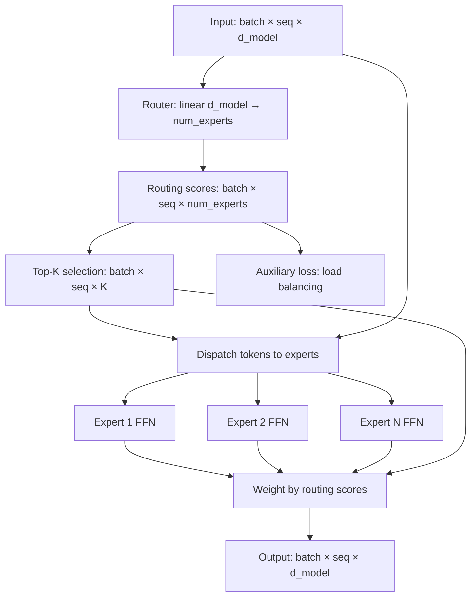

# 04 — Build a Mini MoE

> [!info] TL;DR
> Build a Mixture-of-Experts (MoE) layer from scratch in ~150 lines of PyTorch. The MoE layer has N expert FFNs, a router that selects top-K experts per token, and load-balancing auxiliary loss. Once you can build this, you understand how Mixtral, DeepSeek-V3, and GPT-4 (inferred) work.

## Project Goals

By the end of this project, you will have built:
1. A Mixture-of-Experts layer with configurable expert count and top-K.
2. A router that selects experts per token.
3. Load-balancing auxiliary loss.
4. A complete MoE Transformer block (attention + MoE FFN).
5. Training and evaluation on a simple task.

The implementation is minimal — no production optimizations (no expert parallelism, no kernel fusion) — but it captures the core algorithm. Once you understand this, production MoE systems (vLLM's MoE support, DeepSpeed-MoE) become transparent.

## Architecture



## Prerequisites

```bash
pip install torch
```

## Step 1: The Router

The router is a linear layer that produces a score for each expert per token.

```python
import torch
import torch.nn as nn
import torch.nn.functional as F

class MoERouter(nn.Module):
    def __init__(self, d_model: int, num_experts: int, top_k: int):
        super().__init__()
        self.num_experts = num_experts
        self.top_k = top_k
        self.router = nn.Linear(d_model, num_experts, bias=False)
    
    def forward(self, x):
        """
        Args:
            x: (batch, seq, d_model)
        Returns:
            routing_weights: (batch, seq, top_k) — weights for selected experts
            selected_experts: (batch, seq, top_k) — indices of selected experts
            routing_logits: (batch, seq, num_experts) — full routing logits (for aux loss)
        """
        batch_size, seq_len, d_model = x.shape
        
        # Compute routing logits
        routing_logits = self.router(x)  # (batch, seq, num_experts)
        
        # Softmax to get probabilities
        routing_probs = F.softmax(routing_logits, dim=-1)
        
        # Select top-K experts
        top_k_probs, top_k_indices = torch.topk(routing_probs, self.top_k, dim=-1)
        # top_k_probs: (batch, seq, top_k)
        # top_k_indices: (batch, seq, top_k)
        
        # Normalize selected probs (so they sum to 1)
        routing_weights = top_k_probs / top_k_probs.sum(dim=-1, keepdim=True)
        
        return routing_weights, top_k_indices, routing_logits
```

## Step 2: The Expert FFN

Each expert is a standard FFN (like in a Transformer). For this example, we use a simple SwiGLU FFN.

```python
class ExpertFFN(nn.Module):
    def __init__(self, d_model: int, d_ff: int):
        super().__init__()
        self.w1 = nn.Linear(d_model, d_ff, bias=False)  # gate
        self.w2 = nn.Linear(d_ff, d_model, bias=False)  # down
        self.w3 = nn.Linear(d_model, d_ff, bias=False)  # up
    
    def forward(self, x):
        """SwiGLU FFN: (w2 * SiLU(w1 * x)) * (w3 * x)"""
        return self.w2(F.silu(self.w1(x)) * self.w3(x))
```

## Step 3: The MoE Layer

The MoE layer combines the router and experts. For each token, it:
1. Routes the token to its top-K experts.
2. Computes each expert's output.
3. Combines the outputs weighted by routing scores.

```python
class MoELayer(nn.Module):
    def __init__(self, d_model: int, d_ff: int, num_experts: int, top_k: int):
        super().__init__()
        self.num_experts = num_experts
        self.top_k = top_k
        self.router = MoERouter(d_model, num_experts, top_k)
        self.experts = nn.ModuleList([
            ExpertFFN(d_model, d_ff) for _ in range(num_experts)
        ])
    
    def forward(self, x):
        """
        Args:
            x: (batch, seq, d_model)
        Returns:
            output: (batch, seq, d_model)
            aux_loss: scalar — load balancing auxiliary loss
        """
        batch_size, seq_len, d_model = x.shape
        
        # Route
        routing_weights, selected_experts, routing_logits = self.router(x)
        # routing_weights: (batch, seq, top_k)
        # selected_experts: (batch, seq, top_k)
        
        # Flatten batch and sequence dimensions for easier indexing
        x_flat = x.view(-1, d_model)  # (batch * seq, d_model)
        routing_weights_flat = routing_weights.view(-1, self.top_k)  # (batch * seq, top_k)
        selected_experts_flat = selected_experts.view(-1, self.top_k)  # (batch * seq, top_k)
        
        # Compute expert outputs
        # For efficiency, we'd group tokens by expert in production.
        # For clarity, we compute per-token here.
        output = torch.zeros_like(x_flat)
        
        for i in range(self.top_k):
            # For each of the top-K positions
            expert_indices = selected_experts_flat[:, i]  # (batch * seq,)
            weights = routing_weights_flat[:, i]  # (batch * seq,)
            
            for expert_idx in range(self.num_experts):
                mask = (expert_indices == expert_idx)
                if not mask.any():
                    continue
                # Get tokens routed to this expert at position i
                expert_input = x_flat[mask]
                expert_output = self.experts[expert_idx](expert_input)
                # Weight and accumulate
                output[mask] += weights[mask].unsqueeze(-1) * expert_output
        
        output = output.view(batch_size, seq_len, d_model)
        
        # Compute auxiliary loss for load balancing
        aux_loss = self._aux_loss(routing_logits)
        
        return output, aux_loss
    
    def _aux_loss(self, routing_logits):
        """Load balancing auxiliary loss (from GShard / Switch Transformer)."""
        # routing_logits: (batch, seq, num_experts)
        routing_probs = F.softmax(routing_logits, dim=-1)
        
        # Fraction of tokens routed to each expert
        # (average across batch and seq)
        tokens_per_expert = routing_probs.mean(dim=[0, 1])  # (num_experts,)
        
        # Average routing probability per expert
        # (how much probability mass each expert gets)
        prob_per_expert = routing_probs.mean(dim=[0, 1])  # (num_experts,)
        
        # Auxiliary loss: encourages balanced routing
        # = num_experts * sum(tokens_per_expert * prob_per_expert)
        # This is minimized when all experts get equal load.
        aux_loss = self.num_experts * (tokens_per_expert * prob_per_expert).sum()
        
        return aux_loss
```

## Step 4: The MoE Transformer Block

Combine attention and MoE FFN into a Transformer block.

```python
class MoETransformerBlock(nn.Module):
    def __init__(self, d_model: int, num_heads: int, d_ff: int, 
                 num_experts: int, top_k: int):
        super().__init__()
        self.norm1 = nn.RMSNorm(d_model)  # or nn.LayerNorm
        self.attention = nn.MultiheadAttention(d_model, num_heads, batch_first=True)
        self.norm2 = nn.RMSNorm(d_model)
        self.moe = MoELayer(d_model, d_ff, num_experts, top_k)
    
    def forward(self, x, mask=None):
        # Self-attention
        residual = x
        x = self.norm1(x)
        x, _ = self.attention(x, x, x, attn_mask=mask, need_weights=False)
        x = residual + x
        
        # MoE FFN
        residual = x
        x = self.norm2(x)
        moe_output, aux_loss = self.moe(x)
        x = residual + moe_output
        
        return x, aux_loss
```

## Step 5: Training Loop

```python
def train_moe_model():
    # Hyperparameters
    d_model = 256
    num_heads = 8
    d_ff = 1024
    num_experts = 8
    top_k = 2
    num_layers = 4
    vocab_size = 1000
    max_seq_len = 128
    batch_size = 32
    
    # Build model
    embedding = nn.Embedding(vocab_size, d_model)
    pos_embedding = nn.Embedding(max_seq_len, d_model)
    blocks = nn.ModuleList([
        MoETransformerBlock(d_model, num_heads, d_ff, num_experts, top_k)
        for _ in range(num_layers)
    ])
    final_norm = nn.RMSNorm(d_model)
    output_head = nn.Linear(d_model, vocab_size, bias=False)
    
    # Optimizer
    optimizer = torch.optim.AdamW(
        list(embedding.parameters()) + 
        list(pos_embedding.parameters()) +
        list(blocks.parameters()) +
        list(final_norm.parameters()) +
        list(output_head.parameters()),
        lr=1e-4
    )
    
    # Training loop (simplified)
    for step in range(1000):
        # Generate random input (in practice, use real data)
        input_ids = torch.randint(0, vocab_size, (batch_size, max_seq_len))
        positions = torch.arange(max_seq_len).unsqueeze(0).expand(batch_size, -1)
        
        # Forward pass
        x = embedding(input_ids) + pos_embedding(positions)
        
        total_aux_loss = 0
        for block in blocks:
            x, aux_loss = block(x)
            total_aux_loss += aux_loss
        
        x = final_norm(x)
        logits = output_head(x)
        
        # Language modeling loss (next token prediction)
        # Shift: predict token t+1 from token t
        lm_loss = F.cross_entropy(
            logits[:, :-1].reshape(-1, vocab_size),
            input_ids[:, 1:].reshape(-1)
        )
        
        # Total loss: LM loss + aux loss (weighted)
        loss = lm_loss + 0.01 * total_aux_loss
        
        # Backward
        optimizer.zero_grad()
        loss.backward()
        torch.nn.utils.clip_grad_norm_(
            list(embedding.parameters()) + list(blocks.parameters()),
            max_norm=1.0
        )
        optimizer.step()
        
        if step % 100 == 0:
            print(f"Step {step}: LM loss={lm_loss.item():.4f}, "
                  f"Aux loss={total_aux_loss.item():.4f}")
    
    return embedding, blocks, output_head

# Run
model = train_moe_model()
```

## Extensions

Once the basic MoE works, try:
1. **Expert parallelism**: distribute experts across GPUs (each GPU holds a subset of experts).
2. **Capacity factor**: limit how many tokens each expert processes (drop excess). This prevents load imbalance from causing memory issues.
3. **Top-K > 2**: try top-4 or top-8 routing (more experts active per token).
4. **Auxiliary-loss-free balancing**: implement DeepSeek-V3's bias-based balancing instead of the auxiliary loss. See [[28 - DeepSeek-V2 and V3 2024]].
5. **Shared experts**: add a shared expert (always active) alongside the routed experts.
6. **Different expert sizes**: use smaller experts for common patterns, larger for rare ones.

## Common Pitfalls

### All Tokens Route to One Expert
If the router collapses (all tokens go to one expert), the model wastes capacity. The auxiliary loss should prevent this, but if it's too weak, increase its weight. If it's too strong, it hurts quality.

### Expert Underutilization
Some experts never get tokens. This is the load imbalance the auxiliary loss addresses. Monitor expert utilization during training.

### Memory Blowup
The naive implementation processes tokens one at a time, which is slow. Production MoE groups tokens by expert for efficiency. This is a significant engineering effort but necessary for scale.

### Gradient Instability
MoE training can be unstable due to the routing's discrete nature. Use gradient clipping and careful learning rate tuning.

## Production Considerations

This minimal implementation is for learning. Production MoE systems add:
- **Expert parallelism**: experts distributed across GPUs.
- **Kernel fusion**: combine routing, dispatch, expert computation, and combine into fused kernels.
- **Capacity management**: drop tokens when an expert is overloaded.
- **Top-K routing optimization**: efficient sparse matmul for top-K selection.
- **Load balancing monitoring**: real-time tracking of expert utilization.

For production, use vLLM (which supports Mixtral and other MoE models), DeepSpeed-MoE, or Megatron-LM.

## See Also

- [[01 - Build Attention and Transformer From Scratch]]
- [[02 - Build a Mini RAG Pipeline]]
- [[03 - Build a Mini Agent]]
- [[15 - Mixture of Experts Transformer]]
- [[28 - DeepSeek-V2 and V3 2024]]
- [[26 - Mistral 7B 2023]] — Mixtral is built on this
- [[27 - Projects/MOC|27 Projects MOC]]

## Production Hardening Checklist

1. **Top-K=2 routing with noisy top-k**: add noise to logits before top-k to enable differentiable expert selection; essential for backprop through the router.
2. **Load-balancing loss**: add auxiliary loss `L_bal = N * sum_i(f_i * P_i)` where `f_i` = fraction of tokens routed to expert i, `P_i` = avg router probability for expert i. Weight ~0.01.
3. **Capacity factor**: hard-cap tokens per expert at `capacity = (tokens / N_experts) * capacity_factor` (typically 1.25–1.5); drop excess tokens (with drop-tracking for debugging).
4. **Expert specialization monitoring**: log per-expert activation frequency, per-expert loss contribution; detect dead experts (activation <1% of tokens).
5. **BF16 training**: MoE is memory-hungry; BF16 + ZeRO-3 is the minimum for >8B total params.
6. **Activation checkpointing**: every MoE layer should checkpoint; 30% compute overhead for 60% memory savings.
7. **Efficient sparse matmul**: use grouped GEMM (cuBLAS) or Megablocks (opensparse) for top-K=2 routing; standard dense matmul wastes 50%+ compute.
8. **Router z-loss**: add auxiliary loss to prevent router logits from drifting too large (causes overflow in softmax). Weight ~0.001.
9. **Tokenizer-conditional routing** (advanced): route tokens based on token ID distribution; helps specialize experts by token type (punctuation vs. content words).
10. **Inference optimization**: MoE inference is memory-bandwidth-bound; use FP8 weights + FP8 KV cache + grouped GEMM kernel (vLLM, TensorRT-LLM).

## Modern Developments (2024–2026)

### DeepSeek's MLA + MoE Combination
DeepSeek-V3 (2024) combined Multi-Head Latent Attention (MLA — compresses KV cache 4x) with MoE (256 experts, top-8 routing, 21B active params of 671B total). This combination achieved GPT-4-class performance at 1/10th the inference cost. See [[26 - Papers/2024-2026/28 - DeepSeek-V2 and V3 2024]].

### Fine-Grained Experts and Shared Experts
Modern MoE uses **fine-grained experts** (more experts, smaller each — 64 experts of 1B params instead of 8 experts of 8B) for better specialization. **Shared experts** (always-active experts that handle common patterns) reduce redundancy. DeepSeek-V3 uses 1 shared expert + 256 routed experts.

### MoE Inference with Expert Caching
At inference, only top-K experts are activated per token. vLLM and TensorRT-LLM cache expert weights on GPU and swap them in/out based on router predictions. With 8 experts and top-2 routing, only 25% of expert weights need to be hot — dramatically reducing GPU memory.

### Dropless MoE (DroplessPaper, 2025)
Traditional MoE drops tokens when an expert exceeds capacity. Dropless MoE dynamically adjusts capacity based on the actual token distribution per batch, eliminating drops with minimal overhead. Critical for production where drops cause quality degradation.

### Soft MoE
Soft MoE (Google, 2023) replaces discrete top-K routing with soft routing (weighted combination of all experts). Differentiable end-to-end; no load-balancing loss needed; no token drops. Trade-off: every token activates every expert (no inference speedup unless sparsified at inference). Best for moderate-scale training where stability matters more than inference cost.

## Interview Questions

1. **Q: Why does MoE improve scaling? Doesn't more parameters always mean more compute?**
   A: MoE decouples total parameters from active parameters per token. A 671B MoE with 21B active params has the **inference cost** of a 21B dense model but the **capacity** of a 671B model. The compute per token depends on active params, not total. The trade-off is memory: you must load all 671B params into GPU memory (or swap dynamically), making MoE memory-bandwidth-bound at inference.

2. **Q: How does the load-balancing loss work, and why is it needed?**
   A: Without it, the router can collapse — routing all tokens to one or two experts, leaving the rest unused ("dead experts"). The loss `L_bal = N * sum_i(f_i * P_i)` penalizes imbalance: if expert i gets more tokens (high f_i) AND the router is confident (high P_i), the loss increases. This encourages the router to spread tokens evenly. The factor N normalizes for expert count. Weight ~0.01 keeps the loss from dominating the main task loss.

3. **Q: What's the capacity factor, and how do you choose it?**
   A: Capacity = (tokens / N_experts) * capacity_factor. With factor=1, experts can handle exactly the average load; any imbalance causes drops. With factor=1.5, experts have 50% headroom for imbalance but waste 33% of expert compute on padding. Typical: 1.25 (good balance). For training stability, use 1.5; for inference efficiency, use 1.0–1.1 (with dropless MoE to handle imbalance).

4. **Q: How would you handle dead experts in production?**
   A: (1) **Detect**: log per-expert activation frequency; flag experts with <1% of tokens for >1k steps. (2) **Diagnose**: check router logits for that expert — has the router learned to never select it? (3) **Recover**: increase the load-balancing loss weight; re-initialize the dead expert's weights; restart training from a checkpoint before the expert died. (4) **Prevent**: use expert dropout during training (randomly disable experts to force the router to use all of them); use router noise to prevent deterministic collapse.

5. **Q: Why is MoE inference memory-bandwidth-bound, and how do you optimize it?**
   A: For each token, only top-K experts are activated (e.g., 2 of 8). But you must load ALL expert weights from HBM to SRAM for the routing decision; only the selected experts' weights are then used. The bottleneck is the HBM→SRAM transfer, not the compute. Optimizations: (1) **Expert weight quantization** (FP8, INT4) — 2–4x bandwidth reduction. (2) **Expert weight caching** — keep hot experts in SRAM, swap cold ones. (3) **Grouped GEMM** — fuse the routing + matmul into one kernel (Megablocks, cuBLAS grouped GEMM). (4) **Batching across experts** — accumulate tokens routed to the same expert, process as a batch.

6. **Q: Compare dense vs MoE for a fixed compute budget.**
   A: Given 1e22 FLOPs training budget: (1) **Dense** (e.g., 13B params, trained on 4T tokens) — Chinchilla-optimal; best quality per FLOP for moderate scale. (2) **MoE** (e.g., 100B total params, 13B active, trained on 4T tokens) — same training FLOP as dense 13B, but better quality at inference due to higher capacity. The crossover is around 1e21 FLOPs: below that, dense wins; above, MoE wins. Most 2026 frontier models are MoE.

## Connection to Other Concepts

- [[07 - Transformers/Variants/15 - Mixture of Experts Transformer]] — the parent concept.
- [[26 - Papers/2024-2026/28 - DeepSeek-V2 and V3 2024]] — production MoE at scale.
- [[26 - Papers/2024-2026/43 - MiniMax-01 2025]] — another large MoE.
- [[26 - Papers/2024-2026/41 - Jamba 2024]] — MoE + SSM hybrid.
- [[10 - Model Architecture Research/Open Source/01 - DeepSeek Architecture]] — DeepSeek's MoE design.
- [[10 - Model Architecture Research/Open Source/04 - Mistral and Mixtral Architecture]] — Mixtral's MoE.
- [[11 - Training/Distributed Training/02 - Distributed Training]] — MoE training requires expert parallelism.
- [[13 - Inference/Serving/04 - vLLM and Continuous Batching]] — MoE inference optimization.
- [[13 - Inference/Quantization/03 - Quantization]] — FP8/INT4 quantization for MoE.
- [[27 - Projects/Capstones/11 - Build a Distributed Training Pipeline]] — distributed training that supports MoE.
