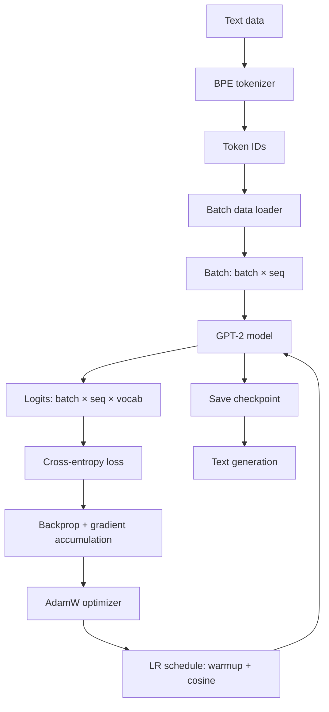

# 05 — Build a Tiny LLM Trainer

> [!info] TL;DR
> Build a complete LLM training pipeline in ~200 lines of PyTorch: tokenizer, model (GPT-2 architecture), data loading, training loop with gradient accumulation, and evaluation. This is the "nanoGPT" approach — minimal code that captures the essential training recipe. Once you can build this, you understand how LLMs are trained, from data to model to optimizer.

## Project Goals

By the end of this project, you will have built:
1. A GPT-2-style model from scratch (attention, FFN, Transformer block).
2. A simple BPE tokenizer (or use an existing one).
3. A data loading pipeline for text data.
4. A training loop with gradient accumulation, learning rate schedule, and checkpointing.
5. A text generation function for inference.

The implementation is deliberately minimal — no distributed training, no FlashAttention, no mixed precision. But it captures the core algorithm. Scale it up (more data, more parameters, distributed training) and you have a real LLM trainer.

## Architecture



## Prerequisites

```bash
pip install torch tiktoken
```

## Step 1: The Model (GPT-2 Architecture)

```python
import torch
import torch.nn as nn
import torch.nn.functional as F
import math

class CausalSelfAttention(nn.Module):
    def __init__(self, d_model: int, num_heads: int):
        super().__init__()
        assert d_model % num_heads == 0
        self.num_heads = num_heads
        self.d_head = d_model // num_heads
        self.qkv = nn.Linear(d_model, 3 * d_model, bias=False)
        self.proj = nn.Linear(d_model, d_model, bias=False)
    
    def forward(self, x):
        batch, seq, d_model = x.shape
        qkv = self.qkv(x)  # (batch, seq, 3 * d_model)
        q, k, v = qkv.chunk(3, dim=-1)
        
        # Reshape for multi-head: (batch, seq, num_heads, d_head) -> (batch, num_heads, seq, d_head)
        q = q.view(batch, seq, self.num_heads, self.d_head).transpose(1, 2)
        k = k.view(batch, seq, self.num_heads, self.d_head).transpose(1, 2)
        v = v.view(batch, seq, self.num_heads, self.d_head).transpose(1, 2)
        
        # Scaled dot-product attention with causal mask
        scores = q @ k.transpose(-2, -1) / math.sqrt(self.d_head)
        # Causal mask: lower triangle is allowed, upper is masked
        mask = torch.tril(torch.ones(seq, seq, device=x.device)).bool()
        scores = scores.masked_fill(~mask, float('-inf'))
        attn = F.softmax(scores, dim=-1)
        out = attn @ v  # (batch, num_heads, seq, d_head)
        
        # Concatenate heads
        out = out.transpose(1, 2).contiguous().view(batch, seq, d_model)
        return self.proj(out)


class FFN(nn.Module):
    def __init__(self, d_model: int, d_ff: int):
        super().__init__()
        self.w1 = nn.Linear(d_model, d_ff, bias=False)
        self.w2 = nn.Linear(d_ff, d_model, bias=False)
        self.w3 = nn.Linear(d_model, d_ff, bias=False)
    
    def forward(self, x):
        # SwiGLU: w2(silu(w1(x)) * w3(x))
        return self.w2(F.silu(self.w1(x)) * self.w3(x))


class TransformerBlock(nn.Module):
    def __init__(self, d_model: int, num_heads: int, d_ff: int):
        super().__init__()
        self.norm1 = nn.RMSNorm(d_model)
        self.attn = CausalSelfAttention(d_model, num_heads)
        self.norm2 = nn.RMSNorm(d_model)
        self.ffn = FFN(d_model, d_ff)
    
    def forward(self, x):
        x = x + self.attn(self.norm1(x))
        x = x + self.ffn(self.norm2(x))
        return x


class TinyGPT(nn.Module):
    def __init__(self, vocab_size: int, d_model: int, num_heads: int, 
                 d_ff: int, num_layers: int, max_seq_len: int):
        super().__init__()
        self.token_emb = nn.Embedding(vocab_size, d_model)
        self.pos_emb = nn.Embedding(max_seq_len, d_model)
        self.blocks = nn.ModuleList([
            TransformerBlock(d_model, num_heads, d_ff) for _ in range(num_layers)
        ])
        self.norm = nn.RMSNorm(d_model)
        self.lm_head = nn.Linear(d_model, vocab_size, bias=False)
        # Weight tying: share embeddings and output head
        self.lm_head.weight = self.token_emb.weight
    
    def forward(self, input_ids, targets=None):
        batch, seq = input_ids.shape
        positions = torch.arange(seq, device=input_ids.device).unsqueeze(0)
        
        x = self.token_emb(input_ids) + self.pos_emb(positions)
        for block in self.blocks:
            x = block(x)
        x = self.norm(x)
        logits = self.lm_head(x)
        
        loss = None
        if targets is not None:
            loss = F.cross_entropy(
                logits.view(-1, logits.size(-1)),
                targets.view(-1),
                ignore_index=-1
            )
        
        return logits, loss
    
    def generate(self, input_ids, max_new_tokens, temperature=1.0, top_k=None):
        """Generate text autoregressively."""
        for _ in range(max_new_tokens):
            # Crop context to max_seq_len
            context = input_ids[:, -self.pos_emb.num_embeddings:]
            logits, _ = self(context)
            logits = logits[:, -1, :] / temperature  # last token
            
            if top_k is not None:
                v, _ = torch.topk(logits, top_k)
                logits[logits < v[:, [-1]]] = float('-inf')
            
            probs = F.softmax(logits, dim=-1)
            next_token = torch.multinomial(probs, num_samples=1)
            input_ids = torch.cat([input_ids, next_token], dim=1)
        
        return input_ids
```

## Step 2: Data Loading

```python
import tiktoken

class TextDataset:
    def __init__(self, text: str, block_size: int, tokenizer=None):
        self.block_size = block_size
        self.tokenizer = tokenizer or tiktoken.get_encoding("gpt2")
        self.tokens = self.tokenizer.encode(text)
    
    def __len__(self):
        return max(0, len(self.tokens) - self.block_size - 1)
    
    def __getitem__(self, idx):
        chunk = self.tokens[idx:idx + self.block_size + 1]
        x = torch.tensor(chunk[:-1], dtype=torch.long)
        y = torch.tensor(chunk[1:], dtype=torch.long)
        return x, y


def get_dataloader(text: str, block_size: int, batch_size: int, shuffle=True):
    dataset = TextDataset(text, block_size)
    return torch.utils.data.DataLoader(
        dataset, batch_size=batch_size, shuffle=shuffle, num_workers=0
    )
```

## Step 3: The Training Loop

```python
def train_tiny_gpt(
    text: str,
    d_model: int = 256,
    num_heads: int = 8,
    d_ff: int = 1024,
    num_layers: int = 4,
    max_seq_len: int = 256,
    batch_size: int = 32,
    learning_rate: float = 3e-4,
    num_epochs: int = 10,
    grad_accum_steps: int = 4,
    warmup_steps: int = 100,
):
    # Tokenizer and data
    tokenizer = tiktoken.get_encoding("gpt2")
    vocab_size = tokenizer.n_vocab
    dataloader = get_dataloader(text, max_seq_len, batch_size)
    
    # Model
    model = TinyGPT(
        vocab_size=vocab_size,
        d_model=d_model,
        num_heads=num_heads,
        d_ff=d_ff,
        num_layers=num_layers,
        max_seq_len=max_seq_len,
    )
    
    # Optimizer
    optimizer = torch.optim.AdamW(model.parameters(), lr=learning_rate, weight_decay=0.1)
    
    # LR schedule: warmup + cosine decay
    total_steps = len(dataloader) * num_epochs // grad_accum_steps
    def get_lr(step):
        if step < warmup_steps:
            return learning_rate * step / warmup_steps
        progress = (step - warmup_steps) / max(1, total_steps - warmup_steps)
        return learning_rate * 0.5 * (1 + math.cos(math.pi * progress))
    
    # Training loop
    step = 0
    model.train()
    for epoch in range(num_epochs):
        optimizer.zero_grad()
        for i, (x, y) in enumerate(dataloader):
            logits, loss = model(x, y)
            loss = loss / grad_accum_steps
            loss.backward()
            
            if (i + 1) % grad_accum_steps == 0:
                # Gradient clipping
                torch.nn.utils.clip_grad_norm_(model.parameters(), max_norm=1.0)
                
                # Update LR
                lr = get_lr(step)
                for param_group in optimizer.param_groups:
                    param_group['lr'] = lr
                
                optimizer.step()
                optimizer.zero_grad()
                step += 1
                
                if step % 50 == 0:
                    print(f"Epoch {epoch}, Step {step}, Loss {loss.item() * grad_accum_steps:.4f}, LR {lr:.6f}")
        
        # Save checkpoint
        torch.save({
            'model_state': model.state_dict(),
            'optimizer_state': optimizer.state_dict(),
            'step': step,
            'config': {'d_model': d_model, 'num_heads': num_heads, 'd_ff': d_ff,
                      'num_layers': num_layers, 'max_seq_len': max_seq_len},
        }, f'checkpoint_epoch_{epoch}.pt')
    
    return model, tokenizer
```

## Step 4: Generation

```python
def generate_text(model, tokenizer, prompt: str, max_tokens: int = 100, 
                  temperature: float = 0.8, top_k: int = 50):
    model.eval()
    input_ids = torch.tensor([tokenizer.encode(prompt)], dtype=torch.long)
    
    with torch.no_grad():
        output_ids = model.generate(input_ids, max_tokens, temperature, top_k)
    
    return tokenizer.decode(output_ids[0].tolist())

# Usage:
# model, tokenizer = train_tiny_gpt(training_text)
# print(generate_text(model, tokenizer, "Once upon a time", max_tokens=100))
```

## Step 5: Putting It Together

```python
if __name__ == "__main__":
    # Use a small text for demo (in practice, use a large corpus)
    sample_text = """
    The Transformer architecture revolutionized natural language processing.
    It uses self-attention to capture dependencies between tokens.
    Multi-head attention allows the model to attend to different aspects simultaneously.
    The feed-forward network processes each position independently.
    Layer normalization stabilizes training.
    """
    # Repeat to have more data
    training_text = sample_text * 100
    
    model, tokenizer = train_tiny_gpt(
        training_text,
        d_model=128,        # small for demo
        num_heads=4,
        d_ff=512,
        num_layers=2,
        max_seq_len=64,
        batch_size=8,
        num_epochs=3,
    )
    
    # Generate
    print(generate_text(model, tokenizer, "The Transformer", max_tokens=50))
```

## Extensions

Once the basic trainer works, try:
1. **FlashAttention**: replace the manual attention with `F.scaled_dot_product_attention` (PyTorch 2.0+) for 2–4× speedup.
2. **Mixed precision**: use `torch.cuda.amp` for FP16 training — 2× speedup and memory reduction.
3. **Distributed training**: use `torch.nn.parallel.DistributedDataParallel` for multi-GPU training.
4. **Larger data**: train on a real corpus (TinyStories, OpenWebText, Wikipedia).
5. **RoPE**: replace learned positional embeddings with RoPE for better length generalization.
6. **GQA**: replace MHA with GQA for efficiency.
7. **LoRA**: add LoRA adapters for efficient fine-tuning.
8. **Checkpoint saving/loading**: implement proper checkpoint management for resumable training.

## Scaling Up

This minimal trainer produces a tiny model (a few million parameters). To scale to a real LLM:
- **More data**: millions of tokens (OpenWebText: ~9B tokens; The Pile: ~840B tokens).
- **Larger model**: d_model=4096, num_heads=32, num_layers=32 (≈7B parameters).
- **Distributed training**: multiple GPUs with FSDP or DeepSpeed ZeRO.
- **Mixed precision**: BF16 or FP8 for memory efficiency.
- **Better tokenizer**: train a custom BPE on your corpus.

The architecture and training loop are the same — just bigger. This is the beauty of the nanoGPT approach: the core algorithm doesn't change as you scale.

## Common Pitfalls

### No Gradient Clipping
Without gradient clipping, training can diverge (loss spikes to NaN). Always clip gradients to max norm 1.0.

### No LR Warmup
Training without warmup can be unstable, especially for larger models. Always include warmup (100–2000 steps depending on model size).

### Wrong Loss Reduction
Make sure cross-entropy uses `ignore_index=-1` (or similar) for padding tokens, and that the loss is averaged correctly.

### No Weight Decay
Weight decay (0.1) improves generalization. Don't apply it to biases or layer norm parameters.

### Tokenizer Mismatch
If the model is trained with one tokenizer but generated with another, outputs are garbage. Always use the same tokenizer for training and inference.

### Context Window Overflow
Generation beyond `max_seq_len` causes index errors. Always crop the context in `generate()`.

## See Also

- [[01 - Build Attention and Transformer From Scratch]]
- [[04 - Build a Mini MoE]]
- [[03 - Build a Mini Agent]]
- [[01 - Decoder-Only Architecture]]
- [[01 - Pretraining Objectives and Scaling Laws]]
- [[14 - Learning Rate Schedules]]
- [[13 - Adam Derivation]]
- [[27 - Projects/MOC|27 Projects MOC]]

## Production Hardening Checklist

1. **Data deduplication**: use MinHash + LSH to remove near-duplicate documents; deduped data trains better models (less memorization, better generalization).
2. **Data quality filtering**: perplexity filter (train a small LM on high-quality data, score new docs; drop high-perplexity outliers); profanity/PII filter.
3. **Contamination check**: hash n-grams from eval sets; remove any matching training docs to prevent contamination.
4. **Cosine LR schedule with warmup**: 2000-step linear warmup → cosine decay to 10% of peak LR. Standard for >1B params.
5. **Gradient clipping**: clip at 1.0 (L2 norm); prevents loss spikes from destabilizing training.
6. **Weight decay**: 0.1 (AdamW); decoupled from LR per AdamW derivation.
7. **Mixed precision (BF16)**: BF16 over FP16 — no loss scaling needed; numerically stable.
8. **Gradient accumulation**: accumulate over N micro-batches to simulate larger batch size; needed when GPU memory < batch size.
9. **Checkpointing every N steps**: save every 500–1000 steps; keep last 3 + best; enables rollback from loss spikes.
10. **Loss spike monitoring**: alert if loss >2x previous checkpoint; auto-rollback to last good checkpoint; log spike for debugging.
11. **Eval every N steps**: compute validation perplexity + zero-shot downstream task accuracy; track over training.
12. **Tokenizer training**: train BPE on the training corpus (don't reuse GPT-2's tokenizer for a different domain).

## Modern Developments (2024–2026)

### Chinchilla Scaling Laws Are Now Anti-Patterns
Chinchilla (compute-optimal) suggested ~20 tokens per parameter. Modern LLMs train with 50–200 tokens per parameter ("overtraining") because inference cost dominates total cost — a smaller, well-trained model is cheaper to serve than a larger, Chinchilla-optimal one. Llama 3 8B was trained on 15T tokens (1875 tokens/param). See [[26 - Papers/2024-2026/42 - Scaling Laws (Kaplan and Chinchilla)]] for the original law and its modern reinterpretation.

### Data Quality > Data Quantity
Modern training pipelines spend more effort on data curation than on raw scaling. Key techniques: (1) **Quality classifiers** — train a small classifier on human-labeled (high-quality, low-quality) pairs; filter web crawl data. (2) **Synthetic data** — use LLMs to generate high-quality training data (Phi series, Textbooks Are All You Need). (3) **Data mixing** — careful proportions of web, books, code, academic papers; mixtune for downstream tasks.

### StableAdamW and Adafactor for Large Models
Standard AdamW stores 2 floats per param (m, v) — 16 GB per 1B params in FP32. For >10B models, use: (1) **StableAdamW** — fused kernel, BF16 states; 50% memory reduction. (2) **Adafactor** — factored second moment; 10x memory reduction but slightly worse convergence. (3) **Lion** — only first moment; 50% memory reduction; sometimes better convergence.

### Curriculum Learning and Data Annealing
Train on easy data first (shorter docs, simpler vocabulary), then progressively harder. Anneal the data distribution toward the target domain (code, math, etc.) in the last 10% of training. Llama 3 used data annealing for code quality.

### Streaming Data Loading
For >1T tokens, the dataset doesn't fit on disk in raw form. Use streaming data loaders: tokenize once, store as Shard-aware WebDataset format; stream from S3/local SSD; never load the full dataset into RAM.

## Interview Questions

1. **Q: Walk through the math of training compute for a 1B param model on 100B tokens.**
   A: Training FLOPs ≈ 6 * N * D = 6 * 1e9 * 1e11 = 6e20 FLOPs. On an A100 (312 TFLOPs BF16), that's 6e20 / 3.12e14 = 1.9e6 seconds = ~22 days on one GPU. With 64 A100s (DP=64), ~8.3 hours. Add ~30% overhead for optimizer steps, communication, checkpointing → ~11 hours. Memory: 1B params * 2 bytes (BF16) = 2GB weights + 4GB AdamW state (FP32 m, v) + 4GB gradients (BF16) + ~8GB activations (batch=32, seq=2048) = ~18GB. Fits on one A100 (80GB) with room for larger batch.

2. **Q: How do you debug a loss spike during training?**
   A: (1) **Immediate**: roll back to the last good checkpoint; reduce LR by 2x; resume. (2) **Diagnosis**: check gradient norms (explosion?); check data (any anomalous batches in the spike window?); check hardware (GPU errors, NCCL timeouts); check LR schedule (did warmup end abruptly?). (3) **Prevention**: gradient clipping at 1.0; BF16 over FP16 (no loss scaling issues); slower warmup; log per-layer gradient norms for early warning.

3. **Q: Why is BF16 preferred over FP16 for training?**
   A: BF16 has the same exponent range as FP32 (8 bits) but only 7 bits of mantissa (vs FP32's 23, FP16's 10). FP16's smaller range (max ~65504) causes overflow in gradients and requires loss scaling (manually scale loss up, scale gradients down). BF16's full FP32 range eliminates overflow; no loss scaling needed. Trade-off: BF16 has lower precision than FP16 (7 vs 10 mantissa bits) but this rarely matters for training stability. BF16 is the 2026 default.

4. **Q: How do you choose between training from scratch vs continued pretraining vs fine-tuning?**
   A: (1) **From scratch**: >$10M budget, novel architecture, novel tokenizer, large team. Almost always wrong unless you're a frontier lab. (2) **Continued pretraining**: take an existing base model (Llama 3 8B), train on your domain corpus (medical, legal, code). Cheap (~$10k–$100k), effective for domain adaptation. (3) **Fine-tuning (SFT/DPO)**: take an instruction-tuned model, train on task-specific data. Cheapest (~$10–$1000), best for task-specific behavior. Default: start with fine-tuning; if domain knowledge is missing, do continued pretraining; only train from scratch if you have a research reason.

5. **Q: How do you scale training to multiple GPUs?**
   A: Depends on model size: (1) **<1B params**: Data Parallel (DP) — each GPU has full model, different batches, all-reduce gradients. (2) **1B–10B**: FSDP (ZeRO-3) — shard params/grads/optimizer state across GPUs; all-gather before forward, reduce-scatter after backward. (3) **10B–100B**: 3D parallelism — TP within node, PP across nodes, DP/FSDP across replicas. (4) **>100B**: full 3D + ZeRO-3 + activation checkpointing + recomputation. Use a framework (Megatron-LM, DeepSpeed, TorchTitan) — don't roll your own.

6. **Q: How do you evaluate a trained model?**
   A: Three layers: (1) **Training metrics** — train/val loss, perplexity, gradient norms, LR. Track over time; look for divergence (train↓ val↑ = overfitting). (2) **Zero-shot benchmarks** — MMLU, HellaSwag, ARC, HumanEval, GSM8K. Run every N checkpoints; compare to baselines (Llama 3 at same size). (3) **Human eval** — chat with the model, rate responses; A/B test against baseline. (4) **Specialized evals** — code completion, math reasoning, long-context retrieval — depending on intended use.

## Connection to Other Concepts

- [[11 - Training/MOC]] — the parent chapter.
- [[11 - Training/Pretraining/01 - Pretraining Objectives and Scaling Laws]] — objectives and scaling.
- [[11 - Training/Distributed Training/02 - Distributed Training]] — multi-GPU scaling.
- [[11 - Training/Optimization/04 - Mixed Precision Training]] — BF16/FP8.
- [[11 - Training/Optimization/05 - Loss Spikes and Stability]] — debugging.
- [[11 - Training/Data/03 - Data Pipelines and Deduplication]] — data preparation.
- [[02 - Mathematics/Optimization/13 - Adam Derivation]] — optimizer math.
- [[02 - Mathematics/Optimization/14 - Learning Rate Schedules]] — LR schedules.
- [[26 - Papers/2024-2026/42 - Scaling Laws (Kaplan and Chinchilla)]] — scaling laws.
- [[27 - Projects/Capstones/11 - Build a Distributed Training Pipeline]] — large-scale training.
- [[27 - Projects/Capstones/07 - Build a Reasoning Model Fine-Tune]] — fine-tuning extension.
