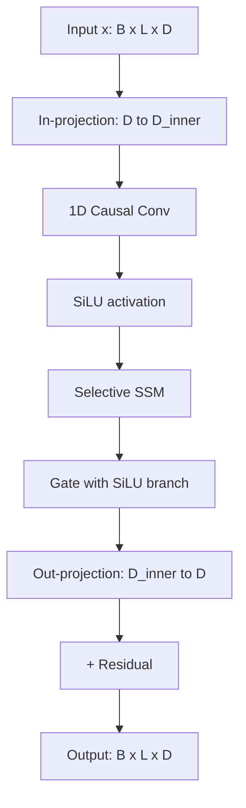

# 09 — Build a Mini SSM (Mamba-style Selective State Space)

> [!info] TL;DR
> Build a selective state space model (SSM) in PyTorch — the architecture behind Mamba and Mamba-2. The model uses a **selective scan**: instead of fixed SSM matrices (as in S4), the transition matrices depend on the input, allowing the model to decide what to remember and what to forget at each step. This is the key insight that made SSMs competitive with Transformers on language tasks. By the end, you'll have a working Mamba-style block that you can drop into a language model.

## Project Goals

By the end of this project, you will have built:

1. A **selective scan** kernel (in pure PyTorch; no custom CUDA).
2. An **SSD (State Space Duality)** block — the Mamba-2 formulation.
3. A **Mamba-style language model** — stacked SSM blocks + MLPs.
4. A training loop on a tiny text dataset.
5. A comparison with a Transformer baseline of similar size.

The implementation uses pure PyTorch and demonstrates the architecture from [[01 - SSMs Mamba and Frontiers]] and [[02 - Mamba-2 and Structured Attention]].

## Why SSMs?

Transformers have $O(n^2)$ attention — every token attends to every other token. This is the fundamental scaling bottleneck for long contexts. State space models offer $O(n)$ computation per layer: each token is processed sequentially, updating a fixed-size hidden state.

The original S4 (2022) showed SSMs could match Transformers on Long Range Arena benchmarks. But S4 used **fixed** SSM matrices — the same transition dynamics regardless of input. This made S4 strong for tasks requiring long-range memorization (audio, time series) but weak for language, where the model needs to selectively forget irrelevant context.

Mamba (2023) introduced **selective SSMs**: the transition matrices depend on the input. The model learns to gate what enters the state (input-dependent $B$, $C$) and what decays (input-dependent $\Delta$). This is the analog of attention's content-based routing, but in a linear-time framework.

## Architecture



The block has the same residual structure as a Transformer block, but the attention sublayer is replaced with a selective SSM.

## Prerequisites

```bash
pip install torch einops
```

Pure PyTorch is enough for this implementation. Production Mamba uses custom CUDA kernels (the `mamba-ssm` package) for 5-10× speedup, but the algorithm is the same.

## Step 1: The Selective Scan

The core of Mamba is the **selective scan**: a recurrence over the sequence, where the SSM matrices depend on the input.

The continuous-time SSM is:
$$h'(t) = Ah(t) + Bx(t), \quad y(t) = Ch(t) + Dx(t)$$

Discretized with a step $\Delta$:
$$h_t = \bar{A} h_{t-1} + \bar{B} x_t, \quad y_t = C h_t + D x_t$$

where $\bar{A} = \exp(\Delta A)$ and $\bar{B} = (\Delta A)^{-1}(\exp(\Delta A) - I) \cdot \Delta B$ (zero-order hold discretization).

In Mamba, $A$ is parameterized as $\exp(-\Delta \cdot \text{softplus}(-A_{\log}))$ — this keeps $A$ negative (stable decay) and makes the decay rate input-dependent via $\Delta$.

```python
import torch
import torch.nn as nn
import torch.nn.functional as F
from einops import rearrange

class SelectiveSSM(nn.Module):
    def __init__(self, d_model, d_state=16, d_inner=4):
        super().__init__()
        self.d_model = d_model
        self.d_state = d_state
        self.d_inner = d_inner
        
        # Input-dependent projections (the "selective" part)
        self.x_proj = nn.Linear(d_inner, d_state * 2 + d_inner, bias=False)
        # Projects x to (B, C, delta)
        
        # A parameter (log-space, kept negative for stability)
        self.A_log = nn.Parameter(torch.randn(d_state) * 0.01 - 4.0)
        # Initialize to ~exp(-4) = 0.018 (slow decay)
        
        # D parameter (skip connection)
        self.D = nn.Parameter(torch.ones(d_inner))
        
        # Output projection
        self.out_proj = nn.Linear(d_inner, d_model, bias=False)
    
    def forward(self, x):
        """x: (batch, length, d_inner)"""
        B, L, D = x.shape
        
        # Project x to (B, C, delta) - all input-dependent
        x_dbl = self.x_proj(x)  # (B, L, 2*d_state + d_inner)
        delta = F.softplus(x_dbl[:, :, :self.d_inner])  # (B, L, d_inner)
        B_ = x_dbl[:, :, self.d_inner:self.d_inner + self.d_state]  # (B, L, d_state)
        C_ = x_dbl[:, :, self.d_inner + self.d_state:]  # (B, L, d_state)
        
        # Discretize A and B
        A = -torch.exp(self.A_log)  # (d_state,) - negative
        # Discrete A: (B, L, d_inner, d_state)
        dA = torch.exp(delta.unsqueeze(-1) * A)  # broadcast: (B, L, d_inner, d_state)
        # Discrete B: (B, L, d_inner, d_state)
        dB = delta.unsqueeze(-1) * B_.unsqueeze(2)  # (B, L, d_inner, d_state)
        
        # Sequential scan (this is the slow part; production uses CUDA)
        h = torch.zeros(B, D, self.d_state, device=x.device, dtype=x.dtype)
        ys = []
        for t in range(L):
            h = dA[:, t] * h + dB[:, t] * x[:, t].unsqueeze(-1)
            y_t = (h * C_[:, t].unsqueeze(1)).sum(dim=-1)  # (B, D)
            ys.append(y_t)
        y = torch.stack(ys, dim=1)  # (B, L, D)
        
        # Skip connection
        y = y + x * self.D
        
        return self.out_proj(y)
```

Key implementation notes:

- `A_log` is initialized around -4, so `exp(A_log) ≈ 0.018`. This makes the decay slow by default — the state retains information over many steps.
- `delta = softplus(...)` is the **selectivity** mechanism. Large $\Delta$ → fast decay (forget the past). Small $\Delta$ → slow decay (remember the past). The model learns to vary $\Delta$ per token.
- The sequential scan is the bottleneck. For production, use the parallel scan algorithm or the `mamba-ssm` CUDA kernel.

## Step 2: The Mamba Block

The full Mamba block wraps the SSM with input/output projections, a 1D causal conv, and gating:

```python
class MambaBlock(nn.Module):
    def __init__(self, d_model, d_state=16, d_inner=None, expand=2):
        super().__init__()
        d_inner = d_inner or d_model * expand
        
        # In-projection (with gating)
        self.in_proj = nn.Linear(d_model, d_inner * 2, bias=False)
        
        # 1D depthwise causal conv
        self.conv1d = nn.Conv1d(
            in_channels=d_inner,
            out_channels=d_inner,
            kernel_size=4,
            padding=3,
            groups=d_inner,  # depthwise
            bias=True,
        )
        
        # The selective SSM
        self.ssm = SelectiveSSM(d_model, d_state=d_state, d_inner=d_inner)
        
        self.d_model = d_model
        self.d_inner = d_inner
    
    def forward(self, x):
        """x: (batch, length, d_model)"""
        B, L, D = x.shape
        
        # In-projection and split into two branches
        xz = self.in_proj(x)  # (B, L, 2*d_inner)
        x_branch, z = xz.chunk(2, dim=-1)  # each (B, L, d_inner)
        
        # 1D causal conv on x_branch
        x_branch = x_branch.transpose(1, 2)  # (B, d_inner, L)
        x_branch = self.conv1d(x_branch)[:, :, :L]  # causal: trim right padding
        x_branch = x_branch.transpose(1, 2)  # (B, L, d_inner)
        
        # SiLU activation
        x_branch = F.silu(x_branch)
        
        # SSM
        y = self.ssm(x_branch)
        
        # Gate with z (also SiLU)
        y = y * F.silu(z)
        
        # Out-projection happens in ssm.out_proj
        return y  # (B, L, d_model)
```

The block has the same residual structure as a Transformer block when wrapped with a residual connection at the model level.

## Step 3: The Mamba Language Model

Stack Mamba blocks with residuals and norms:

```python
class MambaLM(nn.Module):
    def __init__(self, vocab_size, d_model=256, n_layers=4, d_state=16, max_seq_len=512):
        super().__init__()
        self.token_emb = nn.Embedding(vocab_size, d_model)
        # No positional embedding! SSMs encode position implicitly via the state.
        
        self.layers = nn.ModuleList([
            MambaBlock(d_model, d_state=d_state) for _ in range(n_layers)
        ])
        self.norm_f = nn.LayerNorm(d_model)
        
        self.lm_head = nn.Linear(d_model, vocab_size, bias=False)
        # Optionally tie weights: self.lm_head.weight = self.token_emb.weight
    
    def forward(self, input_ids):
        """input_ids: (batch, length)"""
        x = self.token_emb(input_ids)  # (B, L, D)
        
        for layer in self.layers:
            x = x + layer(x)  # residual
        
        x = self.norm_f(x)
        logits = self.lm_head(x)  # (B, L, vocab_size)
        return logits
```

Note: no positional embeddings. The SSM encodes position implicitly — the state at step $t$ summarizes tokens $1..t$, so the model knows "where it is" by what's in the state. This is one of Mamba's elegant properties.

## Step 4: Training Loop

Standard autoregressive language model training:

```python
from torch.optim import AdamW

def train(model, dataset, epochs=10, lr=1e-3, batch_size=32, device="cuda"):
    model = model.to(device)
    optimizer = AdamW(model.parameters(), lr=lr, weight_decay=0.1)
    
    for epoch in range(epochs):
        for batch in dataset.iterate_batches(batch_size):
            input_ids = batch["input_ids"].to(device)  # (B, L)
            labels = batch["labels"].to(device)  # shifted by one
            
            logits = model(input_ids)  # (B, L, V)
            loss = F.cross_entropy(
                logits.reshape(-1, logits.size(-1)),
                labels.reshape(-1),
                ignore_index=-100,
            )
            
            optimizer.zero_grad()
            loss.backward()
            torch.nn.utils.clip_grad_norm_(model.parameters(), max_norm=1.0)
            optimizer.step()
        
        print(f"Epoch {epoch}: loss={loss.item():.4f}")
```

The training loop is identical to a Transformer LM. The architecture difference is in the model, not the training procedure.

## Step 5: Inference (with State Caching)

A key advantage of SSMs: inference is $O(1)$ per token (just update the state). No KV cache of growing size like Transformers.

```python
def generate(model, prompt_ids, max_new_tokens=100, temperature=1.0):
    """Autoregressive generation. SSMs are naturally O(L) per step."""
    model.eval()
    with torch.no_grad():
        ids = prompt_ids
        # Run the prompt through the model to get the final state
        # (in practice, cache the state and only update with new tokens)
        for _ in range(max_new_tokens):
            logits = model(ids[:, -1:])  # only need the last token with state caching
            # For simplicity, recompute the full sequence (slow but correct)
            logits = model(ids)[:, -1, :]  # (B, V)
            
            probs = F.softmax(logits / temperature, dim=-1)
            next_token = torch.multinomial(probs, num_samples=1)
            ids = torch.cat([ids, next_token], dim=1)
        
        return ids
```

In a production implementation, you'd cache the SSM state between calls and only run the new token through the model. This is the SSM equivalent of the Transformer KV cache, but with fixed (not growing) memory.

## Common Pitfalls

### Slow Sequential Scan

The naive Python for-loop over time is extremely slow. For training, you must use either:

- The `mamba-ssm` CUDA kernel (5-10× faster).
- A parallel scan algorithm (2-3× faster in pure PyTorch).
- The Mamba-2 SSD formulation, which expresses the scan as a matrix multiplication (see [[02 - Mamba-2 and Structured Attention]]).

For this learning project, the slow scan is fine; for production, it's a dealbreaker.

### Initialization of A

The `A_log` initialization matters. Too close to 0 (slow decay): the state saturates and the model can't forget. Too negative (fast decay): the state is empty after a few steps. The Mamba paper recommends initializing around -4 to -6 (i.e., `A_log` initialized to log of 0.018 to 0.0025).

### Forgetting Position

Unlike Transformers, SSMs don't need positional embeddings. But if you add them anyway (mistakenly thinking they're needed), you'll hurt performance — the model double-counts position.

### Numerical Instability with Large d_state

The state has shape `(batch, d_inner, d_state)`. For `d_state=128` and `d_inner=2048`, this is 256K floats per batch element per layer. The sequential scan can accumulate numerical errors over long sequences. Use float32 for the state, even if the rest of the model is in bf16.

### Causal Conv Padding

The 1D causal conv needs careful padding. With `kernel_size=4` and `padding=3` (right padding), the conv is causal — it only sees past tokens. Getting this wrong silently breaks causality.

## Production Extensions

### Use the Official Kernels

For real workloads, use the `mamba-ssm` package's CUDA kernels. They implement the selective scan as a custom CUDA kernel, achieving 5-10× speedup over pure PyTorch.

### Mamba-2 SSD Formulation

Mamba-2 reformulates the scan as a structured matrix multiplication (the "State Space Duality"). This enables using existing matrix multiplication kernels (which are highly optimized on modern GPUs) instead of custom scan kernels. See [[02 - Mamba-2 and Structured Attention]].

### Hybrid SSM + Attention

Production models like Jamba and Zamba use SSM for most layers but insert attention layers periodically (e.g., every 8th layer). This combines SSM's $O(n)$ efficiency with attention's precise content-based routing. The hybrid pattern is currently the most promising direction for long-context models.

### LoRA Fine-Tuning

For adapting a pretrained Mamba model to a downstream task, use LoRA on the in/out projections. The SSM matrices ($A$, $B$, $C$, $\Delta$) can be frozen or fine-tuned depending on the task.

## See Also

- [[01 - SSMs Mamba and Frontiers]] — SSM overview
- [[02 - Mamba-2 and Structured Attention]] — the SSD formulation
- [[03 - RWKV and RetNet]] — linear-time alternatives
- [[04 - Hyena and Long Convolutions]] — FFT-based alternative
- [[05 - DeltaNet and Titans]] — neural memory extension
- [[11 - Mamba 2023]] — the original Mamba paper
- [[05 - Build a Tiny LLM Trainer]] — simpler training loop for context
- [[27 - Projects/MOC|27 Projects MOC]]

## Production Hardening Checklist

1. **Selective scan kernel**: use the official `mamba_ssm` CUDA kernel or `mamba2` kernel — naive PyTorch selective scan is 10–100x slower.
2. **State size**: Mamba-1 supports up to 256; Mamba-2 (SSD) supports up to 8192. Larger state = better long-context recall.
3. **BF16 training**: SSMs are sensitive to numerical precision; BF16 over FP16.
4. **Initialization**: S4-style init for the A matrix (HiPPO) for stable long-range modeling.
5. **Convolution mode for training**: use the parallel scan / convolution mode during training (fast); switch to recurrent mode for inference (constant memory).
6. **State caching at inference**: cache the SSM state across tokens (analogous to KV cache in Transformers); O(1) per token at inference.
7. **Hybrid with attention**: pure SSMs fail in-context retrieval tasks; add 1 attention layer every 6–8 SSM layers (Jamba pattern).
8. **Monitoring dead channels**: track per-channel activation; some channels may die during training (always zero). Reinitialize or prune.
9. **Gradient clipping at 1.0**: SSMs can have gradient spikes, especially with large state sizes.
10. **Long-context eval**: test on retrieval tasks (needle-in-haystack, multi-hop QA) — SSMs can fail these silently.

## Common Failure Modes — Diagnostic Table

| Symptom                                | Likely Cause                                  | Fix                                                          |
|----------------------------------------|-----------------------------------------------|--------------------------------------------------------------|
| Training 50x slower than Transformer   | Using naive PyTorch scan, not CUDA kernel     | Install `mamba_ssm`; use `mamba2` kernel                     |
| Loss spikes after N steps              | A matrix init wrong; or state overflow        | Use HiPPO init for A; switch to BF16; lower LR                |
| Model fails retrieval tasks            | Pure SSM can't do in-context retrieval        | Add 1 attention layer per 6–8 SSM layers (hybrid)            |
| Inference is slow                      | Not using state caching                       | Cache SSM state across tokens; recurrent mode at inference   |
| Memory grows with context              | Using scan mode at inference                  | Switch to recurrent mode (constant memory per token)         |
| Quality worse than Transformer         | State size too small; or pure SSM             | Increase state size to 256+; or use hybrid (Jamba pattern)   |
| Dead channels (zero activations)       | Some SSM channels collapse during training    | Monitor per-channel activation; reinit dead channels         |
| Can't generate coherent long text      | State size insufficient for long deps         | Increase state size; or use Mamba-2 (8192 state)             |

## Modern Developments (2024–2026)

### Mamba-2 and SSD Framework
Mamba-2 (Dao & Gu, 2024) introduced Structured State Space Duality (SSD) — a theoretical bridge between SSMs and linear attention. This enabled: (1) state size up to 8192 (vs Mamba-1's 256), (2) reuse of linear-attention kernels (FlashLinearAttention), (3) 2–8x speedup over Mamba-1. Mamba-2 is the backbone of Jamba, Codestral Mamba, and other 2024–2025 production hybrids. See [[26 - Papers/2024-2026/45 - Mamba-2 2024]].

### Hybrid SSM-Transformer Architectures
Pure SSMs fail in-context retrieval (induction heads). The 2024–2026 solution is hybrid: mostly SSM layers with periodic attention (every 6–8 layers). Production hybrids: Jamba (1:7 attention:SSM ratio, 52B total), Kimi Linear (hybrid for 1M context), MiniMax-01 (linear attention + attention). See [[26 - Papers/2024-2026/41 - Jamba 2024]] and [[26 - Papers/2024-2026/43 - MiniMax-01 2025]].

### Titans — Neural Memory + Test-Time Learning
Titans (Google, 2024) adds a neural memory MLP that learns at test time (per-token gradient descent). This gives SSM-like linear cost with attention-like retrieval capability. Outperforms pure SSMs and hybrids on 1M+ context. See [[26 - Papers/2024-2026/46 - Titans 2024]].

### Inference Infrastructure for SSMs
vLLM 0.6+ supports Mamba-2; TensorRT-LLM supports Jamba. The main difference from Transformer inference: SSMs use constant-size state (no growing KV cache), but the state is incompatible with PagedAttention. Custom inference engines are needed.

### Mamba-2 for Vision (Vim)
Vision Mamba (Vim, 2024) applies Mamba-2 to image patches with bidirectional scanning. Matches ViT quality at lower compute for high-res images. Active research area.

## Interview Questions

1. **Q: What's the key difference between an SSM and a Transformer?**
   A: Transformers use attention (O(N²) in sequence length, exact retrieval of any past token). SSMs use a fixed-size recurrent state (O(N) in sequence length, compressed history). SSMs are cheaper for long sequences but can't do exact retrieval — they compress all history into a state vector. Hybrids (Jamba) combine SSM efficiency with attention's retrieval capability.

2. **Q: What makes Mamba's "selective" SSM different from S4?**
   A: S4 (and earlier SSMs) had time-invariant parameters — the A, B, C matrices were fixed regardless of input. Mamba makes B and C input-dependent: the model can decide, per token, what to write to the state (B) and what to read (C). This "selective" capability is what lets Mamba match Transformer quality — it can selectively forget irrelevant tokens and remember important ones. S4 cannot.

3. **Q: Why can't pure SSMs do in-context retrieval?**
   A: In-context retrieval requires looking up a specific earlier token (e.g., "the user said X 1000 tokens ago — what was X?"). Attention does this trivially (each query attends to all past keys). SSMs compress history into a fixed-size state vector; once a token is compressed, it can't be exactly retrieved. This is the "induction head" failure mode identified by H3 (2022). The fix is hybrid: add 1 attention layer to handle retrieval.

4. **Q: How does Mamba-2's SSD framework improve on Mamba-1?**
   A: SSD (Structured State Space Duality) proves SSMs are equivalent to linear attention with a structured mask. This lets Mamba-2: (1) reuse linear-attention kernels (FlashLinearAttention) — 2–8x faster than Mamba-1's custom CUDA kernel; (2) support state sizes up to 8192 (vs 256) — 32x more memory capacity; (3) be more maintainable (uses standard kernel ecosystem). Mamba-2 is the production default; Mamba-1 is largely historical.

5. **Q: How would you choose between Mamba-2, Jamba, and a Transformer for a 1M-token context application?**
   A: (1) **Transformer**: O(N²) cost makes 1M tokens prohibitively expensive (~$5/query at standard pricing). Only if you need exact retrieval and have unlimited budget. (2) **Mamba-2 (pure)**: linear cost, but fails retrieval tasks. Good for streaming/summarization where exact retrieval isn't needed. (3) **Jamba (hybrid)**: linear cost + periodic attention for retrieval. Best general-purpose choice for 1M context. (4) **Titans**: neural memory + test-time learning; best quality at 1M+ but adds 30% inference overhead. Choice depends on retrieval requirements and compute budget.

6. **Q: How does SSM inference differ from Transformer inference?**
   A: Transformers use a KV cache that grows with context (O(N) memory per token). SSMs use a fixed-size state (O(1) memory per token, regardless of context length). At inference: (1) Transformers pre-fill (compute KV for prompt) then decode (use cached KV); SSMs roll up state (process prompt tokens sequentially) then decode (update state per token). (2) Transformers' KV cache can be paged (PagedAttention); SSM state can't (it's a single tensor). (3) Transformers support prefix caching (re-use KV for shared prompts); SSMs support state caching (re-use rolled-up state). Custom inference engines (vLLM Mamba backend) handle these differences.

## Connection to Other Concepts

- [[26 - Papers/2024-2026/11 - Mamba 2023]] — the paper this implements.
- [[26 - Papers/2024-2026/45 - Mamba-2 2024]] — Mamba-2 with SSD framework.
- [[26 - Papers/2024-2026/44 - H3 2022]] — identified induction-head bottleneck.
- [[26 - Papers/2024-2026/46 - Titans 2024]] — neural memory alternative.
- [[26 - Papers/2024-2026/41 - Jamba 2024]] — production hybrid.
- [[24 - Research Frontiers/State Space Models/01 - SSMs Mamba and Frontiers]] — SSM overview.
- [[24 - Research Frontiers/State Space Models/02 - Mamba-2 and Structured Attention]] — Mamba-2 deep dive.
- [[24 - Research Frontiers/Hybrid Architectures/03 - RWKV and RetNet]] — alternative linear-time models.
- [[04 - Neural Networks/Architectures/04 - RNN LSTM GRU]] — RNN precursor.
- [[27 - Projects/Implementations/01 - Build Attention and Transformer From Scratch]] — Transformer equivalent.
- [[27 - Projects/Implementations/05 - Build a Tiny LLM Trainer]] — training pipeline.
