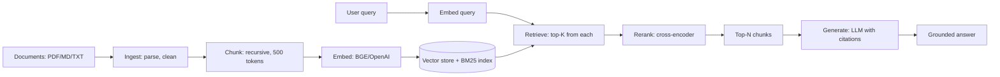

# 02 — Build a Mini RAG Pipeline

> [!info] TL;DR
> Build a complete RAG pipeline in ~200 lines of Python: document ingestion, chunking, embedding, vector storage (pgvector or in-memory), hybrid retrieval (vector + BM25), reranking, and grounded generation. The goal is not production-grade — it's to understand every component by implementing it. Once you can build this from scratch, every RAG framework (LangChain, LlamaIndex) becomes transparent.

## Project Goals

By the end of this project, you will have built a RAG system that:
1. Ingests documents (PDF, Markdown, text) and stores them in a vector database.
2. Retrieves relevant chunks using hybrid search (vector + BM25).
3. Reranks retrieved chunks with a cross-encoder.
4. Generates a grounded answer with citations.
5. Evaluates retrieval and generation quality.

The implementation is deliberately minimal — no abstractions, no framework, no clever tricks. Each component is a function you can read and understand. Once you have this baseline, you can swap components for production-grade alternatives (vLLM for inference, Qdrant for storage, Cohere for reranking) and understand exactly what changes.

## Architecture



## Prerequisites

```bash
pip install openai sentence-transformers rank-bm25 pypdf tiktoken
# Or for local embeddings:
pip install sentence-transformers rank-bm25 pypdf tiktoken
```

For the LLM, you can use:
- OpenAI API (set `OPENAI_API_KEY`).
- A local model via Ollama (`ollama serve` + `ollama pull llama3.1`).
- vLLM (`vllm serve meta-llama/Llama-3.1-8B-Instruct`).

## Step 1: Document Ingestion

```python
from pathlib import Path
from pypdf import PdfReader

def ingest_document(path: str) -> str:
    """Load a document and return its text content."""
    p = Path(path)
    if p.suffix.lower() == ".pdf":
        reader = PdfReader(path)
        return "\n\n".join(page.extract_text() for page in reader.pages)
    elif p.suffix.lower() in (".md", ".txt"):
        return p.read_text(encoding="utf-8")
    else:
        raise ValueError(f"Unsupported file type: {p.suffix}")

def clean_text(text: str) -> str:
    """Minimal cleaning: collapse whitespace, remove obvious headers/footers."""
    import re
    text = re.sub(r"\n{3,}", "\n\n", text)
    text = re.sub(r"[ \t]+", " ", text)
    return text.strip()
```

For production, you'd add OCR for scanned PDFs, layout-aware parsing (unstructured.io), language detection, and PII scrubbing. For the mini-project, basic text extraction is enough.

## Step 2: Chunking

```python
import tiktoken

def chunk_text(text: str, target_tokens: int = 500, overlap: int = 50) -> list[str]:
    """Recursive character-based chunking with token-based target size."""
    enc = tiktoken.get_encoding("cl100k_base")
    
    # Split on paragraph boundaries first, then sentences, then words
    paragraphs = text.split("\n\n")
    chunks = []
    current_chunk = ""
    current_tokens = 0
    
    for para in paragraphs:
        para_tokens = len(enc.encode(para))
        
        if para_tokens > target_tokens:
            # Paragraph too big; split by sentences
            if current_chunk:
                chunks.append(current_chunk.strip())
                current_chunk = ""
                current_tokens = 0
            
            sentences = para.split(". ")
            for sent in sentences:
                sent_tokens = len(enc.encode(sent))
                if current_tokens + sent_tokens > target_tokens and current_chunk:
                    chunks.append(current_chunk.strip())
                    # Keep overlap
                    overlap_text = current_chunk[-overlap * 4:]  # rough char estimate
                    current_chunk = overlap_text + " " + sent
                    current_tokens = len(enc.encode(current_chunk))
                else:
                    current_chunk = (current_chunk + ". " + sent).strip()
                    current_tokens += sent_tokens
        else:
            if current_tokens + para_tokens > target_tokens and current_chunk:
                chunks.append(current_chunk.strip())
                current_chunk = para
                current_tokens = para_tokens
            else:
                current_chunk = (current_chunk + "\n\n" + para).strip()
                current_tokens += para_tokens
    
    if current_chunk:
        chunks.append(current_chunk.strip())
    
    return chunks
```

This is a simplified version of LangChain's `RecursiveCharacterTextSplitter`. For production, consider:
- Layout-aware chunking (keep headings, lists, tables intact).
- Semantic chunking (split at topic boundaries).
- Late chunking (embed the full document first, then split — preserves context).

See [[02 - Chunking Hybrid Search Reranking]] for details.

## Step 3: Embedding

```python
from sentence_transformers import SentenceTransformer

# Load a small, fast embedding model
embedder = SentenceTransformer("BAAI/bge-small-en-v1.5")

def embed_texts(texts: list[str]) -> list[list[float]]:
    """Embed a list of texts."""
    embeddings = embedder.encode(texts, normalize_embeddings=True, show_progress_bar=True)
    return embeddings.tolist()

def embed_query(query: str) -> list[float]:
    """Embed a single query."""
    # BGE models recommend prepending a query instruction
    return embedder.encode(["Represent this sentence for searching relevant passages: " + query],
                          normalize_embeddings=True)[0].tolist()
```

For production, use OpenAI's `text-embedding-3-small` (cheaper, larger context) or `BAAI/bge-large-en-v1.5` (open-source, high quality). Always normalize embeddings for cosine similarity.

## Step 4: Vector Storage (In-Memory)

```python
import numpy as np

class InMemoryVectorStore:
    def __init__(self):
        self.chunks: list[str] = []
        self.metadata: list[dict] = []
        self.embeddings: np.ndarray = None
    
    def add(self, chunks: list[str], embeddings: list[list[float]], metadata: list[dict] = None):
        if metadata is None:
            metadata = [{} for _ in chunks]
        self.chunks.extend(chunks)
        self.metadata.extend(metadata)
        
        new_emb = np.array(embeddings, dtype=np.float32)
        if self.embeddings is None:
            self.embeddings = new_emb
        else:
            self.embeddings = np.vstack([self.embeddings, new_emb])
    
    def search(self, query_emb: list[float], top_k: int = 10) -> list[tuple[str, float, dict]]:
        query_vec = np.array(query_emb, dtype=np.float32)
        # Cosine similarity (embeddings are normalized)
        scores = self.embeddings @ query_vec
        top_idx = np.argsort(-scores)[:top_k]
        return [(self.chunks[i], float(scores[i]), self.metadata[i]) for i in top_idx]
```

For production, replace this with pgvector (see [[02 - Vector Storage with pgvector]]) or a dedicated vector DB (see [[04 - Vector Memory Backends]]).

## Step 5: BM25 (Keyword Search)

```python
from rank_bm25 import BM25Okapi

class BM25Store:
    def __init__(self):
        self.bm25 = None
        self.chunks: list[str] = []
    
    def add(self, chunks: list[str]):
        self.chunks.extend(chunks)
        tokenized = [chunk.lower().split() for chunk in chunks]
        self.bm25 = BM25Okapi(tokenized)
    
    def search(self, query: str, top_k: int = 10) -> list[tuple[str, float]]:
        if not self.bm25:
            return []
        tokenized_query = query.lower().split()
        scores = self.bm25.get_scores(tokenized_query)
        top_idx = np.argsort(-scores)[:top_k]
        return [(self.chunks[i], float(scores[i])) for i in top_idx]
```

BM25 catches exact keyword matches that vector search might miss (entity names, code identifiers, IDs).

## Step 6: Hybrid Retrieval

```python
def hybrid_retrieve(query: str, vector_store: InMemoryVectorStore, 
                    bm25_store: BM25Store, top_k: int = 20) -> list[dict]:
    """Retrieve from both stores, fuse with reciprocal rank fusion."""
    query_emb = embed_query(query)
    
    # Get top-K from each
    vec_results = vector_store.search(query_emb, top_k=top_k)
    bm25_results = bm25_store.search(query, top_k=top_k)
    
    # Reciprocal Rank Fusion
    rrf_k = 60  # standard constant
    rrf_scores: dict[str, float] = {}
    
    for rank, (chunk, score, meta) in enumerate(vec_results):
        rrf_scores[chunk] = rrf_scores.get(chunk, 0) + 1 / (rrf_k + rank + 1)
    
    for rank, (chunk, score) in enumerate(bm25_results):
        rrf_scores[chunk] = rrf_scores.get(chunk, 0) + 1 / (rrf_k + rank + 1)
    
    # Sort by fused score
    fused = sorted(rrf_scores.items(), key=lambda x: -x[1])[:top_k]
    
    return [{"chunk": chunk, "score": score} for chunk, score in fused]
```

Reciprocal Rank Fusion (RRF) is the simplest way to combine rankings. It's robust to different score scales and works well in practice.

## Step 7: Reranking

```python
from sentence_transformers import CrossEncoder

# Load a cross-encoder reranker
reranker = CrossEncoder("cross-encoder/ms-marco-MiniLM-L-6-v2")

def rerank(query: str, chunks: list[str], top_n: int = 5) -> list[tuple[str, float]]:
    """Rerank chunks by relevance to the query."""
    pairs = [(query, chunk) for chunk in chunks]
    scores = reranker.predict(pairs)
    ranked = sorted(zip(chunks, scores), key=lambda x: -x[1])[:top_n]
    return [(chunk, float(score)) for chunk, score in ranked]
```

Cross-encoder rerankers are slower than bi-encoder embeddings (they process query+document together) but much more accurate. Use them to refine the top-20 from retrieval to the top-5 for generation.

## Step 8: Grounded Generation

```python
import openai

def generate_answer(query: str, retrieved_chunks: list[str], model: str = "gpt-4o-mini") -> str:
    """Generate a grounded answer with citations."""
    context = "\n\n---\n\n".join(
        f"[{i+1}] {chunk}" for i, chunk in enumerate(retrieved_chunks)
    )
    
    prompt = f"""Answer the question based on the following context.
Cite sources using [N] notation. If the context doesn't contain the answer, say "I don't have enough information to answer this question."

Context:
{context}

Question: {query}

Answer:"""
    
    response = openai.chat.completions.create(
        model=model,
        messages=[{"role": "user", "content": prompt}],
        temperature=0.1,  # low temperature for factual answers
        max_tokens=500,
    )
    
    return response.choices[0].message.content
```

Key choices:
- **Low temperature** (0.1–0.3): factual answers, less hallucination.
- **Citation format**: `[N]` notation lets users verify claims.
- **Fallback**: explicitly tell the model to say "I don't know" if context is insufficient.

## Step 9: Putting It Together

```python
def build_rag(documents_dir: str):
    """Build a RAG system from a directory of documents."""
    # Ingest
    vector_store = InMemoryVectorStore()
    bm25_store = BM25Store()
    
    for path in Path(documents_dir).glob("**/*"):
        if path.suffix.lower() not in (".pdf", ".md", ".txt"):
            continue
        text = clean_text(ingest_document(str(path)))
        chunks = chunk_text(text)
        embeddings = embed_texts(chunks)
        metadata = [{"source": str(path), "chunk_idx": i} for i in range(len(chunks))]
        
        vector_store.add(chunks, embeddings, metadata)
        bm25_store.add(chunks)
    
    return vector_store, bm25_store

def query_rag(query: str, vector_store, bm25_store) -> str:
    """Query the RAG system."""
    # Hybrid retrieval
    retrieved = hybrid_retrieve(query, vector_store, bm25_store, top_k=20)
    
    # Rerank
    chunks = [r["chunk"] for r in retrieved]
    reranked = rerank(query, chunks, top_n=5)
    top_chunks = [chunk for chunk, score in reranked]
    
    # Generate
    answer = generate_answer(query, top_chunks)
    
    return answer, top_chunks

# Usage
vector_store, bm25_store = build_rag("./documents")
answer, sources = query_rag("What is the return policy?", vector_store, bm25_store)
print(answer)
print("Sources:", sources)
```

## Step 10: Evaluation

```python
def evaluate_rag(test_cases: list[dict], vector_store, bm25_store) -> dict:
    """Evaluate retrieval and generation quality."""
    results = {"retrieval_hit_rate": 0, "generation_faithfulness": 0}
    
    for case in test_cases:
        query = case["query"]
        expected_source = case.get("expected_source")
        expected_answer_keywords = case.get("answer_keywords", [])
        
        # Retrieve
        retrieved = hybrid_retrieve(query, vector_store, bm25_store, top_k=20)
        
        # Check if expected source is in top-5
        if expected_source:
            top_sources = [r["chunk"][:100] for r in retrieved[:5]]
            if any(expected_source in src for src in top_sources):
                results["retrieval_hit_rate"] += 1
        
        # Generate
        answer, _ = query_rag(query, vector_store, bm25_store)
        
        # Check if answer contains expected keywords
        if expected_answer_keywords:
            if all(kw.lower() in answer.lower() for kw in expected_answer_keywords):
                results["generation_faithfulness"] += 1
    
    n = len(test_cases)
    results["retrieval_hit_rate"] /= n
    results["generation_faithfulness"] /= n
    return results
```

For production, use a framework like Ragas or TruLens for more sophisticated evaluation (faithfulness scoring via LLM-as-judge, context precision, answer relevance). See [[04 - LLM-as-Judge Evaluation]].

## Extensions

Once the basic pipeline works, try:
1. **Replace the in-memory store with pgvector** (see [[02 - Vector Storage with pgvector]]).
2. **Add query rewriting** — use an LLM to rewrite the query before retrieval.
3. **Add HyDE** — generate a hypothetical answer, embed it, use it for retrieval.
4. **Add multi-hop retrieval** — if the first retrieval is insufficient, generate follow-up queries.
5. **Add streaming** — stream the answer token by token as it's generated.
6. **Add a feedback loop** — log queries and answers; use thumbs-up/down to improve.
7. **Add structured generation** — use JSON mode or a schema to constrain output format.
8. **Add agentic RAG** — let the model decide when to retrieve, what to retrieve, and when to stop. See [[03 - Advanced RAG Patterns]].

## Common Pitfalls

### Chunk Size Too Large
Large chunks dilute relevance. The retriever returns a chunk that mostly isn't about the query. Target 200–500 tokens per chunk.

### No Overlap
Chunks split mid-sentence lose context. Use 10–20% overlap.

### No Hybrid Search
Pure vector search misses exact matches. Always combine with BM25.

### No Reranking
Top-K from retrieval is noisy. Reranking with a cross-encoder dramatically improves precision.

### No Citation
Without citations, users cannot verify claims. Always require the model to cite sources.

### No Fallback
The model hallucinates when context is insufficient. Always tell it to say "I don't know" if context is insufficient.

### No Evaluation
Without an eval set, you cannot measure improvements. Build a small test set (50–100 examples) and run it on every change.

## See Also

- [[01 - Build Attention and Transformer From Scratch]]
- [[03 - Build a Mini Agent]]
- [[01 - RAG Pipeline Overview]]
- [[02 - Chunking Hybrid Search Reranking]]
- [[03 - Advanced RAG Patterns]]
- [[02 - Vector Storage with pgvector]]
- [[04 - LLM-as-Judge Evaluation]]
- [[27 - Projects/MOC|27 Projects MOC]]

## Production Hardening Checklist

The mini RAG pipeline in this project is intentionally simple. To make it production-grade, add:

1. **Hybrid retrieval**: combine BM25 (tsvector) + vector (pgvector) with reciprocal rank fusion (RRF, k=60). Pure vector search misses exact entity matches.
2. **Cross-encoder reranking**: after retrieving top-50, rerank with `bge-reranker-large` or Cohere Rerank; take top-5. Improves precision@5 by 10–20%.
3. **Query rewriting**: an LLM rewrites the user's query into 2–4 variants (HyDE — generate a hypothetical answer, embed it). Run retrieval on all variants; dedupe results.
4. **Citation enforcement**: parse the LLM's output for `[N]` citations and verify each maps to a retrieved chunk. Reject responses with ungrounded citations.
5. **Per-chunk metadata**: store `source_doc`, `page`, `chunk_index`, `confidence`, `last_updated`. Filter by these at retrieval time.
6. **Incremental reindexing**: when a source doc changes, re-embed only the affected chunks (track a `doc_hash` per chunk).
7. **Evaluation harness**: 50–100 test queries with known-good answers; measure retrieval recall@5, answer faithfulness (LLM-as-judge), and answer relevance on every change.
8. **Streaming**: stream the LLM's answer token-by-token back to the user; embed citation tooltips inline.
9. **Caching**: cache query embeddings (same query → same embedding) and final answers for low-cardinality queries (FAQ).
10. **Telemetry**: log per-query retrieval latency, rerank latency, LLM latency, and cost. Set SLOs (p99 < 3s) and alert on breaches.

## Modern Developments (2024–2026)

### Late-Interaction Retrieval (ColBERT, ColPali)
Instead of one embedding per document, store one embedding per token. At query time, compute MaxSim (sum of max similarities per query token) — captures fine-grained lexical+semantic matching. 10–20% higher nDCG than single-vector but 5–10x more storage. See [[26 - Papers/Multimodal/40 - BLIP-2 2023]]-era multi-vector research and the ColPali paper for vision retrieval.

### Agentic RAG
Replace the single retrieve-then-generate step with an agent loop: the LLM decides when to retrieve, what query to use, and whether the results are sufficient. If insufficient, it rewrites the query and retrieves again (Self-RAG, Corrective RAG). Production agents cap retrieval rounds at 3–5 to control latency.

### Multimodal RAG
Documents often contain figures, tables, and screenshots. Multimodal RAG embeds images (via CLIP or SigLIP) alongside text, retrieves both, and passes both to a vision-language model. ColPali extends this by treating document pages as images directly — no OCR step needed.

### GraphRAG
For entity-heavy domains (legal, medical), build a knowledge graph from documents. Retrieval combines vector search (for relevant nodes) + graph traversal (for related entities). Microsoft GraphRAG (2024) is the canonical reference implementation.

### Speculative RAG
A smaller "draft" model proposes an answer; the larger "target" model verifies. If verification succeeds, skip the full retrieve-then-generate. Reduces latency 2–3x for queries where the draft model is confident.

## Interview Questions

1. **Q: Walk through what happens when a user asks "What is our refund policy?" to a RAG system.**
   A: (1) Embed the query with the same embedder used at indexing time. (2) Retrieve top-50 chunks via hybrid search (BM25 + vector + RRF). (3) Rerank top-50 with a cross-encoder; take top-5. (4) Build a prompt: system message + 5 retrieved chunks (with `[1]`...`[5]` citations) + user question + instruction to cite sources. (5) Stream the LLM's response. (6) Parse for `[N]` citations; verify each maps to a retrieved chunk. (7) Return response + cited chunks to the user. (8) Log: query, retrieval latency, rerank latency, LLM latency, citations used, user feedback (thumbs up/down).

2. **Q: How do you evaluate a RAG system end-to-end?**
   A: Three metric categories: (1) **Retrieval metrics** — recall@k (did the right chunk appear in top-k?), MRR (mean reciprocal rank), nDCG. (2) **Generation metrics** — faithfulness (is every claim grounded in a cited chunk?), answer relevance (does it address the question?), correctness (vs. a gold answer). Use LLM-as-judge with a rubric for the latter two. (3) **End-to-end metrics** — user satisfaction (thumbs up/down), task completion (did the user achieve their goal?), latency p99. Tools: RAGAS, TruLens, DeepEval.

3. **Q: When would you NOT use RAG?**
   A: Three cases: (1) **Closed-book QA** where the model already knows the answer (general knowledge, popular facts) — RAG adds latency and cost without benefit. (2) **Personalization** where the user's history fits in context — just stuff it in. (3) **Strict determinism** — RAG introduces retrieval variance (same query → different chunks). For deterministic outputs, use a curated prompt or fine-tune instead. RAG shines for: domain-specific knowledge, frequently-updated content, citation requirements, and contexts too large to fit in the window.

4. **Q: How do you handle conflicting sources in RAG?**
   A: (1) **Detect** — if two retrieved chunks have contradictory claims, flag via an LLM judge. (2) **Resolve** — apply priority rules: more recent > older, official docs > community posts, higher authority source > lower. (3) **Surface** — if unclear, present both to the user: "I found conflicting info: source A says X, source B says Y. Which would you like to use?" (4) **Log** — track conflicts for human review; update source priorities.

5. **Q: How would you scale RAG to 10M documents?**
   A: (1) **Shard the vector index** by topic or tenant; query only relevant shards. (2) **Use DiskANN or SPANN** for disk-based ANN that doesn't fit in RAM. (3) **Apply PQ or binary quantization** to compress vectors 16–32x. (4) **Cache aggressively** — query embeddings, popular queries' results. (5) **Pre-filter** by metadata (tenant, time, source) before vector search. (6) **Use a managed vector DB** (Pinecone Serverless, Qdrant Cloud) for ops-free scaling. (7) **Monitor recall** — sample queries with known-good results; alert on recall drops.

6. **Q: How do you handle multilingual RAG?**
   A: (1) **Embedder choice** — use a multilingual embedder (e.g., `multilingual-e5-large`, Cohere multilingual v3). (2) **Indexing** — index all documents in their original language; don't translate. (3) **Query routing** — detect query language; route to a language-specific index or use a unified multilingual index. (4) **Cross-lingual retrieval** — the embedder handles it; verify with evals. (5) **Generation** — prompt the LLM to answer in the user's language. (6) **Eval** — build per-language eval sets; multilingual RAG often has 5–10% lower recall on non-English due to embedder quality gaps.

## Connection to Other Concepts

- [[17 - RAG/MOC]] — the parent chapter on RAG.
- [[17 - RAG/Ingestion and Retrieval/01 - RAG Pipeline Overview]] — the conceptual pipeline this project implements.
- [[17 - RAG/Ingestion and Retrieval/02 - Chunking Hybrid Search Reranking]] — chunking + hybrid search patterns.
- [[17 - RAG/Advanced Patterns/03 - Advanced RAG Patterns]] — advanced patterns (Agentic RAG, GraphRAG, Self-RAG).
- [[27 - Projects/Capstones/13 - Build a RAG Evaluation Harness]] — production RAG eval.
- [[27 - Projects/Capstones/14 - Build a Multimodal RAG Pipeline]] — multimodal extension.
- [[18 - Memory Systems/Vector Memory/04 - Vector Memory Backends]] — same vector DB patterns.
- [[09 - Foundation Models/Embedding Models/02 - Embedding Models for Retrieval]] — embedder selection.
- [[21 - LLMOps and MLOps/Evaluation/04 - LLM-as-Judge Evaluation]] — LLM-as-judge for RAG eval.
- [[25 - Frameworks and Tools/LLM Frameworks/05 - LlamaIndex]] — LlamaIndex for RAG.
- [[25 - Frameworks and Tools/LLM Frameworks/02 - LangChain]] — LangChain for RAG.
