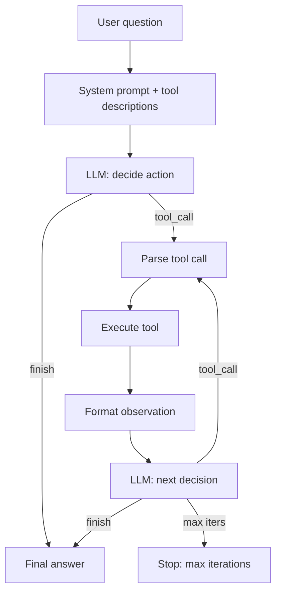

# 03 — Build a Mini Agent

> [!info] TL;DR
> Build a complete ReAct agent in ~150 lines of Python: an LLM, two tools (web search + calculator), a tool-call loop with max iterations, observation formatting, and conversation history. The goal is to understand the agent loop from first principles — once you can build this, every agent framework (LangChain, LangGraph, OpenAI Agents SDK) becomes transparent.

## Project Goals

By the end of this project, you will have built an agent that:
1. Takes a user question.
2. Decides whether to use a tool or answer directly.
3. Calls tools (web search, calculator) with appropriate arguments.
4. Observes the results and decides the next step.
5. Terminates with a final answer when it has enough information.

The implementation uses native OpenAI function calling (the modern way), but the structure mirrors the original ReAct paper's Thought → Action → Observation loop. Once you understand this loop, you understand every agent framework.

## Architecture



## Prerequisites

```bash
pip install openai duckduckgo-search
```

For the LLM:
- OpenAI API (gpt-4o-mini is sufficient and cheap).
- Or a local model via Ollama with function-calling support (Llama 3.1, Qwen 2.5).

## Step 1: Define Tools

Tools are functions with type-annotated parameters. The agent framework converts these to JSON schemas for the LLM.

```python
import json
from duckduckgo_search import DDGS

def web_search(query: str, max_results: int = 5) -> str:
    """Search the web for current information.
    
    Args:
        query: The search query.
        max_results: Maximum number of results to return.
    
    Returns:
        JSON string of search results with title, url, and snippet.
    """
    with DDGS() as ddgs:
        results = list(ddgs.text(query, max_results=max_results))
    
    formatted = [
        {"title": r["title"], "url": r["href"], "snippet": r["body"]}
        for r in results
    ]
    return json.dumps(formatted, indent=2)

def calculator(expression: str) -> str:
    """Evaluate a mathematical expression.
    
    Args:
        expression: A Python-evaluable math expression, e.g. "2 + 3 * 4" or "(100 + 50) / 3".
    
    Returns:
        The result of the expression as a string.
    """
    # SECURITY: restrict to safe characters only
    allowed = set("0123456789+-*/.() ")
    if not all(c in allowed for c in expression):
        return "Error: expression contains invalid characters"
    
    try:
        result = eval(expression, {"__builtins__": {}}, {})
        return str(result)
    except Exception as e:
        return f"Error: {e}"

# Tool registry
TOOLS = {
    "web_search": web_search,
    "calculator": calculator,
}

# Tool schemas (for the LLM)
TOOL_SCHEMAS = [
    {
        "type": "function",
        "function": {
            "name": "web_search",
            "description": "Search the web for current information. Use for questions about recent events, facts, or anything not in your training data.",
            "parameters": {
                "type": "object",
                "properties": {
                    "query": {"type": "string", "description": "The search query"},
                    "max_results": {"type": "integer", "description": "Max results (default 5)", "default": 5},
                },
                "required": ["query"],
            },
        },
    },
    {
        "type": "function",
        "function": {
            "name": "calculator",
            "description": "Evaluate a mathematical expression. Use for any arithmetic to avoid calculation errors.",
            "parameters": {
                "type": "object",
                "properties": {
                    "expression": {"type": "string", "description": "Python-evaluable math expression, e.g. '2 + 3 * 4'"},
                },
                "required": ["expression"],
            },
        },
    },
]
```

Key principles for tool design:
- **Clear descriptions**: the LLM uses these to decide when to call the tool.
- **Strict schemas**: required parameters are marked; types are explicit.
- **Safe execution**: the calculator restricts characters to prevent code injection.
- **String returns**: tools return strings (or JSON-stringified data) so they can be fed back as observations.

## Step 2: The System Prompt

```python
SYSTEM_PROMPT = """You are a helpful assistant that can answer questions using tools.

You have access to the following tools:
- web_search: Search the web for current information.
- calculator: Evaluate mathematical expressions.

Follow the ReAct pattern:
1. Think about what you need to do.
2. If you need information or computation, call a tool.
3. Observe the tool's result.
4. Repeat until you have enough information.
5. Provide a final answer.

Guidelines:
- Always use the calculator for arithmetic — do not compute in your head.
- Use web_search for any question about recent events, current facts, or information you're unsure about.
- Cite sources when using web search results (include the URL).
- If a tool fails, try again with different arguments or a different approach.
- Be concise in your final answer.

When you have enough information, respond with your final answer (no tool call)."""
```

## Step 3: The Agent Loop

```python
import openai

def run_agent(question: str, model: str = "gpt-4o-mini", max_iters: int = 10) -> str:
    """Run the ReAct agent on a question.
    
    Args:
        question: The user's question.
        model: The LLM model to use.
        max_iters: Maximum number of tool-call iterations.
    
    Returns:
        The agent's final answer.
    """
    messages = [
        {"role": "system", "content": SYSTEM_PROMPT},
        {"role": "user", "content": question},
    ]
    
    for iteration in range(max_iters):
        # Call the LLM
        response = openai.chat.completions.create(
            model=model,
            messages=messages,
            tools=TOOL_SCHEMAS,
            tool_choice="auto",  # let the model decide
            temperature=0.1,  # low temperature for deterministic behavior
        )
        
        msg = response.choices[0].message
        
        # Add the assistant's message to history
        messages.append(msg)
        
        # Check if the model wants to call tools
        if not msg.tool_calls:
            # No tool calls — this is the final answer
            return msg.content
        
        # Execute each tool call
        for tool_call in msg.tool_calls:
            tool_name = tool_call.function.name
            tool_args = json.loads(tool_call.function.arguments)
            
            print(f"[Iter {iteration+1}] Calling {tool_name}({tool_args})")
            
            # Execute the tool
            if tool_name in TOOLS:
                try:
                    result = TOOLS[tool_name](**tool_args)
                except Exception as e:
                    result = f"Error executing {tool_name}: {e}"
            else:
                result = f"Error: unknown tool '{tool_name}'"
            
            # Truncate long results to save context
            if len(result) > 2000:
                result = result[:2000] + "\n... [truncated]"
            
            # Add the tool result as a tool message
            messages.append({
                "role": "tool",
                "tool_call_id": tool_call.id,
                "content": result,
            })
            
            print(f"[Iter {iteration+1}] Result: {result[:200]}...")
    
    # Max iterations reached
    return "I'm sorry, I couldn't complete this task within the allowed number of steps."
```

## Step 4: Tracing and Observability

A production agent needs tracing — every thought, action, and observation should be logged for debugging.

```python
import logging
from datetime import datetime

logger = logging.getLogger("agent")

def run_agent_with_tracing(question: str, model: str = "gpt-4o-mini", max_iters: int = 10) -> dict:
    """Run the agent with full tracing."""
    trace = {
        "question": question,
        "model": model,
        "start_time": datetime.utcnow().isoformat(),
        "iterations": [],
        "final_answer": None,
    }
    
    messages = [
        {"role": "system", "content": SYSTEM_PROMPT},
        {"role": "user", "content": question},
    ]
    
    for iteration in range(max_iters):
        iter_log = {"iteration": iteration + 1, "tool_calls": []}
        
        response = openai.chat.completions.create(
            model=model,
            messages=messages,
            tools=TOOL_SCHEMAS,
            temperature=0.1,
        )
        
        msg = response.choices[0].message
        messages.append(msg)
        
        if not msg.tool_calls:
            iter_log["type"] = "final_answer"
            iter_log["answer"] = msg.content
            trace["iterations"].append(iter_log)
            trace["final_answer"] = msg.content
            trace["end_time"] = datetime.utcnow().isoformat()
            return trace
        
        iter_log["type"] = "tool_calls"
        for tool_call in msg.tool_calls:
            tool_name = tool_call.function.name
            tool_args = json.loads(tool_call.function.arguments)
            
            call_log = {"tool": tool_name, "args": tool_args}
            
            if tool_name in TOOLS:
                try:
                    result = TOOLS[tool_name](**tool_args)
                    call_log["status"] = "success"
                except Exception as e:
                    result = f"Error: {e}"
                    call_log["status"] = "error"
                    call_log["error"] = str(e)
            else:
                result = f"Error: unknown tool '{tool_name}'"
                call_log["status"] = "unknown_tool"
            
            call_log["result_preview"] = result[:200]
            
            messages.append({
                "role": "tool",
                "tool_call_id": tool_call.id,
                "content": result,
            })
            
            iter_log["tool_calls"].append(call_log)
        
        trace["iterations"].append(iter_log)
    
    trace["final_answer"] = "Max iterations reached."
    trace["end_time"] = datetime.utcnow().isoformat()
    return trace
```

For production, integrate with OpenTelemetry or LangSmith for distributed tracing. See [[05 - Observability Stack]].

## Step 5: Error Handling and Robustness

```python
def run_agent_robust(question: str, model: str = "gpt-4o-mini", max_iters: int = 10) -> str:
    """Agent with comprehensive error handling."""
    messages = [
        {"role": "system", "content": SYSTEM_PROMPT},
        {"role": "user", "content": question},
    ]
    
    consecutive_errors = 0
    MAX_CONSECUTIVE_ERRORS = 3
    
    for iteration in range(max_iters):
        try:
            response = openai.chat.completions.create(
                model=model,
                messages=messages,
                tools=TOOL_SCHEMAS,
                temperature=0.1,
                timeout=30,  # 30-second timeout
            )
        except openai.APITimeoutError:
            return "I'm sorry, the request timed out. Please try again."
        except openai.RateLimitError:
            return "I'm sorry, I'm being rate-limited. Please try again in a moment."
        except openai.APIError as e:
            consecutive_errors += 1
            if consecutive_errors >= MAX_CONSECUTIVE_ERRORS:
                return f"I'm sorry, I encountered repeated errors: {e}"
            # Retry
            continue
        
        consecutive_errors = 0  # reset on success
        msg = response.choices[0].message
        messages.append(msg)
        
        if not msg.tool_calls:
            return msg.content
        
        for tool_call in msg.tool_calls:
            tool_name = tool_call.function.name
            try:
                tool_args = json.loads(tool_call.function.arguments)
            except json.JSONDecodeError:
                # Model produced invalid JSON; tell it
                messages.append({
                    "role": "tool",
                    "tool_call_id": tool_call.id,
                    "content": "Error: invalid JSON arguments. Please retry with valid JSON.",
                })
                continue
            
            if tool_name not in TOOLS:
                messages.append({
                    "role": "tool",
                    "tool_call_id": tool_call.id,
                    "content": f"Error: tool '{tool_name}' does not exist. Available tools: {list(TOOLS.keys())}",
                })
                continue
            
            try:
                result = TOOLS[tool_name](**tool_args)
            except TypeError as e:
                # Argument mismatch
                result = f"Error: invalid arguments for {tool_name}: {e}"
            except Exception as e:
                result = f"Error executing {tool_name}: {e}"
            
            # Truncate
            if len(result) > 2000:
                result = result[:2000] + "\n... [truncated]"
            
            messages.append({
                "role": "tool",
                "tool_call_id": tool_call.id,
                "content": result,
            })
    
    return "I'm sorry, I couldn't complete this task within the allowed number of steps."
```

## Step 6: Usage Examples

```python
# Simple calculation
answer = run_agent("What is 17 * 23 + 45?")
# Expected: uses calculator, returns "436"

# Web search
answer = run_agent("What is the current population of Tokyo?")
# Expected: uses web_search, returns answer with source URL

# Multi-step
answer = run_agent("What is the GDP of Japan divided by its population?")
# Expected: web_search for GDP, web_search for population, calculator for division, final answer

# No tool needed
answer = run_agent("What is the capital of France?")
# Expected: model answers directly without tools (knowledge from training)
```

## Extensions

Once the basic agent works, try:
1. **Add more tools**: file system access, code execution (sandboxed), database query, RAG retrieval.
2. **Add streaming**: stream the final answer token by token.
3. **Add structured outputs**: use JSON mode to constrain the final answer format.
4. **Add memory**: persist conversation across sessions. See [[02 - MemGPT and Letta]].
5. **Add multi-agent**: split into a planner + executor. See [[01 - Multi-Agent Architectures]].
6. **Add reflection**: after errors, have the agent reflect on what went wrong. See [[05 - Reflection]].
7. **Add planning**: use Tree-of-Thoughts for hard problems. See [[06 - Tree of Thoughts and Self Consistency]].
8. **Add MCP integration**: connect to MCP servers for tool discovery. See [[01 - MCP Overview]].
9. **Add guardrails**: input/output filtering for safety. See [[01 - LLM Security and Prompt Injection]].
10. **Add evaluation**: build a test set of (question, expected_answer) pairs and run automated evaluation.

## Common Pitfalls

### No Max Iterations
Without a cap, the agent loops forever on errors. Always set `max_iters`.

### No Tool Validation
The model passes invalid arguments; the tool crashes; the agent gives up. Validate arguments; return clear error messages.

### Long Observations
Tool results (especially web search) can be huge. Truncate to keep context manageable.

### No Tracing
Without traces, agent bugs are impossible to debug. Log every iteration.

### No Temperature Control
High temperature makes the agent's tool selection erratic. Use low temperature (0.1–0.3) for the agent loop.

### Too Many Tools
With 50+ tools, the model struggles to choose. Keep tools to 5–20 for typical use cases; use retrieval to find relevant tools for larger sets.

### No System Prompt
Without a clear system prompt, the model doesn't know when to use tools vs. answer directly. Always include explicit instructions.

### Trusting Tool Outputs
Tools can fail silently (web search returns stale data, calculator overflows). The agent should validate outputs when possible.

## See Also

- [[01 - Build Attention and Transformer From Scratch]]
- [[02 - Build a Mini RAG Pipeline]]
- [[03 - ReAct Pattern]]
- [[02 - Chain-of-Thought]]
- [[04 - Function Calling]]
- [[05 - Reflection]]
- [[01 - MCP Overview]]
- [[27 - Projects/MOC|27 Projects MOC]]

## Production Hardening Checklist

The mini agent in this project is a starting point. To make it production-grade, add:

1. **Structured tool schemas**: use Pydantic models for tool args and return types; validate every call.
2. **Tool-call budget**: cap tool calls per turn at 5–10; force-finalize on limit to prevent infinite loops.
3. **Streaming**: stream the LLM's reasoning + tool args + tool results to the user for transparency.
4. **Retry with backoff**: wrap every tool call with `tenacity` retry (3 attempts, exponential backoff) for transient failures.
5. **Tool result validation**: every tool result must match its declared schema; reject and re-prompt the LLM on mismatch.
6. **Observability**: log every (thought, action, observation) tuple to LangSmith / Langfuse for debugging.
7. **Concurrency**: parallelize independent tool calls (e.g., web search + calculator can run concurrently); ~30% latency reduction.
8. **Context compression**: if conversation exceeds 32k tokens, summarize old turns; preserve recent + tool results.
9. **Guardrails**: input guardrail (prompt injection detection) + output guardrail (PII detection, toxicity filter).
10. **Cost tracking**: per-turn token cost; alert if cost >$1/turn (likely a runaway loop).

## Modern Developments (2024–2026)

### Structured Outputs (OpenAI, Anthropic, Gemini)
All major LLM providers now support **constrained decoding** to guarantee tool-call args match a JSON Schema. This eliminates the parsing-failure class of bugs that plagued early ReAct agents. Use `response_format: { type: "json_schema", json_schema: {...} }` (OpenAI) or tool_choice="required" (Anthropic).

### Computer Use Agents
Anthropic's Computer Use (2024) and OpenAI's Operator (2025) extended agents beyond text tools to GUI automation: screenshot, click, type, scroll. These agents plan multi-step UI interactions and are 10–100x slower than text-tool agents but enable tasks not previously automatable (e.g., "book a flight on this airline's website").

### Reasoning Models as Agent Cores
GPT-o1, Claude 3.7 Sonnet thinking, DeepSeek-R1 — reasoning models dramatically improve agent performance on complex tasks. The model's internal CoT handles the "think" step of ReAct, leaving only the "act" step explicit. Trade-off: higher latency (10–60s per turn) and cost.

### MCP as the Tool Protocol
The mini agent's ad-hoc tool definitions are giving way to MCP-compatible tools (see [[19 - MCP/MOC]]). MCP standardizes tool discovery, schemas, and execution — your agent can use any MCP server's tools without code changes.

### Sub-Agent Delegation
Complex tasks benefit from a **manager-worker** pattern: a top-level agent decomposes the task and delegates sub-tasks to specialized sub-agents (research, code, write). Each sub-agent has its own tool set and prompt. See [[27 - Projects/Capstones/06 - Build a Multi-Agent System]].

## Interview Questions

1. **Q: What's the difference between an LLM application, a workflow, an agent, and an autonomous agent?**
   A: **LLM application**: single LLM call + UI (e.g., a translator). **Workflow**: a fixed DAG of LLM calls + tools, defined in code (e.g., RAG pipeline). **Agent**: an LLM in a loop with tools, deciding what to do next based on observations (ReAct). **Autonomous agent**: an agent with long-term memory, scheduling, and minimal human oversight — runs for hours/days. The mini agent here is the third type; adding memory + scheduling makes it the fourth.

2. **Q: How do you prevent an agent from looping infinitely on a failing tool?**
   A: (1) **Tool-call budget per turn** (5–10 calls max); force-finalize on limit. (2) **Per-tool retry limit** (3 attempts with backoff). (3) **Error-aware prompt**: include tool errors in the context so the LLM can adapt (e.g., "the API is down, try a different approach"). (4) **Circuit breaker**: after N consecutive failures of the same tool, disable it for the rest of the session. (5) **Cost cap**: abort if cost >$X per turn.

3. **Q: When should you use ReAct vs a workflow?**
   A: Use ReAct when the task requires **adaptive decisions** — the agent doesn't know upfront how many tool calls it'll need or which tools to use. Use a workflow when the **structure is fixed** — always retrieve-then-generate, always parse-then-validate-then-store. Workflows are cheaper, faster, and more debuggable. ReAct is more flexible but more expensive and harder to debug. Hybrid: use a workflow for the main flow, drop into ReAct for the uncertain sub-steps.

4. **Q: How do you test an agent?**
   A: Three layers: (1) **Unit tests** for individual tools (mock the underlying API). (2) **Trajectory tests** — given an input, assert the agent calls specific tools in a specific order (use a recorded LLM response or a deterministic stub). (3) **End-to-end tests** — given a user query, assert the final answer matches expected (use LLM-as-judge for fuzzy matching). Run all three in CI. Track pass rate over time as a quality metric.

5. **Q: How would you reduce agent latency?**
   A: (1) **Parallel tool calls** — when the agent's plan has independent steps, run them concurrently. (2) **Smaller model for routing** — use Haiku/Mini for the "what tool next?" decision; only use the big model for final synthesis. (3) **Streaming** — start showing the user partial results immediately. (4) **Caching** — cache tool results for identical queries (especially web search). (5) **Speculative execution** — if the agent's plan is predictable, pre-execute likely tool calls before the LLM finishes thinking.

6. **Q: How do you handle prompt injection in an agent?**
   A: Layered defense: (1) **Input guardrail** — detect injection patterns in user input ("ignore previous instructions", "system:"). (2) **Tool result sandboxing** — mark tool outputs as untrusted in the LLM's context (e.g., wrap in `<untrusted>...</untrusted>` tags with instructions not to follow instructions inside). (3) **Tool allowlist** — never let the agent call tools not in the allowlist, even if it claims to. (4) **Output review** — for sensitive actions (sending email, deleting files), require human approval. (5) **Audit log** — every tool call logged for post-incident review.

## Connection to Other Concepts

- [[15 - AI Agents/MOC]] — the parent chapter on agents.
- [[15 - AI Agents/Architecture/01 - Agent vs Workflow vs LLM Application]] — when to use which.
- [[15 - AI Agents/Reasoning/03 - ReAct Pattern]] — the pattern this project implements.
- [[15 - AI Agents/Reasoning/02 - Chain-of-Thought]] — the reasoning backbone.
- [[15 - AI Agents/Tool Calling/04 - Function Calling]] — tool calling mechanics.
- [[15 - AI Agents/Patterns/05 - Reflection]] — adding reflection to the agent loop.
- [[15 - AI Agents/Autonomy/08 - Autonomous Agent Lifecycles]] — extending to autonomous.
- [[27 - Projects/Capstones/06 - Build a Multi-Agent System]] — multi-agent extension.
- [[19 - MCP/MOC]] — production tool protocol.
- [[22 - Production AI/Security/01 - LLM Security and Prompt Injection]] — security.
- [[25 - Frameworks and Tools/Agent Frameworks/01 - Framework Selection Guide]] — framework choice.
