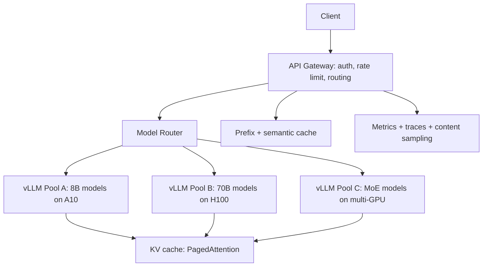
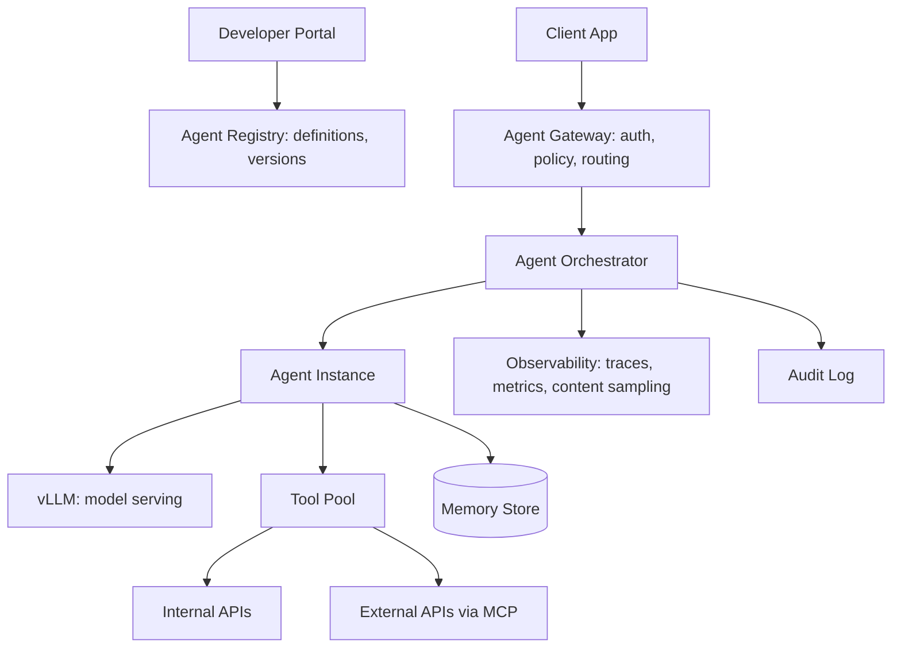

# 02 — System Design Interview Questions

> [!info] TL;DR
> LLM system design interviews test your ability to design production AI systems end-to-end: serving architecture, cost optimization, evaluation, monitoring, multi-tenancy, and failure handling. The three most common questions are: design a multi-tenant RAG platform, design an LLM serving system, and design an agent platform. Each requires understanding the same core components (model serving, vector storage, prompt management, observability) but with different emphasis.

## How to Approach LLM System Design

Unlike classical system design (where the bottleneck is usually the database or the cache), LLM system design has four recurring bottlenecks:
1. **Latency**: LLM inference is slow (100ms–10s).
2. **Cost**: token-based pricing scales with usage.
3. **Quality**: hallucination, drift, prompt injection.
4. **Context**: long contexts cost more and slow down inference.

A good answer addresses all four explicitly. The structure:

1. **Clarify requirements**: users, traffic, latency SLO, cost budget, quality bar.
2. **High-level architecture**: components and data flow.
3. **Deep-dive on the hardest component**: usually the LLM serving or retrieval.
4. **Cost and quality strategy**: routing, caching, eval, monitoring.
5. **Failure handling**: provider outages, cost spikes, quality regressions.
6. **Scale-up plan**: how the system evolves from 1K to 1M users.

Spend the first 5 minutes on requirements clarification. Most candidates jump to architecture too early and miss critical constraints.

## Question 1: Design a Multi-Tenant RAG Platform

### Requirements Clarification
- **Users**: enterprise customers, each with 10–1000 users.
- **Tenants**: 100+ tenants, each with their own document corpus (10K–10M documents).
- **Traffic**: 10–100 queries per second per tenant at peak.
- **Latency SLO**: p95 < 3 seconds end-to-end.
- **Cost**: per-tenant chargeback; budget caps.
- **Quality**: 95%+ retrieval relevance, <5% hallucination rate.
- **Isolation**: tenants cannot see each other's documents.

### High-Level Architecture

```mermaid
graph TD
  Client[Client App] --> API[API Gateway: auth, rate limit]
  API --> Orchestrator[Query Orchestrator]
  Orchestrator --> Router[Model Router]
  Router --> LLM1[vLLM: Llama-3.1-8B for easy queries]
  Router --> LLM2[vLLM: Llama-3.1-70B for hard queries]
  Orchestrator --> Retrieve[Retrieval Service]
  Retrieve --> Vec[(pgvector per tenant)]
  Retrieve --> BM25[(BM25 index per tenant)]
  Retrieve --> Rerank[Cross-encoder reranker]
  Rerank --> Orchestrator
  Orchestrator --> Cache[Redis: response cache]
  Ingest[Ingestion API] --> Queue[Celery: embed queue]
  Queue --> EmbedWorker[Embedding workers]
  EmbedWorker --> Vec
  EmbedWorker --> BM25
```

### Key Decisions

**Multi-tenancy strategy**: shared Postgres cluster with `tenant_id` on every row and row-level security. Each tenant has their own HNSW index within the shared `documents` table. This balances isolation (queries are tenant-scoped by RLS) with operational simplicity (one cluster to manage).

For tenants with very large corpora (>1M documents), consider a dedicated Postgres instance. For smaller tenants, shared is more efficient.

**Retrieval**: hybrid search (vector + BM25) per tenant, with cross-encoder reranking on the top 20 to get the top 5 for generation. RRF for fusion. See [[02 - Chunking Hybrid Search Reranking]].

**Model routing**: classify queries by difficulty. Easy queries (factual lookups, simple Q&A) go to Llama-3.1-8B. Hard queries (multi-step reasoning, code generation) go to Llama-3.1-70B. Routing via a small classifier or the 8B model itself with a "can you answer this?" prompt. See [[06 - Cost Optimization]].

**Caching**: 
- Prefix caching for common system prompts (handled by vLLM).
- Response cache (Redis) for exact-match queries. 5–30% hit rate typical.
- Semantic cache for near-duplicate queries (using embedding similarity). Higher hit rate but risks returning wrong answers.

**Cost governance**: per-tenant budget caps enforced at the API gateway. Requests that would exceed the cap are rejected with a clear error. Per-tenant usage tracking with daily/monthly chargeback reports.

**Quality monitoring**: 
- LLM-as-judge on 1% of responses (faithfulness, relevance).
- User feedback (thumbs up/down) captured and aggregated.
- Retrieval metrics: are the retrieved chunks actually relevant? Sample and audit weekly.
- Hallucination rate: faithfulness check on RAG outputs.

### Failure Handling

- **LLM provider outage**: failover to a backup model (e.g., if OpenAI is down, switch to a self-hosted Llama).
- **Vector DB overload**: degrade to BM25-only retrieval (lower quality but still functional).
- **Cost spike**: alert on per-request cost >$0.50 (likely a bug); auto-disable expensive features.
- **Quality regression**: alert if LLM-as-judge score drops below threshold; rollback the latest prompt change.

### Scale-Up Plan

- **1K users**: single Postgres instance, single vLLM replica, in-process cache.
- **10K users**: Postgres read replica, 2–3 vLLM replicas, Redis cache, dedicated embedding workers.
- **100K users**: sharded Postgres (by tenant), vLLM autoscaling, semantic cache, dedicated retrieval service.
- **1M users**: multi-region deployment, dedicated vector DB (Qdrant or Milvus), disaggregated inference (prefill/decode split).

### Common Follow-Up Questions

- "How do you handle a tenant whose corpus grows to 100M documents?" → migrate to a dedicated Postgres instance, then to a dedicated vector DB if needed. Re-embed if the embedding model changes.
- "How do you handle multi-language documents?" → use a multilingual embedding model (BGE-M3, multilingual E5); detect language at ingest time and route to language-specific indexes if needed.
- "How do you handle PII in documents?" → scrub at ingest time (use a PII detector like Presidio); never log raw prompts/responses; store only redacted versions.
- "How do you handle document updates?" → re-embed the updated document; version the chunks; handle in-flight queries by serving the old version until the new one is ready.

## Question 2: Design an LLM Serving System

### Requirements Clarification
- **Traffic**: 1000 QPS peak, mixed workload (chat, completion, embedding).
- **Models**: 5–10 models served concurrently (different sizes, different fine-tunes).
- **Latency SLO**: p95 TTFT < 1s, p95 total < 5s.
- **Cost**: minimize cost per token; budget cap.
- **Reliability**: 99.9% availability.
- **Clients**: internal applications via API.

### High-Level Architecture



### Key Decisions

**Serving engine**: vLLM for all models. PagedAttention for memory efficiency, continuous batching for throughput, prefix caching for shared system prompts. See [[10 - PagedAttention vLLM 2023]] and [[04 - vLLM and Continuous Batching]].

**Hardware**:
- 8B models: A10 (24GB) — 1 GPU per replica, 8 replicas per node.
- 70B models: H100 (80GB) — 2 GPUs per replica (tensor parallel), 4 replicas per node.
- MoE models: H100 — 4–8 GPUs per replica depending on expert count.

**Model routing**: route by model name + difficulty. For models with multiple fine-tunes (e.g., base + LoRA), use vLLM's multi-LoRA support to serve many adapters from one base model. See [[01 - LoRA]].

**Caching**:
- **Prefix cache** (vLLM native): cache KV state for shared system prompts. 50–80% hit rate for chat applications.
- **Response cache** (Redis): cache exact-match responses. 5–20% hit rate.
- **Semantic cache**: cache responses for semantically similar prompts. Higher hit rate, lower reliability.

**Autoscaling**: scale vLLM replicas based on queue depth and GPU utilization. HPA (Horizontal Pod Autoscaler) on Kubernetes, with custom metrics (queue depth, KV cache utilization).

**Multi-region**: deploy in 2–3 regions for latency and availability. Route by geography (closest region). Replicate model weights across regions (one-time cost); replicate state (cache, conversation) via Redis cross-region replication.

### Failure Handling

- **GPU failure**: Kubernetes restarts the pod; in-flight requests fail and are retried by the client. Use circuit breakers to avoid retry storms.
- **Model OOM**: detected by vLLM; trigger preemption of low-priority requests. See [[10 - PagedAttention vLLM 2023]].
- **Traffic spike**: autoscaler adds replicas (takes 30–60 seconds); in the meantime, queue requests and apply rate limiting.
- **Cost spike**: alert on cost per request; auto-throttle if cost exceeds threshold.

### Cost Optimization

- **Quantization**: INT8 for 70B models (fits on 1 H100 instead of 2). 2× throughput.
- **Speculative decoding**: for chat workloads, use a 1B draft model. 2–3× throughput on accept-heavy workloads. See [[05 - Speculative Decoding]].
- **Batching**: continuous batching (vLLM) gives 5–10× throughput vs. naive.
- **Caching**: prefix + response cache reduces effective QPS by 30–50%.
- **Spot instances**: for batch workloads, use spot GPUs with checkpointing.

### Common Follow-Up Questions

- "How do you handle long-context requests (100K+ tokens)?" → dedicated pool with long-context models; chunked prefill; prefix caching for shared context; consider Ring Attention for >1M tokens.
- "How do you deploy a new model without downtime?" → blue-green deployment: deploy new model in parallel, route a small percentage of traffic, monitor, ramp to 100%, then decommission old model. See [[07 - A-B Testing and Shadow Deployment]].
- "How do you handle streaming responses?" → Server-Sent Events (SSE) from vLLM through the gateway to the client. Buffer management to avoid blocking.
- "How do you handle tool calls?" → parse tool-call JSON from the model, execute tools, feed results back. The serving system itself is tool-agnostic; the client (or an agent framework) handles tool execution.

## Question 3: Design an Agent Platform

### Requirements Clarification
- **Use case**: internal company platform for building AI agents (customer support, research, automation).
- **Users**: 100+ developers across multiple teams.
- **Agents**: 1000+ deployed agents, each with custom prompts, tools, and integrations.
- **Traffic**: 100+ agent invocations per second at peak.
- **Reliability**: 99.9% availability; graceful degradation on component failures.
- **Security**: per-team access control; audit logging; prompt-injection defense.

### High-Level Architecture



### Key Decisions

**Agent definition**: each agent is a versioned bundle (base model + adapter + prompt + tools + parameters), stored in the registry. Promotion through dev → staging → production. See [[03 - Model Registry and Versioning]].

**Orchestrator**: the entry point for agent invocations. Authenticates the caller, loads the agent definition, spawns the agent process (or routes to a warm pool), enforces policies, and returns the result. See [[04 - Enterprise Multi-Agent Architectures]].

**Tool execution**: tools run in sandboxed containers (Docker, gVisor) with limited permissions. Each tool has an access-control list (which agents can call it, on which data). All tool calls are logged for audit. See [[03 - MCP Security]].

**Memory**: per-conversation and per-user memory, stored in Postgres + pgvector. Tenant isolation via row-level security. See [[03 - Memory Operations]] and [[02 - Vector Storage with pgvector]].

**Observability**:
- Distributed tracing (OpenTelemetry) across the orchestrator, agent, tools, and LLM.
- Metrics: per-agent latency, per-tool call rate, per-tenant cost, error rates.
- Content sampling: 1% of agent outputs sampled for LLM-as-judge quality monitoring.

**Policy enforcement**: centralized policy engine (OPA or custom) that enforces:
- Per-team access control (which teams can deploy agents that call which tools).
- Cost caps per team.
- Tool allowlists per agent (a customer-support agent cannot call finance tools).
- Data residency (PII cannot leave certain regions).

### Failure Handling

- **LLM provider outage**: failover to a backup model (different provider or self-hosted).
- **Tool failure**: retry with backoff; fall back to a degraded mode (e.g., return cached data); fail gracefully with a clear error.
- **Agent timeout**: enforce max execution time; return partial results if possible.
- **Cost cap exceeded**: reject new requests from the team; allow in-flight requests to complete.

### Common Follow-Up Questions

- "How do you handle multi-agent workflows?" → use LangGraph-style state graphs; the orchestrator manages the graph traversal. See [[01 - Multi-Agent Architectures]].
- "How do you handle long-running agents (minutes to hours)?" → async pattern: client submits, gets a job ID, polls or subscribes for updates. Use Celery or Temporal for orchestration. See [[03 - Messaging with Kafka and Celery]].
- "How do you handle agent self-modification (MemGPT-style)?" → sandbox the agent's memory writes; validate changes before committing; audit all memory modifications. See [[02 - MemGPT and Letta]].
- "How do you handle prompt injection?" → defense-in-depth: input sanitization, output validation, tool allowlists per context, human-in-the-loop for high-risk tools. See [[03 - MCP Security]] and [[01 - LLM Security and Prompt Injection]].

## General Tips

### Be Explicit About Trade-offs
Every design decision has trade-offs. State them: "I'm choosing pgvector over Pinecone because we already operate Postgres and the operational simplicity outweighs the performance difference at our scale."

### Use Numbers
"This gives us ~500 QPS per vLLM replica, so we need 4 replicas for 2K QPS with headroom." Numbers show you can do capacity planning.

### Address Cost
Most candidates ignore cost. Address it explicitly: "At $0.005 per request, 1M requests/day = $5K/day = $1.8M/year. With caching and routing, we can get this to $500K/year."

### Address Quality
Quality monitoring is often forgotten. Mention LLM-as-judge, content sampling, and feedback loops.

### Have a Scale-Up Plan
Show how the design evolves: "At 10× traffic, we'd shard the database, add a dedicated vector DB, and move to multi-region."

## See Also

- [[01 - Conceptual Interview Questions]]
- [[03 - Coding Interview Questions]]
- [[29 - Interview Prep/MOC|29 Interview Prep MOC]]
- [[01 - Production AI Stack]]
- [[04 - Enterprise Multi-Agent Architectures]]
- [[04 - vLLM and Continuous Batching]]
- [[02 - Vector Storage with pgvector]]
- [[06 - Cost Optimization]]
- [[05 - Production Monitoring]]
