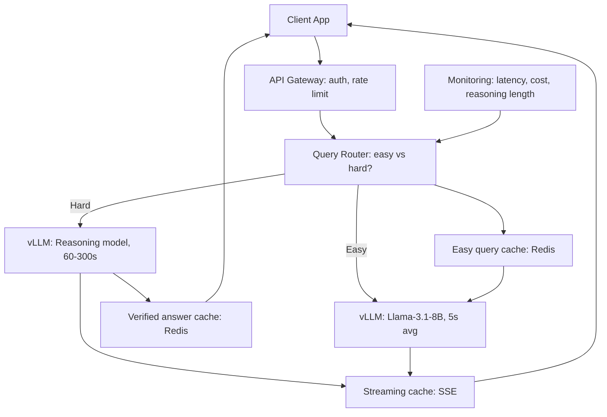
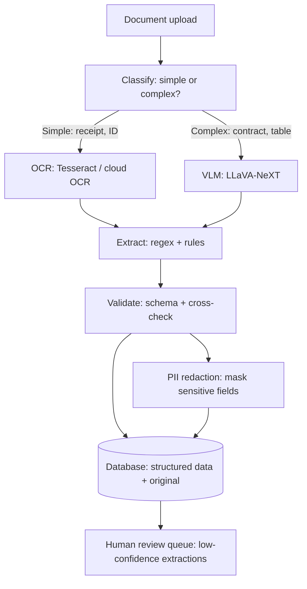
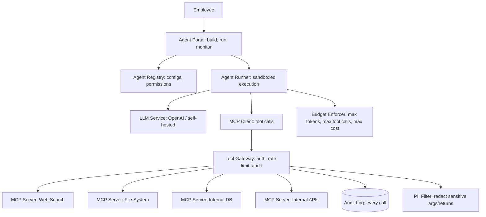
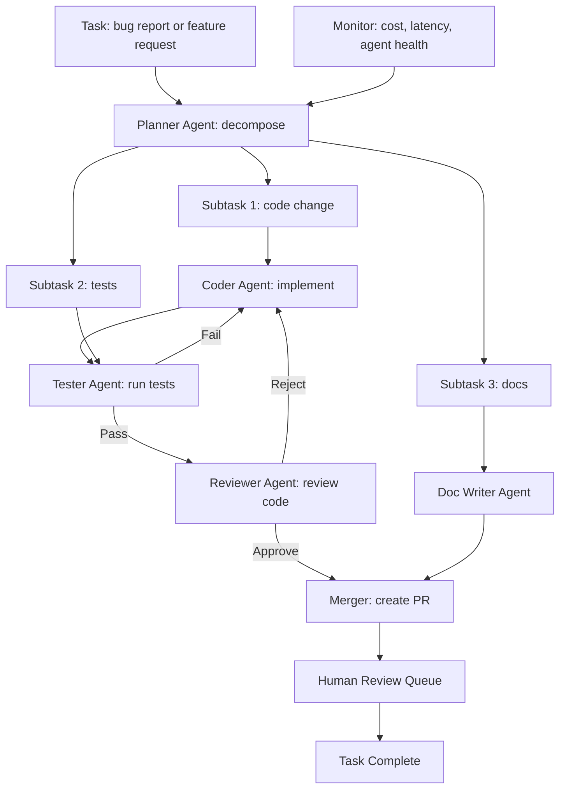

# 05 — System Design Interview Questions (Part 2)

> [!info] TL;DR
> System design questions for advanced AI engineering topics that the original [[02 - System Design Interview Questions|System Design Interview Questions]] note didn't cover: reasoning model serving (o1/R1-style), Vision-Language Model deployment, MCP-based agent architectures, and multi-agent production systems. These are the questions that distinguish a senior AI engineer from a mid-level one — they test integration depth, cost awareness, and failure-mode thinking. Each question includes requirements clarification, high-level architecture, deep-dive on the hardest component, cost/quality strategy, failure handling, and scale-up plan.

## How to Use This Note

Each question follows the standard AI system design structure:

1. **Requirements clarification** — users, traffic, latency SLO, cost budget, quality bar.
2. **High-level architecture** — components and data flow.
3. **Deep-dive on the hardest component** — usually serving, retrieval, or orchestration.
4. **Cost and quality strategy** — routing, caching, eval, monitoring.
5. **Failure handling** — provider outages, cost spikes, quality regressions.
6. **Scale-up plan** — how the system evolves from 1K to 1M users.

Spend the first 5 minutes on requirements clarification. Most candidates jump to architecture too early and miss critical constraints.

---

## Question 1: Design a Reasoning Model Serving System

### Requirements Clarification

- **Model**: a reasoning model (o1-style or DeepSeek-R1-style) that produces long chain-of-thought before answering.
- **Users**: 10K daily active users, 5 queries/day average = 50K queries/day.
- **Latency SLO**: time-to-first-token (TTFT) < 2s; total response time < 60s for easy queries, < 5 minutes for hard queries.
- **Cost**: budget $0.10 per query average.
- **Quality**: must match or exceed the base model on reasoning benchmarks.
- **Use case**: math homework help, code debugging, multi-step planning.

### Key Challenge: Reasoning Models Have Long, Variable Latency

Reasoning models generate 1K–50K tokens of chain-of-thought before the final answer. This means:

- **Latency is 10–100× higher than standard LLMs** — a query that takes 2s on GPT-4o takes 60–300s on o1.
- **Latency is highly variable** — easy queries finish in 30s; hard ones take 5 minutes. Hard to plan capacity.
- **Cost scales with reasoning length** — at $0.06/1K output tokens, a 10K-token reasoning trace costs $0.60. Cost per query varies 10×.
- **Users expect streaming** — showing the reasoning as it's generated (or at least progress indicators) is essential for UX.

### High-Level Architecture



### Key Decisions

**Query routing**: classify queries by difficulty. Easy queries (factual lookups, simple Q&A) go to a fast, cheap model (Llama-3.1-8B, ~5s, $0.001). Hard queries (math, code, multi-step reasoning) go to the reasoning model (~60-300s, $0.10-$0.60). Routing via a small classifier or the 8B model itself with a "can you answer this in 5 seconds?" prompt.

This is critical: sending every query to the reasoning model would cost $0.30 average (10× the budget). Routing 70% to the fast model and 30% to the reasoning model brings average cost to $0.10.

**Streaming with progress indicators**: the reasoning model's chain-of-thought is streamed via SSE (Server-Sent Events). Don't show the raw CoT (it's verbose and confusing to users); instead, show progress indicators like "Thinking... 30s elapsed, 2K tokens of reasoning". When the final answer is ready, stream it normally.

**Verified answer caching**: for math/code queries with verifiable answers, cache the verified answer. If the same query comes in again, return the cached answer immediately (no reasoning needed). Hit rate: 10–30% for homework help (same problems recur).

**Reasoning length budget**: set a max reasoning length (e.g., 32K tokens). If the model exceeds this, cut it off and produce the best answer it can. This bounds cost and latency but may hurt quality on very hard problems.

**Reasoning model deployment**: use vLLM with continuous batching. Reasoning models benefit less from KV cache (each query is independent) but benefit greatly from batching (multiple reasoning traces in parallel). Target: batch 16–32 concurrent reasoning queries per GPU.

### Cost Breakdown (per query)

- Easy query (70% of traffic): Llama-3.1-8B, 5s, 200 tokens output → $0.001.
- Hard query (30% of traffic): reasoning model, 120s avg, 8K tokens output → $0.30.
- Weighted average: 0.7 × $0.001 + 0.3 × $0.30 = $0.09 per query. Within budget.

For 50K queries/day: $4,500/day = $135K/month. Significant but feasible.

### Failure Handling

- **Reasoning model timeout**: if a query exceeds 5 minutes, return a partial answer with "Reasoning incomplete — here's the best answer so far". Don't leave the user hanging.
- **Reasoning model crash**: reasoning models can enter loops or produce garbage. Detect via output monitoring (repetition, length without progress) and fall back to the fast model with a "couldn't solve this, here's a simpler answer".
- **Cost spike**: if daily cost exceeds 1.5× the budget, automatically tighten routing (send more queries to the fast model). Alert the team.
- **Quality regression**: if user feedback (thumbs up/down) drops below 80% positive, alert and roll back to a previous model version.

### Scale-Up Plan

- **1K users/day**: single vLLM instance with 4 GPUs. $5K/month.
- **10K users/day**: 4 vLLM instances with autoscaling. $135K/month.
- **100K users/day**: dedicated GPU cluster (32+ GPUs), model distillation (train a smaller model to mimic the reasoning model's outputs on common query types). $500K-$1M/month.
- **1M users/day**: requires distillation or a custom-trained smaller reasoning model. The full reasoning model is too expensive at this scale; you need a distilled version that's 10× cheaper with similar quality on common queries.

### Interview Tips

- **Acknowledge the cost challenge upfront** — reasoning models are expensive. Show that you understand the cost-quality tradeoff and have a routing strategy.
- **Don't send every query to the reasoning model** — this is the #1 mistake. Always have a fast fallback.
- **Discuss streaming** — reasoning models are slow; users need to see progress. SSE is the standard.
- **Mention distillation for scale** — at 1M users, you can't afford the full reasoning model. Distillation is the answer.
- **Have a timeout strategy** — never let a query run forever. Bound it.

---

## Question 2: Design a VLM Deployment for Document Analysis

### Requirements Clarification

- **Model**: a Vision-Language Model (LLaVA-NeXT, Qwen-VL, or GPT-4V) that analyzes documents (PDFs, screenshots, scanned images).
- **Users**: internal enterprise users, 1K daily active, 20 documents/day average = 20K documents/day.
- **Latency SLO**: < 10s per document for single-page; < 60s for 50-page documents.
- **Cost**: $0.05 per page average.
- **Quality**: 95%+ accuracy on key information extraction (names, dates, amounts, line items).
- **Use cases**: invoice processing, contract analysis, form extraction, receipt OCR.
- **Data sensitivity**: documents contain PII (names, financial data). Must not leave the enterprise network.

### Key Challenge: VLMs Are Expensive and Variable

VLM inference is 5–10× more expensive than text LLM inference (vision encoder + larger model). Document analysis adds:

- **Variable document length** — 1-page receipt vs. 50-page contract. Cost scales with pages.
- **Layout complexity** — tables, figures, multi-column layouts. Naive approaches lose information.
- **OCR vs. VLM tradeoff** — OCR is cheap but loses layout; VLM is expensive but understands layout.
- **PII concerns** — can't use closed APIs (GPT-4V) if documents are sensitive.

### High-Level Architecture



### Key Decisions

**Modality routing**: classify documents by complexity. Simple documents (receipts, IDs, single-field forms) go to OCR + regex extraction (~$0.001/page, 1s). Complex documents (contracts, multi-column tables, handwritten notes) go to the VLM (~$0.05/page, 5-30s). Routing via a small classifier on the first page image.

This is critical: sending every document to the VLM would cost $0.05 × 20K × avg_50_pages = $50K/day. Routing 70% to OCR and 30% to VLM brings cost to $5K/day.

**Self-hosted VLM**: documents contain PII, so can't use GPT-4V. Self-host LLaVA-NeXT (or Qwen-VL) on enterprise GPUs. This also gives better cost control ($0.01-0.02/page at scale vs. $0.05 for GPT-4V).

**Document chunking**: for long documents (50+ pages), don't feed the whole thing to the VLM at once (context window limits + cost). Chunk by page or section, process each chunk, then aggregate. Use a text LLM for aggregation (cheaper than VLM).

**Schema-driven extraction**: don't ask the VLM "what's in this document?". Ask "extract the invoice number, date, vendor name, and line items in this JSON schema". This gives structured output, enables validation, and reduces hallucination.

**Validation pipeline**: cross-check extracted fields against each other (e.g., invoice date should be after the contract date; line items should sum to the total). Low-confidence extractions go to a human review queue.

**PII redaction**: before storing or sending to any external service, redact PII (names, SSNs, account numbers). Use a combination of regex (for structured PII) and NER (for unstructured PII). Audit the redaction pipeline regularly.

### Cost Breakdown (per page)

- Simple (70% of pages): OCR + regex, $0.001, 1s.
- Complex (30% of pages): VLM, $0.05, 10s.
- Weighted average: 0.7 × $0.001 + 0.3 × $0.05 = $0.016 per page. Well under budget.

For 20K documents × avg 10 pages = 200K pages/day: $3,200/day = $96K/month. Feasible for enterprise.

### Failure Handling

- **VLM unavailable (GPU failure)**: fall back to OCR + text LLM. Lower quality but still functional. Alert the team.
- **Low-confidence extraction**: route to human review queue. Don't return garbage to the user.
- **Document too long**: chunk and process. If chunking fails (e.g., corrupted PDF), return an error with diagnostic info.
- **PII redaction failure**: if redaction fails, block the response and alert. Never expose unredacted PII.
- **Quality regression**: if extraction accuracy drops below 95%, alert and roll back to a previous model version.

### Scale-Up Plan

- **1K documents/day**: single VLM instance with 2 GPUs. $5K/month.
- **20K documents/day**: 4 VLM instances with autoscaling. $96K/month.
- **100K documents/day**: dedicated GPU cluster (16+ GPUs), model fine-tuning (fine-tune LLaVA on your specific document types for better accuracy and lower cost). $300K-$500K/month.
- **1M documents/day**: requires distillation (train a smaller VLM to mimic the large one on common document types) or specialized models (e.g., LayoutLM for forms). $1M-$3M/month.

### Interview Tips

- **Acknowledge the PII constraint upfront** — this rules out closed APIs. Show you understand enterprise constraints.
- **Don't send every document to the VLM** — OCR is 50× cheaper for simple documents. Route.
- **Discuss chunking** — long documents can't fit in one VLM call. Chunk and aggregate.
- **Mention schema-driven extraction** — don't ask "what's in this?". Ask "extract these fields in this schema". Better quality, structured output.
- **Have a validation strategy** — cross-check fields, route low-confidence to humans.

---

## Question 3: Design an MCP-Based Agent Platform

### Requirements Clarification

- **Platform**: an internal platform where employees can build and run agents that use MCP servers (web search, file system, databases, internal APIs).
- **Users**: 500 employees, 50 active agents, 1K agent runs/day.
- **Latency SLO**: agent runs complete in < 60s for simple tasks, < 10 minutes for complex tasks.
- **Cost**: $0.50 per agent run average.
- **Security**: agents access internal systems; must have per-user permissions, audit logs, and sandboxing.
- **Use cases**: research assistants, data analysis, code review, customer support triage.

### Key Challenge: Untrusted Tool Composition

MCP lets agents call arbitrary tools from arbitrary servers. This creates security and reliability challenges:

- **Tool poisoning** — a malicious or buggy MCP server could return harmful data or execute unwanted actions.
- **Permission creep** — agents accumulate permissions over time; users don't know what their agents can access.
- **Cost blowup** — an agent that loops calling expensive tools can rack up huge bills.
- **Audit requirements** — enterprise needs to know who called what tool when, with what arguments, and what was returned.

### High-Level Architecture



### Key Decisions

**Tool Gateway**: every MCP tool call goes through a gateway that enforces:
- **Authentication**: the agent's identity (which employee, which agent) is verified.
- **Authorization**: the agent has permission to call this tool (per-user, per-tool permissions).
- **Rate limiting**: max calls per minute, per day, per agent.
- **Audit logging**: every call (agent, tool, args, return, timestamp) is logged for compliance.
- **PII filtering**: sensitive args and returns are redacted before logging.
- **Cost tracking**: tool costs (if any) are attributed to the agent's owner.

**Sandboxed execution**: agents run in Docker containers with:
- **No network access** except through the MCP gateway (prevents direct external calls).
- **Read-only filesystem** except for a scratch directory.
- **Resource limits**: CPU, memory, time.
- **No secrets** mounted unless explicitly granted.

**Budget enforcement**: every agent run has a budget:
- Max LLM tokens (e.g., 100K).
- Max tool calls (e.g., 50).
- Max wall-clock time (e.g., 10 minutes).
- Max cost (e.g., $5).

When any budget is exceeded, the agent is terminated with a budget-exceeded error.

**Permission model**: permissions are per-agent, not per-user. Each agent has a manifest declaring which tools it can use and with what arguments. The manifest is reviewed and approved before the agent can run. Example:

```yaml
agent_name: research-assistant
owner: alice@company.com
tools:
  - name: web_search
    max_calls_per_run: 20
    allowed_args:
      query: "*"
      max_results: 5
  - name: internal_kb_search
    max_calls_per_run: 10
    allowed_args:
      query: "*"
      kb: ["engineering", "product"]
  # NO permission for: file_system, internal_db_write, email_send
budget:
  max_tokens: 100000
  max_tool_calls: 50
  max_time_seconds: 600
  max_cost_usd: 5.00
```

**LLM choice**: route to different LLMs based on the agent's needs:
- Simple agents (research, lookup): Llama-3.1-8B, $0.001/run.
- Complex agents (analysis, code): Llama-3.1-70B or GPT-4o, $0.05/run.
- Reasoning agents (multi-step planning): o1 or DeepSeek-R1, $0.30/run.

### Cost Breakdown (per agent run)

- LLM: $0.05 average (mix of 8B and 70B).
- Tool calls: $0.01 average (mostly free internal tools, some paid APIs).
- Infrastructure: $0.01 (compute, storage).
- Total: $0.07 per run. Well under the $0.50 budget.

For 1K runs/day: $70/day = $2,100/month. Very feasible.

### Failure Handling

- **Tool unavailable**: if an MCP server is down, the agent gets a clear error and can choose an alternative tool or report failure.
- **Tool returns invalid data**: the gateway validates returns against the tool's schema; invalid returns are rejected.
- **Agent loops**: the budget enforcer catches infinite loops (max tool calls, max time).
- **Agent produces harmful output**: post-processing filters check the output for PII, secrets, harmful content. Flagged outputs are blocked and reviewed.
- **Permission revoked mid-run**: if an agent's permissions are revoked while it's running, the gateway stops accepting its tool calls. The agent must terminate.

### Scale-Up Plan

- **50 agents, 1K runs/day**: single server with Docker, 2 GPUs for LLM serving. $5K/month.
- **500 agents, 10K runs/day**: Kubernetes cluster with autoscaling, 8 GPUs. $50K/month.
- **5K agents, 100K runs/day**: dedicated cluster (32+ GPUs), multi-region for HA. $500K/month.
- **50K agents, 1M runs/day**: requires significant infrastructure (100+ GPUs), custom tool gateway, advanced caching. $3M-$5M/month.

### Interview Tips

- **Acknowledge the security challenge upfront** — untrusted tool composition is the hard part. Show you have a gateway strategy.
- **Don't let agents call tools directly** — always go through a gateway that enforces auth, rate limits, and audit.
- **Discuss the permission model** — per-agent manifests, reviewed and approved. This is enterprise-grade.
- **Mention budget enforcement** — agents can loop forever without it. Always set max tokens, max calls, max time.
- **Have a sandboxing strategy** — Docker with no network, read-only FS, resource limits.
- **Audit everything** — every tool call, every argument, every return. Enterprise compliance requires this.

---

## Question 4: Design a Multi-Agent Production System

### Requirements Clarification

- **System**: a multi-agent system where multiple specialized agents collaborate on complex tasks (e.g., software development: planner + coder + tester + reviewer).
- **Users**: internal engineering team, 100 daily active, 50 tasks/day.
- **Latency SLO**: tasks complete in < 30 minutes for simple, < 4 hours for complex.
- **Cost**: $5 per task average.
- **Quality**: 80% of tasks completed without human intervention; 95% with one round of human review.
- **Use case**: automated bug fixes, feature implementation, code review, documentation generation.

### Key Challenge: Coordination and Failure Modes

Multi-agent systems have failure modes that single-agent systems don't:

- **Echo chamber** — agents agree with each other incorrectly, amplifying mistakes.
- **Deadlock** — agents wait for each other indefinitely.
- **Cascade errors** — one agent's mistake propagates to all downstream agents.
- **Cost blowup** — N agents each making LLM calls can cost N× a single agent.
- **Context bloat** — agents passing context to each other can blow up context windows.
- **Lack of accountability** — when something goes wrong, it's unclear which agent is responsible.

### High-Level Architecture



### Key Decisions

**Hierarchical architecture**: a planner agent decomposes the task into subtasks, each handled by a specialized agent. The planner coordinates; the specialists execute. This is more controllable than a flat swarm (where all agents talk to each other).

**Clear agent contracts**: each agent has a defined input schema, output schema, and failure mode. The planner knows exactly what to expect from each specialist. Example:
- Coder: input = subtask description + relevant files; output = diff; failure = "couldn't implement".
- Tester: input = diff + test commands; output = test results; failure = "tests failed: [details]".
- Reviewer: input = diff + test results; output = approve/reject + comments; failure = "unclear, needs human review".

**Iteration budget**: each subtask has a max iteration count (e.g., 3 rounds of code-test-review). If the budget is exceeded, the task is escalated to human review. This prevents infinite loops.

**Context passing**: don't pass full context between agents. Pass structured summaries:
- Coder → Tester: pass the diff and the list of affected files (not the full file contents).
- Tester → Reviewer: pass the diff and test results (not the full test output).
- Reviewer → Planner: pass approve/reject and key comments (not the full review).

This keeps context windows manageable and forces agents to communicate concisely.

**Cost attribution**: track cost per agent per task. If one agent (e.g., the coder) is consuming 80% of the cost, that's a signal to optimize it (e.g., use a cheaper model for initial drafts, expensive model only for review).

**Model routing**: use different LLMs for different agents:
- Planner: GPT-4o (strong reasoning, expensive).
- Coder: Llama-3.1-70B or DeepSeek-Coder (good at code, cheaper).
- Tester: Llama-3.1-8B (simple test execution).
- Reviewer: GPT-4o (strong judgment).
- Doc Writer: Llama-3.1-8B (simple writing).

This reduces cost 3–5× vs. using GPT-4o for everything.

**Failure detection and escalation**:
- If any agent reports failure, the planner decides: retry, use a different agent, or escalate to human.
- If the iteration budget is exceeded, escalate to human.
- If cost exceeds 2× the budget, terminate and escalate.
- If the system produces a PR that fails CI, escalate to human.

### Cost Breakdown (per task)

- Planner (1 call, GPT-4o): $0.10.
- Coder (3 iterations, Llama-3.1-70B): $0.30.
- Tester (3 iterations, Llama-3.1-8B): $0.05.
- Reviewer (3 iterations, GPT-4o): $0.30.
- Doc Writer (1 call, Llama-3.1-8B): $0.01.
- Infrastructure: $0.24 (compute, storage).
- Total: $1.00 per task. Well under the $5 budget.

For 50 tasks/day: $50/day = $1,500/month. Very feasible.

### Failure Handling

- **Agent failure**: if an agent crashes or times out, the planner retries (up to 2 retries) or uses a different agent.
- **Echo chamber**: the reviewer agent is given a "red team" prompt — explicitly asked to find flaws. This counteracts the tendency to agree.
- **Deadlock**: every agent call has a timeout. If an agent doesn't respond, the planner moves on.
- **Cascade errors**: the reviewer catches errors before they propagate. If the reviewer rejects, the coder must fix before the task proceeds.
- **Cost blowup**: the cost monitor terminates tasks that exceed 2× budget.
- **Quality regression**: if the human review rejection rate exceeds 20%, alert the team and pause new tasks.

### Scale-Up Plan

- **50 tasks/day**: single server, 2 GPUs. $5K/month.
- **500 tasks/day**: Kubernetes cluster, 8 GPUs. $15K/month.
- **5K tasks/day**: dedicated cluster (32+ GPUs), model fine-tuning (fine-tune coder agent on your codebase for better quality and lower cost). $100K/month.
- **50K tasks/day**: requires significant infrastructure, model distillation, and specialized agents. $500K-$1M/month.

### Interview Tips

- **Acknowledge the coordination challenge upfront** — multi-agent systems have failure modes single-agent systems don't. Show you understand echo chambers, deadlocks, and cascade errors.
- **Use a hierarchical architecture** — a planner coordinates; specialists execute. This is more controllable than a flat swarm.
- **Define clear agent contracts** — input schema, output schema, failure mode. The planner knows what to expect.
- **Set iteration budgets** — never let agents loop forever. Always escalate to human when the budget is exceeded.
- **Pass structured summaries, not full context** — keeps context windows manageable and forces concise communication.
- **Route to different models** — use expensive models (GPT-4o) for planning/review, cheap models (Llama-3.1-8B) for execution. 3–5× cost reduction.
- **Have a failure detection strategy** — timeouts, cost monitors, quality regression alerts.
- **Mention human-in-the-loop** — for production, always have a human review step. Don't auto-merge agent outputs.

---

## See Also

- [[29 - Interview Prep/MOC|Interview Prep MOC]]
- [[29 - Interview Prep/System Design/02 - System Design Interview Questions|System Design Interview Questions]] — the original, with multi-tenant RAG, LLM serving, agent platform.
- [[29 - Interview Prep/Coding/03 - Coding Interview Questions|Coding Interview Questions]]
- [[29 - Interview Prep/Coding/04 - Coding Interview Questions 2|Coding Interview Questions 2]]
- [[09 - Foundation Models/Reasoning Models/03 - Reasoning Models|Reasoning Models]] — what the reasoning server serves.
- [[13 - Inference/Serving/04 - vLLM and Continuous Batching|vLLM and Continuous Batching]] — the serving infrastructure.
- [[23 - Multimodal AI/Vision-Language/03 - LLaVA|LLaVA]] — the VLM in the document analysis system.
- [[19 - MCP/Architecture/01 - MCP Overview|MCP Overview]] — the protocol the agent platform uses.
- [[19 - MCP/Security/03 - MCP Security|MCP Security]] — security considerations for the gateway.
- [[16 - Multi-Agent Systems/Architectures/01 - Multi-Agent Architectures|Multi-Agent Architectures]] — the architecture patterns.
- [[16 - Multi-Agent Systems/Coordination/03 - Coordination and Consensus|Coordination and Consensus]] — failure modes and mitigation.
- [[22 - Production AI/Architecture/02 - Reference Production Architectures|Reference Production Architectures]]
- [[22 - Production AI/Reliability/06 - Failure Modes and Graceful Degradation|Failure Modes and Graceful Degradation]]
