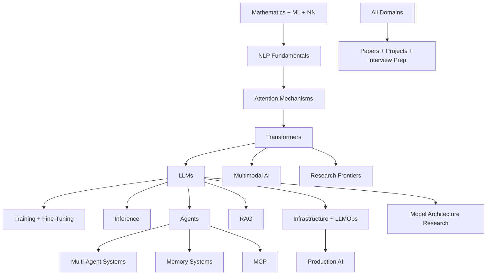

# Master Map of Content (MOC)

> [!info] The MOC is the front door to the vault. If you don't know where to start, start here.

## The Big Picture

The vault teaches the complete AI Engineering stack, organized as a curriculum:

## Domains

### Foundations

- [[01 - AI Foundations/MOC|01 AI Foundations]] — what AI engineering is, roles, the modern stack
- [[02 - Mathematics/MOC|02 Mathematics]] — linear algebra, probability, calculus, optimization, information theory
- [[03 - Machine Learning/MOC|03 Machine Learning]] — supervised, unsupervised, reinforcement learning, evaluation
- [[04 - Neural Networks/MOC|04 Neural Networks]] — perceptrons, MLPs, CNNs, RNNs, training
- [[05 - NLP Fundamentals/MOC|05 NLP Fundamentals]] — tokenization, embeddings, language modeling

### Core Sequence Modeling

- [[06 - Attention Mechanisms/MOC|06 Attention Mechanisms]] — Bahdanau → Luong → self-attention → multi-head → positional → efficient → long-context
- [[07 - Transformers/MOC|07 Transformers]] — the Transformer block, encoder/decoder variants, components
- [[08 - LLMs/MOC|08 LLMs]] — LLM architecture, context/KV, sampling, evaluation, capabilities

### Advanced Models

- [[09 - Foundation Models/MOC|09 Foundation Models]] — vision, multimodal, embedding, code, reasoning
- [[10 - Model Architecture Research/MOC|10 Model Architecture Research]] — per-model deep dives (Llama, DeepSeek, GPT, Claude, Gemini, Mistral, Qwen, etc.)
- [[23 - Multimodal AI/MOC|23 Multimodal AI]] — vision-language, audio, video, diffusion

### Training & Inference

- [[11 - Training/MOC|11 Training]] — pretraining, alignment, data, distributed training
- [[12 - Fine-Tuning/MOC|12 Fine-Tuning]] — PEFT (LoRA, QLoRA), RLHF, DPO, instruction tuning, distillation
- [[13 - Inference/MOC|13 Inference]] — KV cache, decoding, quantization, serving, optimization
- [[14 - Interpretability/MOC|14 Interpretability]] — mechanistic interp, attention analysis, SAEs

### Agents & Systems

- [[15 - AI Agents/MOC|15 AI Agents]] — architecture, planning, reasoning, tool calling, autonomy
- [[16 - Multi-Agent Systems/MOC|16 Multi-Agent Systems]] — coordination, communication, enterprise
- [[17 - RAG/MOC|17 RAG]] — end-to-end retrieval-augmented generation
- [[18 - Memory Systems/MOC|18 Memory Systems]] — memory types, architectures, operations
- [[19 - MCP/MOC|19 MCP]] — Model Context Protocol

### Production

- [[20 - AI Infrastructure/MOC|20 AI Infrastructure]] — serving, storage, messaging, compute, observability
- [[21 - LLMOps and MLOps/MOC|21 LLMOps and MLOps]] — pipelines, monitoring, evaluation, deployment
- [[22 - Production AI/MOC|22 Production AI]] — architectures, reliability, security, scaling
- [[25 - Frameworks and Tools/MOC|25 Frameworks and Tools]] — LangChain, LangGraph, vLLM, etc.

### Research & Reference

- [[24 - Research Frontiers/MOC|24 Research Frontiers]] — SSMs, hybrids, reasoning, long-context, 2026 emerging
- [[26 - Papers/MOC|26 Papers]] — landmark papers (Bahdanau → 2026)
- [[27 - Projects/MOC|27 Projects]] — implementations, mini-projects, capstones
- [[28 - Glossary/MOC|28 Glossary]] — A–Z glossary, acronyms, notation
- [[29 - Interview Prep/MOC|29 Interview Prep]] — conceptual, system design, coding

### Meta

- [[00 - Vault Management/README|00 Vault Management]] — project state, roadmap, status, handoff

## Where to Start (Choose Your Path)

### 🎓 I'm a student learning AI engineering

1. [[02 - Mathematics/MOC|Mathematics]]
2. [[03 - Machine Learning/MOC|Machine Learning]]
3. [[04 - Neural Networks/MOC|Neural Networks]]
4. [[05 - NLP Fundamentals/MOC|NLP Fundamentals]]
5. [[06 - Attention Mechanisms/MOC|Attention Mechanisms]]
6. [[07 - Transformers/MOC|Transformers]]
7. [[08 - LLMs/MOC|LLMs]]
8. Continue per [[Learning Roadmap]]

### 🛠️ I'm an engineer building LLM applications

1. [[08 - LLMs/MOC|LLMs]]
2. [[13 - Inference/MOC|Inference]]
3. [[17 - RAG/MOC|RAG]]
4. [[15 - AI Agents/MOC|AI Agents]]
5. [[19 - MCP/MOC|MCP]]
6. [[25 - Frameworks and Tools/MOC|Frameworks]]
7. [[22 - Production AI/MOC|Production AI]]

### 🔬 I'm a researcher tracking frontiers

1. [[06 - Attention Mechanisms/MOC|Attention]] (full)
2. [[07 - Transformers/MOC|Transformers]]
3. [[10 - Model Architecture Research/MOC|Model Architecture Research]]
4. [[24 - Research Frontiers/MOC|Research Frontiers]]
5. [[26 - Papers/MOC|Papers]]
6. [[00 - Vault Management/Research Queue|Research Queue]]

### 🎯 I'm preparing for interviews

1. [[29 - Interview Prep/MOC|Interview Prep]]
2. [[28 - Glossary/MOC|Glossary]]
3. Cross-reference concept notes for depth.

## Cross-Domain Themes

Some topics span multiple domains. These "theme" links let you explore horizontally:

- **Attention** appears in [[06 - Attention Mechanisms/MOC|06]], [[07 - Transformers/MOC|07]], [[08 - LLMs/MOC|08]], [[10 - Model Architecture Research/MOC|10]], [[13 - Inference/MOC|13]] (KV cache), [[24 - Research Frontiers/MOC|24]] (linear attention).
- **Memory** appears in [[13 - Inference/MOC|13]] (KV cache), [[18 - Memory Systems/MOC|18]] (agent memory), [[24 - Research Frontiers/MOC|24]] (neural memory).
- **Tools** appear in [[15 - AI Agents/MOC|15]] (tool calling), [[19 - MCP/MOC|19]] (MCP tools), [[25 - Frameworks and Tools/MOC|25]] (frameworks).
- **Embeddings** appear in [[05 - NLP Fundamentals/MOC|05]], [[08 - LLMs/MOC|08]], [[17 - RAG/MOC|17]], [[18 - Memory Systems/MOC|18]], [[23 - Multimodal AI/MOC|23]].
- **Reasoning** appears in [[15 - AI Agents/MOC|15]] (CoT, ToT), [[09 - Foundation Models/MOC|09]] (reasoning models), [[24 - Research Frontiers/MOC|24]] (test-time compute).

## Reading Lists

- [[Learning Roadmap]] — full curriculum order.
- [[Reading Order]] — alternative reading orders (researcher, engineer, interviewer).
- [[26 - Papers/MOC|Papers MOC]] — paper-reading order.

## Vault State

For project-state information (iteration, status, what's done, what's next), see [[00 - Vault Management/README|Vault Management]].

---

See also: [[README]] · [[00 - Vault Management/Master Roadmap|Master Roadmap]] · [[Learning Roadmap]]
