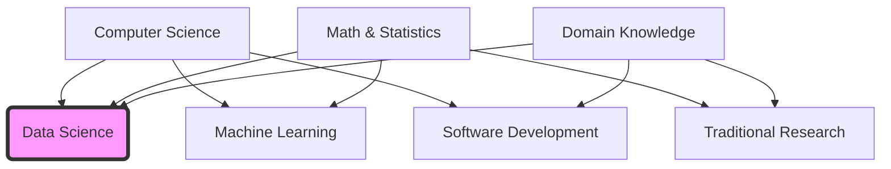

# 1. Data Science Definition and Philosophy

## 1.1 Core Definition

**Data Science** is an interdisciplinary field that utilizes scientific methods, processes, algorithms, and systems to extract knowledge and insights from data. It accepts data in various forms—both **structured** (e.g., database tables, Excel sheets) and **unstructured** (e.g., text, images, video)—and transforms it into actionable intelligence.

> [!INFO] **Formal Definition**
> "Data science is the study of the generalizable extraction of knowledge from data."  
> — *Dhar, V. (2013). Data science and prediction.*

At its core, Data Science is about **automating insight**. It moves beyond simple observation ("What happened?") to prediction and prescription ("What will happen?" and "What should we do?").

## 1.2 The Interdisciplinary Intersection

Data Science is not a standalone subject; it sits at the intersection of three primary domains. This relationship is often visualized using a Venn diagram.

1.  **Computer Science:** Provides the tools for data storage, processing speed, algorithmic efficiency, and software engineering.
2.  **Math & Statistics:** Provides the theoretical rigor, probability models, and inference techniques required to validate findings.
3.  **Domain Knowledge:** Contextual understanding of the specific industry (e.g., Healthcare, Finance) to ensure the analysis is relevant and actionable.

## 1.3 Structured vs. Unstructured Data

A Data Scientist must be comfortable working with two fundamental types of data:

| Feature | **Structured Data** | **Unstructured Data** |
| :--- | :--- | :--- |
| **Format** | Highly organized, rows & columns (Tabular). | No pre-defined format. |
| **Storage** | Relational Databases (SQL), CSV, Excel. | Data Lakes, NoSQL, Folders (Images/PDFs). |
| **Examples** | Transaction logs, sensor readings, patient records. | Emails, social media posts, X-rays, audio files. |
| **Analysis Difficulty** | Low (Easy to query). | High (Requires advanced extraction techniques). |

## 1.4 The Goal of Data Science

The ultimate objective is not just to "process data," but to support **decision-making and automation**.

*   **Descriptive:** What is the state of the world?
*   **Diagnostic:** Why did this happen?
*   **Predictive:** What will happen in the future?
*   **Prescriptive:** How can we make the best outcome happen?