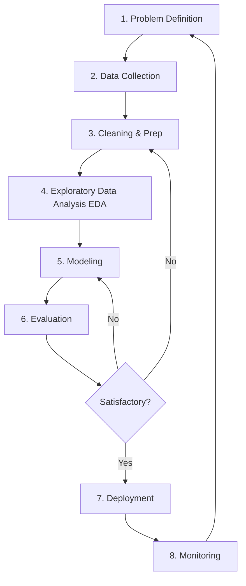

# 4. The Complete Data Science Workflow

Data Science is not a random exploration; it follows a systematic, iterative lifecycle often referred to as **CRISP-DM** (Cross-Industry Standard Process for Data Mining) or the generic Data Science Lifecycle.

## Step-by-Step Breakdown

### 1. Problem Definition
**Goal:** Clearly identify the business or research question.
*   *Key Question:* What are we trying to solve?
*   *Example:* "We want to reduce the number of patients returning to the hospital within 30 days of discharge."

### 2. Data Collection
**Goal:** Gather raw materials.
*   *Sources:* Databases (SQL), APIs, Web Scraping, IoT Sensors, Surveys.
*   *Example:* Extracting Electronic Health Records (EHR) and demographic data.

### 3. Data Cleaning and Preparation (Wrangling)
**Goal:** Convert raw data into a usable format. **This often takes 60-80% of the project time.**
*   *Tasks:* Handling missing values (NaN), removing duplicates, correcting data types, dealing with outliers.
*   *Example:* Filling missing "Blood Pressure" values with the average or removing duplicate patient IDs.

### 4. Exploratory Data Analysis (EDA)
**Goal:** Understand the data's "personality."
*   *Tasks:* Visualization (histograms, scatter plots), correlation analysis, descriptive statistics (mean, median).
*   *Example:* Plotting patient age vs. readmission rate to see if older patients return more often.

### 5. Modeling
**Goal:** Build the mathematical engine.
*   *Tasks:* Selecting algorithms (e.g., Logistic Regression, Decision Trees), splitting data into Train/Test sets.
*   *Example:* Training a model to predict the probability of readmission (0 to 100%).

### 6. Evaluation
**Goal:** Validate the model's accuracy.
*   *Tasks:* Comparing predictions against actual historical outcomes using metrics like Accuracy, Precision, Recall, or RMSE.
*   *Example:* "The model correctly identifies 90% of high-risk patients."

### 7. Deployment
**Goal:** Put the model into production.
*   *Tasks:* Integrating the model into an app, dashboard, or API.
*   *Example:* When a doctor discharges a patient, the software alerts them: "High Risk of Readmission."

### 8. Monitoring
**Goal:** Ensure longevity.
*   *Tasks:* Checking for "Data Drift" (when real-world data changes compared to training data).
*   *Example:* Retraining the model if patient demographics change significantly over a year.