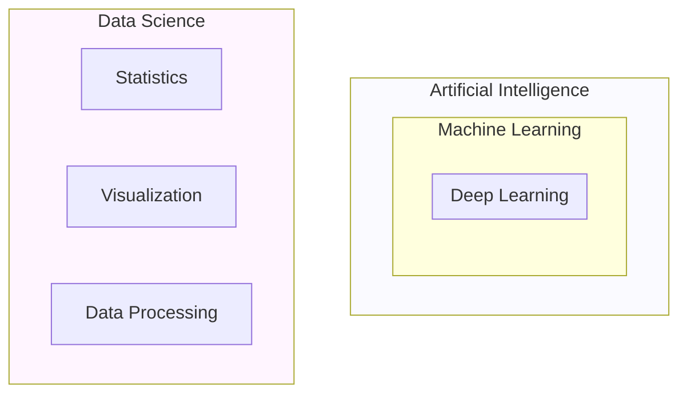

# 7. Comparing Data Science, AI, ML, and BI

These terms are often used interchangeably, but they represent distinct concepts with specific relationships.

## 7.1 Visual Hierarchy

## 7.2 Definitions and Differences

### Artificial Intelligence (AI)
*   **Definition:** The broad concept of machines acting in a way that we would consider "smart" or mimicking human intelligence (reasoning, perception).
*   **Scope:** Includes Robotics, Computer Vision, NLP, and Logic.

### Machine Learning (ML)
*   **Definition:** A **subset of AI**. It is the study of algorithms that learn from data. Instead of programming rules explicitly (e.g., `if x then y`), the machine learns the rules by looking at examples.
*   **Relationship:** ML is a tool used *by* Data Science.

### Data Science (DS)
*   **Definition:** An interdisciplinary field focused on extracting insights from data.
*   **Relationship:** DS *uses* ML as a tool to make predictions, but DS also includes things that are *not* ML, such as data cleaning, dashboarding, and statistical testing.

### Business Intelligence (BI)
*   **Definition:** Strategies and technologies used for data analysis of business information.
*   **Comparison:**
    *   **BI** looks at the **Past**: "What happened last month?" (Reporting).
    *   **DS** looks at the **Future**: "What will happen next month?" (Prediction).

## 7.3 Big Data vs. Data Science

*   **Big Data:** Refers to the **Volume, Velocity, and Variety** of data. It is the *material*.
    *   Technologies: Hadoop, Spark, NoSQL.
*   **Data Science:** Refers to the **methods** used to analyze that data. It is the *process*.

> [!SUMMARY] **Analogy**
> *   **Big Data** is the crude oil.
> *   **Data Science** is the refinery process.
> *   **AI/ML** are the specialized engines that run on the refined fuel.